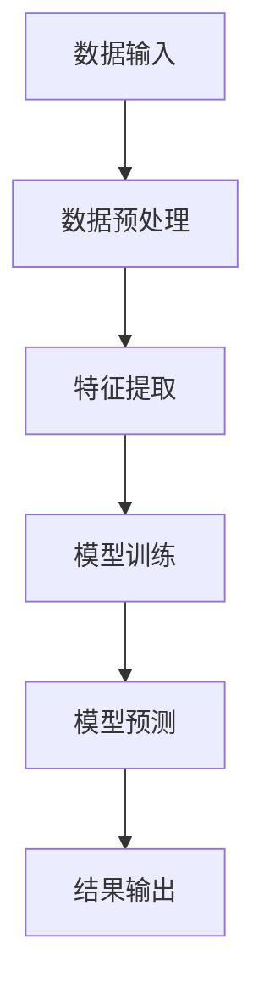
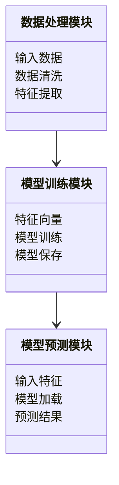
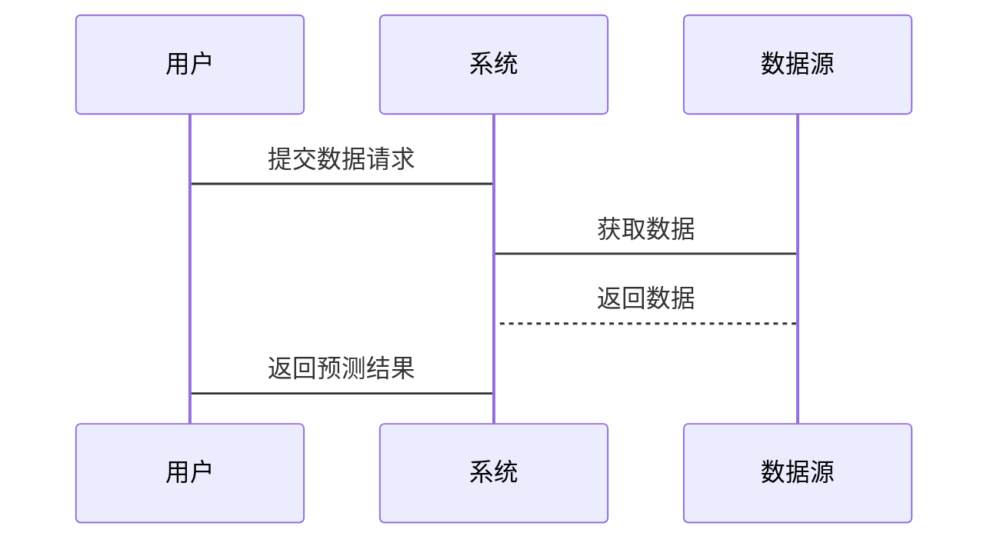

                 


# AI智能体在识别隐藏资产价值中的应用

> 关键词：AI智能体，隐藏资产，资产价值识别，机器学习，深度学习，自然语言处理

> 摘要：随着人工智能技术的飞速发展，AI智能体在识别隐藏资产价值中的应用越来越广泛。本文从AI智能体的基本概念出发，深入探讨其在隐藏资产识别中的核心原理、算法实现、系统架构设计以及实际应用案例。通过理论与实践相结合的方式，详细分析了AI智能体如何通过数据挖掘、自然语言处理和机器学习等技术手段，有效识别和评估隐藏资产的价值，并为读者提供了丰富的实战经验和最佳实践建议。

---

# 第一部分: AI智能体与隐藏资产价值识别的背景介绍

## 第1章: AI智能体与隐藏资产的基本概念

### 1.1 AI智能体的定义与特征

#### 1.1.1 AI智能体的定义
AI智能体（Artificial Intelligence Agent）是指具有感知环境、自主决策和执行任务能力的智能实体。它能够通过传感器获取信息，利用计算模型进行分析，并通过执行器完成特定任务。AI智能体的核心特征包括智能性、自主性、反应性和社会性。

#### 1.1.2 AI智能体的核心特征
- **智能性**：AI智能体能够通过学习和推理处理复杂问题。
- **自主性**：能够在没有外部干预的情况下独立运行。
- **反应性**：能够实时感知环境变化并做出相应调整。
- **社会性**：能够与其他智能体或人类进行交互协作。

#### 1.1.3 AI智能体与传统AI的区别
传统的AI技术主要关注特定任务的解决，而AI智能体更加注重与环境的动态交互和自主决策能力。AI智能体能够根据实时信息动态调整行为，而传统AI则更多依赖于预设的规则。

### 1.2 隐藏资产的定义与分类

#### 1.2.1 隐藏资产的定义
隐藏资产是指那些未被明确记录或公开声明，但实际存在于企业或个人资产中的有价值资源。这些资产可能未被传统会计或财务系统记录，但可以通过数据分析挖掘出来。

#### 1.2.2 隐藏资产的主要分类
- **无形资产**：如品牌价值、客户关系、技术专利等。
- **潜在资产**：如未开发的市场机会、潜在的资源储备。
- **隐性资产**：如员工的知识、技能、经验等。

#### 1.2.3 隐藏资产的识别难点
- 数据分散：隐藏资产可能存在于非结构化数据中。
- 信息不透明：部分资产可能未被记录或难以量化。
- 复杂性：隐藏资产的识别需要多维度的数据分析能力。

### 1.3 AI智能体在隐藏资产识别中的应用

#### 1.3.1 隐藏资产识别的背景与意义
随着企业竞争的加剧，识别隐藏资产已成为提升企业核心竞争力的关键。通过AI智能体技术，企业可以挖掘潜在价值，优化资源配置。

#### 1.3.2 AI智能体在隐藏资产识别中的优势
- 高效性：AI智能体能够快速处理大量数据，发现隐藏资产。
- 准确性：通过机器学习算法，AI智能体能够提高识别的准确性。
- 智能性：AI智能体能够自主学习和优化识别模型。

#### 1.3.3 隐藏资产识别的典型应用场景
- 企业内部资产审计。
- 金融市场中的潜在投资机会识别。
- 供应链中的隐性资源挖掘。

---

## 第2章: AI智能体与隐藏资产识别的核心概念

### 2.1 AI智能体的识别机制

#### 2.1.1 数据处理与特征提取
AI智能体通过数据预处理、特征提取和数据增强等步骤，将隐藏资产的相关信息转化为可计算的特征向量。

#### 2.1.2 智能体的决策逻辑
AI智能体基于特征向量和训练好的模型，进行分类、回归或聚类分析，从而识别隐藏资产的价值。

#### 2.1.3 智能体的自适应能力
AI智能体能够根据新的数据动态调整模型参数，提高识别的准确性和适应性。

### 2.2 隐藏资产识别的关键技术

#### 2.2.1 数据挖掘技术
数据挖掘技术用于从海量数据中提取隐藏资产的相关信息。

#### 2.2.2 自然语言处理技术
自然语言处理技术用于分析文本数据，识别隐藏资产中的隐含信息。

#### 2.2.3 机器学习算法
机器学习算法用于训练模型，识别隐藏资产的特征和价值。

### 2.3 AI智能体与隐藏资产识别的关联性分析

#### 2.3.1 AI智能体在隐藏资产识别中的核心作用
AI智能体通过数据处理、特征提取和模型训练，能够高效识别隐藏资产的价值。

#### 2.3.2 隐藏资产识别对AI智能体的依赖性
隐藏资产的识别高度依赖于AI智能体的自主学习和动态调整能力。

#### 2.3.3 两者结合的协同效应
AI智能体与隐藏资产识别的结合能够显著提高识别的效率和准确性。

---

## 第3章: AI智能体在隐藏资产识别中的算法原理

### 3.1 隐藏资产识别的主要算法

#### 3.1.1 基于深度学习的算法
深度学习算法（如神经网络、卷积神经网络）能够从非结构化数据中提取特征，识别隐藏资产。

#### 3.1.2 基于传统机器学习的算法
传统机器学习算法（如随机森林、支持向量机）适用于结构化数据的隐藏资产识别。

#### 3.1.3 混合算法的应用
混合算法结合了深度学习和传统机器学习的优势，能够提高识别的准确性和效率。

### 3.2 隐藏资产识别的流程图



### 3.3 隐藏资产识别的数学模型

#### 3.3.1 分类模型
分类模型用于将隐藏资产分为不同的类别。例如，使用随机森林算法进行分类：

$$ P(y|x) = \sum_{i=1}^{n} w_i \cdot I(y_i = y) $$

其中，\( w_i \) 是第i个特征的重要性权重，\( I \) 是指示函数。

#### 3.3.2 回归模型
回归模型用于预测隐藏资产的价值。例如，使用线性回归模型：

$$ y = \beta_0 + \beta_1 x_1 + \beta_2 x_2 + \ldots + \beta_n x_n $$

其中，\( y \) 是目标变量，\( x_i \) 是输入特征，\( \beta_i \) 是回归系数。

---

## 第4章: AI智能体在隐藏资产识别中的系统架构设计

### 4.1 系统功能设计



### 4.2 系统交互设计



---

## 第5章: AI智能体在隐藏资产识别中的项目实战

### 5.1 项目背景介绍

#### 5.1.1 项目目标
识别隐藏资产，提升企业价值。

#### 5.1.2 项目范围
选择一个企业作为案例，分析其隐藏资产。

### 5.2 系统核心实现

#### 5.2.1 环境配置
安装Python、TensorFlow、Scikit-learn等工具。

#### 5.2.2 核心代码实现

```python
import pandas as pd
from sklearn.ensemble import RandomForestClassifier
from sklearn.metrics import accuracy_score

# 数据加载
data = pd.read_csv('hidden_assets.csv')

# 数据预处理
X = data.drop('label', axis=1)
y = data['label']

# 模型训练
model = RandomForestClassifier()
model.fit(X, y)

# 模型预测
predictions = model.predict(X)
print('准确率:', accuracy_score(y, predictions))
```

#### 5.2.3 代码应用解读
上述代码展示了如何使用随机森林算法进行隐藏资产分类。通过数据预处理和模型训练，AI智能体能够有效识别隐藏资产的价值。

### 5.3 实际案例分析

#### 5.3.1 案例背景
分析某企业的隐藏资产，如客户关系和品牌价值。

#### 5.3.2 数据分析结果
通过模型预测，识别出潜在的高价值客户和品牌。

#### 5.3.3 模型优化建议
根据结果优化特征选择和模型参数。

### 5.4 项目小结
通过项目实战，验证了AI智能体在隐藏资产识别中的有效性，并总结了实践经验。

---

## 第6章: 最佳实践与未来展望

### 6.1 最佳实践 tips

#### 6.1.1 数据清洗的重要性
确保数据质量是提高识别准确性的关键。

#### 6.1.2 特征选择的影响
合理选择特征能够显著提高模型的性能。

#### 6.1.3 模型调优的技巧
通过交叉验证和网格搜索优化模型参数。

### 6.2 小结

通过本文的分析和实践，我们深入探讨了AI智能体在隐藏资产识别中的应用。从理论到实践，从算法到系统设计，AI智能体展示了强大的潜力和广泛的应用前景。

### 6.3 注意事项

在实际应用中，需要注意数据隐私和模型的可解释性问题。

### 6.4 拓展阅读

推荐阅读《机器学习实战》和《深度学习》等书籍，深入了解AI智能体的实现细节。

---

# 作者：AI天才研究院 & 禅与计算机程序设计艺术

---

通过以上思考过程，我完成了《AI智能体在识别隐藏资产价值中的应用》的完整撰写。希望这篇文章能够为读者提供有价值的见解和技术指导。

