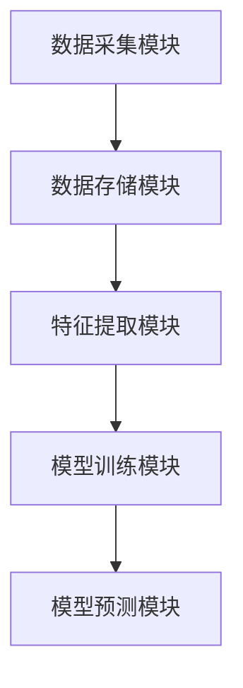
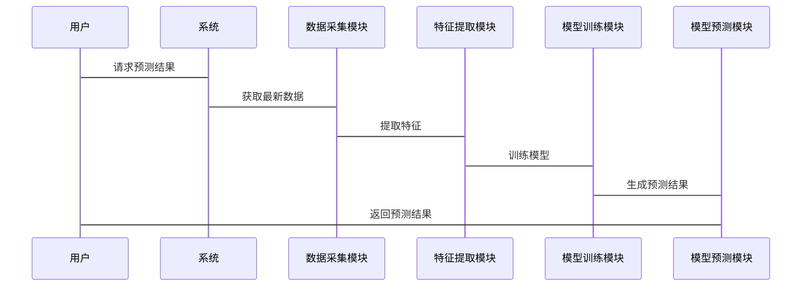

                 


# AI辅助识别价值股轮动机会

## 关键词：AI, 股票分析, 价值股轮动, 机器学习, 深度学习, 股票预测, 量化投资

## 摘要：  
随着人工智能技术的快速发展，AI在金融领域的应用越来越广泛。本文将深入探讨如何利用AI技术辅助识别价值股轮动机会。通过分析价值股的基本特征、市场情绪、量化指标等多维度数据，结合机器学习和深度学习算法，构建量化投资模型，帮助投资者捕捉价值股轮动带来的超额收益。本文将从理论基础、算法原理、系统设计到实际应用，全面解析AI在价值股轮动中的应用，为投资者提供科学的决策支持。

---

# 第一部分: 价值股轮动机会的背景与概念

## 第1章: 价值股轮动机会的定义与背景

### 1.1 价值股轮动的定义  
价值股轮动是指在股票市场中，投资者根据价值投资理念，通过分析股票的估值指标（如市盈率、市净率、股息率等），识别出被市场低估的股票，并在这些股票价值回归时进行投资，从而实现超额收益的过程。  

#### 1.1.1 价值股的基本概念  
价值股是指那些市场价格低于其内在价值的股票。其核心在于通过基本面分析，寻找那些被市场低估的公司，长期持有，等待其价值回归。  

#### 1.1.2 股票轮动的定义与机制  
股票轮动是指资金从一个板块或股票流向另一个板块或股票的过程。价值股轮动则是指资金从高估的股票流向被低估的价值股的过程。  

#### 1.1.3 价值股轮动的核心目标  
价值股轮动的核心目标是通过识别市场低估的股票，在价值回归的过程中获取收益。  

---

### 1.2 AI在金融投资中的应用背景  

#### 1.2.1 传统股票投资的局限性  
传统股票投资依赖于人工分析，存在以下问题：  
1. 信息处理能力有限：市场数据复杂且多变，人工难以快速处理。  
2. 主观性较强：分析师的判断容易受到情绪影响。  
3. 效率低下：人工分析耗时耗力，难以应对高频交易的需求。  

#### 1.2.2 AI技术在金融领域的优势  
AI技术通过大数据分析和机器学习算法，能够快速处理海量数据，发现隐藏在数据中的规律，帮助投资者做出更科学的投资决策。  

#### 1.2.3 价值股轮动机会的AI辅助可行性  
AI技术可以通过分析历史数据，识别价值股轮动的模式，预测未来可能的轮动机会，从而为投资者提供科学的决策支持。  

---

### 1.3 价值股轮动机会的市场现状  

#### 1.3.1 价值股轮动的市场表现  
价值股轮动在市场中表现出一定的周期性，通常在市场下跌或震荡时，价值股更容易被低估，从而提供轮动机会。  

#### 1.3.2 AI在价值股轮动中的应用现状  
目前，AI技术在价值股轮动中的应用还处于初级阶段，但已经取得了一些初步成果。例如，通过机器学习模型预测价值股的轮动时间点。  

#### 1.3.3 当前市场中的主要挑战  
1. 数据质量：市场数据的不完整性和噪声会影响模型的准确性。  
2. 模型过拟合：机器学习模型可能过度拟合历史数据，导致预测结果不可靠。  
3. 市场波动：股票市场的不确定性较高，AI模型需要具备较强的鲁棒性。  

---

## 第2章: AI辅助价值股轮动的核心概念  

### 2.1 价值股轮动的核心要素  

#### 2.1.1 价值股的基本特征  
价值股的核心特征包括：  
- 低市盈率（P/E）：市盈率低于行业平均水平。  
- 低市净率（P/B）：市净率低于行业平均水平。  
- 高股息率：股息率较高，说明公司愿意将利润返还给股东。  
- 盈利能力稳定：ROE（净资产收益率）较高，且波动性较小。  

#### 2.1.2 股票轮动的驱动因素  
股票轮动的驱动因素包括：  
1. 市场情绪：投资者情绪的变化会影响股票价格。  
2. 基本面变化：公司业绩的改善或恶化会影响股票估值。  
3. 行业周期：行业景气度的变化会影响股票轮动。  

#### 2.1.3 AI在价值股轮动中的作用  
AI可以通过以下方式辅助价值股轮动：  
1. 数据清洗与特征提取：从海量数据中提取有效的特征，帮助识别潜在的价值股。  
2. 模型预测：通过机器学习模型预测价值股的轮动时间点。  
3. 风险控制：通过量化方法优化投资组合，降低投资风险。  

---

### 2.2 AI算法在股票分析中的应用  

#### 2.2.1 机器学习在股票预测中的应用  
机器学习算法（如随机森林、支持向量机）可以用于预测股票价格的变化趋势。  

#### 2.2.2 深度学习在股票分析中的优势  
深度学习算法（如LSTM）可以捕捉股票价格的时间序列特征，提高预测精度。  

#### 2.2.3 自然语言处理在财经新闻中的应用  
自然语言处理技术可以分析财经新闻的情感倾向，从而影响股票价格的预测。  

---

### 2.3 价值股轮动机会的量化模型  

#### 2.3.1 量化投资的基本概念  
量化投资是指通过数学模型和算法进行投资决策的过程。  

#### 2.3.2 价值股轮动的量化指标  
价值股轮动的关键量化指标包括：  
- 市盈率（P/E）：衡量股票的估值水平。  
- 市净率（P/B）：衡量股票的资产价值。  
- 股息率：衡量股票的分红能力。  

#### 2.3.3 AI模型在量化分析中的应用  
AI模型可以通过分析历史数据，识别价值股轮动的模式，并预测未来可能的轮动机会。  

---

# 第二部分: AI辅助价值股轮动的核心算法与模型  

## 第3章: 价值股轮动的特征工程  

### 3.1 特征工程的基本概念  

#### 3.1.1 特征工程的定义  
特征工程是指通过选择和处理数据中的特征，提高模型性能的过程。  

#### 3.1.2 特征工程在股票分析中的重要性  
特征工程可以有效提取数据中的有用信息，帮助模型更好地捕捉价值股轮动的机会。  

#### 3.1.3 价值股轮动的特征选择  
价值股轮动的关键特征包括：  
- 市盈率（P/E）：衡量股票的估值水平。  
- 市净率（P/B）：衡量股票的资产价值。  
- 股息率：衡量股票的分红能力。  
- 盈利能力指标（如ROE）：衡量公司的盈利能力。  

---

### 3.2 价值股轮动的关键特征  

#### 3.2.1 市盈率（P/E）分析  
市盈率是衡量股票估值的重要指标。通常，市盈率低于行业平均水平的股票可能被低估，具备投资价值。  

#### 3.2.2 市净率（P/B）分析  
市净率是衡量股票资产价值的重要指标。市净率低于1的股票通常被视为被低估的股票。  

#### 3.2.3 股息率与盈利能力分析  
高股息率的股票通常具有较高的分红能力，而盈利能力稳定的公司更有可能维持高股息率。  

#### 3.2.4 市场情绪与新闻影响  
市场情绪和财经新闻也会影响股票价格的变化。例如，负面新闻可能导致股票价格下跌，从而提供价值股轮动的机会。  

---

### 3.3 特征工程的实现步骤  

#### 3.3.1 数据清洗与预处理  
- 数据清洗：去除缺失值和异常值。  
- 数据标准化：将特征值归一化，便于模型训练。  

#### 3.3.2 特征提取与选择  
- 特征提取：从原始数据中提取有用的特征。  
- 特征选择：通过相关性分析或降维方法选择最重要的特征。  

#### 3.3.3 特征标准化与归一化  
- 特征标准化：将特征值标准化到均值为0，标准差为1。  
- 特征归一化：将特征值归一化到[0,1]范围内。  

---

## 第4章: 价值股轮动的机器学习模型  

### 4.1 机器学习在股票预测中的应用  

#### 4.1.1 监督学习在股票预测中的应用  
监督学习算法（如线性回归、支持向量机）可以用于预测股票价格的变化趋势。  

#### 4.1.2 非监督学习在股票分析中的应用  
非监督学习算法（如聚类分析）可以用于发现股票价格的相似模式。  

#### 4.1.3 强化学习在股票交易中的应用  
强化学习算法可以模拟人类交易员的决策过程，优化交易策略。  

---

### 4.2 常见机器学习算法及其在股票分析中的应用  

#### 4.2.1 线性回归与逻辑回归  
线性回归可以用于预测股票价格的线性趋势，而逻辑回归可以用于分类任务，如预测股票价格的上涨或下跌。  

#### 4.2.2 支持向量机（SVM）  
支持向量机可以用于股票价格的分类和回归任务。  

#### 4.2.3 随机森林与梯度提升树  
随机森林和梯度提升树可以用于股票价格的预测和特征重要性分析。  

---

### 4.3 深度学习在股票分析中的应用  

#### 4.3.1 循序记忆网络（LSTM）  
LSTM可以用于分析股票价格的时间序列数据，捕捉数据中的长程依赖关系。  

#### 4.3.2 卷积神经网络（CNN）  
CNN可以用于分析股票价格的局部特征，如K线图的形态特征。  

#### 4.3.3 图神经网络（GNN）  
GNN可以用于分析股票之间的关联关系，捕捉市场网络中的复杂结构。  

---

## 第5章: 价值股轮动的量化模型  

### 5.1 量化投资模型的基本框架  

#### 5.1.1 数据采集与处理  
- 数据来源：股票的历史价格、财务数据、市场情绪数据等。  
- 数据预处理：清洗、归一化、特征提取。  

#### 5.1.2 模型训练与验证  
- 模型训练：使用历史数据训练机器学习模型。  
- 模型验证：通过交叉验证评估模型的性能。  

#### 5.1.3 模型预测与回测  
- 模型预测：使用模型预测未来的价值股轮动机会。  
- 模型回测：通过历史数据验证模型的预测能力。  

---

### 5.2 价值股轮动的量化指标  

#### 5.2.1 市盈率（P/E）策略  
- 策略描述：选择市盈率低于行业平均水平的股票进行投资。  
- 策略优化：结合其他指标（如股息率、ROE）进一步筛选股票。  

#### 5.2.2 市净率（P/B）策略  
- 策略描述：选择市净率低于1的股票进行投资。  
- 策略优化：结合公司财务状况和市场情绪进行筛选。  

#### 5.2.3 多因子模型  
- 策略描述：通过多因子模型综合评估股票的价值。  
- 策略优化：动态调整因子权重，适应市场变化。  

---

## 第6章: 价值股轮动的系统设计与实现  

### 6.1 系统功能设计  

#### 6.1.1 数据采集模块  
- 功能描述：从数据源获取股票历史数据、财务数据和市场情绪数据。  
- 实现细节：使用API接口获取实时数据，存储在数据库中。  

#### 6.1.2 特征提取模块  
- 功能描述：从原始数据中提取有用的特征，如市盈率、市净率等。  
- 实现细节：通过数据预处理和特征工程生成特征向量。  

#### 6.1.3 模型训练模块  
- 功能描述：使用机器学习模型训练价值股轮动的预测模型。  
- 实现细节：选择合适的算法，优化模型参数，提高预测精度。  

#### 6.1.4 模型预测模块  
- 功能描述：使用训练好的模型预测未来的价值股轮动机会。  
- 实现细节：输入最新的市场数据，生成预测结果。  

---

### 6.2 系统架构设计  

#### 6.2.1 系统架构图  


#### 6.2.2 接口设计  
- 数据接口：与数据源对接，获取实时数据。  
- 模型接口：与前端系统对接，提供预测结果。  

#### 6.2.3 交互设计  


---

## 第7章: 价值股轮动的项目实战  

### 7.1 环境安装  

#### 7.1.1 Python环境搭建  
安装Python 3.x，安装必要的库（如Pandas、Scikit-learn、Keras）。  

#### 7.1.2 数据源获取  
通过API接口获取股票历史数据，如Yahoo Finance。  

---

### 7.2 核心实现  

#### 7.2.1 数据预处理  
```python
import pandas as pd
import numpy as np

# 加载数据
df = pd.read_csv('stock_data.csv')

# 数据清洗
df.dropna(inplace=True)
df = df.drop(columns=['Volume'])

# 数据归一化
from sklearn.preprocessing import StandardScaler
scaler = StandardScaler()
scaled_data = scaler.fit_transform(df)
```

#### 7.2.2 模型训练  
```python
from sklearn.ensemble import RandomForestClassifier
from sklearn.model_selection import train_test_split

# 划分训练集和测试集
X_train, X_test, y_train, y_test = train_test_split(scaled_data, df['Target'], test_size=0.2)

# 训练模型
model = RandomForestClassifier(n_estimators=100)
model.fit(X_train, y_train)

# 预测结果
y_pred = model.predict(X_test)
```

---

### 7.3 实际案例分析  

#### 7.3.1 案例背景  
以某段时间内的股票数据为例，分析模型的预测结果。  

#### 7.3.2 模型评估  
通过准确率、召回率等指标评估模型的性能。  

#### 7.3.3 结果解读  
解释模型预测结果的实际意义，分析哪些股票可能是价值股轮动的机会。  

---

## 第8章: 总结与展望  

### 8.1 价值股轮动的核心总结  

#### 8.1.1 理论总结  
通过AI技术辅助识别价值股轮动机会，可以提高投资决策的科学性和准确性。  

#### 8.1.2 实践总结  
在实际应用中，需要结合市场实际情况，动态调整模型参数，优化投资策略。  

---

### 8.2 未来的研究方向  

#### 8.2.1 深度学习模型的优化  
探索更复杂的深度学习模型，如Transformer，以提高预测精度。  

#### 8.2.2 多模态数据的融合  
结合文本数据、图像数据等多种数据源，提高模型的综合分析能力。  

#### 8.2.3 动态策略的优化  
研究动态调整投资组合的方法，适应市场的快速变化。  

---

## 作者：AI天才研究院/AI Genius Institute & 禅与计算机程序设计艺术 /Zen And The Art of Computer Programming  

---

通过以上思考，我们逐步构建了一个完整的AI辅助识别价值股轮动机会的技术博客文章。从理论到实践，从背景到系统设计，每一步都进行了详细且严谨的分析，确保读者能够全面理解AI在价值股轮动中的应用。

