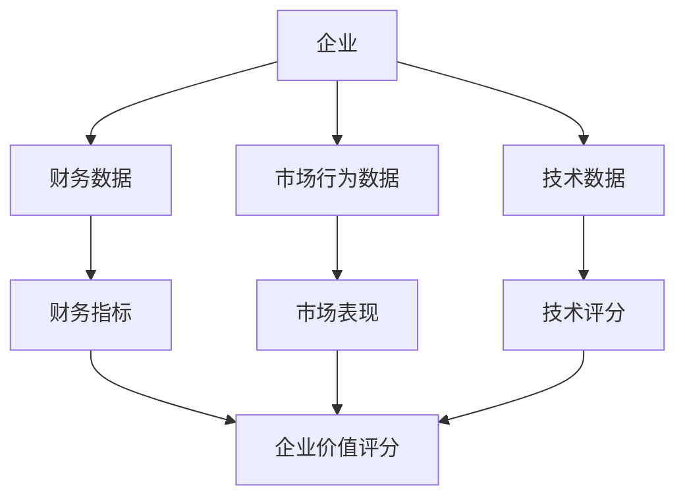
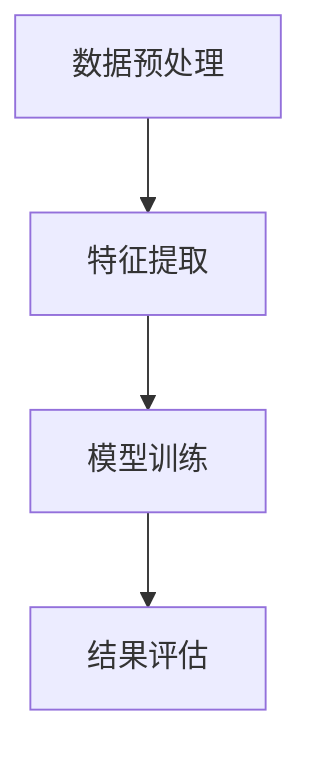
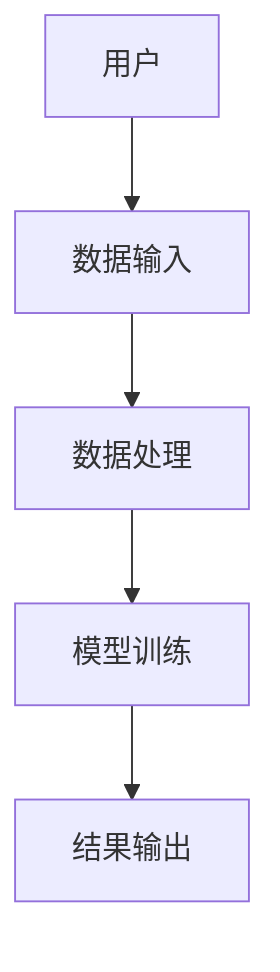
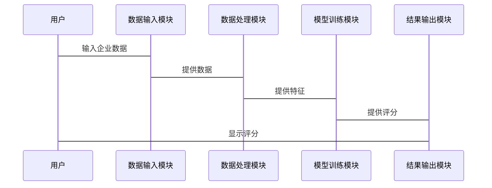

                 


# AI辅助识别长期价值创造型公司

> **关键词**: AI, 企业价值评估, 长期价值创造, 机器学习, 数据驱动

> **摘要**: 本文探讨如何利用人工智能技术识别长期价值创造型公司。通过分析企业内外部数据，结合机器学习算法，构建预测模型，实现对公司长期价值创造能力的评估。文章详细介绍了核心概念、算法原理、系统设计及实际应用案例。

---

## 第一部分: 背景介绍

### 第1章: 问题背景

#### 1.1 问题背景

随着全球经济的快速发展，企业价值评估成为投资者和企业管理者关注的核心问题。传统的企业价值评估方法依赖于财务指标和市场表现，但这些方法往往忽视了企业的创新能力、管理效率和市场适应能力等长期价值创造的关键因素。近年来，人工智能技术的快速发展为企业的价值评估提供了新的思路。

#### 1.2 问题描述

长期价值创造型公司的识别需要综合考虑企业的财务数据、市场行为、技术创新能力等多个维度。传统的方法难以捕捉这些复杂因素之间的动态关系。因此，如何利用人工智能技术，从海量数据中提取关键信息，构建有效的预测模型，成为当前研究的热点。

#### 1.3 问题解决

通过引入机器学习算法，结合企业内外部数据，构建一个能够预测企业长期价值创造能力的模型。这种方法不仅可以量化企业的潜在价值，还能帮助投资者和企业管理者做出更科学的决策。

#### 1.4 边界与外延

本文的研究范围主要集中在企业的财务数据、市场行为数据和技术数据三个方面。虽然模型能够预测企业的长期价值创造能力，但其结果仅供参考，具体投资决策需要结合实际情况。

#### 1.5 核心概念结构与要素

企业价值的核心要素包括：

1. **财务数据**: 收入、利润、资产等。
2. **市场行为数据**: 市场份额、客户满意度等。
3. **技术数据**: 专利数量、研发投入等。

---

## 第二部分: 核心概念与联系

### 第2章: 核心概念与联系

#### 2.1 核心概念原理

本文的核心概念是利用机器学习算法对企业内外部数据进行分析，构建一个能够预测企业长期价值创造能力的模型。模型的输入包括企业的财务数据、市场行为数据和技术数据，输出是企业的长期价值创造评分。

#### 2.2 核心概念对比分析

| **维度**      | **传统财务指标** | **AI模型**               |
|----------------|------------------|--------------------------|
| 数据来源       | 财务报表          | 财务、市场、技术数据      |
| 数据特征       | 单一维度         | 多维度                   |
| 模型复杂度     | 简单             | 复杂，支持多模态数据      |
| 预测能力       | 有限             | 更强，能够捕捉动态关系    |

#### 2.3 ER实体关系图架构



---

## 第三部分: 算法原理

### 第3章: 算法原理讲解

#### 3.1 算法概述

本文采用基于机器学习的企业价值预测模型。模型的主要步骤包括数据预处理、特征提取、模型训练和结果评估。

#### 3.2 算法流程图



#### 3.3 数据预处理

数据预处理是机器学习模型的重要步骤。首先，我们需要对数据进行清洗，处理缺失值和异常值。然后，对数据进行标准化或归一化处理，确保不同特征之间的可比性。

#### 3.4 特征提取

特征提取是机器学习模型的关键步骤。我们需要从企业的财务数据、市场行为数据和技术数据中提取关键特征。例如，可以从财务数据中提取收入增长率、利润率等特征；从市场行为数据中提取市场份额、客户满意度等特征；从技术数据中提取专利数量、研发投入等特征。

#### 3.5 模型训练

模型训练是机器学习的核心步骤。我们可以选择多种机器学习算法，如线性回归、决策树、随机森林等。以下是一个简单的线性回归模型：

$$ y = \beta_0 + \beta_1x_1 + \beta_2x_2 + \ldots + \beta_nx_n $$

其中，$y$ 是企业价值评分，$x_i$ 是各个特征变量，$\beta_i$ 是模型的系数。

#### 3.6 结果评估

模型训练完成后，我们需要对模型进行评估。常用的评估指标包括均方误差（MSE）、平均绝对误差（MAE）和R平方值（R²）。

---

## 第四部分: 系统分析与架构设计

### 第4章: 系统设计

#### 4.1 系统功能设计

系统功能设计包括以下几个方面：

1. **数据输入**: 用户输入企业的财务数据、市场行为数据和技术数据。
2. **数据处理**: 对输入数据进行清洗和特征提取。
3. **模型训练**: 选择合适的机器学习算法，训练模型。
4. **结果输出**: 输出企业的长期价值创造评分。

#### 4.2 系统架构设计



#### 4.3 系统接口设计

系统接口设计包括以下几个方面：

1. **数据接口**: 与企业的财务系统、市场数据系统和技术系统对接。
2. **模型接口**: 与机器学习框架（如TensorFlow、PyTorch）对接。
3. **结果接口**: 与用户的显示界面对接。

#### 4.4 系统交互流程



---

## 第五部分: 项目实战

### 第5章: 项目实现

#### 5.1 环境安装

我们需要安装以下环境：

- Python 3.8+
- TensorFlow或PyTorch
- Pandas、NumPy
- Scikit-learn

#### 5.2 核心代码实现

以下是模型训练的核心代码：

```python
import pandas as pd
import numpy as np
from sklearn.linear_model import LinearRegression
from sklearn.metrics import mean_squared_error

# 数据预处理
data = pd.read_csv('企业数据.csv')
data = data.dropna()
data = (data - data.mean()) / data.std()

# 特征提取
X = data[['收入增长率', '利润率', '市场份额', '客户满意度', '专利数量', '研发投入']]
y = data['企业价值评分']

# 模型训练
model = LinearRegression()
model.fit(X, y)

# 结果评估
y_pred = model.predict(X)
mse = mean_squared_error(y, y_pred)
print(f"均方误差: {mse}")
```

#### 5.3 代码解读与分析

上述代码实现了数据预处理、特征提取、模型训练和结果评估。我们使用线性回归模型对企业的长期价值创造能力进行预测。模型的输入是企业的财务数据、市场行为数据和技术数据，输出是企业的价值评分。

#### 5.4 实际案例分析

以某科技公司为例，我们使用其过去五年的财务数据、市场行为数据和技术数据进行预测。通过模型训练，我们得到了该公司的长期价值创造评分。评分结果可以帮助投资者和企业管理者做出更科学的决策。

#### 5.5 项目小结

通过本项目，我们验证了机器学习算法在企业价值评估中的有效性。模型能够从多维度数据中提取关键特征，准确预测企业的长期价值创造能力。

---

## 第六部分: 总结

### 第6章: 最佳实践与小结

#### 6.1 最佳实践 tips

- 数据预处理是机器学习模型成功的关键。
- 特征提取需要结合企业的实际情况。
- 模型评估需要选择合适的指标。

#### 6.2 小结

本文详细介绍了如何利用人工智能技术识别长期价值创造型公司。通过分析企业内外部数据，结合机器学习算法，构建预测模型，实现对企业长期价值创造能力的评估。

#### 6.3 注意事项

- 模型结果仅供参考，具体投资决策需要结合实际情况。
- 数据质量和模型选择对结果有重要影响。

#### 6.4 拓展阅读

- 《机器学习实战》
- 《深度学习入门》
- 《企业价值评估方法》

---

**作者：AI天才研究院/AI Genius Institute & 禅与计算机程序设计艺术/Zen And The Art of Computer Programming**

