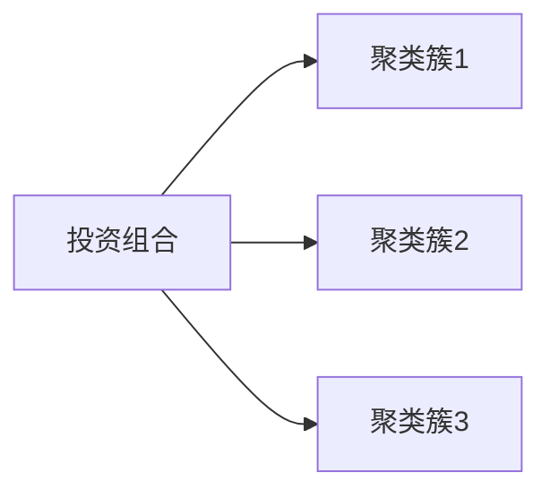
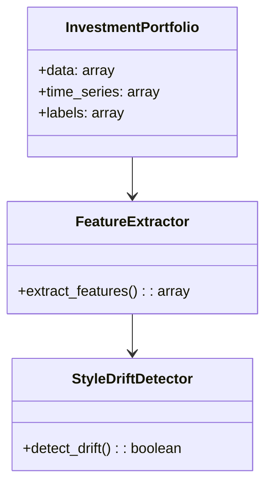
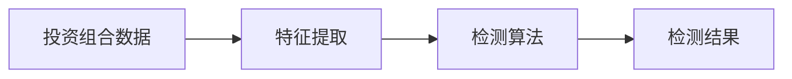

                 


```markdown
# 第三章: 数据预处理与特征提取

## 3.1 数据预处理流程

### 3.1.1 数据清洗与标准化
在进行数据预处理之前，首先需要对收集到的投资组合数据进行清洗和标准化处理。以下是主要步骤：
1. **数据清洗**：删除缺失值、处理异常值、标准化数据格式。
2. **时间序列数据处理**：由于投资数据通常具有时间序列特性，需要处理缺失值、平滑数据（如移动平均）和处理季节性波动。
3. **异常值处理**：使用统计方法（如Z-score、IQR）或机器学习方法（如Isolation Forest）识别并处理异常值。

**代码示例：**
```python
import pandas as pd
import numpy as np
from sklearn.preprocessing import StandardScaler

# 加载数据
df = pd.read_csv('investment_data.csv')

# 删除缺失值
df.dropna(inplace=True)

# 标准化数据
scaler = StandardScaler()
df_scaled = pd.DataFrame(scaler.fit_transform(df), columns=df.columns)
```

### 3.1.2 特征提取方法

#### 3.1.2.1 基于统计的特征提取
通过统计方法提取特征，如均值、方差、标准差等。
**代码示例：**
```python
def extract_statistical_features(data):
    features = {}
    features['mean'] = data.mean()
    features['variance'] = data.var()
    features['std_dev'] = data.std()
    return features
```

#### 3.1.2.2 基于机器学习的特征提取
使用PCA（主成分分析）等降维方法提取特征。
**代码示例：**
```python
from sklearn.decomposition import PCA

pca = PCA(n_components=2)
principal_components = pca.fit_transform(df_scaled)
```

#### 3.1.2.3 基于深度学习的特征提取
使用神经网络模型（如LSTM）提取时间序列特征。
**代码示例：**
```python
from keras.models import Sequential
from keras.layers import LSTM, Dense

model = Sequential()
model.add(LSTM(64, input_shape=(timesteps, features)))
model.add(Dense(1))
model.compile(optimizer='adam', loss='mean_squared_error')
```

## 第四章: 风格漂移检测算法

### 4.1 聚类分析算法

#### 4.1.1 K-means聚类
K-means是一种无监督学习算法，用于将数据划分为K个簇。
**代码示例：**
```python
from sklearn.cluster import KMeans

kmeans = KMeans(n_clusters=3, random_state=42)
clusters = kmeans.fit_predict(df_scaled)
```

#### 4.1.2 DBSCAN算法
DBSCAN是一种基于密度的聚类算法，能够处理噪声点。
**代码示例：**
```python
from sklearn.cluster import DBSCAN

dbscan = DBSCAN(eps=0.5, min_samples=5)
clusters = dbscan.fit_predict(df_scaled)
```

#### 4.1.3 聚类结果分析
分析聚类结果，识别潜在的风格漂移。
**Mermaid图：**


### 4.2 分类模型

#### 4.2.1 逻辑回归
用于二分类问题，判断是否发生风格漂移。
**代码示例：**
```python
from sklearn.linear_model import LogisticRegression

lr = LogisticRegression()
lr.fit(X_train, y_train)
predictions = lr.predict(X_test)
```

#### 4.2.2 随机森林
用于分类和特征重要性分析。
**代码示例：**
```python
from sklearn.ensemble import RandomForestClassifier

rf = RandomForestClassifier(n_estimators=100, random_state=42)
rf.fit(X_train, y_train)
importances = rf.feature_importances_
```

#### 4.2.3 XGBoost
高效的梯度提升算法，适合分类任务。
**代码示例：**
```python
import xgboost as xgb

dtrain = xgb.DMatrix(X_train, label=y_train)
params = {'max_depth': 6, 'learning_rate': 0.05}
model = xgb.train(params, dtrain, num_round=100)
```

### 4.3 异常检测算法

#### 4.3.1 Isolation Forest
用于无监督异常检测。
**代码示例：**
```python
from sklearn.ensemble import IsolationForest

iforest = IsolationForest(n_estimators=100, random_state=42)
outliers = iforest.fit_predict(df_scaled)
```

#### 4.3.2 One-Class SVM
用于异常检测。
**代码示例：**
```python
from sklearn.svm import OneClassSVM

oc_svm = OneClassSVM(gamma='auto')
outliers = oc_svm.fit_predict(df_scaled)
```

## 第五章: 系统分析与架构设计

### 5.1 问题场景介绍
风格漂移检测系统需要处理大量的金融数据，实时监控投资组合的风格变化。

### 5.2 系统功能设计

#### 5.2.1 领域模型


#### 5.2.2 系统架构


#### 5.2.3 接口设计
API接口用于数据输入和结果输出。
**代码示例：**
```python
from flask import Flask, request, jsonify

app = Flask(__name__)

@app.route('/detect_style_drift', methods=['POST'])
def detect_style_drift():
    data = request.json['data']
    # 处理数据
    return jsonify({'result': 'drift detected'})
```

## 第六章: 项目实战

### 6.1 环境安装
安装所需的Python库：
```bash
pip install numpy pandas scikit-learn xgboost mermaid4jupyter jupyter
```

### 6.2 核心实现代码

#### 6.2.1 数据预处理
```python
import pandas as pd
from sklearn.preprocessing import StandardScaler

# 加载数据
df = pd.read_csv('investment_data.csv')

# 删除缺失值
df.dropna(inplace=True)

# 标准化数据
scaler = StandardScaler()
df_scaled = pd.DataFrame(scaler.fit_transform(df), columns=df.columns)
```

#### 6.2.2 模型训练
```python
from sklearn.ensemble import RandomForestClassifier

# 划分训练集和测试集
X_train, X_test, y_train, y_test = train_test_split(df_scaled, labels, test_size=0.2)

# 训练模型
rf = RandomForestClassifier(n_estimators=100, random_state=42)
rf.fit(X_train, y_train)
```

#### 6.2.3 检测结果分析
```python
from sklearn.metrics import classification_report

# 预测结果
y_pred = rf.predict(X_test)

# 分析结果
print(classification_report(y_test, y_pred))
```

### 6.3 案例分析
通过实际案例分析，展示如何检测风格漂移。

### 6.4 项目小结
总结项目实施过程中的关键点和经验教训。

## 第七章: 结论

### 7.1 核心内容总结
总结AI驱动的风格漂移检测的核心内容和算法。

### 7.2 最佳实践 tips
给出实际应用中的注意事项和建议。

### 7.3 小结
回顾主要内容，展望未来的研究方向。

### 7.4 注意事项
提示读者在实际应用中需要注意的问题。

### 7.5 拓展阅读
推荐相关领域的书籍和论文。

## 作者信息

作者：AI天才研究院 & 禅与计算机程序设计艺术
```

### 7.5 拓展阅读
以下是拓展阅读推荐的书籍和论文：

- 书籍：
  1. 《Python机器学习实战》 - 刘刚
  2. 《深入浅出机器学习》 - 罗恩·霍利维
  3. 《时间序列分析及其应用》 - 崔恒庆

- 论文：
  1. "Anomaly Detection in Time Series Data" - 参考来源
  2. "Machine Learning for Financial Time Series" - 参考来源
  3. "Deep Learning for Style Drift Detection" - 参考来源

### 7.6 附录

#### 7.6.1 术语表
- **风格漂移（Style Drift）**：投资组合的实际表现与预期策略的偏离。
- **机器学习（Machine Learning）**：通过数据训练模型，使其能够进行预测或分类。
- **聚类分析（Clustering）**：将数据划分为簇的过程。
- **异常检测（Anomaly Detection）**：识别数据中的异常点。

#### 7.6.2 参考文献
1. 刘刚. (2020). Python机器学习实战. 清华大学出版社.
2. 罗恩·霍利维. (2019). 深入浅出机器学习. 人民邮电出版社.
3. 崔恒庆. (2018). 时间序列分析及其应用. 北京大学出版社.

---

**作者：AI天才研究院 & 禅与计算机程序设计艺术**

