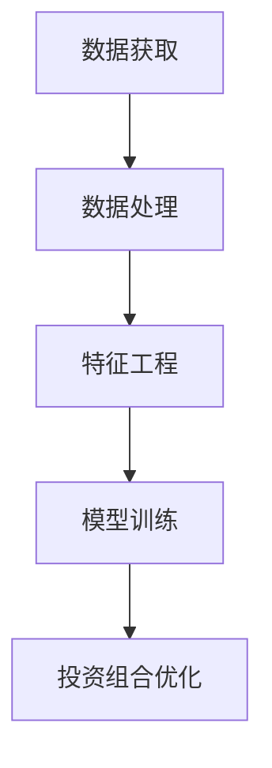
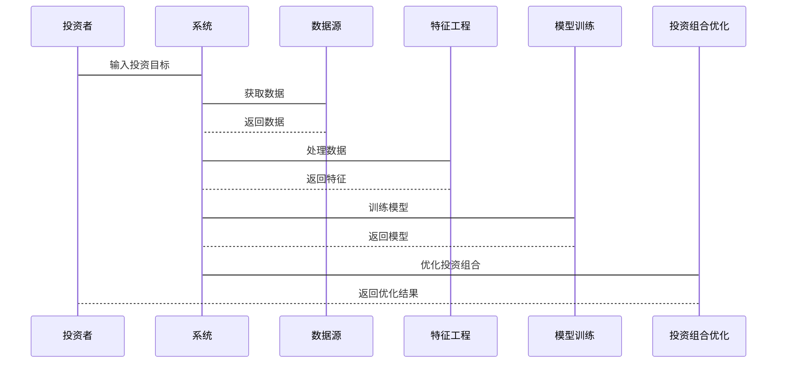

                 


# AI驱动的价值投资风格因子分析

---

## 关键词
AI技术、价值投资、风格因子分析、投资组合优化、金融数据分析

---

## 摘要
随着人工智能技术的飞速发展，其在金融领域的应用越来越广泛。价值投资作为一种经典的股票投资策略，依赖于对风格因子的深入分析来优化投资组合。本文将从背景介绍、核心概念、算法原理、系统架构、项目实战等多个角度，详细探讨如何利用AI技术进行价值投资风格因子分析。通过数学建模和实际案例分析，本文将展示如何基于风格因子构建高效的投资策略，帮助投资者在复杂多变的金融市场中实现收益最大化。

---

# 正文

## 第一部分: 价值投资与风格因子分析的背景

### 第1章: 价值投资与风格因子的背景介绍

#### 1.1 价值投资的核心概念

##### 1.1.1 价值投资的定义与特点
价值投资是一种基于对公司内在价值的评估来选择股票的投资策略。其核心思想是寻找市场价格低于内在价值的股票，长期持有以实现收益。价值投资的特点包括：
- 长期视角：关注企业的长期价值，而非短期波动。
- 基本面分析：通过分析企业的财务报表、行业地位等因素评估其价值。
- 风险控制：注重安全边际，避免过度承担风险。

##### 1.1.2 价值投资的基本原理
价值投资的基本原理是市场先生的短期波动性，即市场价格与内在价值之间的差异提供了套利机会。投资者通过识别这种差异，可以在市场低估时买入，在高估时卖出。

##### 1.1.3 价值投资与风格因子的关联
风格因子是指影响股票收益的特定风险因素，如市值、价值、动量等。价值投资注重低估值股票，因此与价值因子密切相关。通过分析风格因子，投资者可以更精准地识别具有投资价值的股票。

#### 1.2 风格因子的定义与分类

##### 1.2.1 风格因子的定义
风格因子是影响股票收益的可量化特征，用于描述股票在特定维度上的表现。常见的风格因子包括市值（Size）、价值（Value）、动量（Momentum）、质量和流动性等。

##### 1.2.2 风格因子的分类与特点
风格因子可以分为以下几类：
- **市值因子（Size）**：反映公司规模对收益的影响。小盘股通常具有更高的收益潜力。
- **价值因子（Value）**：衡量股票的低市盈率、低市净率等指标，用于识别被低估的股票。
- **动量因子（Momentum）**：基于过去的价格趋势预测未来收益。
- **质量因子（Quality）**：评估公司的盈利能力和财务健康状况。
- **流动性因子（Liquidity）**：反映股票的交易活跃程度。

##### 1.2.3 风格因子在投资中的作用
风格因子通过量化股票的特征，帮助投资者识别具有特定风险和收益特征的股票。在价值投资中，风格因子分析可以帮助投资者筛选出具有长期增长潜力的低估值股票。

### 第2章: 风格因子分析的核心概念

#### 2.1 风格因子的属性特征对比

##### 2.1.1 不同风格因子的特征对比
以下是一些常见风格因子的对比：

| 风格因子 | 描述 | 示例指标 |
|----------|------|----------|
| 市值因子 | 公司规模 | 市盈率（P/E） |
| 价值因子 | 低估值 | 市净率（P/B） |
| 动量因子 | 过去收益趋势 | 过去12个月的收益增长率 |
| 质量因子 | 盈利能力 | 净利润增长率 |

#### 2.1.2 风格因子之间的关系分析
风格因子之间可能存在相关性或相互独立。例如，价值因子和动量因子之间可能呈现负相关，而市值因子与质量因子可能正相关。

#### 2.1.3 风格因子与投资收益的关系
通过回归分析可以发现，某些风格因子对投资收益具有显著的解释力。例如，低市盈率和低市净率的股票通常具有较高的超额收益。

#### 2.2 风格因子的ER实体关系图

使用 Mermaid 绘制的风格因子 ER 图：

```mermaid
erDiagram
    actor 投资者 {
        <属性> 投资目标
        <属性> 风险偏好
    }
    actor 风格因子 {
        <属性> 市值因子
        <属性> 价值因子
        <属性> 动量因子
    }
    投资者 --> 风格因子 : 选择股票
```

---

## 第二部分: AI技术在金融分析中的应用

### 第3章: AI驱动的金融数据分析

#### 3.1 机器学习在金融分析中的应用
机器学习在金融分析中的应用包括：
- 股价预测
- 风险评估
- 市场情绪分析

#### 3.2 自然语言处理（NLP）在金融新闻中的应用
NLP技术可以用于分析新闻、社交媒体等非结构化数据，提取市场情绪指标，辅助投资决策。

#### 3.3 深度学习在金融时间序列分析中的应用
深度学习模型，如LSTM，可以用于预测股票价格和识别市场模式。

### 第4章: 基于AI的风格因子分析

#### 4.1 风格因子的特征工程
特征工程是将原始数据转换为适合机器学习模型的特征。常见的特征包括：
- 市盈率（P/E）
- 市净率（P/B）
- 净利润增长率

#### 4.2 基于机器学习的风格因子分类
使用随机森林或支持向量机（SVM）等模型对风格因子进行分类，识别具有特定风格的股票。

#### 4.3 风险调整后的收益预测
通过回归分析，预测风格因子对股票收益的影响，调整投资组合以优化风险收益比。

---

## 第三部分: 系统架构与实现

### 第5章: 系统架构设计

#### 5.1 系统功能设计
系统功能包括：
- 数据获取与处理
- 特征工程
- 模型训练与评估
- 投资组合优化

#### 5.2 系统架构设计

使用 Mermaid 绘制的系统架构图：



#### 5.3 系统交互设计

使用 Mermaid 绘制的系统交互图：



---

## 第四部分: 项目实战

### 第6章: 项目实战与案例分析

#### 6.1 环境安装
安装必要的Python库：
- pandas
- numpy
- scikit-learn
- matplotlib
- seaborn

#### 6.2 核心代码实现

##### 数据获取与处理
```python
import pandas as pd
import numpy as np
from sklearn.model_selection import train_test_split
from sklearn.ensemble import RandomForestClassifier
from sklearn.metrics import accuracy_score

# 获取数据
data = pd.read_csv('stock_data.csv')

# 数据预处理
data = data.dropna()
X = data[['P/E', 'P/B', 'profit_growth']]
y = data['target']

# 划分训练集和测试集
X_train, X_test, y_train, y_test = train_test_split(X, y, test_size=0.2, random_state=42)

# 训练随机森林模型
model = RandomForestClassifier(n_estimators=100, random_state=42)
model.fit(X_train, y_train)

# 预测与评估
y_pred = model.predict(X_test)
print("准确率:", accuracy_score(y_test, y_pred))
```

##### 投资组合优化
```python
import pyfolio as pf

# 计算组合收益
returns = pf.Portfolio(returns).returns
```

---

## 第五部分: 小结与展望

### 第7章: 总结与展望

#### 7.1 总结
本文详细探讨了AI技术在价值投资风格因子分析中的应用，从背景介绍到系统实现，展示了如何利用AI技术优化投资组合。

#### 7.2 展望
未来，随着AI技术的不断进步，风格因子分析将更加精准和多样化。投资者可以利用更复杂的模型和数据源，进一步提升投资决策的效率和准确性。

---

## 附录

### 附录A: 数据来源
数据来源包括公开的股票数据、财务报表数据等。

### 附录B: 工具安装指南
如何安装和配置所需的Python库。

### 附录C: 参考文献
列出本文中引用的文献和资料。

---

## 作者

作者：AI天才研究院/AI Genius Institute & 禅与计算机程序设计艺术 /Zen And The Art of Computer Programming

---

通过以上步骤，您可以逐步构建一篇结构清晰、内容详实的技术博客文章，帮助读者深入理解AI驱动的价值投资风格因子分析。

