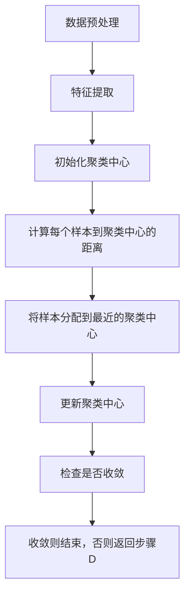
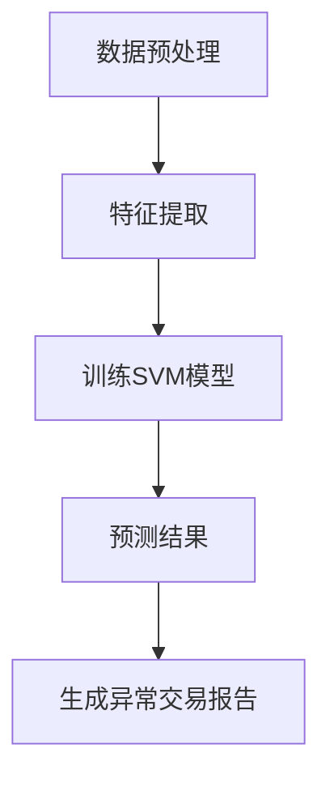
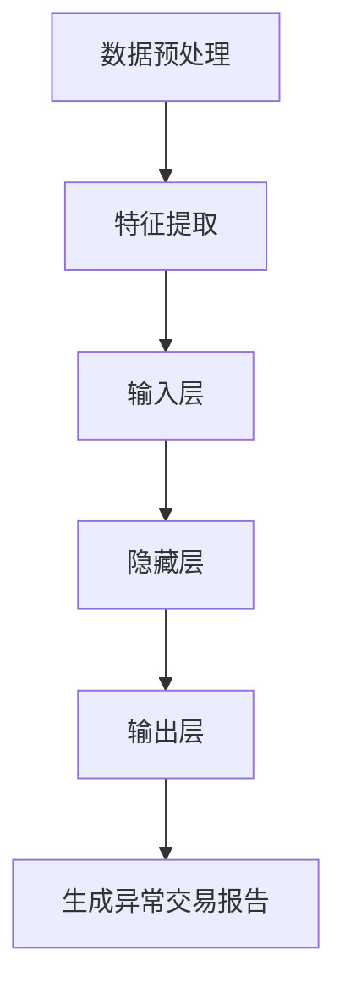
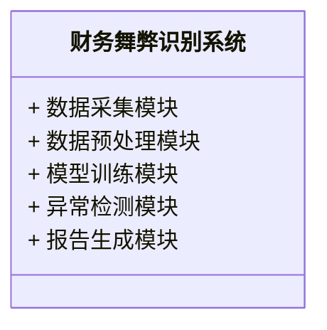
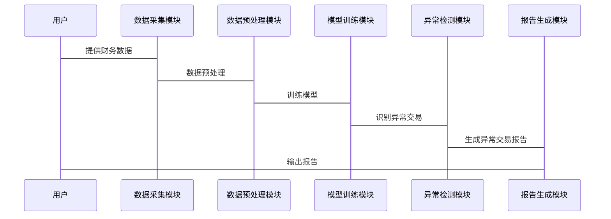

                 


# AI驱动的企业财务舞弊模式识别系统

## 关键词：AI，财务舞弊，模式识别，机器学习，深度学习，企业财务

## 摘要：本文探讨了如何利用人工智能技术，特别是机器学习和深度学习算法，构建企业财务舞弊模式识别系统。通过分析财务数据的特征和模式，结合系统架构设计和项目实战，详细阐述了AI在财务舞弊识别中的应用潜力和实际价值。本文旨在为企业财务部门和技术开发者提供一种高效、可靠的财务舞弊检测方法，助力企业防范财务风险。

---

# 第一部分: 企业财务舞弊模式识别的背景与挑战

# 第1章: 财务舞弊模式识别的背景与问题描述

## 1.1 财务舞弊的定义与特征

### 1.1.1 财务舞弊的定义
财务舞弊是指企业在财务报表、会计记录或其他财务文档中故意提供虚假信息，以掩盖真实财务状况的行为。这种行为通常是为了掩盖亏损、虚增收入或其他非法目的。

### 1.1.2 财务舞弊的主要特征
财务舞弊具有以下主要特征：
1. **隐蔽性**：舞弊者通常会采取复杂手段掩盖舞弊行为，如虚构交易、虚增收入、虚减支出等。
2. **复杂性**：舞弊行为可能涉及多个部门、多个时间段，且舞弊手段不断演变。
3. **破坏性**：舞弊行为可能导致企业财务状况恶化，损害投资者利益，甚至引发企业破产。

### 1.1.3 财务舞弊对企业的影响
财务舞弊对企业的影响是多方面的，包括：
1. **经济损失**：企业可能因为舞弊行为而蒙受直接经济损失。
2. **声誉损害**：舞弊行为会损害企业的声誉，影响投资者信心。
3. **法律风险**：舞弊行为可能导致企业面临法律诉讼和罚款。

## 1.2 传统财务舞弊识别方法的局限性

### 1.2.1 传统审计方法的局限性
传统审计方法主要依赖人工检查和分析，存在以下问题：
1. **效率低下**：人工审计需要大量时间和资源，难以应对海量数据的分析需求。
2. **主观性**：审计结果依赖于审计人员的经验和判断，存在主观性较强的问题。
3. **覆盖范围有限**：传统审计方法难以覆盖所有可能的舞弊行为，尤其是复杂的舞弊手段。

### 1.2.2 人工识别的效率低下
人工识别财务舞弊的效率低下主要体现在以下几个方面：
1. **数据量大**：现代企业财务数据量庞大，人工分析效率难以应对。
2. **复杂性高**：舞弊行为往往涉及复杂的交易和数据操作，人工识别难度大。
3. **成本高**：人工审计需要大量专业人员，成本较高。

### 1.2.3 数据量大与复杂性增加的挑战
随着企业规模的扩大和业务的复杂化，财务数据量急剧增加，数据类型也更加多样化。传统方法难以有效处理这些数据，导致舞弊行为难以被及时发现。

## 1.3 AI技术在财务舞弊识别中的应用潜力

### 1.3.1 AI技术的核心优势
AI技术在财务舞弊识别中的核心优势在于：
1. **高效性**：AI能够快速处理海量数据，提高识别效率。
2. **准确性**：通过机器学习算法，AI能够发现数据中的异常模式，提高识别准确性。
3. **适应性**：AI系统能够不断学习和优化，适应舞弊手段的变化。

### 1.3.2 AI在财务数据分析中的独特价值
AI技术在财务数据分析中的独特价值体现在以下几个方面：
1. **自动化分析**：AI能够自动化处理财务数据，减少人工干预。
2. **模式识别**：通过机器学习和深度学习算法，AI能够识别复杂的财务舞弊模式。
3. **实时监控**：AI系统可以实时监控财务数据，及时发现异常交易。

### 1.3.3 企业级AI驱动的舞弊识别系统的发展趋势
随着AI技术的不断发展，企业级AI驱动的舞弊识别系统将越来越普及，成为企业财务管理的重要工具。未来，AI技术将进一步提升舞弊识别的准确性和效率，帮助企业更好地防范财务风险。

## 1.4 本章小结
本章主要介绍了财务舞弊的定义和特征，分析了传统财务舞弊识别方法的局限性，并探讨了AI技术在财务舞弊识别中的应用潜力。通过对比传统方法和AI技术的优劣，本文为后续章节的深入分析奠定了基础。

---

# 第二部分: 财务舞弊模式识别的核心概念与理论基础

# 第2章: 财务舞弊模式识别的核心概念

## 2.1 财务数据特征分析

### 2.1.1 财务数据的多维特征
财务数据具有多维特征，包括：
1. **时间特征**：数据的时间序列特性，如月度、季度或年度数据。
2. **金额特征**：交易金额的大小、波动性等。
3. **交易特征**：交易频率、交易类型、交易对手等。

### 2.1.2 异常交易的识别特征
异常交易通常具有以下识别特征：
1. **交易金额异常**：交易金额明显偏离正常范围。
2. **交易时间异常**：交易集中在特定时间段，或在非正常时间发生。
3. **交易对手异常**：交易对手身份不明或与企业无实质性业务往来。

### 2.1.3 财务舞弊的模式特征
财务舞弊的模式特征包括：
1. **虚构交易**：通过虚构交易虚增收入或虚减支出。
2. **关联交易**：通过关联交易转移资金或资产。
3. **账实不符**：账面记录与实际业务不符。

## 2.2 AI驱动的模式识别原理

### 2.2.1 机器学习在模式识别中的应用
机器学习是一种通过数据训练模型，使其能够识别数据中的模式和特征的技术。在财务舞弊识别中，机器学习算法可以通过对财务数据的训练，识别出异常交易模式。

### 2.2.2 深度学习在复杂模式识别中的优势
深度学习是一种基于人工神经网络的机器学习技术，能够处理复杂的非线性关系。在财务舞弊识别中，深度学习算法可以识别出隐藏在数据中的深层模式，提高识别准确性。

### 2.2.3 聚类与分类算法在舞弊识别中的作用
聚类算法可以将财务数据分成不同的类别，识别出异常交易的特征。分类算法可以通过对财务数据的训练，将交易分为正常交易和异常交易。

## 2.3 财务舞弊模式识别的系统架构

### 2.3.1 系统输入与输出
财务舞弊模式识别系统的输入包括财务数据、交易记录等，输出包括异常交易报告、风险预警等。

### 2.3.2 系统功能模块划分
系统功能模块包括：
1. **数据采集模块**：负责采集财务数据。
2. **数据预处理模块**：对数据进行清洗和转换。
3. **模型训练模块**：训练机器学习模型。
4. **异常检测模块**：识别异常交易。
5. **报告生成模块**：生成异常交易报告。

### 2.3.3 系统的核心算法选择
系统的核心算法可以选择聚类、分类、深度学习等算法，具体选择取决于数据特征和舞弊模式的复杂性。

## 2.4 本章小结
本章主要介绍了财务舞弊模式识别的核心概念，包括财务数据特征分析、AI驱动的模式识别原理和系统架构设计。通过对这些概念的深入分析，为后续章节的算法实现奠定了理论基础。

---

# 第三部分: AI驱动的财务舞弊模式识别算法原理

# 第3章: 基于机器学习的舞弊识别算法

## 3.1 聚类算法在舞弊识别中的应用

### 3.1.1 K-means算法原理与流程图
K-means算法是一种常用的聚类算法，其原理是通过迭代优化将数据分成K个簇。以下是K-means算法的流程图：



### 3.1.2 聚类算法的Python实现示例
以下是一个使用K-means算法进行聚类的Python代码示例：

```python
from sklearn.cluster import KMeans
import pandas as pd

# 示例数据
data = pd.DataFrame({
    'x': [1, 2, 3, 4, 5],
    'y': [6, 7, 8, 9, 10]
})

# 初始化K-means模型
kmeans = KMeans(n_clusters=2, random_state=0)

# 拟合模型
kmeans.fit(data)

# 获取聚类中心
print("聚类中心：", kmeans.cluster_centers_)
```

## 3.2 基于分类算法的舞弊识别

### 3.2.1 支持向量机（SVM）原理与流程图
支持向量机（SVM）是一种常用的分类算法，其原理是通过找到一个超平面将数据分成两类。以下是SVM算法的流程图：



### 3.2.2 分类算法的Python实现示例
以下是一个使用SVM算法进行分类的Python代码示例：

```python
from sklearn import svm
import pandas as pd

# 示例数据
data = pd.DataFrame({
    'x': [1, 2, 3, 4, 5],
    'y': [6, 7, 8, 9, 10]
})

# 标签
labels = [0, 0, 1, 1, 1]

# 初始化SVM模型
model = svm.SVC()

# 拟合模型
model.fit(data, labels)

# 预测结果
print("预测结果：", model.predict(data))
```

## 3.3 基于深度学习的舞弊识别

### 3.3.1 神经网络原理与流程图
神经网络是一种常用的深度学习算法，其原理是通过多层神经元模拟人类大脑的神经网络。以下是神经网络算法的流程图：



### 3.3.2 神经网络的Python实现示例
以下是一个使用神经网络进行分类的Python代码示例：

```python
import numpy as np
import tensorflow as tf

# 示例数据
x = np.array([[0.1, 0.2], [0.3, 0.4], [0.5, 0.6]], dtype=np.float32)
y = np.array([0, 1, 0], dtype=np.float32)

# 定义神经网络模型
model = tf.keras.Sequential([
    tf.keras.layers.Dense(2, activation='relu'),
    tf.keras.layers.Dense(1, activation='sigmoid')
])

# 编译模型
model.compile(optimizer='adam', loss='binary_crossentropy', metrics=['accuracy'])

# 训练模型
model.fit(x, y, epochs=100, batch_size=32)

# 预测结果
print("预测结果：", model.predict(x))
```

## 3.4 本章小结
本章主要介绍了基于机器学习的舞弊识别算法，包括聚类算法、分类算法和深度学习算法的原理和实现。通过这些算法的应用，可以有效识别财务数据中的异常交易，提高舞弊识别的准确性和效率。

---

# 第四部分: 财务舞弊模式识别系统架构与实现

# 第4章: 系统架构设计

## 4.1 系统功能模块划分

### 4.1.1 数据采集模块
数据采集模块负责从企业财务系统中采集财务数据，包括财务报表、交易记录等。

### 4.1.2 数据预处理模块
数据预处理模块对采集到的数据进行清洗和转换，确保数据的完整性和一致性。

### 4.1.3 模型训练模块
模型训练模块利用预处理后的数据，训练机器学习模型，提取数据中的特征和模式。

### 4.1.4 异常检测模块
异常检测模块通过模型识别异常交易，生成异常交易报告。

### 4.1.5 报告生成模块
报告生成模块将异常交易报告输出为可视化报告，供企业财务部门参考。

## 4.2 系统架构设计

### 4.2.1 系统核心算法选择
系统核心算法可以选择聚类、分类或深度学习算法，具体选择取决于数据特征和舞弊模式的复杂性。

### 4.2.2 系统架构的Mermaid类图
以下是系统的类图：



## 4.3 系统接口设计

### 4.3.1 系统输入接口
系统输入接口包括财务数据接口和用户输入接口，分别用于接收财务数据和用户输入的参数。

### 4.3.2 系统输出接口
系统输出接口包括异常交易报告接口和可视化报告接口，分别用于输出异常交易报告和可视化报告。

## 4.4 系统交互流程

### 4.4.1 系统交互的Mermaid序列图
以下是系统的交互流程图：



## 4.5 本章小结
本章主要介绍了财务舞弊模式识别系统的架构设计，包括功能模块划分、系统架构设计、接口设计和交互流程。通过合理的系统设计，可以提高舞弊识别系统的效率和准确性。

---

# 第五部分: 项目实战与应用

# 第5章: 项目实战

## 5.1 项目环境配置

### 5.1.1 数据集准备
需要准备企业财务数据，包括财务报表、交易记录等。

### 5.1.2 工具安装与配置
需要安装Python、机器学习库（如scikit-learn、TensorFlow）等工具。

## 5.2 系统核心实现

### 5.2.1 数据预处理代码
以下是数据预处理的代码示例：

```python
import pandas as pd
from sklearn.preprocessing import StandardScaler

# 读取数据
data = pd.read_csv('financial_data.csv')

# 数据清洗
data.dropna(inplace=True)

# 特征提取
features = data[['revenue', 'expenses', 'net_income']]

# 标准化处理
scaler = StandardScaler()
features_scaled = scaler.fit_transform(features)
```

### 5.2.2 模型训练代码
以下是模型训练的代码示例：

```python
from sklearn.ensemble import RandomForestClassifier
import pandas as pd

# 读取数据
data = pd.read_csv('financial_data.csv')

# 特征选择
features = data[['revenue', 'expenses', 'net_income']]
labels = data['is_fraud']

# 训练模型
model = RandomForestClassifier()
model.fit(features, labels)
```

### 5.2.3 异常检测代码
以下是异常检测的代码示例：

```python
from sklearn.isotonic import IsotonicRegression

# 预测结果
predicted_labels = model.predict(features)

# 异常检测
ir = IsotonicRegression()
ir.fit(features, predicted_labels)

# 生成异常报告
abnormal_transactions = pd.Series(predicted_labels != labels).sum()
```

## 5.3 案例分析与结果解读

### 5.3.1 案例分析
以下是一个具体的案例分析：

假设我们有一个企业的财务数据，其中有一笔异常交易。通过模型训练和异常检测，系统能够识别出这笔交易是舞弊行为。

### 5.3.2 结果解读
系统生成的异常交易报告包括异常交易的详细信息，如交易金额、交易时间、交易对手等，帮助企业财务部门进一步调查和处理。

## 5.4 本章小结
本章通过实际项目实战，详细介绍了系统的核心实现过程，包括数据预处理、模型训练和异常检测。通过案例分析和结果解读，展示了AI驱动的企业财务舞弊模式识别系统在实际应用中的价值。

---

# 第六部分: 最佳实践与小结

# 第6章: 最佳实践与总结

## 6.1 系统优缺点分析

### 6.1.1 优点
1. **高效性**：AI系统能够快速处理海量数据，提高识别效率。
2. **准确性**：通过机器学习算法，系统能够识别复杂的舞弊模式，提高识别准确性。
3. **适应性**：系统能够不断学习和优化，适应舞弊手段的变化。

### 6.1.2 缺点
1. **数据依赖性**：AI系统依赖于高质量的数据，数据质量直接影响识别结果。
2. **算法选择**：算法选择和参数设置对识别结果有重要影响，需要专业人员进行调优。
3. **维护成本**：AI系统的维护和更新需要较高的技术和人力资源。

## 6.2 系统改进建议

### 6.2.1 数据质量管理
建议企业加强数据质量管理，确保数据的完整性和准确性。

### 6.2.2 算法优化
建议企业不断优化算法，选择最适合数据特征的算法，提高识别效果。

### 6.2.3 系统维护
建议企业加强系统维护，定期更新模型，确保系统高效运行。

## 6.3 注意事项

### 6.3.1 数据隐私保护
在处理财务数据时，需要注意数据隐私保护，遵守相关法律法规。

### 6.3.2 系统安全
系统需要具备较高的安全性，防止数据泄露和系统攻击。

## 6.4 拓展阅读

### 6.4.1 推荐书籍
1. 《机器学习实战》
2. 《深度学习》
3. 《财务报表分析》

### 6.4.2 推荐博客
1. Towards Data Science
2. Analytics Vidhya
3. Medium上的AI相关文章

## 6.5 本章小结
本章总结了AI驱动的企业财务舞弊模式识别系统的优缺点，提出了改进建议，并给出了实际应用中的注意事项和拓展阅读资源。通过不断完善和优化，系统可以更好地服务于企业财务管理，帮助企业防范财务风险。

---

# 作者：AI天才研究院/AI Genius Institute & 禅与计算机程序设计艺术 /Zen And The Art of Computer Programming

