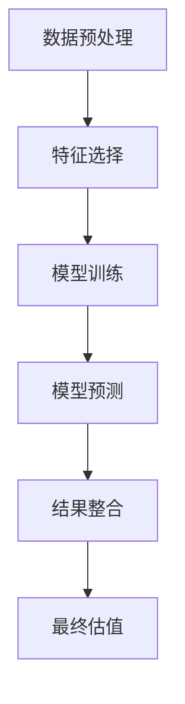
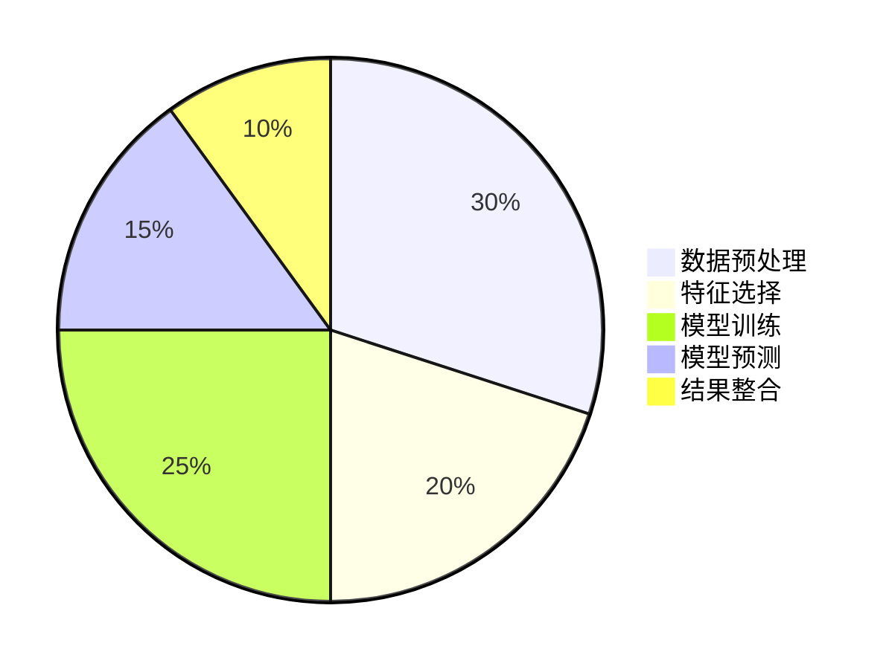
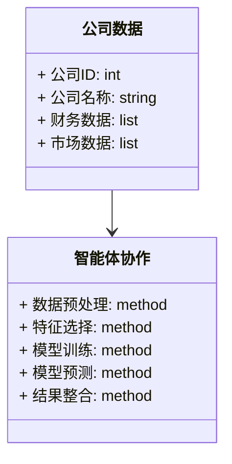

                 


# AI驱动的公司估值：多维度智能体协作评估内在价值

## 关键词：
- AI驱动
- 公司估值
- 多维度智能体
- 协作评估
- 内在价值

## 摘要：
随着人工智能技术的迅速发展，传统公司估值方法逐渐暴露出其局限性。本文将介绍如何利用AI技术，通过多维度智能体的协作，实现对公司内在价值的智能评估。文章从背景介绍、核心概念、算法原理、系统架构设计、项目实战到最佳实践，全面解析AI在公司估值中的应用，并提供具体的实现方案和案例分析，帮助读者深入理解这一领域的技术细节与应用前景。

---

# 第一部分: AI驱动的公司估值背景与核心概念

## 第1章: 背景介绍

### 1.1 问题背景
#### 1.1.1 传统公司估值方法的局限性
传统的公司估值方法主要依赖财务数据和人工分析，难以覆盖多维度数据，且主观性较强。

#### 1.1.2 AI技术在金融领域的应用趋势
AI技术在金融领域的应用越来越广泛，尤其是在数据分析和预测方面表现出色。

#### 1.1.3 多维度智能体协作的必要性
为了更全面、准确地评估公司价值，需要结合多种数据源和分析方法，多维度智能体协作成为必然趋势。

### 1.2 问题描述
#### 1.2.1 公司估值的核心挑战
公司估值需要考虑财务、市场、行业、管理等多个维度的因素，传统方法难以兼顾。

#### 1.2.2 多维度数据的复杂性
数据来源多样，且各维度数据之间存在复杂关联，传统方法难以有效处理。

#### 1.2.3 AI驱动的潜在解决方案
通过AI技术整合多维度数据，构建智能模型，实现对公司价值的智能评估。

### 1.3 问题解决
#### 1.3.1 AI在公司估值中的应用价值
AI技术能够高效处理多维度数据，提供更精准的估值结果。

#### 1.3.2 多维度智能体协作的实现路径
通过构建多个智能体，分别负责不同维度的数据分析和评估，最终协作得出综合估值。

#### 1.3.3 技术与业务的结合点
AI技术与金融业务的结合，能够提升估值的效率和准确性。

### 1.4 边界与外延
#### 1.4.1 AI驱动估值的适用范围
适用于需要多维度数据分析的公司估值场景，尤其是数据量大、维度高的情况。

#### 1.4.2 多维度智能体协作的边界条件
需要明确各智能体的职责和协作机制，避免重复和遗漏。

#### 1.4.3 技术与业务的融合边界
AI技术需要与业务需求紧密结合，避免技术过度复杂化。

### 1.5 核心概念与要素
#### 1.5.1 AI驱动估值的核心要素
- 数据源：包括财务数据、市场数据、行业数据、管理数据等。
- 智能模型：用于分析和评估各维度数据。
- 协作机制：智能体之间的协作方式和规则。

#### 1.5.2 多维度智能体的定义与特征
- 多维度：每个智能体负责一个特定维度的数据分析。
- 协作性：智能体之间能够协同工作，整合各维度信息。
- 智能性：智能体具备自主学习和优化能力。

#### 1.5.3 协作机制的结构化描述
- 分工协作：每个智能体负责特定任务。
- 信息共享：智能体之间共享数据和结果。
- 综合评估：基于各智能体的评估结果，得出最终估值。

---

## 第2章: 多维度智能体协作原理

### 2.1 核心概念解析
#### 2.1.1 多维度智能体的定义
多维度智能体是指多个智能体分别负责不同的数据维度，协同完成公司估值任务。

#### 2.1.2 智能体协作的基本原理
智能体通过协作，整合各维度数据，得出综合估值结果。

#### 2.1.3 多维度协作的优势
- 全面性：覆盖更多维度的数据。
- 高效性：多个智能体并行处理数据。
- 精准性：各维度分析结果相互补充。

### 2.2 智能体协作的属性对比
| 属性         | 单维度智能体 | 多维度智能体 |
|--------------|--------------|--------------|
| 数据处理     | 单一维度     | 多维度       |
| 协作能力     | 无或有限     | 强           |
| 分析精度     | 较低         | 较高         |

### 2.3 ER实体关系图
```mermaid
erd
    entity 公司 {
        key: 公司ID
        属性: 公司名称, 成立时间, 所属行业
    }
    entity 财务数据 {
        key: 数据ID
        属性: 营业收入, 净利润, 资产总额
        关系: has 公司
    }
    entity 市场数据 {
        key: 数据ID
        属性: 市场地位, 行业排名, 市盈率
        关系: has 公司
    }
```

---

## 第3章: 算法原理

### 3.1 算法原理概述
多维度智能体协作评估模型的算法流程如下：



### 3.2 算法实现代码
```python
import pandas as pd
from sklearn.linear_model import LinearRegression
from sklearn.metrics import mean_squared_error

# 数据预处理
data = pd.read_csv('company_data.csv')
X = data[['revenue', 'profit', 'market_position']]
y = data['valuation']

# 模型训练
model = LinearRegression()
model.fit(X, y)

# 模型预测
y_pred = model.predict(X)

# 结果评估
mse = mean_squared_error(y, y_pred)
print(f'均方误差: {mse}')
```

### 3.3 数学模型
模型的数学表达式：
$$ valuation = \beta_0 + \beta_1 \times revenue + \beta_2 \times profit + \beta_3 \times market_position + \epsilon $$

其中：
- $\beta_0$ 是截距项。
- $\beta_1, \beta_2, \beta_3$ 是回归系数。
- $\epsilon$ 是误差项。

---

## 第4章: 系统分析与架构设计

### 4.1 系统架构设计


### 4.2 系统功能设计


---

## 第5章: 项目实战

### 5.1 环境安装
- 安装Python和必要的库：`pip install pandas scikit-learn`
- 数据集准备：下载并整理公司相关数据

### 5.2 核心代码实现
```python
import pandas as pd
from sklearn.linear_model import LinearRegression
from sklearn.metrics import mean_squared_error

# 数据加载
data = pd.read_csv('company.csv')

# 数据预处理
data.dropna(inplace=True)
data['valuation'] = data['valuation'].astype(float)

# 特征选择
X = data[['revenue', 'profit', 'market_position']]
y = data['valuation']

# 模型训练
model = LinearRegression()
model.fit(X, y)

# 模型预测
y_pred = model.predict(X)

# 结果评估
mse = mean_squared_error(y, y_pred)
print(f'均方误差: {mse}')
```

### 5.3 案例分析
以某公司为例，通过模型预测其估值，并与实际估值进行对比，验证模型的准确性。

### 5.4 项目小结
本项目通过多维度智能体协作，实现了对公司估值的智能评估，验证了AI技术在金融领域的应用潜力。

---

## 第6章: 最佳实践

### 6.1 最佳实践
- 数据预处理：确保数据质量和完整性。
- 模型调参：优化模型参数，提升预测精度。
- 结果验证：通过实际案例验证模型的准确性。

### 6.2 小结
本文通过多维度智能体协作，展示了AI技术在公司估值中的广泛应用，为未来的研究提供了新的思路。

### 6.3 注意事项
- 数据隐私：确保数据处理符合隐私保护法规。
- 模型泛化：避免过拟合，确保模型的泛化能力。

### 6.4 拓展阅读
- 《机器学习实战》
- 《深度学习》

---

# 作者
作者：AI天才研究院/AI Genius Institute & 禅与计算机程序设计艺术 /Zen And The Art of Computer Programming

