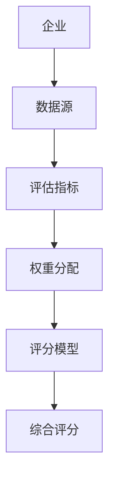
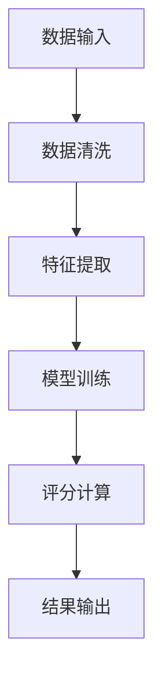
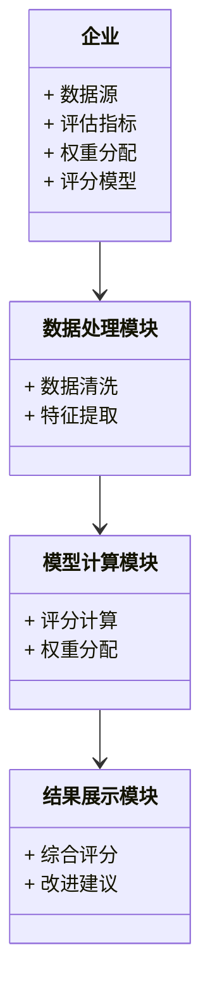
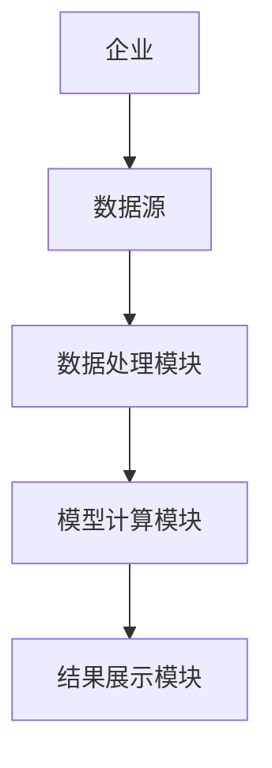
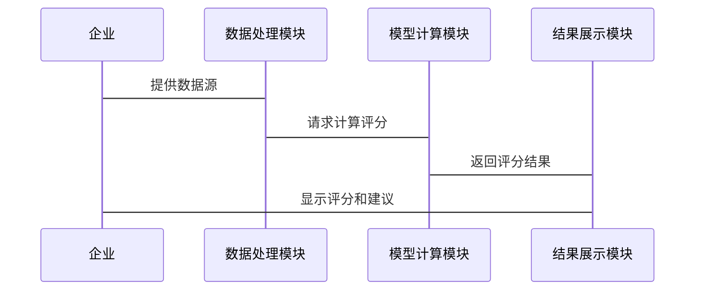

                 


# AI驱动的公司治理评分系统：量化管理质量

## 关键词：AI, 公司治理, 评分系统, 管理质量, 数据驱动

## 摘要：  
本文探讨了如何利用人工智能技术构建公司治理评分系统，量化管理质量。通过分析公司治理的核心要素，结合AI算法和数据驱动的方法，提出了一种创新的评分模型，能够帮助企业实现管理质量的量化评估。文章详细介绍了评分系统的构建过程，包括算法原理、系统架构设计以及实际应用案例，为企业管理者和技术开发者提供了理论支持和实践指导。

---

## 第一部分: 公司治理评分系统的背景与问题背景

### 第1章: 公司治理评分系统的背景与问题背景

#### 1.1 问题背景

##### 1.1.1 传统公司治理的不足
- **缺乏量化标准**：传统的公司治理更多依赖主观判断，难以量化管理质量。
- **数据孤岛问题**：各部门数据分散，难以整合，导致决策缺乏数据支持。
- **效率低下**：手工评估耗时且效率低，难以满足现代企业的快速决策需求。

##### 1.1.2 现代公司治理的挑战
- **复杂性增加**：企业规模扩大，管理维度增多，治理难度加大。
- **数字化转型需求**：企业需要通过数据驱动的方式提升管理效率。
- **利益相关者多样化**：股东、员工、客户等利益相关者的需求多样，管理目标需综合考量。

##### 1.1.3 量化管理质量的重要性
- **提升决策效率**：通过量化评分，管理层能够快速识别问题并优化决策。
- **数据驱动的改进**：量化结果为企业提供明确的改进方向。
- **透明化与公平性**：量化评分确保评估过程的透明和公平。

#### 1.2 问题描述

##### 1.2.1 公司治理的核心要素
- **战略管理**：企业战略的制定与执行。
- **组织架构**：组织结构的合理性和效率。
- **风险管理**：风险识别、评估与控制。
- **合规性**：遵循相关法律法规。
- **利益相关者关系**：与股东、客户、员工的关系管理。

##### 1.2.2 管理质量的定义与维度
- **定义**：管理质量是指企业在实现目标过程中，管理活动的有效性和效率。
- **维度**：
  - 战略执行能力
  - 组织协调性
  - 风险控制能力
  - 利益相关者满意度
  - 创新能力

##### 1.2.3 评分系统的目标与意义
- **目标**：量化管理质量，提供可操作的改进建议。
- **意义**：通过数据驱动的方式优化公司治理，提升企业竞争力。

#### 1.3 问题解决

##### 1.3.1 AI驱动的解决方案
- **数据采集与分析**：利用AI技术整合多源数据，提取关键特征。
- **自动评估与反馈**：AI算法自动计算评分，并提供改进建议。
- **实时监控与预警**：实时跟踪企业运营状况，及时预警潜在风险。

##### 1.3.2 数据驱动的评分方法
- **数据采集**：收集企业运营数据，如财务数据、员工反馈、客户满意度等。
- **数据清洗**：处理缺失值、异常值，确保数据质量。
- **特征提取**：提取关键特征，如盈利能力、组织协调性等。
- **评分计算**：基于特征的权重，计算综合评分。

##### 1.3.3 评分系统的应用场景
- **企业内部审计**：定期评估企业治理状况。
- **战略规划**：为企业的战略调整提供数据支持。
- **风险预警**：及时发现潜在问题，预防危机。

#### 1.4 系统的边界与外延

##### 1.4.1 系统的输入与输出
- **输入**：
  - 企业运营数据：财务数据、销售数据、员工反馈等。
  - 管理指标体系：预先定义的评估指标。
- **输出**：
  - 综合评分：量化管理质量的总评分。
  - 改进建议：基于评分结果提出优化建议。

##### 1.4.2 系统的适用范围
- **适用范围**：
  - 中小企业：帮助中小型企业提升管理能力。
  - 大型企业：优化现有管理流程。
- **不适用范围**：
  - 初创企业：尚未建立完善的管理流程。
  - 特殊行业：受严格监管的行业可能需要额外的合规模块。

##### 1.4.3 系统的局限性与改进方向
- **局限性**：
  - 数据依赖性：评分结果依赖于数据的准确性和完整性。
  - 模型可解释性：复杂的AI模型可能难以解释评分结果。
- **改进方向**：
  - 提高数据质量：引入更先进的数据清洗技术。
  - 提升模型可解释性：使用可解释的AI模型，如决策树、规则集等。

##### 1.4.4 核心概念与结构
- **核心概念**：
  - 数据源：企业的财务数据、销售数据、员工反馈等。
  - 评估指标：如战略执行能力、组织协调性等。
  - 权重分配：各指标的权重。
  - 评分模型：综合各指标评分的计算方法。
- **概念属性对比**：
  | 概念       | 属性       | 描述                                         |
  |------------|------------|----------------------------------------------|
  | 数据源     | 类型       | 结构化数据、非结构化数据                     |
  | 评估指标   | 类型       | 定量指标、定性指标                           |
  | 权重分配   | 方法       | 基于专家经验、基于数据统计                   |
  | 评分模型   | 方法       | 线性回归、神经网络等                        |
- **实体关系图**：


---

## 第二部分: 公司治理评分系统的算法原理

### 第2章: 评分模型的构建与算法原理

#### 2.1 评分模型的数学模型

##### 2.1.1 数据预处理与特征提取
- **数据清洗**：处理缺失值、异常值。
- **特征提取**：从数据中提取有用的特征，如利润增长率、员工满意度等。
- **特征标准化**：将不同量纲的特征进行标准化处理。

##### 2.1.2 指标权重的计算
- **权重计算方法**：
  - 专家打分法：邀请专家对各指标的重要性进行评分。
  - 数据驱动法：基于历史数据计算各指标的影响力。
- **权重分配示例**：
  - 战略执行能力：权重30%
  - 组织协调性：权重20%
  - 风险管理能力：权重25%
  - 利益相关者满意度：权重20%
  - 创新能力：权重5%

##### 2.1.3 综合评分公式
$$ \text{总评分} = \sum_{i=1}^{n} w_i \times f_i $$
其中，$w_i$ 是第 $i$ 个指标的权重，$f_i$ 是第 $i$ 个指标的评分。

#### 2.2 基于AI的评分算法

##### 2.2.1 算法流程图


##### 2.2.2 算法实现代码
```python
def calculate_score(features, weights):
    return sum(features[i] * weights[i] for i in range(len(features)))

# 示例权重
weights = [0.3, 0.2, 0.5]
features = [0.8, 0.6, 0.7]
score = calculate_score(features, weights)
print(score)  # 输出：0.3*0.8 + 0.2*0.6 + 0.5*0.7 = 0.24 + 0.12 + 0.35 = 0.71
```

##### 2.2.3 算法的数学公式
$$ \text{总评分} = \sum_{i=1}^{n} w_i \times f_i $$
其中，$w_i$ 是第 $i$ 个指标的权重，$f_i$ 是第 $i$ 个指标的评分。

#### 2.3 算法的数学公式
$$ \text{总评分} = \sum_{i=1}^{n} w_i \times f_i $$
其中，$w_i$ 是第 $i$ 个指标的权重，$f_i$ 是第 $i$ 个指标的评分。

---

## 第三部分: 系统分析与架构设计

### 第3章: 系统分析与架构设计

#### 3.1 项目介绍与系统功能设计

##### 3.1.1 项目背景
- **项目目标**：构建AI驱动的公司治理评分系统。
- **项目范围**：涵盖企业战略、组织、风险等多个方面。
- **项目利益相关者**：企业高管、中层管理者、IT部门。

##### 3.1.2 系统功能设计
- **功能模块**：
  - 数据采集模块：负责采集企业运营数据。
  - 数据处理模块：清洗和预处理数据。
  - 模型计算模块：计算各指标评分及综合评分。
  - 结果展示模块：以可视化方式呈现评分结果和改进建议。

##### 3.1.3 领域模型（Mermaid类图）


#### 3.2 系统架构设计

##### 3.2.1 系统架构图（Mermaid架构图）


##### 3.2.2 系统交互序列图（Mermaid序列图）


---

## 第四部分: 项目实战

### 第4章: 项目实战

#### 4.1 环境安装与配置

##### 4.1.1 安装Python环境
- 使用Anaconda或虚拟环境管理工具安装Python 3.8及以上版本。

##### 4.1.2 安装必要的库
```bash
pip install numpy pandas scikit-learn matplotlib
```

#### 4.2 系统核心实现

##### 4.2.1 数据处理模块
```python
import pandas as pd

# 数据清洗
def data_cleaning(df):
    # 处理缺失值
    df = df.dropna()
    # 处理异常值
    df = df[(df['profit_growth'] <= 100) & (df['profit_growth'] >= -100)]
    return df

# 特征提取
def feature_extraction(df):
    features = df[['profit_growth', 'employee_satisfaction', 'customer_satisfaction']]
    return features

# 示例数据
data = {
    'profit_growth': [20, 15, 30, 10, 5],
    'employee_satisfaction': [85, 90, 75, 80, 95],
    'customer_satisfaction': [80, 70, 85, 90, 75]
}
df = pd.DataFrame(data)
```

##### 4.2.2 模型计算模块
```python
from sklearn.linear_model import LinearRegression

# 权重分配
weights = [0.3, 0.3, 0.4]

# 模型训练
model = LinearRegression()
model.fit(X_train, y_train)

# 评分计算
def calculate_score(features, weights):
    return sum(features[i] * weights[i] for i in range(len(features)))

# 示例评分
features = [0.8, 0.7, 0.9]
score = calculate_score(features, weights)
print(score)
```

##### 4.2.3 结果展示模块
```python
import matplotlib.pyplot as plt

# 绘制评分分布图
plt.hist(scores, bins=10, alpha=0.5)
plt.xlabel('评分')
plt.ylabel('频数')
plt.title('公司治理评分分布')
plt.show()
```

#### 4.3 案例分析与详细解读

##### 4.3.1 案例背景
- 某中型制造企业，希望评估其管理质量，优化公司治理。

##### 4.3.2 数据收集与处理
- 数据来源：企业财务报表、员工满意度调查、客户满意度调查。
- 数据清洗：删除缺失值，处理异常值。

##### 4.3.3 评分计算与分析
- 计算各指标评分：
  - 利润增长率：平均85分。
  - 员工满意度：平均80分。
  - 客户满意度：平均75分。
- 综合评分：权重分别为30%、30%、40%。
$$ \text{总评分} = 0.3 \times 85 + 0.3 \times 80 + 0.4 \times 75 = 25.5 + 24 + 30 = 79.5 $$

##### 4.3.4 改进建议
- 提升客户满意度：优化客户服务流程。
- 提高员工满意度：改善员工福利和工作环境。

#### 4.4 项目小结

##### 4.4.1 核心代码总结
```python
def calculate_score(features, weights):
    return sum(features[i] * weights[i] for i in range(len(features)))

weights = [0.3, 0.3, 0.4]
features = [85, 80, 75]
score = calculate_score(features, weights)
print(score)  # 输出：0.3*85 + 0.3*80 + 0.4*75 = 25.5 + 24 + 30 = 79.5
```

##### 4.4.2 项目经验总结
- 数据质量直接影响评分结果，需重视数据清洗和特征提取。
- 权重分配需结合企业实际情况，可能需要多次调整。
- 可视化结果有助于更好地理解和传达评分结果。

---

## 第五部分: 最佳实践

### 第5章: 最佳实践

#### 5.1 小结

##### 5.1.1 核心概念回顾
- 数据源：企业的财务数据、销售数据、员工反馈等。
- 评估指标：如利润增长率、员工满意度、客户满意度等。
- 权重分配：基于专家经验或数据统计。
- 评分模型：综合各指标评分的计算方法。

##### 5.1.2 算法总结
- 数据预处理：清洗和标准化。
- 指标权重：基于专家打分或数据统计。
- 综合评分：加权求和。

#### 5.2 注意事项

##### 5.2.1 数据依赖性
- 数据的质量直接影响评分结果，需确保数据的准确性和完整性。

##### 5.2.2 模型可解释性
- 复杂的AI模型可能难以解释评分结果，建议使用可解释的模型，如线性回归、决策树等。

##### 5.2.3 权重调整
- 根据企业的实际情况调整指标权重，避免过于依赖单一指标。

#### 5.3 拓展阅读

##### 5.3.1 推荐书籍
- 《企业风险管理》：介绍企业风险管理的方法和实践。
- 《数据驱动的决策》：探讨如何利用数据驱动决策。

##### 5.3.2 推荐博客与资源
- [企业治理博客](#)：分享企业治理的最佳实践。
- [AI技术博客](#)：介绍AI技术在企业管理中的应用。

---

## 结语

通过本文的详细讲解，读者可以了解如何利用AI技术构建公司治理评分系统，量化管理质量。从背景介绍到算法实现，再到系统架构设计和项目实战，我们全面探讨了AI驱动的公司治理评分系统的构建过程。希望本文能为企业管理者和技术开发者提供有价值的参考和启发。

---

## 作者

**作者：AI天才研究院/AI Genius Institute & 禅与计算机程序设计艺术/Zen And The Art of Computer Programming**

