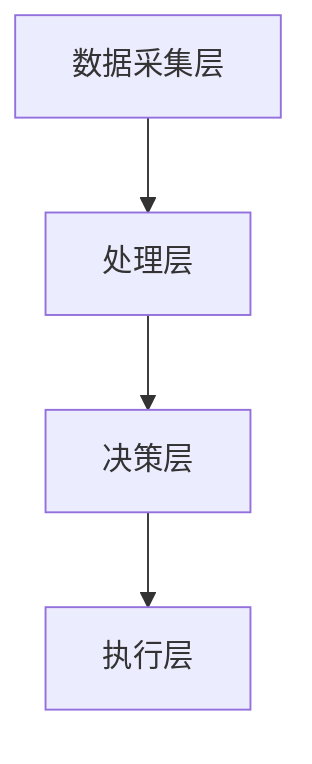
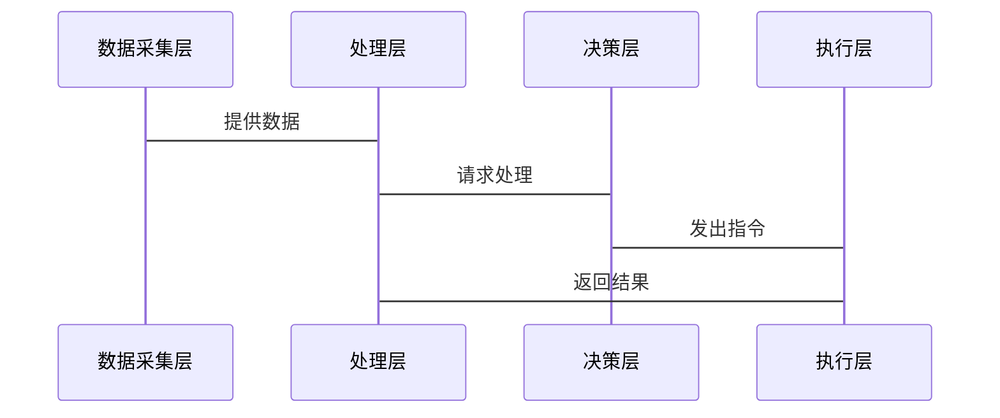

                 


# AI驱动的地缘政治风险分析：价值投资中的多智能体应用

## 关键词
- AI驱动的地缘政治风险分析
- 多智能体系统
- 价值投资
- 风险评估
- 协作算法

## 摘要
本文探讨了人工智能在地缘政治风险分析中的应用，特别是在价值投资中的多智能体协作优化。文章从地缘政治风险分析的背景出发，详细讲解了多智能体系统的核心概念、算法原理，以及在价值投资中的实际应用。通过系统架构设计、数学模型建立和项目实战案例分析，展示了AI如何通过多智能体协作提升地缘政治风险评估的准确性和效率，为价值投资提供科学依据。

---

# 第1章 地缘政治风险分析的背景与挑战

## 1.1 地缘政治风险分析的背景
### 1.1.1 地缘政治风险的定义与特征
地缘政治风险是指因地理位置、政治局势、国际关系等因素引发的潜在风险，具有复杂性、动态性和高影响性的特征。

### 1.1.2 地缘政治风险分析的复杂性
传统的地缘政治分析方法依赖专家经验，但面对海量数据和复杂局势时，容易出现主观性和滞后性的问题。

### 1.1.3 人工智能的优势
AI能够快速处理海量数据，识别隐含模式，提供实时分析，为决策者提供更精准的风险评估。

## 1.2 多智能体系统在地缘政治分析中的作用
### 1.2.1 多智能体系统的定义与特点
多智能体系统是由多个独立但协作的智能体组成的系统，具备分布性、协作性和自主性。

### 1.2.2 多智能体系统的优势
通过分布式计算和协作，多智能体系统能够更高效地处理复杂问题，提供更全面的解决方案。

### 1.2.3 应用潜力
在地缘政治风险分析中，多智能体系统可以用于实时监控、事件预测和策略优化。

## 1.3 价值投资中的地缘政治风险分析
### 1.3.1 价值投资的基本概念
价值投资是通过分析资产的内在价值，寻找被市场低估的投资机会。

### 1.3.2 地缘政治风险对投资的影响
地缘政治事件可能导致市场波动，影响资产价格，投资者需要及时识别和应对这些风险。

### 1.3.3 AI驱动的地缘政治风险分析对价值投资的优化作用
通过AI和多智能体系统，投资者可以更精准地评估风险，优化投资组合，提升投资回报。

---

# 第2章 多智能体系统的核心概念与原理

## 2.1 多智能体系统的架构
### 2.1.1 分布式智能体架构
智能体分布在不同的节点，通过通信协议协作完成任务。

### 2.1.2 集中式与分布式决策机制
集中式架构依赖一个中央控制节点，而分布式架构则通过去中心化的方式进行决策。

### 2.1.3 智能体之间的通信与协作
通过消息传递和协同推理，智能体之间实现信息共享和协作。

## 2.2 多智能体系统的算法基础
### 2.2.1 协作式搜索算法
通过协作搜索，智能体可以共同寻找最优解决方案。

### 2.2.2 基于博弈论的决策算法
利用博弈论模型，智能体可以模拟不同决策的后果，选择最优策略。

### 2.2.3 联合推理与规划算法
智能体通过联合推理和规划，实现协同任务的高效完成。

## 2.3 多智能体系统的应用案例
### 2.3.1 金融市场的多智能体模拟
通过模拟不同智能体的行为，分析市场趋势和风险。

### 2.3.2 地缘政治事件预测的多智能体模型
利用多智能体系统预测地缘政治事件的可能性和影响。

### 2.3.3 价值投资中的多智能体协作优化
通过协作优化，提升投资决策的准确性和效率。

---

# 第3章 地缘政治风险分析的数学模型与算法

## 3.1 地缘政治风险的量化模型
### 3.1.1 风险因子的提取与权重分配
提取关键风险因子，并根据其重要性分配权重。

### 3.1.2 风险评估的数学公式
$$ R = \sum_{i=1}^{n} w_i \cdot f_i $$
其中，$R$ 是综合风险值，$w_i$ 是因子权重，$f_i$ 是因子值。

### 3.1.3 风险预测的动态模型
通过时间序列分析，建立动态风险预测模型。

## 3.2 多智能体协作的算法实现
### 3.2.1 基于强化学习的协作算法
通过强化学习，智能体学习协作策略，提升整体性能。

### 3.2.2 基于图论的智能体关系建模
利用图论方法，描述智能体之间的关系和协作方式。

### 3.2.3 联合推理的数学框架
通过联合推理算法，智能体共同解决问题。

## 3.3 算法实现的代码示例
### 3.3.1 环境安装与依赖管理
安装必要的库，如Python的`numpy`和`scikit-learn`。

### 3.3.2 多智能体协作的Python代码实现
```python
import numpy as np
from sklearn.metrics import mean_squared_error

def multi_agent_collaboration(data):
    # 分配任务给多个智能体
    agents = [Agent(i) for i in range(n_agents)]
    tasks = distribute_tasks(data, agents)
    # 协作推理
    results = [agent.collaborate(tasks) for agent in agents]
    # 组合结果
    final_result = combine_results(results)
    return final_result

class Agent:
    def __init__(self, id):
        self.id = id
    def collaborate(self, task):
        # 具体协作逻辑
        pass
```

### 3.3.3 算法运行与结果分析
通过运行代码，分析算法的性能和效果，优化协作策略。

---

# 第4章 价值投资中的多智能体系统应用

## 4.1 价值投资与地缘政治风险的关系
### 4.1.1 价值投资的基本原理
通过分析资产的内在价值，寻找被市场低估的投资机会。

### 4.1.2 地缘政治风险对资产价格的影响
地缘政治事件可能导致资产价格波动，影响投资收益。

### 4.1.3 AI驱动的地缘政治风险分析对价值投资的优化作用
通过AI和多智能体系统，投资者可以更精准地评估风险，优化投资组合。

## 4.2 多智能体系统在价值投资中的具体应用
### 4.2.1 风险评估与资产配置
通过多智能体系统，评估不同资产的风险，优化资产配置。

### 4.2.2 多智能体协作的交易策略优化
通过协作优化，制定更高效的交易策略，提升投资收益。

### 4.2.3 实时风险监控与投资决策
实时监控地缘政治风险，及时调整投资策略，规避潜在风险。

## 4.3 价值投资中的多智能体系统设计
### 4.3.1 投资目标与智能体角色分配
根据投资目标，分配不同智能体的角色和任务。

### 4.3.2 多智能体协作的规则与机制
制定协作规则和机制，确保智能体之间的高效协作。

### 4.3.3 系统的可扩展性与鲁棒性设计
设计可扩展的系统架构，确保系统的鲁棒性和稳定性。

---

# 第5章 系统架构与实现方案

## 5.1 系统架构设计
### 5.1.1 分层架构设计
将系统分为数据采集层、处理层、决策层和执行层。

### 5.1.2 智能体协作的通信机制
通过消息队列或事件总线实现智能体之间的通信与协作。

### 5.1.3 系统的模块划分与功能分配
模块划分包括数据采集、风险评估、策略制定和结果输出。

## 5.2 系统功能设计
### 5.2.1 数据采集与处理模块
采集地缘政治相关的数据，进行清洗和预处理。

### 5.2.2 风险评估与预警模块
通过多智能体协作，评估风险并发出预警。

### 5.2.3 交易策略优化模块
根据风险评估结果，优化交易策略，提升投资收益。

## 5.3 系统架构图


## 5.4 系统接口设计
### 5.4.1 数据接口
定义数据接口，实现数据的输入输出和格式转换。

### 5.4.2 智能体协作接口
定义协作接口，实现智能体之间的通信与协作。

### 5.4.3 用户接口
提供友好的用户界面，方便用户查看和操作。

## 5.5 系统交互序列图


---

# 第6章 项目实战：价值投资中的多智能体系统实现

## 6.1 环境安装与配置
安装必要的库，如Python的`numpy`、`pandas`、`scikit-learn`和`tensorflow`。

## 6.2 系统核心实现
### 6.2.1 数据采集与预处理
采集地缘政治相关的数据，进行清洗和预处理。

### 6.2.2 风险评估模型的训练
使用机器学习算法，训练风险评估模型。

### 6.2.3 多智能体协作算法的实现
实现多智能体协作算法，优化投资策略。

## 6.3 代码实现与解读
### 6.3.1 数据采集代码
```python
import pandas as pd

def load_data():
    data = pd.read_csv('geopolitical_data.csv')
    return data
```

### 6.3.2 风险评估模型
```python
from sklearn.model

