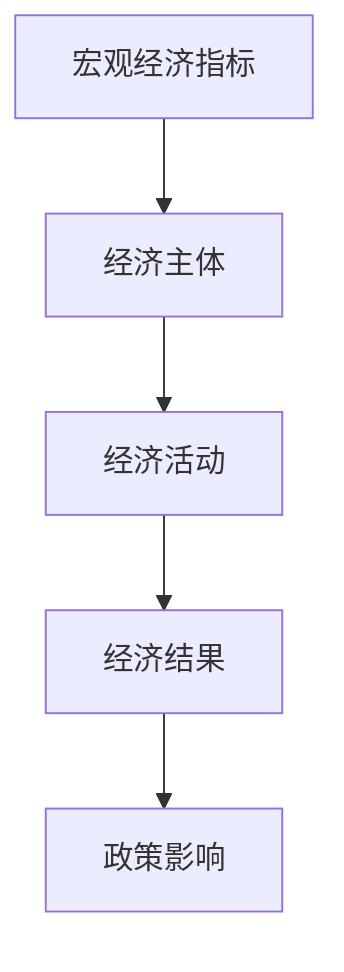
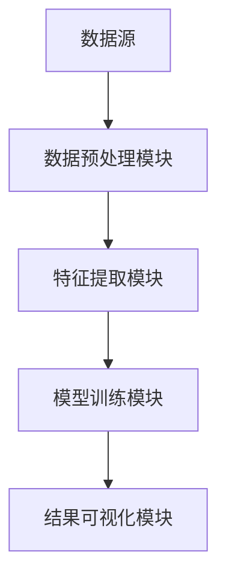

                 


# AI驱动的宏观经济分析：为价值投资提供大局观

> 关键词：AI技术、宏观经济分析、价值投资、经济预测、机器学习

> 摘要：本文将深入探讨如何利用人工智能技术驱动宏观经济分析，为价值投资提供更全面的大局观。通过分析宏观经济指标、构建经济模型、应用机器学习算法，本文旨在揭示AI在宏观经济预测中的潜力，并为投资者提供科学的决策支持。

---

## 第一部分: AI驱动的宏观经济分析基础

### 第1章: 宏观经济分析与AI技术概述

#### 1.1 宏观经济分析的基本概念
宏观经济分析是通过对整体经济体系的运行状况进行研究，以预测未来经济趋势并为决策提供依据。它关注的是GDP、通货膨胀率、失业率、货币政策、财政政策等宏观经济指标之间的关系。传统的宏观经济分析方法依赖于统计分析、经济学理论和经验判断，但其局限性在于数据处理能力有限、预测精度不足以及难以捕捉复杂经济关系。

#### 1.2 AI技术的基本原理
人工智能（AI）是指模拟人类智能的计算机系统，其核心是机器学习。机器学习通过训练数据模型，使计算机能够从数据中学习并做出预测或决策。常见的机器学习算法包括线性回归、支持向量机（SVM）、随机森林和深度学习模型（如神经网络、LSTM）。

#### 1.3 宏观经济分析与AI技术的结合
AI技术的应用为宏观经济分析带来了新的可能性。AI能够处理海量数据、识别复杂模式、提高预测精度，并实时更新模型。通过AI驱动的宏观经济分析，投资者可以更准确地预测经济趋势，优化投资决策。

---

### 第2章: 宏观经济分析的核心概念与联系

#### 2.1 宏观经济指标的分类与属性对比
宏观经济指标可以分为总量指标和结构指标两大类。总量指标反映整体经济状况，如GDP、通货膨胀率；结构指标则关注经济结构的变化，如就业结构、产业结构。下表展示了主要宏观经济指标的分类与特征对比：

| 指标类型 | 指标名称 | 主要特征 |
|----------|----------|----------|
| 总量指标 | GDP      | 衡量整体经济规模 |
|          | CPI      | 衡量通货膨胀水平 |
| 结构指标 | 就业结构 | 反映经济结构变化 |

#### 2.2 宏观经济模型的构建与AI的关系
宏观经济模型是用来描述和预测经济系统运行的数学模型。AI技术可以增强模型的预测能力，通过机器学习算法优化模型参数，提高预测精度。例如，基于AI的宏观经济模型可以更好地捕捉经济变量之间的非线性关系。

#### 2.3 宏观经济分析的ER实体关系图
通过ER图可以清晰地展示宏观经济分析中的核心实体及其关系。以下是宏观经济分析的ER实体关系图：



---

### 第3章: 宏观经济预测的AI算法原理

#### 3.1 时间序列分析的基本原理
时间序列分析是研究经济指标随时间变化的模式和趋势的重要方法。常见的时间序列模型包括ARIMA、SARIMA和Prophet。

##### 3.1.1 ARIMA模型
ARIMA（自回归积分滑动平均模型）是一种广泛应用于时间序列预测的模型。其核心思想是通过自回归和滑动平均的组合来捕捉数据的依赖性。

##### 3.1.2 LSTM模型
长短期记忆网络（LSTM）是一种特殊的循环神经网络（RNN），能够有效地捕捉时间序列中的长期依赖关系。

#### 3.2 基于机器学习的宏观经济预测
机器学习算法在宏观经济预测中的应用越来越广泛。例如，使用随机森林模型对GDP增长率进行预测，或利用XGBoost模型对通货膨胀率进行预测。

##### 3.2.1 预测流程
1. 数据清洗与特征提取
2. 模型训练与优化
3. 模型评估与部署

#### 3.3 异常检测在宏观经济分析中的应用
异常检测可以帮助识别经济指标中的异常波动，及时发现潜在的经济风险。常见的异常检测算法包括Isolation Forest和One-Class SVM。

---

## 第四部分: 系统架构与技术实现

### 第4章: 系统架构与技术实现

#### 4.1 系统功能设计
AI驱动的宏观经济分析系统主要功能包括数据采集、特征工程、模型训练和结果可视化。

#### 4.2 系统架构设计
以下是系统的架构图：



---

## 第五部分: 项目实战

### 第5章: 项目实战

#### 5.1 项目介绍
本项目旨在通过AI技术预测某国的GDP增长率。

#### 5.2 系统实现
以下是项目的代码示例：

```python
import pandas as pd
import numpy as np
from sklearn.ensemble import RandomForestRegressor
from sklearn.metrics import mean_squared_error
from sklearn.model_selection import train_test_split

# 数据加载与预处理
data = pd.read_csv('economic_data.csv')
data = data.dropna()

# 特征工程
features = ['inflation', 'unemployment_rate', 'exchange_rate']
target = 'gdp_growth'

X = data[features]
y = data[target]

# 数据分割
X_train, X_test, y_train, y_test = train_test_split(X, y, test_size=0.2, random_state=42)

# 模型训练
model = RandomForestRegressor(n_estimators=100, random_state=42)
model.fit(X_train, y_train)

# 模型评估
y_pred = model.predict(X_test)
print('均方误差:', mean_squared_error(y_test, y_pred))
```

---

## 第六部分: 总结与展望

### 第6章: 总结与展望

#### 6.1 小结
本文详细探讨了AI在宏观经济分析中的应用，从理论到实践，展示了如何通过AI技术提升经济预测的准确性和效率。

#### 6.2 展望
未来，随着AI技术的不断发展，宏观经济分析将更加智能化和精准化。投资者可以通过AI驱动的宏观经济分析系统，更好地把握经济趋势，优化投资决策。

---

## 作者：AI天才研究院 & 禅与计算机程序设计艺术

