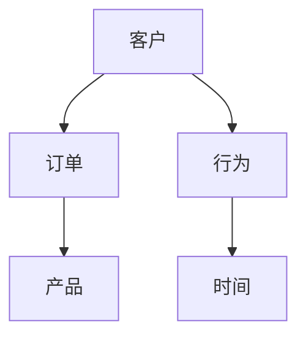
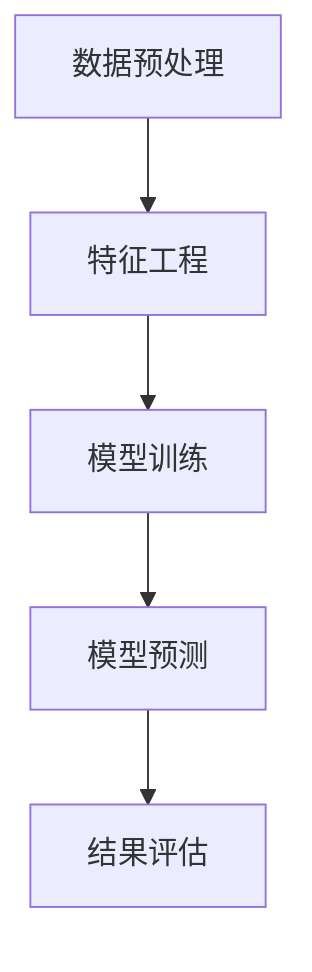
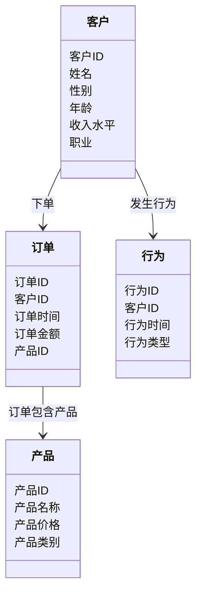
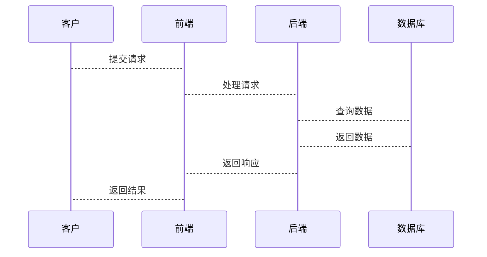

                 


# AI驱动的客户终身价值预测：评估公司的长期盈利能力

## 关键词：
AI, 客户终身价值, 预测模型, 机器学习, 长期盈利能力, 数据分析

## 摘要：
在当今竞争激烈的商业环境中，企业需要通过预测客户的终身价值（CLV）来评估和优化其长期盈利能力。本文将深入探讨如何利用人工智能技术构建客户终身价值预测模型，帮助企业做出更明智的商业决策。文章从背景介绍、核心概念、算法原理、系统架构到项目实战，全面解析AI驱动的客户价值预测方法，并通过实际案例分析，展示其在企业中的应用价值。

---

## 第一部分：AI驱动的客户终身价值预测概述

### 第1章：背景介绍

#### 1.1 问题背景
- **企业盈利模式的转变**：传统的企业盈利模式依赖于短期销售，而现代企业更加关注客户的长期价值。通过预测客户在生命周期内的贡献，企业可以更好地制定客户维护和营销策略。
- **客户价值在企业中的重要性**：客户是企业最重要的资产之一，客户流失不仅会带来直接的经济损失，还会增加获取新客户的成本。通过预测客户终身价值，企业可以识别高价值客户，优化资源分配。
- **AI技术在商业分析中的应用**：人工智能技术（如机器学习、深度学习）在商业分析中的应用越来越广泛。利用AI技术，企业可以更精准地预测客户行为，优化客户关系管理（CRM）策略。

#### 1.2 问题描述
- **客户终身价值（CLV）的定义**：客户终身价值是指客户在其生命周期内为企业带来的净收益。CLV不仅考虑了客户的当前价值，还包括未来可能的贡献。
- **预测CLV的挑战与难点**：客户行为的不确定性、数据的不完整性、模型的泛化能力等问题都增加了CLV预测的难度。
- **CLV与企业长期盈利能力的关系**：CLV是企业长期盈利能力的重要指标，通过优化CLV，企业可以提升客户满意度、忠诚度，从而实现可持续发展。

#### 1.3 问题解决思路
- **数据驱动的分析方法**：通过收集和分析客户的行为数据、交易数据和属性数据，构建客户画像，为CLV预测提供数据支持。
- **AI技术在CLV预测中的应用**：利用机器学习算法（如随机森林、XGBoost）构建CLV预测模型，通过模型优化提升预测精度。
- **预测模型的构建与优化**：从数据预处理、特征工程到模型训练、评估，逐步构建和优化CLV预测模型。

#### 1.4 边界与外延
- **CLV预测的适用场景**：适用于B2C模式的企业，尤其是电商、金融、零售等行业。CLV预测不适用于B2B模式，因为客户关系更加复杂。
- **模型的局限性与改进方向**：CLV预测模型基于历史数据，无法完全预测未来的不可预测事件（如经济危机、政策变化等）。未来可以通过引入实时数据和动态模型进一步提高预测精度。
- **CLV与其他客户价值指标的关系**：CLV与其他指标（如客户满意度、客户保留率）密切相关，但CLV更注重客户在生命周期内的总贡献。

#### 1.5 核心要素组成
- **客户行为数据**：包括客户的购买频率、购买时间、购买金额等数据。
- **历史交易数据**：包括客户的交易记录、订单金额、订单时间等数据。
- **客户属性特征**：包括客户的性别、年龄、职业、收入水平等数据。

### 第2章：核心概念与联系

#### 2.1 客户终身价值（CLV）的定义与公式
- **CLV的数学表达式**：$$CLV = \frac{R}{1 - \omega}$$
  其中，R为客户的生命周期价值，ω为贴现率。

#### 2.2 数据特征与模型选择
- **数据特征的分类**：
  - **客户行为特征**：购买频率、购买时间、购买金额等。
  - **历史交易特征**：交易记录、订单金额、订单时间等。
  - **客户属性特征**：性别、年龄、职业、收入水平等。
- **模型选择与对比**：
  - **线性回归**：适用于线性关系的预测，但对非线性关系的拟合能力较差。
  - **随机森林**：适用于复杂关系的预测，具有较强的抗过拟合能力。
  - **XGBoost**：适用于高维数据的预测，具有较高的预测精度。

#### 2.3 ER实体关系图


### 第3章：算法原理讲解

#### 3.1 算法流程


#### 3.2 算法实现代码
```python
import pandas as pd
from sklearn.ensemble import RandomForestRegressor

# 数据预处理
data = pd.read_csv('customer_data.csv')
X = data.drop(columns=['customer_id', 'profit'])
y = data['profit']

# 特征工程
from sklearn.model_selection import train_test_split
X_train, X_test, y_train, y_test = train_test_split(X, y, test_size=0.2)

# 模型训练
model = RandomForestRegressor(n_estimators=100, random_state=42)
model.fit(X_train, y_train)

# 模型预测
y_pred = model.predict(X_test)

# 结果评估
from sklearn.metrics import mean_squared_error
mse = mean_squared_error(y_test, y_pred)
print(f'Mean Squared Error: {mse}')
```

#### 3.3 数学模型与公式
- **线性回归模型**：$$y = \beta_0 + \beta_1x_1 + \beta_2x_2 + \dots + \beta_nx_n + \epsilon$$
- **随机森林模型**：随机森林通过构建多个决策树，并通过投票或平均的方式得到最终的预测结果。
- **XGBoost模型**：XGBoost通过构建多个弱分类器，并通过积分的方式得到最终的预测结果。

---

## 第二部分：系统分析与架构设计

### 第4章：系统分析与架构设计方案

#### 4.1 问题场景介绍
- **问题场景**：企业希望通过预测客户终身价值（CLV）来优化客户关系管理（CRM）策略，提升客户满意度和忠诚度，从而实现长期盈利能力的提升。

#### 4.2 项目介绍
- **项目目标**：构建一个基于AI的客户终身价值预测系统，帮助企业优化客户关系管理策略，提升客户满意度和忠诚度，从而实现长期盈利能力的提升。

#### 4.3 系统功能设计
- **领域模型**：


- **系统架构设计**：


- **系统接口设计**：


---

## 第三部分：项目实战

### 第5章：项目实战

#### 5.1 环境安装
- **Python安装**：需要安装Python 3.6或更高版本。
- **库安装**：需要安装以下库：
  - pandas
  - numpy
  - scikit-learn
  - xgboost
  - mermaid

#### 5.2 系统核心实现源代码
```python
import pandas as pd
import numpy as np
from sklearn.ensemble import RandomForestRegressor
from sklearn.metrics import mean_squared_error
from xgboost import XGBRegressor

# 数据预处理
data = pd.read_csv('customer_data.csv')
X = data.drop(columns=['customer_id', 'profit'])
y = data['profit']

# 特征工程
from sklearn.model_selection import train_test_split
X_train, X_test, y_train, y_test = train_test_split(X, y, test_size=0.2)

# 模型训练
# 随机森林
model_rf = RandomForestRegressor(n_estimators=100, random_state=42)
model_rf.fit(X_train, y_train)

# XGBoost
model_xgb = XGBRegressor(n_estimators=100, learning_rate=0.1, random_state=42)
model_xgb.fit(X_train, y_train)

# 模型预测
y_pred_rf = model_rf.predict(X_test)
y_pred_xgb = model_xgb.predict(X_test)

# 结果评估
mse_rf = mean_squared_error(y_test, y_pred_rf)
mse_xgb = mean_squared_error(y_test, y_pred_xgb)

print(f'随机森林模型的Mean Squared Error: {mse_rf}')
print(f'XGBoost模型的Mean Squared Error: {mse_xgb}')
```

#### 5.3 实际案例分析与详细解读
- **案例分析**：假设我们有一个电商企业的客户数据，包括客户的购买频率、购买金额、客户属性等。我们希望通过预测客户终身价值（CLV）来优化客户关系管理策略。

#### 5.4 项目小结
- **项目成果**：通过构建基于AI的客户终身价值预测模型，帮助企业优化客户关系管理策略，提升客户满意度和忠诚度，从而实现长期盈利能力的提升。
- **项目经验**：在项目实施过程中，需要注意数据的质量和完整性，选择合适的算法和模型，进行充分的模型调优和验证。

---

## 第四部分：最佳实践

### 第6章：最佳实践

#### 6.1 小结
- **小结**：本文深入探讨了AI驱动的客户终身价值预测方法，通过背景介绍、核心概念、算法原理、系统架构到项目实战，全面解析了CLV预测的实现过程。

#### 6.2 注意事项
- **数据质量**：数据质量是模型预测精度的基础，需要注意数据的完整性和准确性。
- **模型调优**：通过模型调优和验证，可以进一步提高模型的预测精度。
- **实时更新**：客户行为和市场环境是动态变化的，需要实时更新模型和数据。

#### 6.3 拓展阅读
- **推荐书籍**：
  - 《机器学习实战》
  - 《深入理解机器学习》
  - 《数据挖掘导论》
- **推荐博客**：
  - Medium上的AI相关博客
  - Towards Data Science
  - Kaggle上的相关项目

---

## 作者：AI天才研究院/AI Genius Institute & 禅与计算机程序设计艺术 /Zen And The Art of Computer Programming

---

以上是文章的完整目录大纲和部分内容展示，完整文章需要按照上述结构和内容进行详细撰写，涵盖每个章节的核心内容和具体实现细节。

