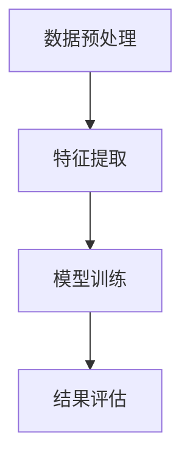
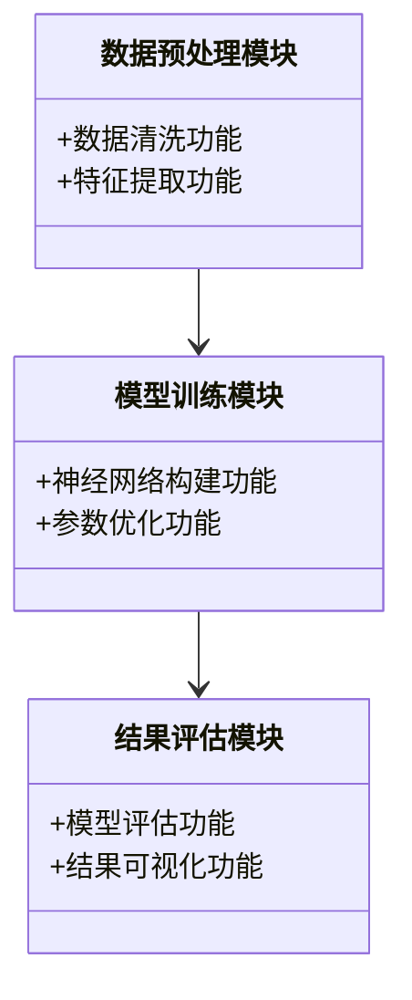

                 


# AI驱动的无形资产组合分析：全面评估公司价值

> 关键词：AI驱动，无形资产，资产组合分析，企业价值评估，机器学习模型

> 摘要：本文深入探讨了如何利用人工智能技术驱动无形资产的组合分析，全面评估公司价值。通过分析无形资产的定义、AI驱动的分析方法、算法原理、系统架构设计、项目实战以及最佳实践，本文为读者提供了一套完整的解决方案，帮助企业在数字化转型中实现资产价值的最大化。

---

# 第1章：引言

## 1.1 无形资产的定义与重要性

### 1.1.1 无形资产的定义与分类

无形资产是指企业拥有或控制的没有实物形态的资产，主要包括专利权、商标权、版权、商誉、客户关系、技术诀窍、品牌价值等。这些资产通常难以通过传统会计方法准确量化，但它们对企业价值的贡献却不可忽视。

| 资产类型 | 特征 | 示例 |
|----------|------|------|
| 专利权 | 法律保护的技术创新 | 发明专利、实用新型专利 |
| 商标权 | 独特标识 | 文字商标、图形商标 |
| 版权 | 创作作品的独有权 | 软件著作权、文学作品版权 |
| 商誉 | 企业声誉与客户忠诚度 | 品牌价值、客户关系 |

### 1.1.2 无形资产在企业价值中的作用

无形资产是企业核心竞争力的重要组成部分，尤其是在知识经济时代，无形资产的价值往往超过有形资产。例如，苹果公司的品牌价值远超其硬件产品的制造成本。无形资产的评估对企业并购、融资、战略规划等决策具有重要意义。

### 1.1.3 无形资产评估的挑战与意义

传统无形资产评估方法（如收益法、市场法、成本法）存在主观性强、难以量化等问题。AI技术的引入为解决这些问题提供了新思路，通过大数据分析和机器学习模型，可以更准确地评估无形资产的价值。

---

## 1.2 AI驱动分析的背景与潜力

### 1.2.1 AI技术的发展与应用现状

人工智能技术近年来取得了突破性进展，尤其是在自然语言处理、计算机视觉和机器学习领域。这些技术在金融、医疗、教育等行业的广泛应用，为企业价值评估提供了新的工具。

### 1.2.2 AI在无形资产评估中的独特优势

AI技术能够处理海量非结构化数据，通过深度学习模型提取隐含信息，从而更准确地评估无形资产的价值。例如，通过分析社交媒体数据，可以评估品牌价值和客户情感。

### 1.2.3 AI驱动分析的未来

随着AI技术的不断进步，未来的企业价值评估将更加依赖于数据驱动的方法。AI驱动的无形资产评估将成为企业战略决策的重要组成部分。

---

# 第2章：无形资产与AI驱动分析的核心概念

## 2.1 核心概念与联系

### 2.1.1 数据特征提取

在AI驱动的无形资产评估中，数据特征提取是关键步骤。特征可以是文本数据（如专利文件）、图像数据（如品牌标识）或结构化数据（如财务数据）。

| 特征类型 | 示例 |
|----------|------|
| 文本特征 | 专利申请文本、商标注册描述 |
| 图像特征 | 品牌Logo、产品设计 |
| 结构化特征 | 财务报表数据、客户数据 |

### 2.1.2 分析方法对比

以下是几种常见的分析方法对比：

| 方法 | 描述 | 优点 | 缺点 |
|------|------|------|------|
| 传统回归分析 | 线性回归模型 | 简单易懂 | 无法处理非线性关系 |
| 支持向量机 | 基于特征空间划分 | 高精度 | 对数据预处理要求高 |
| 神经网络 | 多层感知机 | 强大学习能力 | 训练时间长 |

### 2.1.3 模型结构设计

以下是基于神经网络的无形资产评估模型结构：


---

## 2.2 算法原理与数学模型

### 2.2.1 算法原理

以下是基于神经网络的无形资产评估算法流程：



### 2.2.2 数学模型

以下是神经网络的数学模型：

$$
y = f(xW + b)
$$

其中，$x$ 是输入数据，$W$ 是权重矩阵，$b$ 是偏置项，$f$ 是激活函数。

---

## 2.3 系统架构设计

### 2.3.1 系统功能模块

以下是系统功能模块的类图：



---

## 2.4 项目实战与代码实现

### 2.4.1 环境安装

以下是Python环境安装步骤：

1. 安装Python：`python --version`
2. 安装依赖库：`pip install numpy pandas scikit-learn`

### 2.4.2 核心代码实现

以下是神经网络模型的Python代码：

```python
import numpy as np

def sigmoid(x):
    return 1 / (1 + np.exp(-x))

def forward_propagation(X, W, b):
    return sigmoid(np.dot(X, W) + b)

X = np.array([[1, 2, 3], [4, 5, 6]])
W = np.array([[0.5, 0.5], [0.5, 0.5], [0.5, 0.5]])
b = np.array([0.1, 0.2])
y = forward_propagation(X, W, b)
print(y)
```

---

## 2.5 实际案例分析

通过分析某公司的专利数据和商标数据，我们可以使用上述模型评估其无形资产价值。例如，假设某公司的专利数据如下：

| 专利号 | 发明名称 | 申请日期 |
|--------|----------|----------|
| P1     | 发电机   | 2020-01-01 |
| P2     | 变压器   | 2020-02-01 |

通过特征提取和模型训练，我们可以评估这些专利的价值。

---

## 2.6 总结与展望

AI驱动的无形资产评估为企业提供了新的工具和方法。未来，随着AI技术的不断进步，企业可以更准确地评估无形资产价值，优化资源配置。

---

# 作者

作者：AI天才研究院 & 禅与计算机程序设计艺术

---

以上是《AI驱动的无形资产组合分析：全面评估公司价值》的目录大纲和部分内容。如果您有任何问题或需要进一步的解释，请随时告诉我。

