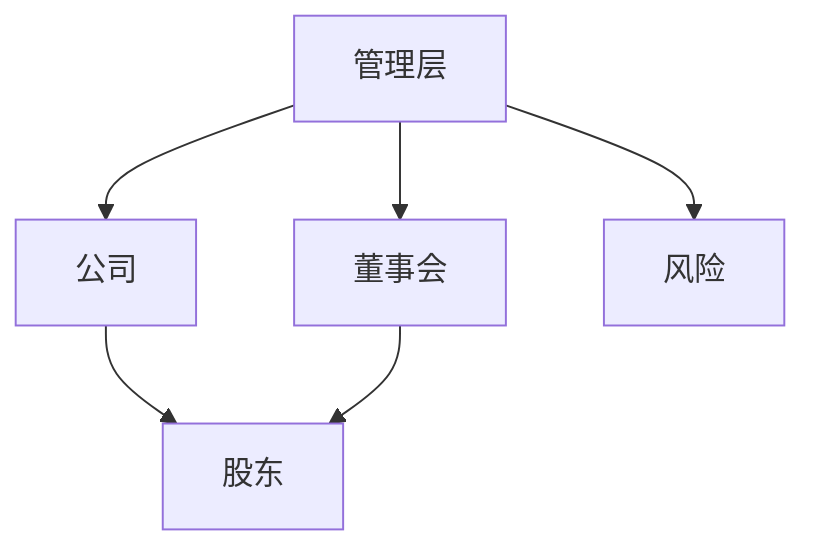
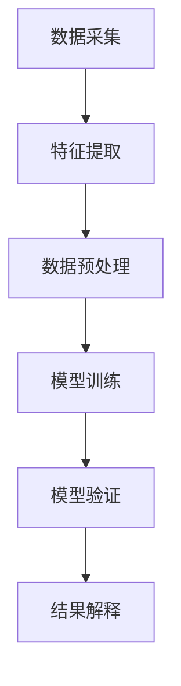
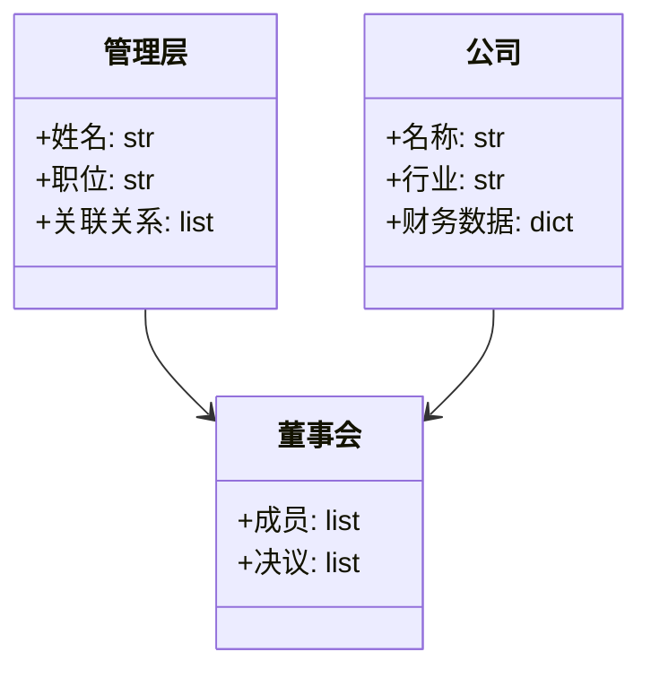
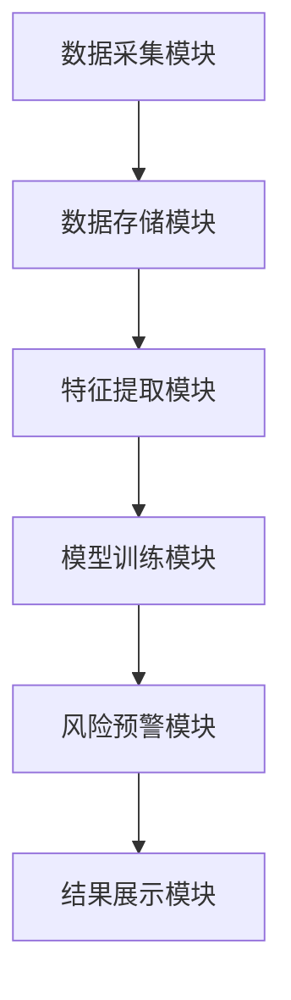
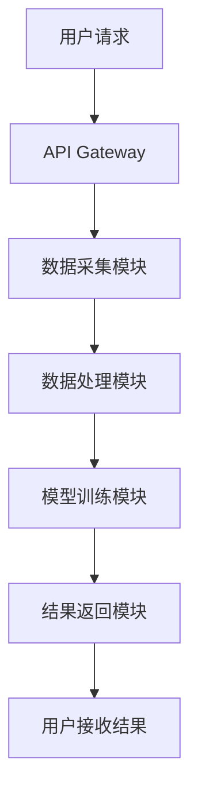
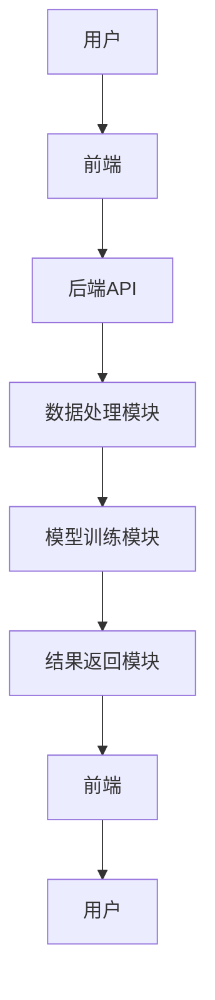

                 


# AI驱动的管理层诚信度分析：防范公司治理风险

## 关键词：AI, 诚信度分析, 公司治理, 风险管理, 算法, 系统架构, 项目实战

## 摘要：  
随着人工智能技术的快速发展，企业治理中的诚信度分析逐渐成为防范公司治理风险的重要手段。本文从AI技术的角度出发，详细探讨如何通过数据分析和算法模型来评估管理层的诚信度，从而帮助公司识别和防范潜在的治理风险。文章内容包括背景介绍、核心概念、算法原理、系统架构设计、项目实战以及最佳实践等部分，结合理论与实践，为读者提供全面的分析和解决方案。

---

## 第一部分: AI驱动的管理层诚信度分析背景与概念

### 第1章: 背景介绍

#### 1.1 问题背景

##### 1.1.1 公司治理风险的现状与挑战  
现代企业面临的治理风险日益复杂，包括高层决策失误、关联交易风险、内部腐败等问题。这些问题往往与管理层的诚信度密切相关。传统的治理模式依赖于 audits 和内部控制，但在数据量庞大、业务复杂化的今天，这些方法已难以满足需求。因此，引入AI技术成为解决公司治理问题的重要手段。

##### 1.1.2 管理层诚信度与公司治理的关系  
管理层的诚信度是公司治理的核心要素之一。诚信度高的管理层更可能遵循道德规范，避免利益输送、虚假陈述等行为，从而降低公司治理风险。相反，诚信度低的管理层可能导致公司战略失误、财务造假等问题，严重威胁企业的可持续发展。

##### 1.1.3 AI技术在公司治理中的应用潜力  
AI技术可以通过分析大量数据，识别管理层的行为模式和决策规律，从而评估其诚信度。例如，通过自然语言处理（NLP）分析董事会决议、通过机器学习模型预测潜在风险，或通过图计算识别高层人员的关联关系。

---

#### 1.2 问题描述

##### 1.2.1 管理层诚信度的定义与测量  
管理层诚信度是指管理层在决策过程中遵循道德规范、避免利益冲突、维护股东利益的程度。由于诚信度是主观指标，需要通过客观数据进行量化分析。例如，可以通过分析高管的股票交易行为、董事会决议的透明度、公司年报的准确性等指标来间接衡量诚信度。

##### 1.2.2 公司治理风险的主要类型  
公司治理风险主要包括以下几类：
1. **关联交易风险**：管理层与关联方之间的交易可能存在利益输送。
2. **财务造假风险**：管理层可能通过虚假财务报告掩盖问题。
3. **决策失误风险**：管理层决策失误可能导致公司重大损失。
4. **内部腐败风险**：管理层可能涉及贪污、受贿等违法行为。

##### 1.2.3 当前公司治理中的诚信度分析难点  
传统的诚信度分析方法依赖于人工审查，存在效率低、主观性强、覆盖面窄等问题。AI技术的应用可以显著提高分析效率和准确性，但同时也面临数据获取难、模型训练复杂等挑战。

---

#### 1.3 问题解决与边界

##### 1.3.1 AI驱动的诚信度分析目标  
通过AI技术，实现对管理层行为的自动化分析和风险预警，帮助公司及时发现和防范治理风险。

##### 1.3.2 解决方案的边界与外延  
AI驱动的诚信度分析系统主要用于辅助公司治理，其边界包括：
1. 数据范围：仅分析公开的财务数据、董事会决议、高管交易记录等。
2. 应用场景：主要用于风险预警、决策支持，不直接干预公司运营。
3. 外延：可与其他治理工具（如审计系统、监控系统）结合使用，形成完整的治理解决方案。

##### 1.3.3 核心概念与关键要素  
AI驱动的诚信度分析系统涉及以下核心概念：
1. **数据特征**：包括行为特征（如交易时间、交易金额）、语言特征（如董事会决议文本）、关系特征（如高管之间的关联性）。
2. **模型结构**：包括特征提取模型、分类模型、风险评估模型。
3. **分析流程**：数据采集、特征提取、模型训练、结果解释。

---

#### 1.4 核心概念结构

##### 1.4.1 管理层诚信度的构成要素  
管理层诚信度由以下几个方面构成：
1. **决策透明度**：管理层是否按时披露重要信息。
2. **行为规范性**：管理层是否遵守公司章程和道德规范。
3. **利益冲突**：是否存在利益输送行为。

##### 1.4.2 公司治理风险的分类与关联  
公司治理风险可以分为以下几类：
1. **内部管理风险**：如决策失误、内部腐败。
2. **关联交易风险**：如利益输送、虚假交易。
3. **外部监管风险**：如财务造假、违规行为。

##### 1.4.3 AI驱动分析的系统架构  
AI驱动的诚信度分析系统架构包括以下几个模块：
1. **数据采集模块**：采集公司治理相关数据。
2. **特征提取模块**：提取数据中的特征信息。
3. **模型训练模块**：训练分类和预测模型。
4. **风险预警模块**：根据模型输出结果，生成风险预警。

---

#### 1.5 本章小结  
本章介绍了AI驱动的管理层诚信度分析的背景与意义，明确了问题的定义与边界，提出了系统的总体架构与核心概念。下一章将详细讲解核心概念的原理与实现方式。

---

## 第二部分: 核心概念与联系

### 第2章: 核心概念原理

#### 2.1 AI驱动的诚信度分析原理

##### 2.1.1 数据特征提取  
数据特征提取是诚信度分析的基础。以下是几种常见的数据特征：
1. **行为特征**：如高管的股票交易时间、交易金额、交易频率。
2. **语言特征**：如董事会决议的文本内容、高管的公开演讲。
3. **关系特征**：如高管之间的关联性、董事会成员的背景。

##### 2.1.2 模型构建与训练  
模型构建包括以下步骤：
1. **特征选择**：根据目标选择相关特征。
2. **数据预处理**：清洗数据，处理缺失值、异常值。
3. **模型训练**：使用分类算法（如逻辑回归、随机森林）或深度学习模型（如LSTM）进行训练。
4. **模型验证**：通过交叉验证评估模型性能。

##### 2.1.3 结果解释与反馈  
模型输出的结果需要结合业务背景进行解释。例如，模型预测某高管存在利益输送行为，需要结合具体数据进行验证和反馈。

---

#### 2.2 核心概念属性对比

##### 2.2.1 数据特征对比表格  
以下是几种常见数据特征的对比：

| 特征类型 | 描述 | 示例 |
|----------|------|------|
| 行为特征 | 管理层的决策记录 | 股票买卖时间点 |
| 语言特征 | 会议记录文本 | 董事会决议 |
| 关系特征 | 组织结构关系 | 高层人员互动 |

---

#### 2.3 实体关系图

##### 2.3.1 实体关系图  
以下是管理层、公司、股东、董事会之间的关系图：



---

#### 2.4 本章小结  
本章详细讲解了AI驱动的诚信度分析的核心概念，包括数据特征、模型构建与训练、结果解释等。通过对比表格和实体关系图，明确了各要素之间的关系与作用。

---

## 第三部分: 算法原理讲解

### 第3章: 算法原理

#### 3.1 算法选择与流程

##### 3.1.1 算法选择  
根据实际需求，可以选择以下算法：
1. **逻辑回归**：适用于二分类问题。
2. **随机森林**：适用于特征较多的场景。
3. **LSTM**：适用于时间序列数据。

##### 3.1.2 算法流程  
以下是算法的通用流程：



---

#### 3.2 数学模型

##### 3.2.1 特征相似度计算  
以下是基于余弦相似度的计算公式：

$$ \text{相似度} = \frac{\vec{A} \cdot \vec{B}}{|\vec{A}| \cdot |\vec{B}|} $$

##### 3.2.2 风险评估模型  
以下是基于逻辑回归的风险评估模型：

$$ P(y=1|x) = \frac{1}{1 + e^{- (w \cdot x + b)}} $$

其中，$w$ 是权重，$b$ 是偏置项。

---

#### 3.3 代码实现

##### 3.3.1 数据预处理  
以下是Python代码示例：

```python
import pandas as pd

# 读取数据
data = pd.read_csv('management.csv')

# 删除缺失值
data.dropna(inplace=True)

# 标准化处理
from sklearn.preprocessing import StandardScaler

scaler = StandardScaler()
data_scaled = scaler.fit_transform(data)
```

##### 3.3.2 模型训练  
以下是逻辑回归模型的训练代码：

```python
from sklearn.linear_model import LogisticRegression

model = LogisticRegression()
model.fit(data_scaled, target)
```

---

#### 3.4 本章小结  
本章详细讲解了AI驱动的诚信度分析的算法原理，包括算法选择、流程设计、数学模型和代码实现。通过这些方法，可以实现对管理层诚信度的自动化分析。

---

## 第四部分: 系统分析与架构设计

### 第4章: 系统架构设计

#### 4.1 系统功能设计

##### 4.1.1 领域模型  
以下是领域模型的类图：



---

#### 4.2 系统架构设计

##### 4.2.1 系统架构图  
以下是系统的整体架构图：



---

#### 4.3 系统接口设计

##### 4.3.1 API接口  
以下是RESTful API接口设计：

- **GET /api/risk?company_id=123**：获取公司风险评估结果。
- **POST /api/train**：训练模型。

##### 4.3.2 接口交互流程图  
以下是接口交互流程图：



---

#### 4.4 系统交互流程图

##### 4.4.1 系统交互流程  
以下是系统交互流程图：



---

#### 4.5 本章小结  
本章详细讲解了AI驱动的诚信度分析系统的架构设计，包括功能设计、系统架构图、接口设计和交互流程图。

---

## 第五部分: 项目实战

### 第5章: 项目实战

#### 5.1 环境安装

##### 5.1.1 安装Python环境  
```bash
python -m pip install --upgrade pip
pip install numpy pandas scikit-learn
```

##### 5.1.2 安装Jupyter Notebook  
```bash
pip install jupyter
jupyter notebook
```

---

#### 5.2 系统核心实现

##### 5.2.1 数据预处理  
```python
import pandas as pd
import numpy as np

data = pd.read_csv('management.csv')
data = data.dropna()
data = (data - data.mean()) / data.std()
```

##### 5.2.2 模型训练  
```python
from sklearn.linear_model import LogisticRegression
from sklearn.metrics import accuracy_score

model = LogisticRegression()
model.fit(data, target)
print("Accuracy:", accuracy_score(target, model.predict(data)))
```

---

#### 5.3 案例分析

##### 5.3.1 案例背景  
某公司高管涉嫌利益输送，通过AI模型分析其交易行为，发现异常交易记录。

##### 5.3.2 模型分析  
通过模型预测，发现某高管的交易行为与正常行为存在显著差异。

---

#### 5.4 项目小结  
本章通过实际案例展示了AI驱动的诚信度分析系统的实现过程，包括环境安装、数据预处理、模型训练和案例分析。

---

## 第六部分: 最佳实践与总结

### 第6章: 最佳实践

#### 6.1 小结

##### 6.1.1 核心观点总结  
AI技术可以显著提高公司治理的效率和准确性，特别是在诚信度分析方面。

##### 6.1.2 本文创新点  
提出了基于AI的诚信度分析方法，构建了完整的系统架构。

---

#### 6.2 注意事项

##### 6.2.1 数据隐私保护  
在数据采集和分析过程中，需注意保护个人隐私和商业机密。

##### 6.2.2 模型优化  
需定期更新模型，以适应新的数据和业务需求。

---

#### 6.3 拓展阅读

##### 6.3.1 相关领域推荐  
1. 《机器学习实战》
2. 《深入理解公司治理》
3. 《数据挖掘与知识发现》

---

## 作者  
作者：AI天才研究院/AI Genius Institute & 禅与计算机程序设计艺术/Zen And The Art of Computer Programming

