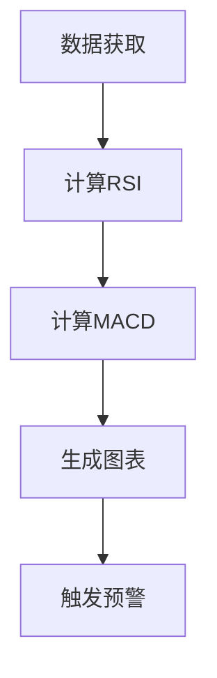
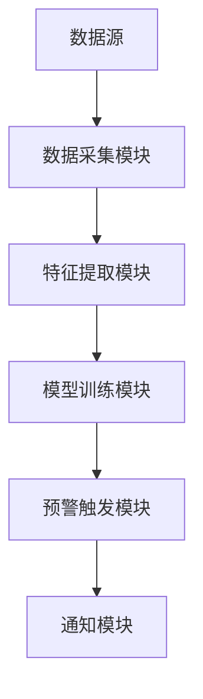
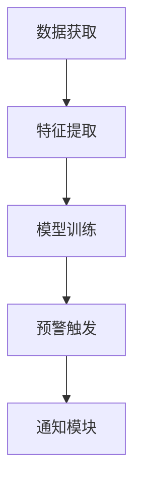

                 


# AI驱动的自动化投资机会提醒

> 关键词：AI投资提醒，自动化投资机会，金融数据分析，机器学习算法，系统架构设计，投资预警机制

> 摘要：本文详细探讨了如何利用人工智能技术实现自动化投资机会提醒。通过分析市场数据、公司基本面和技术指标，结合机器学习算法，构建高效的预警系统，帮助投资者及时捕捉投资机会，降低风险。文章从背景介绍、核心概念、算法原理、系统架构到项目实战，全面解析了AI驱动的投资机会提醒系统的设计与实现。

---

# 第1章: AI驱动的自动化投资机会提醒背景

## 1.1 投资机会提醒的重要性

### 1.1.1 投资机会提醒的核心概念

投资机会提醒是指通过技术手段，自动识别潜在的投资机会并及时通知投资者。传统的投资提醒主要依赖于人工分析和市场监控，效率低下且容易错过最佳时机。随着人工智能技术的发展，AI驱动的投资机会提醒系统能够实时处理海量数据，快速识别潜在的投资机会，为投资者提供精准的决策支持。

### 1.1.2 传统投资机会提醒的局限性

传统的投资机会提醒系统主要依赖人工分析，存在以下问题：

1. **数据处理能力有限**：人工分析难以处理海量数据，容易遗漏关键信息。
2. **反应速度慢**：市场变化迅速，人工分析难以及时捕捉机会。
3. **主观性较强**：依赖分析师的主观判断，容易受到情绪影响。

### 1.1.3 AI驱动的必要性

AI技术的引入解决了传统方法的局限性：

1. **高效数据处理**：AI能够快速处理海量数据，提取关键特征。
2. **实时监控**：通过自动化算法，实时监控市场动态，及时触发预警。
3. **精准预测**：利用机器学习模型，预测市场趋势，提高投资决策的准确性。

## 1.2 AI在金融领域的应用现状

### 1.2.1 AI在金融分析中的应用

AI技术在金融分析中的应用主要体现在以下几个方面：

1. **市场数据分析**：利用自然语言处理（NLP）技术分析新闻、财报等文本数据，提取情绪指标。
2. **交易策略优化**：通过强化学习算法优化交易策略，提高投资收益。
3. **风险管理**：利用机器学习模型预测市场风险，制定风险控制策略。

### 1.2.2 AI在投资决策中的作用

AI在投资决策中的作用日益重要：

1. **数据驱动决策**：通过分析历史数据，识别市场规律，辅助投资决策。
2. **个性化投资建议**：根据投资者的风险偏好，提供个性化的投资建议。
3. **动态调整策略**：根据市场变化，实时调整投资策略，提高适应性。

### 1.2.3 当前AI技术的挑战与机遇

尽管AI技术在金融领域的应用取得了显著进展，但仍面临一些挑战：

1. **数据质量**：数据的准确性和完整性直接影响模型的性能。
2. **模型解释性**：复杂的模型难以解释，影响投资者的信任。
3. **技术瓶颈**：如实时性、可扩展性等问题仍需进一步解决。

## 1.3 本章小结

本章介绍了投资机会提醒的重要性以及AI在金融领域的应用现状。通过分析传统方法的局限性，提出了AI驱动的必要性，并探讨了当前AI技术面临的挑战与机遇。下一章将详细介绍投资机会提醒的核心概念。

---

# 第2章: 投资机会提醒的关键要素

## 2.1 数据特征分析

### 2.1.1 市场数据特征

市场数据是投资机会提醒的核心依据，主要包括以下几类：

1. **价格数据**：包括股票价格、指数价格等。
2. **成交量数据**：包括交易量、换手率等。
3. **市场情绪数据**：通过NLP技术分析新闻、社交媒体等文本数据，提取市场情绪指标。

### 2.1.2 公司基本面特征

公司基本面数据是评估投资机会的重要依据，主要包括：

1. **财务数据**：如收入、利润、资产负债率等。
2. **行业地位**：如市场份额、行业排名等。
3. **管理团队**：如CEO背景、管理团队稳定性等。

### 2.1.3 技术指标特征

技术指标是技术分析的重要工具，主要包括：

1. **移动平均线（MA）**：如5日、10日、20日均线。
2. **相对强弱指数（RSI）**：衡量资产的超买或超卖状态。
3. **MACD指标**：通过移动平均收敛散度分析市场趋势。

### 2.1.4 数据特征对比表格

以下表格对比了市场数据、公司基本面和技术指标的主要特征：

| 特征类型 | 数据来源 | 数据频率 | 主要指标 |
|----------|----------|----------|----------|
| 市场数据 | 交易所 | 实时 | 价格、成交量 |
| 公司基本面 | 财报、公开信息 | 季度 | 收入、利润 |
| 技术指标 | 市场数据 | 日/周 | RSI、MACD |

### 2.1.5 实例分析：某股票的技术指标分析

以下通过Mermaid图展示某股票的技术指标分析流程：



## 2.2 AI模型的核心要素

### 2.2.1 特征提取与选择

特征提取是机器学习模型的关键步骤，主要包括：

1. **数据清洗**：去除噪声数据，处理缺失值。
2. **特征工程**：通过组合、转换等方法提取更有意义的特征。
3. **特征选择**：利用统计方法或模型评估选择重要特征。

### 2.2.2 模型训练与优化

模型训练是AI驱动投资机会提醒的核心步骤：

1. **选择算法**：根据数据类型和任务选择合适的算法，如随机森林、支持向量机（SVM）等。
2. **参数调优**：通过网格搜索等方法优化模型参数。
3. **模型评估**：通过交叉验证评估模型的性能。

### 2.2.3 预警机制设计

预警机制是投资机会提醒系统的重要组成部分：

1. **阈值设定**：根据历史数据设定预警触发条件。
2. **多重检验**：通过多模型验证确保预警的准确性。
3. **动态调整**：根据市场变化动态调整预警策略。

### 2.2.4 实例分析：基于随机森林的模型训练

以下代码示例展示了基于随机森林的模型训练过程：

```python
from sklearn.ensemble import RandomForestClassifier
from sklearn.metrics import accuracy_score
from sklearn.model_selection import train_test_split

# 数据准备
X = df[['feature1', 'feature2', ...]]
y = df['target']

# 数据分割
X_train, X_test, y_train, y_test = train_test_split(X, y, test_size=0.2)

# 模型训练
model = RandomForestClassifier(n_estimators=100, max_depth=4, random_state=42)
model.fit(X_train, y_train)

# 模型评估
y_pred = model.predict(X_test)
print("Accuracy:", accuracy_score(y_test, y_pred))
```

### 2.2.5 投资机会提醒系统的数学模型

以下公式展示了随机森林模型的数学表示：

$$
y = \sum_{i=1}^{n} \theta_i x_i
$$

其中，$\theta_i$是特征$x_i$的权重，$n$是特征的数量。

---

## 2.3 投资机会提醒的系统架构

### 2.3.1 系统功能模块划分

投资机会提醒系统的功能模块主要包括：

1. **数据采集模块**：实时采集市场数据、公司基本面数据等。
2. **特征提取模块**：对采集的数据进行特征提取和工程处理。
3. **模型训练模块**：训练机器学习模型，生成预警信号。
4. **预警触发模块**：根据模型预测结果触发预警通知。

### 2.3.2 数据流与信息流分析

以下Mermaid图展示了系统的数据流与信息流：



### 2.3.3 系统边界与接口设计

系统边界与接口设计：

1. **数据接口**：与数据源（如交易所API）对接，获取实时数据。
2. **模型接口**：与其他系统（如交易系统）对接，提供预警信号。
3. **用户接口**：提供用户友好的界面，显示预警信息。

---

## 2.4 本章小结

本章详细介绍了投资机会提醒的关键要素，包括数据特征分析、AI模型的核心要素和系统架构设计。通过实例分析和代码示例，展示了如何利用随机森林等机器学习算法进行模型训练和预警触发。下一章将深入探讨算法的数学模型与实现细节。

---

# 第3章: AI驱动的投资机会提醒算法原理

## 3.1 特征提取与降维

### 3.1.1 主成分分析（PCA）

主成分分析（PCA）是一种常用的降维技术，通过线性变换将原始数据映射到低维空间，同时保留数据的变异信息。

### 3.1.2 线性判别分析（LDA）

线性判别分析（LDA）是一种监督降维技术，旨在最大化不同类别的分离程度。

### 3.1.3 t-SNE算法

t-SNE算法是一种非线性降维技术，适用于高维数据的可视化。

---

## 3.2 模型训练与优化

### 3.2.1 线性回归模型

线性回归模型用于预测连续型变量，其数学公式如下：

$$
y = \beta_0 + \beta_1 x_1 + \beta_2 x_2 + \ldots + \beta_n x_n
$$

### 3.2.2 支持向量机（SVM）

支持向量机（SVM）用于分类和回归问题，其核心思想是通过寻找最优超平面实现数据的线性或非线性分离。

### 3.2.3 随机森林与梯度提升树

随机森林和梯度提升树是常用的集成学习方法，通过组合多个弱模型提高整体性能。

---

## 3.3 预警机制设计

### 3.3.1 阈值设定

根据历史数据和业务需求设定预警触发条件，如“当RSI指标低于20时触发买入预警”。

### 3.3.2 多重检验与修正

通过多模型验证和历史数据回测，确保预警机制的准确性和稳定性。

### 3.3.3 动态调整策略

根据市场变化动态调整预警阈值和触发条件，提高系统的适应性。

---

## 3.4 算法流程图

以下Mermaid图展示了投资机会提醒系统的算法流程：



---

## 3.5 本章小结

本章详细探讨了投资机会提醒算法的核心原理，包括特征提取与降维、模型训练与优化以及预警机制设计。通过算法流程图和代码示例，展示了如何利用机器学习算法实现自动化投资机会提醒。下一章将结合实际案例，详细介绍系统的数学模型与算法实现。

---

# 第4章: 投资机会提醒系统的数学模型与算法实现

## 4.1 数学模型与公式

### 4.1.1 随机森林模型

随机森林模型是一种集成学习方法，通过组合多个决策树模型提高整体性能。

### 4.1.2 支持向量机（SVM）

支持向量机（SVM）的数学公式如下：

$$
y = \text{sign}(\sum_{i=1}^{n} \alpha_i y_i K(x_i, x))
$$

其中，$\alpha_i$是拉格朗日乘子，$K(x_i, x)$是核函数。

---

## 4.2 算法实现与优化

### 4.2.1 算法实现步骤

1. **数据准备**：获取市场数据、公司基本面数据等。
2. **特征工程**：进行特征提取和降维处理。
3. **模型训练**：训练随机森林或支持向量机等模型。
4. **模型评估**：通过交叉验证评估模型性能。
5. **预警触发**：根据模型预测结果触发预警信号。

### 4.2.2 算法优化策略

1. **参数调优**：通过网格搜索优化模型参数。
2. **特征选择**：利用特征重要性评估选择关键特征。
3. **模型集成**：通过集成学习方法提高模型性能。

---

## 4.3 项目实战

### 4.3.1 环境安装

安装必要的Python库：

```bash
pip install pandas numpy scikit-learn matplotlib
```

### 4.3.2 核心代码实现

以下代码示例展示了如何利用随机森林模型进行投资机会提醒：

```python
import pandas as pd
import numpy as np
from sklearn.ensemble import RandomForestClassifier
from sklearn.metrics import accuracy_score
from sklearn.model_selection import train_test_split

# 数据准备
df = pd.read_csv('data.csv')
X = df[['feature1', 'feature2', 'feature3']]
y = df['target']

# 数据分割
X_train, X_test, y_train, y_test = train_test_split(X, y, test_size=0.2, random_state=42)

# 模型训练
model = RandomForestClassifier(n_estimators=100, max_depth=4, random_state=42)
model.fit(X_train, y_train)

# 模型评估
y_pred = model.predict(X_test)
print("Accuracy:", accuracy_score(y_test, y_pred))

# 预警触发
threshold = 0.5
y_prob = model.predict_proba(X_test)[:, 1]
预警信号 = y_prob > threshold
```

### 4.3.3 实际案例分析

以下案例展示了如何利用上述代码进行投资机会提醒：

1. **数据获取**：获取某股票的历史数据，包括价格、成交量、RSI等指标。
2. **特征提取**：提取价格、成交量、RSI等特征。
3. **模型训练**：训练随机森林模型，预测股票价格的涨跌。
4. **预警触发**：当预测概率超过阈值时，触发买入预警。

---

## 4.4 本章小结

本章通过实际案例展示了投资机会提醒系统的数学模型与算法实现，详细讲解了随机森林模型的训练与优化过程，并通过代码示例展示了如何利用Python实现投资机会提醒系统。下一章将总结最佳实践，并提供一些注意事项和扩展阅读内容。

---

# 第5章: 投资机会提醒系统的最佳实践

## 5.1 小结

本章总结了投资机会提醒系统的核心内容，包括数据特征分析、算法原理、系统架构设计和项目实战。

## 5.2 注意事项

在实际应用中，需要注意以下几点：

1. **数据质量**：确保数据的准确性和完整性。
2. **模型解释性**：提高模型的可解释性，便于投资者理解。
3. **系统稳定性**：确保系统的稳定运行，避免因技术问题导致预警失败。

## 5.3 拓展阅读

1. **《机器学习实战》**：深入学习机器学习算法的实现与应用。
2. **《Python机器学习》**：系统学习Python在机器学习中的应用。
3. **《AI在金融中的应用》**：了解AI技术在金融领域的最新进展。

---

# 作者：AI天才研究院/AI Genius Institute & 禅与计算机程序设计艺术/Zen And The Art of Computer Programming

