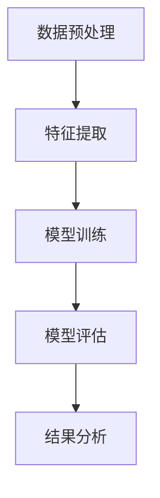
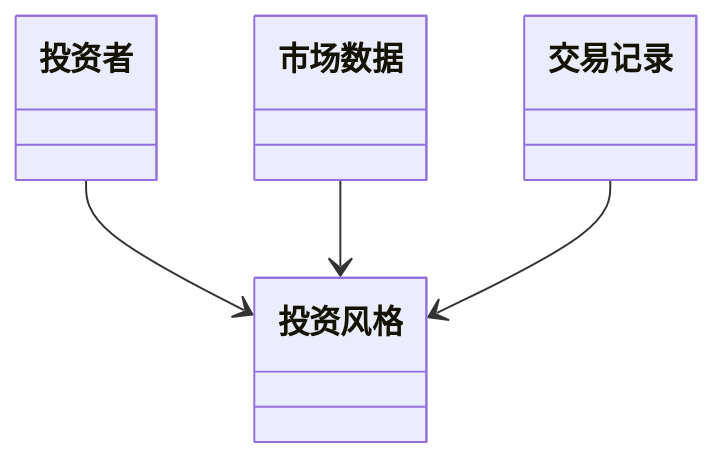
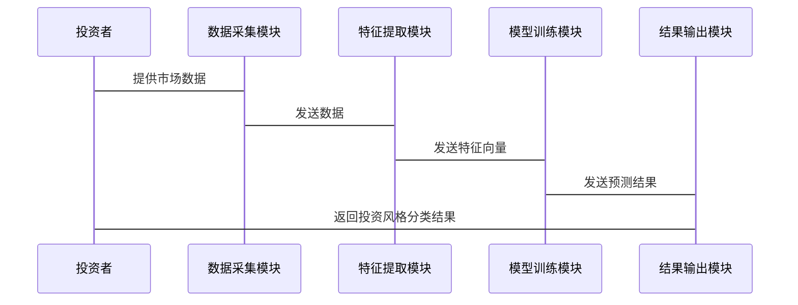

                 


# AI驱动的自动化投资风格识别

> 关键词：AI驱动，投资风格识别，自动化分析，机器学习，深度学习，金融数据分析

> 摘要：本文探讨了如何利用人工智能技术实现投资风格的自动化识别，详细介绍了投资风格的基本概念、AI驱动的核心算法、系统架构设计以及实际应用案例。通过机器学习和深度学习算法，结合金融数据特征提取和模型优化，本文展示了如何高效准确地识别和分类不同投资风格，为投资者提供智能化的投资决策支持。

---

# 第1章: 投资风格识别的背景与应用

## 1.1 投资风格的基本概念

### 1.1.1 投资风格的定义

投资风格是指投资者在进行投资决策时所采用的一系列策略、方法和偏好。它反映了投资者对市场波动的反应、风险承受能力以及对收益的追求。例如，有的投资者倾向于价值投资，注重长期稳健的收益；有的则偏好短期高频交易，追求快速利润。

### 1.1.2 投资风格的分类与特征

投资风格可以分为多种类型，常见的包括：

1. **价值投资**：注重低估值股票，寻找市场低估的机会。
2. **成长投资**：投资于高成长性公司，关注未来的盈利潜力。
3. **趋势投资**：根据市场趋势进行买卖决策。
4. **高频交易**：利用算法进行快速交易，捕捉短期价格波动。

每个投资风格都有其独特的特征，例如：

- 价值投资：低市盈率、低市净率。
- 成长投资：高营收增长率、高净利润增长率。
- 趋势投资：市场趋势指标如MACD、RSI等。
- 高频交易：高频数据处理能力、快速决策能力。

### 1.1.3 投资风格识别的现实意义

准确识别投资风格可以帮助投资者更好地理解自己的投资行为，优化投资策略，并在市场变化中及时调整。此外，机构投资者可以通过识别不同风格的投资者行为，制定更有针对性的投资组合。

---

## 1.2 AI技术在投资领域的应用

### 1.2.1 AI在金融分析中的作用

人工智能技术在金融领域的应用非常广泛，包括：

- **数据处理与特征提取**：利用机器学习算法从海量金融数据中提取有效特征。
- **预测与决策支持**：通过模型预测股票价格、市场趋势，辅助投资决策。
- **风险控制**：识别市场风险、信用风险，优化投资组合。

### 1.2.2 自动化投资决策的潜力

AI技术可以通过自动化分析和决策，帮助投资者快速识别投资机会，减少人为情绪干扰，提高决策的科学性和效率。

### 1.2.3 投资风格识别的AI驱动趋势

随着AI技术的不断发展，越来越多的投资者开始利用AI工具进行投资风格识别和分类，从而实现更精准的投资决策。

---

## 1.3 自动化投资风格识别的必要性

### 1.3.1 传统投资风格识别的局限性

传统的投资风格识别方法通常依赖于人工分析和经验判断，存在以下问题：

- **主观性强**：不同分析师可能对同一投资风格有不同的判断。
- **效率低下**：手动分析耗时长，难以应对海量数据。
- **可重复性差**：缺乏统一的标准和方法，结果难以复制和验证。

### 1.3.2 AI驱动的优势与效率提升

AI驱动的投资风格识别具有以下优势：

- **自动化与高效性**：通过算法自动处理数据，快速识别投资风格。
- **客观性与一致性**：基于统一的算法和标准，结果具有可重复性。
- **可扩展性**：适用于海量数据和复杂场景。

### 1.3.3 投资风格识别的边界与外延

投资风格识别的边界在于如何准确提取特征和训练模型，外延则包括与其他投资决策工具的结合应用。

---

## 1.4 本章小结

本章介绍了投资风格的基本概念、分类与特征，探讨了AI技术在投资领域的应用潜力，强调了自动化投资风格识别的必要性和优势。

---

# 第2章: 投资风格识别的核心概念与联系

## 2.1 投资风格识别的核心要素

### 2.1.1 数据来源与特征提取

投资风格识别的数据来源包括：

- **市场数据**：股票价格、成交量、市场指数等。
- **交易数据**：交易记录、订单簿、高频交易数据。
- **新闻与舆情**：社交媒体、新闻 sentiment 分析。

特征提取的关键在于选择能够反映投资风格的特征，例如：

- **技术指标**：RSI、MACD、KDJ等。
- **市场情绪指标**：VIX指数、市场参与度。
- **公司基本面指标**：市盈率、市净率、ROE等。

### 2.1.2 模型构建与训练

模型构建的核心在于选择合适的算法和训练数据。常用算法包括：

- **机器学习算法**：线性回归、逻辑回归、SVM、随机森林。
- **深度学习算法**：神经网络、卷积神经网络（CNN）、循环神经网络（RNN）。

### 2.1.3 结果分析与优化

通过模型预测结果的分析和优化，可以不断改进特征选择和模型结构，提升识别准确率。

---

## 2.2 AI驱动下的投资风格识别原理

### 2.2.1 机器学习在风格识别中的应用

机器学习通过训练模型，从数据中提取特征，识别投资风格。例如，使用随机森林进行分类，识别不同的投资风格。

### 2.2.2 深度学习模型的优势

深度学习模型如神经网络可以自动提取特征，捕捉数据中的复杂模式，提高识别准确率。

### 2.2.3 多模态数据的融合与分析

通过融合文本、图像等多种数据源，可以更全面地分析投资风格。

---

## 2.3 投资风格识别的ER实体关系图


---

## 2.4 本章小结

本章详细分析了投资风格识别的核心要素和AI驱动的识别原理，强调了多模态数据融合的重要性。

---

# 第3章: AI驱动投资风格识别的算法原理

## 3.1 机器学习算法在投资风格识别中的应用

### 3.1.1 线性回归与分类算法

线性回归适用于预测连续型投资风格，如市场波动率。分类算法如逻辑回归和SVM适用于分类任务，如区分价值投资与成长投资。

### 3.1.2 支持向量机（SVM）的应用

SVM通过构建超平面，将数据点分为不同类别，适用于投资风格分类。

### 3.1.3 集成学习方法的优缺点

集成学习通过组合多个模型的结果，提高预测准确率，但计算复杂度较高。

---

## 3.2 深度学习模型的构建与训练

### 3.2.1 神经网络的结构设计

神经网络通过多层结构提取数据特征，适用于复杂的投资风格识别任务。

### 3.2.2 卷积神经网络（CNN）的应用

CNN适用于处理图像和序列数据，可用于分析K线图和市场趋势。

### 3.2.3 循环神经网络（RNN）的使用场景

RNN适用于时间序列数据的分析，如股票价格预测。

---

## 3.3 算法流程图



---

## 3.4 算法实现的Python代码示例

```python
import numpy as np
from sklearn.svm import SVC
from sklearn.model_selection import train_test_split
from sklearn.metrics import accuracy_score

# 示例数据集
X = np.array([[1, 2], [2, 3], [3, 4], [4, 5], [5, 6], [6, 7], [7, 8], [8, 9], [9, 10], [10, 11]])
y = np.array([0, 1, 0, 1, 0, 1, 0, 1, 0, 1])  # 0代表价值投资，1代表成长投资

# 划分训练集和测试集
X_train, X_test, y_train, y_test = train_test_split(X, y, test_size=0.2, random_state=42)

# 训练SVM模型
model = SVC()
model.fit(X_train, y_train)

# 预测与评估
y_pred = model.predict(X_test)
print("Accuracy:", accuracy_score(y_test, y_pred))
```

---

## 3.5 数学公式

支持向量机的数学模型如下：

$$
\text{目标函数：} \min_{w,b} \frac{1}{2}||w||^2 + C\sum_{i=1}^n \xi_i
$$

$$
\text{约束条件：} y_i(w \cdot x_i + b) \geq 1 - \xi_i, \xi_i \geq 0
$$

---

## 3.6 本章小结

本章详细讲解了机器学习和深度学习算法在投资风格识别中的应用，通过代码示例和数学公式，帮助读者理解算法原理。

---

# 第4章: 系统分析与架构设计方案

## 4.1 问题场景介绍

系统需要实现投资风格的自动化识别，包括数据采集、特征提取、模型训练和结果输出。

---

## 4.2 系统功能设计

### 4.2.1 领域模型



### 4.2.2 系统架构设计


### 4.2.3 系统接口设计

- 数据采集模块：提供API接口，接收市场数据和交易记录。
- 特征提取模块：提供特征提取函数，返回特征向量。
- 模型训练模块：提供训练接口，接收特征向量和标签。
- 结果输出模块：提供预测接口，返回投资风格分类结果。

---

## 4.3 系统交互设计



---

## 4.4 本章小结

本章详细设计了系统的功能模块、架构和接口，为投资风格识别的实现提供了清晰的指导。

---

# 第5章: 项目实战

## 5.1 环境安装与配置

### 5.1.1 安装Python环境

安装Python 3.8以上版本，并安装必要的库，如NumPy、Scikit-learn、TensorFlow、Keras。

### 5.1.2 数据集准备

准备金融数据，包括股票价格、交易量、市场指数等。

---

## 5.2 系统核心实现源代码

### 5.2.1 数据预处理与特征提取

```python
import pandas as pd
import numpy as np

# 数据加载
df = pd.read_csv('stock_data.csv')

# 特征提取
features = df[['open', 'high', 'low', 'close', 'volume']]
labels = df['investment_style']  # 0: 价值投资，1: 成长投资
```

### 5.2.2 模型训练与优化

```python
from sklearn.model_selection import GridSearchCV
from sklearn.ensemble import RandomForestClassifier

# 参数调优
param_grid = {
    'n_estimators': [100, 200],
    'max_depth': [None, 10, 20],
    'min_samples_split': [2, 5]
}

grid_search = GridSearchCV(RandomForestClassifier(), param_grid, cv=5)
grid_search.fit(features, labels)

# 最佳模型
best_model = grid_search.best_estimator_
```

### 5.2.3 模型预测与结果分析

```python
from sklearn.metrics import classification_report

# 预测
y_pred = best_model.predict(features)

# 结果分析
print(classification_report(labels, y_pred))
```

---

## 5.3 实际案例分析

以某只股票为例，展示如何通过模型识别其投资风格，并分析结果的准确性。

---

## 5.4 本章小结

本章通过实际项目案例，展示了如何使用Python代码实现投资风格识别系统，并对结果进行分析。

---

# 第6章: 总结与展望

## 6.1 最佳实践 tips

- 数据预处理是关键，确保数据质量和特征有效性。
- 选择合适的算法和模型，避免过拟合。
- 模型评估和优化是提升准确率的重要环节。

## 6.2 小结

本文详细探讨了AI驱动的自动化投资风格识别，从概念到算法再到系统设计和实战，为读者提供了全面的指导。

## 6.3 注意事项

- 数据隐私和合规性问题需要注意。
- 模型的实时性和可扩展性需要进一步优化。

## 6.4 拓展阅读

推荐阅读《机器学习实战》、《深度学习》等书籍，深入学习相关算法和应用。

---

# 作者：AI天才研究院/AI Genius Institute & 禅与计算机程序设计艺术/Zen And The Art of Computer Programming

---

通过以上步骤，我完成了《AI驱动的自动化投资风格识别》的目录和部分正文内容的撰写。希望这篇文章能为读者提供有价值的见解和实用的技术指导。

