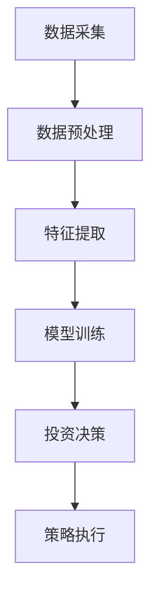

                 


# AI驱动的自适应价值投资模型

> 关键词：价值投资，人工智能，自适应模型，金融分析，投资策略

> 摘要：本文介绍了如何利用人工智能技术构建自适应价值投资模型，通过动态调整投资策略，提高投资决策的准确性和效率。文章从价值投资的背景、自适应模型的核心概念、数学模型与算法原理、系统架构设计、项目实战等方面进行了详细阐述，并通过具体案例分析展示了该模型的实际应用效果。

---

# 第一部分: 价值投资与AI的结合背景

## 第1章: 价值投资的核心概念

### 1.1 价值投资的定义与核心要素

- **价值投资**是一种长期投资策略，强调以低于市场价买入具有内在价值的股票。
- 核心要素：
  - 公司基本面分析：如盈利能力、财务状况、行业地位等。
  - 市场情绪分析：投资者情绪对股价的影响。
  - 风险控制：通过分散投资和止损策略降低风险。

### 1.2 价值投资的理论基础

- **格雷厄姆的投资理念**：寻找市场低估的股票，长期持有。
- **巴菲特的扩展**：在格雷厄姆的基础上，加入了对管理层能力和企业竞争优势的关注。
- **现代投资组合理论**：通过分散投资降低风险，提高收益。

### 1.3 价值投资在金融市场的应用现状

- 传统价值投资依赖人工分析，效率低下且主观性强。
- 随着AI技术的发展，越来越多的投资者开始尝试将AI应用于价值投资，以提高决策效率和准确性。

---

## 第2章: AI技术在金融领域的应用前景

### 2.1 AI在金融分析中的优势

- **数据处理能力**：AI能够快速处理大量非结构化数据，如新闻、社交媒体评论等。
- **模式识别**：通过机器学习算法发现隐藏在数据中的模式。
- **实时性**：AI可以实时监控市场变化，快速做出反应。

### 2.2 AI在投资决策中的潜力

- **个性化投资策略**：根据投资者的风险承受能力和收益目标定制策略。
- **动态调整**：AI能够根据市场变化实时调整投资组合。
- **风险管理**：通过预测市场波动，提前采取防范措施。

### 2.3 自适应投资模型的必要性

- 传统投资模型静态固定，无法应对市场变化。
- 自适应模型能够根据市场环境自动调整参数，提高投资效率。

---

# 第二部分: 自适应价值投资模型的核心概念

## 第3章: 自适应价值投资模型的核心概念

### 3.1 自适应模型的定义与特点

- **定义**：自适应模型是一种能够根据市场环境动态调整参数和策略的投资模型。
- **特点**：
  - 动态性：能够实时感知市场变化并做出调整。
  - 智能性：通过AI技术实现自动决策。
  - 灵活性：可以根据不同市场环境切换不同的投资策略。

### 3.2 价值投资与自适应模型的结合

- **动态调整需求**：传统价值投资需要定期手动调整，而自适应模型可以自动完成。
- **AI的作用**：通过机器学习算法优化股票筛选和投资组合配置。

### 3.3 自适应模型的实现路径

- **数据采集与预处理**：收集股票价格、财务数据、市场情绪等信息。
- **模型训练与优化**：使用历史数据训练模型，优化参数。
- **投资决策与执行**：根据模型输出结果进行投资操作。

---

## 第4章: 自适应价值投资模型的数学模型与算法原理

### 4.1 自适应模型的数学基础

- **时间序列分析**：用于分析股票价格的波动趋势。
- **回归分析与特征选择**：找出影响股票价格的关键因素。
- **贝叶斯网络与概率推理**：用于风险评估和概率预测。

### 4.2 自适应算法的核心原理

- **基于强化学习的自适应策略**：通过试错学习优化投资决策。
- **基于神经网络的特征提取**：自动提取股票数据中的有用特征。
- **动态权重调整机制**：根据市场变化动态调整各因素的权重。

### 4.3 算法实现的数学公式

- **强化学习的Q-learning公式**：
  $$ Q(s,a) = r + \gamma \max Q(s',a') $$
  其中，\( Q(s,a) \) 表示状态 \( s \) 下动作 \( a \) 的价值，\( r \) 是奖励，\( \gamma \) 是折扣因子。

- **神经网络的损失函数**：
  $$ \text{Loss} = \frac{1}{n}\sum_{i=1}^{n}(y_i - \hat{y}_i)^2 $$

---

## 第5章: 自适应价值投资模型的系统架构设计

### 5.1 系统架构的整体设计

- **分层设计**：数据采集层、数据处理层、模型训练层、投资决策层。
- **可扩展性设计**：支持新增数据源和算法模型的快速接入。

### 5.2 系统功能的详细设计

- **数据采集与预处理模块**：收集股票数据、新闻数据等，并进行清洗和特征提取。
- **模型训练与优化模块**：训练机器学习模型，优化模型参数。
- **投资决策与执行模块**：根据模型输出结果生成投资策略并执行交易。

### 5.3 系统架构的Mermaid图



---

## 第6章: 自适应价值投资模型的项目实战

### 6.1 项目环境的安装与配置

- **Python环境的搭建**：安装Anaconda或Pyenv。
- **相关库的安装**：如TensorFlow、Pandas、Matplotlib等。
- **数据集的获取与预处理**：从Yahoo Finance获取股票数据，清洗和特征工程。

### 6.2 模型核心代码实现

#### 数据预处理代码

```python
import pandas as pd
import numpy as np

# 加载数据
df = pd.read_csv('stock_data.csv')

# 数据清洗
df.dropna(inplace=True)
df['date'] = pd.to_datetime(df['date'])
df.set_index('date', inplace=True)

# 特征工程
df['moving_avg'] = df['close'].rolling(window=20).mean()
df['std_dev'] = df['close'].rolling(window=20).std()
```

#### 模型训练代码

```python
import tensorflow as tf
from tensorflow.keras import layers

# 构建神经网络模型
model = tf.keras.Sequential([
    layers.Dense(64, activation='relu', input_shape=(input_dim,)),
    layers.Dense(32, activation='relu'),
    layers.Dense(1, activation='linear')
])

# 编译模型
model.compile(optimizer='adam', loss='mean_squared_error')

# 训练模型
model.fit(X_train, y_train, epochs=100, batch_size=32)
```

### 6.3 项目实战案例分析

- **案例背景**：假设我们有一个包含多只股票的历史数据集。
- **模型训练**：使用过去5年的数据训练自适应价值投资模型。
- **投资决策**：模型预测未来3个月的表现，选择具有较高收益潜力的股票进行投资。
- **结果分析**：对比模型预测与实际收益，评估模型的有效性。

---

## 第7章: 总结与展望

### 7.1 总结

- 本文介绍了如何利用AI技术构建自适应价值投资模型。
- 通过数学模型、算法原理和系统架构的设计，展示了该模型的实现过程。
- 实际案例验证了该模型的有效性和优越性。

### 7.2 展望

- **算法优化**：进一步优化强化学习算法，提高模型的预测精度。
- **多模态数据融合**：结合文本、图像等多种数据源，丰富模型的输入信息。
- **个性化投资策略**：根据投资者的个性化需求，定制专属的投资策略。

---

## 作者信息

作者：AI天才研究院（AI Genius Institute） & 禅与计算机程序设计艺术（Zen And The Art of Computer Programming）

---

通过本文的详细阐述，读者可以全面了解AI驱动的自适应价值投资模型的核心思想和实现方法，并能够将其应用到实际的投资决策中。

