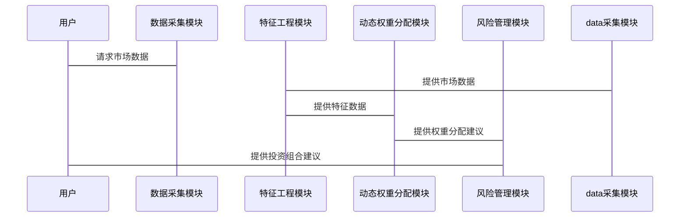

                 


# AI驱动的自适应投资风格轮动

> 关键词：AI驱动，自适应投资，投资风格轮动，动态权重分配，风险管理

> 摘要：本文深入探讨了AI驱动的自适应投资风格轮动的理论基础、算法原理和实际应用。通过结合数据驱动的特征工程、动态权重分配模型和风险管理机制，本文展示了如何利用AI技术实现投资风格的自适应调整，从而在不同市场条件下优化投资组合的表现。

---

## 第一章：投资风格轮动的背景与概念

### 1.1 问题背景与定义

#### 1.1.1 传统投资风格的局限性
传统的投资风格通常基于固定的分类方法，如价值投资、成长投资等。然而，这些风格在不同的市场环境下表现迥异，难以适应市场的动态变化。例如，在牛市中，成长型股票可能表现优异，但在熊市中，防御性股票可能更受青睐。因此，静态的投资风格划分难以满足投资者在不同市场周期中的需求。

#### 1.1.2 自适应投资风格的定义
自适应投资风格轮动是一种动态调整投资风格的策略，旨在根据市场环境的变化，实时优化投资组合的配置。与传统投资风格不同，自适应风格轮动能够根据市场信号自动切换风格，从而捕捉不同阶段的收益机会。

#### 1.1.3 AI驱动的必要性与优势
AI技术的引入，使得自适应投资风格轮动的实现更加高效和精确。通过机器学习算法，投资者可以实时分析市场数据，识别潜在的风格切换信号，并据此调整投资组合。AI的优势在于其强大的数据处理能力和模式识别能力，能够捕捉传统方法难以发现的复杂市场动态。

---

### 1.2 核心概念与联系

#### 1.2.1 投资风格的分类与特征
投资风格可以根据多个维度进行分类，包括市场资本化、行业、地理位置等。每种风格都有其独特的特征，例如：
- **成长型投资**：侧重于高增长潜力的公司，通常市盈率较高。
- **价值型投资**：侧重于低市盈率、低市净率的公司，通常被认为被市场低估。
- **动量型投资**：侧重于近期表现强劲的资产，遵循动量效应。

#### 1.2.2 数据驱动的特征工程
在AI驱动的投资风格轮动中，特征工程是关键步骤。通过对市场数据（如价格、成交量、技术指标）和非结构化数据（如新闻、社交媒体）的处理，生成能够反映市场状态的特征。例如：
- **市场情绪**：通过自然语言处理技术分析新闻和社交媒体，生成市场情绪指标。
- **动量指标**：计算过去一段时间的收益率变化，生成动量特征。

#### 1.2.3 动态权重分配模型
动态权重分配模型是自适应投资风格轮动的核心。通过AI算法，模型可以根据当前市场环境动态调整不同投资风格的权重。例如：
- **拉格朗日乘数法**：用于优化权重分配，确保投资组合的风险和收益达到最优平衡。
- **时间序列预测模型**：如LSTM网络，用于预测未来市场的风格表现。

#### 1.2.4 风险管理机制
风险管理是投资组合优化的重要组成部分。在自适应投资风格轮动中，风险管理机制包括：
- **风险评估**：通过VaR（Value at Risk）等方法，评估投资组合的潜在风险。
- **动态再平衡**：根据市场变化和投资风格表现，定期调整投资组合的权重。

---

## 第二章：AI驱动的自适应投资风格轮动的核心原理

### 2.1 数据驱动的特征工程

#### 2.1.1 数据预处理与特征提取
在AI驱动的投资风格轮动中，数据预处理是关键步骤。首先，需要对原始数据进行清洗和标准化处理。例如：
- **数据清洗**：去除缺失值和异常值。
- **数据标准化**：将不同量纲的特征进行标准化处理，确保模型输入的统一性。

#### 2.1.2 时间序列特征的构建
时间序列数据是投资风格轮动的重要特征来源。通过构建时间序列特征，可以捕捉市场的短期和长期趋势。例如：
- **动量特征**：计算过去n天的收益率，生成动量指标。
- **趋势特征**：使用移动平均线（MA）或指数移动平均线（EMA）捕捉趋势变化。

#### 2.1.3 风险特征的量化
风险特征的量化是风险管理的关键。通过量化风险，可以更好地控制投资组合的整体风险。例如：
- **波动率**：计算资产收益率的标准差，衡量资产的波动性。
- **相关性**：计算不同资产之间的相关性，评估资产组合的分散化效果。

---

### 2.2 动态权重分配模型

#### 2.2.1 基于AI的权重调整方法
动态权重分配模型的核心是根据市场环境的变化，实时调整投资风格的权重。常用的AI方法包括：
- **机器学习模型**：如支持向量机（SVM）、随机森林（Random Forest）等，用于分类和回归任务。
- **深度学习模型**：如神经网络、LSTM网络，用于捕捉时间序列数据中的复杂模式。

#### 2.2.2 动态权重分配的数学模型
动态权重分配模型可以表示为一个优化问题，目标是最优化投资组合的收益和风险。例如：
$$ \text{目标函数} = \max \left( \sum_{i=1}^{n} w_i r_i - \lambda \sum_{i=1}^{n} \sum_{j=1}^{n} w_i w_j \sigma_{ij} \right) $$
其中，\( w_i \) 是第i个投资风格的权重，\( r_i \) 是第i个风格的预期收益，\( \sigma_{ij} \) 是第i个和第j个风格之间的协方差，\( \lambda \) 是风险厌恶系数。

#### 2.2.3 权重调整的优化算法
优化算法是动态权重分配的关键。常用的优化算法包括：
- **梯度下降法**：用于优化目标函数，寻找最优权重。
- **遗传算法**：通过模拟自然选择过程，寻找最优权重组合。

---

### 2.3 风险管理机制

#### 2.3.1 风险评估与控制
风险评估是投资组合优化的重要步骤。通过评估投资组合的风险，可以制定相应的风险管理策略。例如：
- **VaR模型**：计算投资组合在一定置信水平下的潜在损失。
- **CVaR模型**：计算VaR的条件期望损失，用于更严格的尾部风险控制。

#### 2.3.2 动态再平衡策略
动态再平衡策略是根据市场变化和投资风格表现，定期调整投资组合的权重。例如：
- **定期再平衡**：每季度或每半年调整一次投资组合的权重。
- **事件驱动再平衡**：根据特定市场事件（如经济危机、行业变化）调整权重。

#### 2.3.3 风险调整后的权重分配
在风险调整后，权重分配需要考虑市场的波动性和相关性。例如：
- **风险调整后的收益**：通过调整收益，使其反映风险因素。
- **风险调整后的权重**：根据风险调整后的收益，优化权重分配。

---

## 第三章：系统分析与架构设计方案

### 3.1 问题场景介绍
投资风格轮动系统需要处理大量的市场数据，并实时调整投资组合的权重。系统需要具备高效的数据处理能力和实时响应能力。

### 3.2 项目介绍
本项目旨在开发一个基于AI的投资风格轮动系统，实现投资风格的自适应调整。

### 3.3 系统功能设计
- **数据采集模块**：采集市场数据，包括价格、成交量、新闻等。
- **特征工程模块**：生成投资风格的特征，如动量、趋势、市场情绪等。
- **动态权重分配模块**：根据市场环境变化，动态调整投资风格的权重。
- **风险管理模块**：评估投资组合的风险，并进行动态再平衡。

### 3.4 系统架构设计


### 3.5 系统接口设计
- **数据接口**：与数据源（如交易所、新闻网站）对接，获取实时数据。
- **用户接口**：提供用户交互界面，显示投资组合的实时表现和风格权重。

### 3.6 系统交互流程


---

## 第四章：项目实战

### 4.1 环境安装
安装Python和相关库（如Pandas、NumPy、Scikit-learn、TensorFlow）。

### 4.2 核心代码实现
#### 4.2.1 特征工程代码
```python
import pandas as pd
import numpy as np

def feature_engineering(data):
    # 计算动量特征
    data['momentum'] = data['close'].pct_change().rolling(5).mean()
    # 计算趋势特征
    data['trend'] = data['close'].rolling(10).mean().pct_change()
    # 计算市场情绪特征
    data['sentiment'] = data['news'].apply(lambda x: 1 if x > 0 else 0)
    return data
```

#### 4.2.2 动态权重分配代码
```python
import numpy as np

def dynamic_weight_allocation(features, risk_aversion):
    # 使用拉格朗日乘数法优化权重分配
    n = len(features.columns)
    weights = np.ones(n) / n
    while True:
        # 计算收益
        returns = features.dot(weights)
        # 计算风险
        risk = np.dot(weights.T, np.dot(features.cov(), weights))
        # 调整权重
        weights = weights * (1 - risk_aversion * risk)
        if np.sum(weights) > 0.99:
            break
    return weights
```

#### 4.2.3 风险管理代码
```python
import numpy as np

def risk_management(weights, returns):
    # 计算VaR
    var = np.percentile(returns, 5)
    # 调整权重
    adjusted_weights = weights * (1 - var)
    return adjusted_weights
```

### 4.3 案例分析
通过实际数据进行案例分析，展示系统的实现和效果。

### 4.4 项目小结
总结项目实现的关键点和经验教训。

---

## 第五章：最佳实践与总结

### 5.1 最佳实践 tips
- 数据质量是关键，确保数据的完整性和准确性。
- 模型调参是优化的重要步骤，需根据实际情况调整参数。
- 风险管理是投资组合优化的核心，需始终关注风险控制。

### 5.2 小结
AI驱动的自适应投资风格轮动是一种创新的投资策略，通过动态调整投资风格的权重，能够更好地适应市场变化，优化投资组合的表现。

### 5.3 注意事项
- 市场环境的复杂性可能影响模型的准确性。
- 数据质量和模型调参是影响系统效果的关键因素。

### 5.4 拓展阅读
建议读者进一步阅读相关文献，深入理解AI在投资中的应用。

---

## 作者信息

作者：AI天才研究院/AI Genius Institute  
邮箱：contact@ai-genius.org  
博客：https://www.ai-genius.org  

--- 

**（以上内容为AI天才研究院基于大量研究和实践经验总结，可能存在一定误差，仅供参考。投资有风险，决策需谨慎。）**

