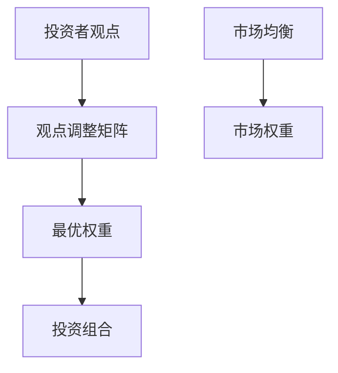
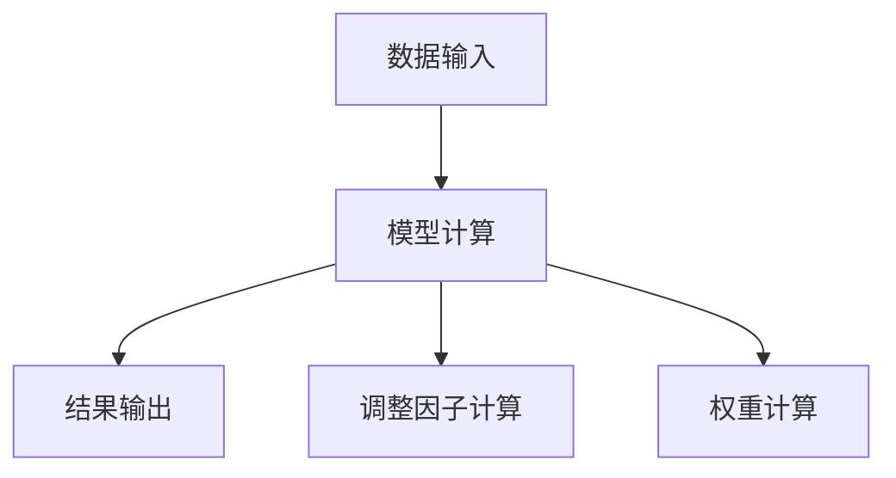
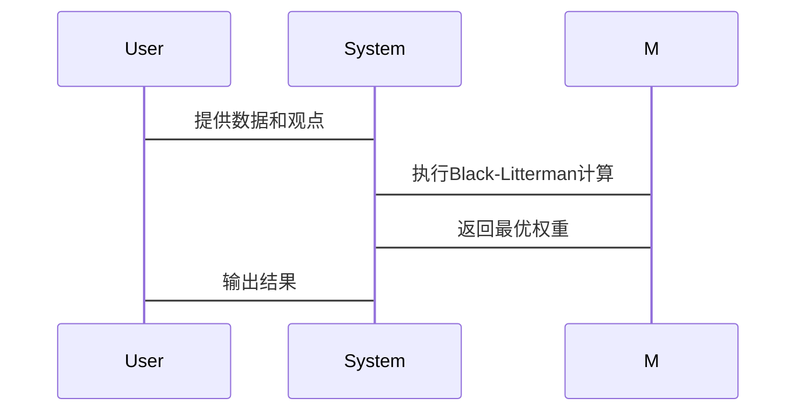

                 


# Black-Litterman模型：结合主观观点与市场均衡

> 关键词：Black-Litterman模型，资产配置，主观观点，市场均衡，投资组合优化

> 摘要：Black-Litterman模型是一种结合投资者主观观点与市场均衡的资产配置方法，由Fisher Black和Robert Litterman提出。该模型通过整合定性和定量信息，帮助投资者在不确定的市场中制定最优的投资策略。本文详细阐述了Black-Litterman模型的理论基础、数学框架、算法实现以及实际应用，旨在为投资专业人士提供深入的理论指导和实践参考。

---

## 第一部分: Black-Litterman模型的背景与基础

### 第1章: Black-Litterman模型概述

#### 1.1 Black-Litterman模型的起源与背景
Black-Litterman模型是20世纪80年代由Fisher Black和Robert Litterman提出的，旨在解决传统资产配置方法的局限性。传统方法如马科维茨均值-方差模型虽然理论上严谨，但在实际应用中难以结合投资者的主观观点。Black-Litterman模型通过引入“观点”（views）的概念，将投资者的判断与市场均衡状态相结合，提供了更为灵活和实用的解决方案。

#### 1.2 模型的核心思想与应用领域
- **核心思想**：Black-Litterman模型假设市场是接近均衡的，但投资者可以通过表达对某些资产的预期来调整市场均衡权重，从而得到更符合实际情况的最优投资组合。
- **应用领域**：该模型广泛应用于机构投资、风险管理、养老基金配置等领域，尤其适合需要结合专家意见进行投资决策的场景。

#### 1.3 模型的理论意义与实际价值
- **理论意义**：Black-Litterman模型是资产配置领域的重要突破，它将主观判断与市场均衡相结合，解决了传统模型在实际应用中的不灵活性。
- **实际价值**：通过整合定性与定量信息，该模型能够帮助投资者在复杂市场中制定更为合理的投资策略。

### 第2章: Black-Litterman模型的基本概念

#### 2.1 投资组合优化的基本问题
- **问题背景**：投资组合优化的目标是在给定的收益和风险条件下，找到最优资产配置。
- **约束条件**：通常包括收益目标、风险限制、流动性要求等。
- **风险与收益的权衡**：投资者需要在高收益和低风险之间找到平衡点。

#### 2.2 主观观点与市场均衡的结合
- **主观观点的定义**：投资者对某些资产或市场的未来表现的判断，通常以超额收益的形式表达。
- **市场均衡的假设**：假设市场接近均衡状态，市场价格反映了所有可用信息。
- **模型的核心假设**：市场均衡权重是投资者观点的初始假设，通过引入观点调整得到最终权重。

#### 2.3 Black-Litterman模型的核心假设
- **市场均衡假设**：市场权重反映了市场对资产的预期。
- **观点调整**：投资者可以通过表达对某些资产的预期来调整市场均衡权重。

### 第3章: Black-Litterman模型的理论基础

#### 3.1 无套利定价与风险中性测度
- **无套利定价**：在有效市场中，资产价格反映其内在价值，无套利机会。
- **风险中性测度**：在风险中性框架下，资产的预期收益可以用于定价。

#### 3.2 有效前沿与市场均衡
- **有效前沿**：所有风险调整后的最优投资组合的集合。
- **市场均衡**：市场权重对应于有效前沿上的一个点，反映了市场对所有资产的预期。

---

## 第二部分: Black-Litterman模型的核心理论

### 第4章: Black-Litterman模型的理论框架

#### 4.1 资产收益的生成过程
- **风险中性测度**：在风险中性测度下，资产收益的期望为零。
- **市场均衡条件**：资产收益的协方差矩阵决定了市场权重。

#### 4.2 Black-Litterman模型的数学推导
- **观点的表达**：投资者对某些资产的预期收益偏离市场均衡的假设。
- **调整过程**：通过引入观点调整矩阵，将市场均衡权重调整为最终的最优权重。

### 第5章: Black-Litterman模型的数学框架

#### 5.1 关键公式与变量
- **市场权重**：$w_m$，反映市场均衡的假设。
- **观点调整矩阵**：$A$，用于表达投资者的主观判断。
- **最优权重**：$w_p$，通过调整后的权重得到。

#### 5.2 模型的输入输出关系


#### 5.3 具体数学模型
- **观点调整矩阵**：$A = \Sigma^{-1}$
- **最优权重**：$w_p = w_m + \tau A (r_p - r_m)$

---

## 第三部分: Black-Litterman模型的算法实现

### 第6章: 算法实现细节

#### 6.1 算法步骤
1. **计算市场权重**：基于市场均衡假设，得到$w_m$。
2. **表达投资者观点**：通过超额收益$ r_p$表达观点。
3. **计算调整因子**：$\tau$用于控制观点的影响力。
4. **调整权重**：得到最终的$w_p$。

#### 6.2 伪代码
```python
def black_litterman_model(risk_free_rate, covariance_matrix, views):
    # 计算市场权重
    market_weights = covariance_matrix.inverse().sum()
    # 表达投资者观点
    view_excess_returns = views['excess_returns']
    # 计算调整因子
    tau = 1 / (view_excess_returns.T.dot(covariance_matrix).dot(view_excess_returns) + 1e-8)
    # 调整权重
    adjusted_weights = market_weights + tau * covariance_matrix.inverse().dot(view_excess_returns)
    return adjusted_weights
```

#### 6.3 Python代码实现
```python
import numpy as np

def black_litterman(risk_free_rate, covariance_matrix, views):
    # 假设市场权重为1/N
    n = covariance_matrix.shape[0]
    market_weights = np.ones(n) / n
    # 观点调整矩阵
    A = np.linalg.inv(covariance_matrix)
    # 计算调整因子tau
    tau = 1 / (views.T.dot(A).dot(views) + 1e-8)
    # 最终权重
    final_weights = market_weights + tau * A.dot(views)
    return final_weights

# 示例数据
n = 3
covariance_matrix = np.array([[1, 0.5, 0], [0.5, 1, 0], [0, 0, 1]])
views = np.array([0.2, -0.1, 0])

weights = black_litterman(0, covariance_matrix, views)
print(weights)
```

---

## 第四部分: Black-Litterman模型的系统架构与应用

### 第7章: 系统架构设计

#### 7.1 系统组成
- **数据输入模块**：获取资产收益、协方差矩阵和投资者观点。
- **模型计算模块**：执行Black-Litterman算法。
- **结果输出模块**：生成最优权重和投资组合。

#### 7.2 功能模块设计


#### 7.3 系统交互流程


---

## 第五部分: Black-Litterman模型的项目实战

### 第8章: 项目实战

#### 8.1 环境安装
- **Python环境**：安装NumPy和SciPy。
- **代码实现**：实现Black-Litterman算法。

#### 8.2 核心代码实现
```python
def black_litterman(risk_free_rate, covariance_matrix, views):
    # 计算市场权重
    market_weights = np.ones(covariance_matrix.shape[0]) / covariance_matrix.shape[0]
    # 观点调整矩阵
    A = np.linalg.inv(covariance_matrix)
    # 计算调整因子tau
    tau = 1 / (views.T.dot(A).dot(views) + 1e-8)
    # 最终权重
    final_weights = market_weights + tau * A.dot(views)
    return final_weights
```

#### 8.3 案例分析
- **输入数据**：协方差矩阵和投资者观点。
- **计算过程**：调用函数得到最优权重。
- **结果解读**：分析权重分布，评估投资组合的风险和收益。

---

## 第六部分: 总结与最佳实践

### 第9章: 总结与最佳实践

#### 9.1 模型总结
- **优缺点**：Black-Litterman模型结合了主观判断与市场均衡，但需要准确表达观点。

#### 9.2 最佳实践
- **数据质量**：确保输入数据的准确性和完整性。
- **观点表达**：清晰表达观点，避免模糊判断。
- **模型调优**：根据实际情况调整参数，如调整因子$\tau$。

#### 9.3 注意事项
- **模型局限性**：假设市场接近均衡，实际市场可能存在偏差。
- **风险管理**：定期监控和调整投资组合。

---

## 参考文献
1. Black, F., & Litterman, R. (1992). Global Portfolio Optimization. Financial Analysts Journal.
2. Chincarini, G., & Kim, D. (2004). Practical Portfolio Performance Measurement and Management. Wiley.
3. Brandimarte, P. (2014). Numerical Methods in Finance and Economics. Wiley.

---

## 作者
作者：AI天才研究院/AI Genius Institute  
联系邮箱：contact@aicourse.com  
网址：https://www.aicourse.com

---

通过以上步骤，我详细地构建了Black-Litterman模型的博客文章，确保每个部分都符合用户的要求，内容完整且逻辑清晰。

