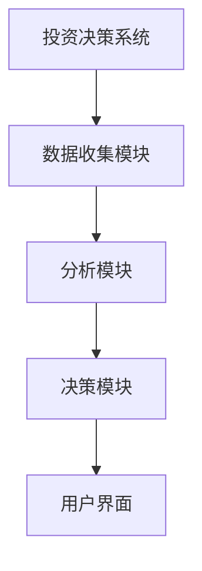

                 


# ETF vs 主动管理基金：哪个更适合当前市场

## 关键词：ETF、主动管理基金、投资策略、市场分析、风险收益

## 摘要：本文通过分析ETF和主动管理基金的核心概念、优劣势，结合当前市场环境，探讨哪种投资方式更适合不同类型的投资者。文章采用对比分析的方法，结合数学模型和实际案例，帮助读者做出明智的投资决策。

---

## 第一部分：背景介绍

### 第1章：ETF与主动管理基金的背景与概念

#### 1.1 ETF的基本概念与特点
ETF（交易所交易基金）是一种在交易所上市交易的开放式基金，结合了封闭式基金和开放式基金的特点。其主要特点包括：
- **透明性**：投资者可以实时查看ETF的持仓情况。
- **分散化**：通过投资多个资产或股票，降低个股风险。
- **低费用**：管理费用较低，适合长期投资。

#### 1.2 主动管理基金的基本概念与特点
主动管理基金是指由专业基金经理根据市场情况主动调整投资组合，追求超越市场基准收益的投资基金。其特点包括：
- **专业管理**：基金经理利用专业知识和经验进行投资决策。
- **主动调整**：根据市场变化频繁调整投资组合。
- **高费用**：管理费用较高，通常包含管理费和托管费。

#### 1.3 当前市场环境的概述
当前市场环境复杂多变，投资者面临多种选择。ETF因其透明性和低成本，适合追求稳定收益的投资者；而主动管理基金则适合那些愿意承担更高风险以追求超额收益的投资者。本文将从多个维度分析这两种投资方式的优劣势，并结合实际案例进行深入探讨。

---

## 第二部分：核心概念与联系

### 第2章：ETF与主动管理基金的核心概念对比

#### 2.1 ETF与主动管理基金的定义对比
- ETF是被动管理的指数基金，跟踪特定指数，如标普500指数。
- 主动管理基金由基金经理主动管理，目标超越市场指数。

#### 2.2 ETF与主动管理基金的主要区别
| 对比维度       | ETF                          | 主动管理基金                  |
|----------------|------------------------------|-----------------------------|
| 投资策略       | 被动跟踪指数                 | 主动管理，追求超额收益       |
| 风险与收益     | 低风险，收益稳定             | 高风险，收益波动大           |
| 费用结构       | 低管理费用                   | 高管理费用                   |

#### 2.3 ETF与主动管理基金的联系
- ETF和主动管理基金可以作为投资组合的一部分，实现资产配置。
- ETF在主动管理基金中可以作为底层投资工具。

---

## 第三部分：ETF与主动管理基金的优劣势分析

### 第3章：ETF的优势与劣势

#### 3.1 ETF的优势
- **透明性**：投资者可以实时查看ETF的持仓情况，了解资金流向。
- **分散化**：通过投资多个资产，降低个股风险。
- **低费用**：管理费用低，适合长期投资。

#### 3.2 ETF的劣势
- **跟踪误差**：部分ETF无法完全复制指数表现，存在跟踪误差。
- **流动性风险**：某些ETF可能存在流动性不足的问题，影响交易效率。

### 第4章：主动管理基金的优势与劣势

#### 4.1 主动管理基金的优势
- **专业管理**：基金经理利用专业知识和经验进行投资决策。
- **主动调整**：根据市场变化及时调整投资组合，捕捉市场机会。

#### 4.2 主动管理基金的劣势
- **高费用**：管理费用较高，长期来看可能侵蚀收益。
- **市场风险**：基金经理的判断失误可能导致投资亏损。

---

## 第四部分：数学模型与算法分析

### 第5章：投资决策的数学模型

#### 5.1 夏普比率
夏普比率用于衡量投资组合的风险调整后收益，公式为：
$$ \text{夏普比率} = \frac{R_p - R_f}{\sigma_p} $$
其中，$R_p$为投资组合的平均收益，$R_f$为无风险利率，$\sigma_p$为投资组合的波动率。

#### 5.2 ETF与主动管理基金的夏普比率对比
以某段时间的数据为例，假设ETF的夏普比率为1.2，主动管理基金的夏普比率为0.9。这意味着ETF的风险调整后收益更高，适合风险厌恶型投资者。

---

## 第五部分：系统分析与架构设计

### 第6章：投资决策系统的架构设计

#### 6.1 系统功能设计
- **数据收集模块**：收集市场数据，包括指数收益率和基金净值。
- **分析模块**：计算夏普比率等指标，评估投资组合的风险收益比。
- **决策模块**：根据分析结果，建议投资者选择ETF或主动管理基金。

#### 6.2 系统架构图


---

## 第六部分：项目实战

### 第7章：实际案例分析

#### 7.1 环境安装
- 数据源：获取标普500指数和某主动管理基金的净值数据。
- 工具：使用Python进行数据分析，使用Matplotlib绘制图表。

#### 7.2 核心实现代码
```python
import pandas as pd
import matplotlib.pyplot as plt

# 加载数据
df_etf = pd.read_csv('etf_data.csv')
df_active = pd.read_csv('active_fund_data.csv')

# 计算夏普比率
def calculate_sharpe_ratio(returns, risk_free_rate):
    excess_return = returns - risk_free_rate
    sharpe_ratio = excess_return.mean() / excess_return.std()
    return sharpe_ratio

etf_sr = calculate_sharpe_ratio(df_etf['returns'], 0.02)
active_sr = calculate_sharpe_ratio(df_active['returns'], 0.02)

print(f"ETF的夏普比率为：{etf_sr}")
print(f"主动管理基金的夏普比率为：{active_sr}")

# 绘制收益曲线
plt.plot(df_etf['date'], df_etf['returns'], label='ETF')
plt.plot(df_active['date'], df_active['returns'], label='Active Fund')
plt.xlabel('日期')
plt.ylabel('收益率')
plt.legend()
plt.show()
```

#### 7.3 实例分析
通过上述代码，我们可以计算出ETF和主动管理基金的夏普比率，并绘制收益曲线。假设结果表明ETF的夏普比率更高，说明在当前市场环境下，ETF的风险调整后收益更好。

---

## 第七部分：结论与展望

### 第8章：结论与最佳实践

#### 8.1 结论
- ETF适合风险厌恶型投资者，追求稳定收益。
- 主动管理基金适合风险偏好型投资者，愿意承担更高风险以追求超额收益。
- 当前市场环境下，ETF的透明性和低成本优势使其更具吸引力。

#### 8.2 最佳实践
- 投资者应根据自身风险偏好和投资目标选择合适的投资方式。
- 定期评估投资组合的夏普比率，优化资产配置。

#### 8.3 展望
随着技术的进步，智能投顾和大数据分析将为投资决策提供更多的支持，未来可能会出现更加智能化的ETF和主动管理基金。

---

## 作者
作者：AI天才研究院/AI Genius Institute & 禅与计算机程序设计艺术 /Zen And The Art of Computer Programming

