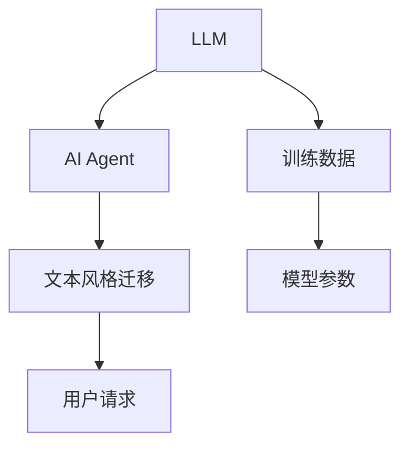
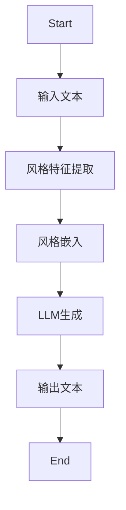
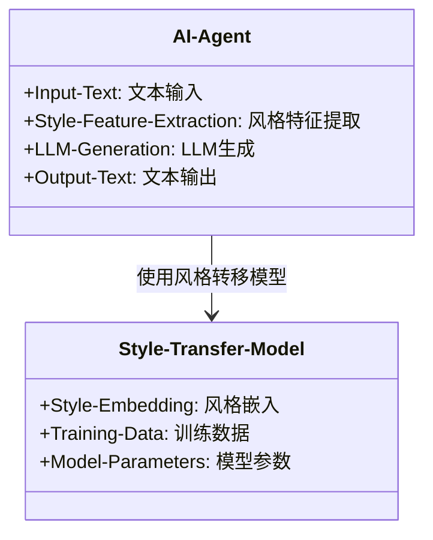
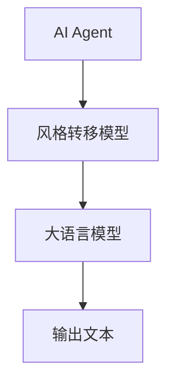
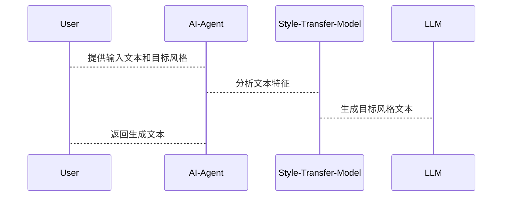

                 


# LLM在AI Agent中的文本风格迁移应用

## 关键词：LLM，AI Agent，文本风格迁移，自然语言处理，机器学习，文本生成

## 摘要：本文深入探讨了大语言模型（LLM）在AI Agent中的文本风格迁移应用。文章从背景介绍、核心概念、算法原理、系统架构到项目实战，全面分析了如何利用LLM实现文本风格迁移。通过具体的案例分析和代码实现，详细解读了LLM在AI Agent中的应用流程，帮助读者全面理解文本风格迁移的实现原理和实际应用。

---

# 第一部分: 背景介绍与核心概念

## 第1章: 背景介绍与核心概念

### 1.1 问题背景与描述
随着自然语言处理（NLP）技术的飞速发展，AI Agent在智能交互中的角色变得越来越重要。AI Agent能够理解用户意图、生成自然语言文本，并通过文本风格迁移技术，实现与用户更自然的交互。然而，传统的文本生成技术在风格一致性、语境理解和多样化表达方面存在诸多限制。LLM（大语言模型）的出现，为AI Agent提供了强大的文本生成能力，同时也为文本风格迁移带来了新的可能性。

### 1.2 核心概念与问题解决
文本风格迁移是指将一段文本从一种风格转换为另一种风格，例如将正式的商务文本转换为口语化的对话文本。AI Agent需要通过理解用户的输入文本，提取其内容和风格特征，并生成符合目标风格的文本。LLM在这一过程中扮演了关键角色，它不仅能够生成多样化的内容，还能通过微调和风格适应技术，实现文本风格的精准迁移。

### 1.3 核心概念的边界与外延
文本风格迁移的外延包括文本语气、情感、领域、语言风格等方面的转换。例如，将技术文档转换为通俗易懂的解释性文本，或将严肃的新闻报道转换为轻松的社交媒体内容。AI Agent的功能边界在于，它需要在理解用户需求的基础上，生成符合目标风格的文本，同时保持内容的准确性和逻辑性。

### 1.4 核心概念结构与组成
AI Agent中的文本风格迁移系统通常由以下几个部分组成：
1. **数据预处理模块**：对输入文本进行清洗、分词和特征提取。
2. **风格识别模块**：通过模型识别输入文本的风格特征。
3. **风格转换模块**：基于LLM生成符合目标风格的文本。
4. **输出模块**：将生成的文本返回给用户。

---

# 第二部分: 核心概念与联系

## 第2章: 核心概念与联系

### 2.1 核心概念原理
文本风格迁移的核心原理在于对文本内容和风格的解耦。LLM通过预训练掌握了大量语言数据，能够生成符合特定风格的文本。AI Agent通过分析用户输入的文本，提取其内容和风格特征，并将这些特征传递给LLM，生成目标风格的文本。

### 2.2 核心概念属性特征对比
以下是文本风格迁移与文本改写的对比分析：

| 特性          | 文本风格迁移 | 文本改写 |
|---------------|--------------|----------|
| 目标          | 改变文本风格 | 修改语法错误或优化表达 |
| 输入要求      | 需要目标风格特征 | 需要明确的修改规则 |
| 输出结果      | 文本风格发生变化，内容保持不变 | 内容和风格可能发生变化 |

### 2.3 ER实体关系图架构
以下是文本风格迁移系统的ER实体关系图：



---

# 第三部分: 算法原理讲解

## 第3章: 算法原理讲解

### 3.1 算法原理概述
文本风格迁移的实现通常基于以下步骤：
1. **输入文本分析**：提取文本的内容和风格特征。
2. **风格嵌入生成**：将风格特征转换为模型可理解的嵌入向量。
3. **LLM生成**：基于风格嵌入，生成符合目标风格的文本。

### 3.2 算法实现流程
以下是文本风格迁移的实现流程图：



### 3.3 数学模型与公式
以下是文本风格迁移中常用的数学模型和公式：

1. **LLM的文本生成概率公式**：
   $$ P(w_{n}|w_{1},...,w_{n-1}) = \theta_{LLM}(w_{n}|w_{1},...,w_{n-1}) $$

2. **文本风格迁移的损失函数**：
   $$ L = \lambda_{1}L_{text} + \lambda_{2}L_{style} $$

   其中，$L_{text}$是文本生成的损失，$L_{style}$是风格匹配的损失，$\lambda_{1}$和$\lambda_{2}$是权重系数。

---

# 第四部分: 系统分析与架构设计方案

## 第4章: 系统分析与架构设计方案

### 4.1 问题场景介绍
在实际应用中，AI Agent需要处理多种风格的文本请求，例如：
- 将用户提供的技术文档转换为用户友好的解释性文本。
- 将正式的商务邮件转换为口语化的聊天记录。

### 4.2 项目介绍
本项目旨在开发一个基于LLM的AI Agent，能够实现文本风格迁移。系统架构设计如下：

1. **数据预处理模块**：对输入文本进行清洗、分词和特征提取。
2. **风格识别模块**：通过模型识别输入文本的风格特征。
3. **风格转换模块**：基于LLM生成符合目标风格的文本。
4. **输出模块**：将生成的文本返回给用户。

### 4.3 系统功能设计
以下是系统的功能设计图：



### 4.4 系统架构设计
以下是系统的架构设计图：



### 4.5 系统接口设计
以下是系统的接口设计：

1. **输入接口**：接收用户输入的文本和目标风格。
2. **输出接口**：返回生成的文本。

### 4.6 系统交互设计
以下是系统的交互流程图：



---

# 第五部分: 项目实战

## 第5章: 项目实战

### 5.1 环境安装
以下是项目所需的环境和工具：
1. Python 3.8+
2. PyTorch 1.9+
3. transformers库（用于加载LLM模型）

### 5.2 系统核心实现源代码
以下是系统的核心代码实现：

```python
from transformers import AutoTokenizer, AutoModelForCausalLM
import torch

# 加载LLM模型和分词器
model_name = "gpt2"
tokenizer = AutoTokenizer.from_pretrained(model_name)
model = AutoModelForCausalLM.from_pretrained(model_name)

def text_style_transfer(input_text, target_style):
    # 输入文本编码
    inputs = tokenizer.encode(input_text, return_tensors="pt", add_special_tokens=True)
    inputs = inputs.to(torch.device("cuda" if torch.cuda.is_available() else "cpu"))
    
    # 生成目标风格文本
    outputs = model.generate(inputs, max_length=100, do_sample=True)
    generated_text = tokenizer.decode(outputs[0], skip_special_tokens=True)
    
    return generated_text

# 示例
input_text = "This is a technical document."
target_style = "user-friendly explanation"

result = text_style_transfer(input_text, target_style)
print(result)
```

### 5.3 代码应用解读与分析
上述代码实现了基于GPT-2模型的文本风格迁移。代码的主要步骤包括：
1. 加载预训练的LLM模型和分词器。
2. 对输入文本进行编码。
3. 使用模型生成目标风格的文本。
4. 解码生成的文本并返回结果。

### 5.4 实际案例分析
假设用户输入以下文本：
```plaintext
The product has been updated with new features.
```

目标风格为“口语化”。经过风格迁移后，生成的文本可能为：
```plaintext
The product now has some cool new features!
```

### 5.5 项目小结
通过上述案例分析，我们可以看到，LLM在AI Agent中的文本风格迁移应用能够显著提升用户体验，实现更自然的文本交互。

---

# 第六部分: 总结与展望

## 第6章: 总结与展望

### 6.1 总结
本文详细探讨了LLM在AI Agent中的文本风格迁移应用，从背景介绍、核心概念、算法原理到系统架构和项目实战，全面分析了实现文本风格迁移的关键技术。通过实际案例的分析和代码实现，进一步验证了LLM在文本风格迁移中的强大能力。

### 6.2 展望
未来，随着LLM技术的不断发展，文本风格迁移的应用场景将更加广泛。AI Agent将能够实现更精准的风格匹配，支持多语言、多领域的文本风格迁移。此外，结合实时反馈和用户偏好分析，AI Agent将能够生成更加个性化、多样化的文本内容。

---

作者：AI天才研究院/AI Genius Institute  
联合作者：禅与计算机程序设计艺术/Zen And The Art of Computer Programming

