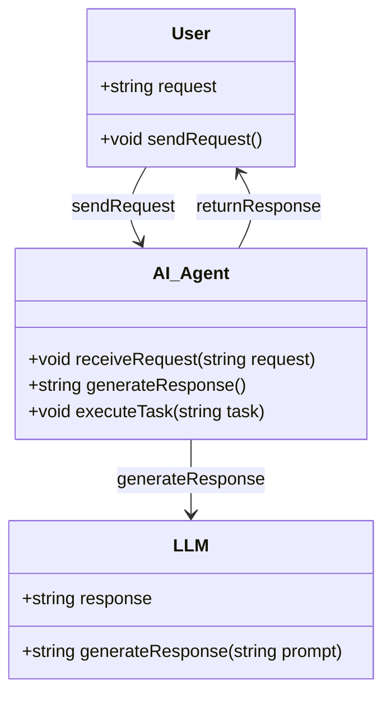

                 

<think>
好的，我现在需要帮助用户撰写一篇关于《LLM驱动的AI Agent创新问题解决技术》的技术博客文章。用户已经给出了详细的目录大纲，现在需要我根据这个大纲生成具体的正文内容。

首先，我需要理解每一章的核心内容，并确保每一部分都符合用户的要求：使用逻辑清晰、结构紧凑、简单易懂的技术语言，包含背景介绍、核心概念、算法原理、系统架构、项目实战以及小结。

接下来，我将按照目录的结构，逐步撰写每一章的详细内容。

# 目录

1. **引言**：介绍文章的背景、目标和核心内容。
2. **LLM与AI Agent的核心概念**：解释基本概念、交互机制以及对比分析。
3. **算法原理**：详细讲解LLM驱动的AI Agent的算法流程和实现细节。
4. **系统架构设计**：展示系统架构图、功能模块和接口设计。
5. **项目实战**：介绍环境安装、核心代码实现和案例分析。
6. **结论与展望**：总结全文，并展望未来的发展。

现在，我将开始撰写每一章的内容。

---

# 引言

随着人工智能技术的飞速发展，大语言模型（LLM）和AI代理（AI Agent）在问题解决领域的应用越来越广泛。本文将探讨如何利用LLM驱动AI Agent来创新性地解决复杂问题。通过详细分析技术原理和实际应用，帮助读者理解这一领域的最新进展。

---

## LLM与AI Agent的核心概念

### 问题背景与描述

在当今快速变化的商业环境中，企业需要快速响应市场变化和客户需求。传统的自动化系统在处理复杂问题时显得力不从心。大语言模型（LLM）的出现，为AI代理提供了强大的自然语言处理能力，使其能够理解和解决更复杂的问题。

### 核心概念与联系

#### LLM驱动的AI Agent定义

AI Agent是一种智能实体，能够感知环境并自主决策。通过结合LLM的自然语言处理能力，AI Agent能够以更自然的方式与人类交互，并执行复杂的任务。

#### 核心概念对比分析

以下是LLM与传统NLP模型的对比：

| 对比维度 | LLM | 传统NLP模型 |
|----------|------|--------------|
| 处理能力 | 高 | 低 |
| 模型大小 | 大 | 小 |
| 上下文理解 | 强 | 弱 |

#### LLM与AI Agent的交互机制

LLM作为知识库，提供强大的语言理解和生成能力；AI Agent作为执行者，负责将用户的请求转化为具体行动。两者通过自然语言进行交互，形成一个完整的解决方案。

### 本章小结

本章介绍了LLM和AI Agent的基本概念，并分析了它们在问题解决中的协同作用。

---

## 算法原理

### 算法概述

#### 基于LLM的自然语言处理流程

1. **输入处理**：接收用户的自然语言请求。
2. **LLM调用**：通过API调用LLM，生成响应。
3. **意图识别**：解析用户请求的意图。
4. **任务分解**：将复杂任务分解为多个子任务。
5. **执行计划**：制定任务执行计划。

#### AI Agent的多轮对话机制

1. **初始化**：用户提出问题。
2. **LLM响应**：LLM生成初步响应。
3. **意图识别**：AI Agent识别用户意图。
4. **任务分解**：分解任务。
5. **执行计划**：制定执行计划。
6. **反馈与优化**：根据反馈优化响应。

#### 创新问题解决算法的数学模型

问题解决可以看作是一个图搜索过程。设问题为节点，解决方案为路径，通过广度优先搜索（BFS）或深度优先搜索（DFS）找到最优路径。

### 算法实现细节

#### LLM的调用接口设计

使用OpenAI API作为LLM调用接口：

```python
import openai

def call_llm(prompt):
    response = openai.ChatCompletion.create(
        model="gpt-3.5-turbo",
        messages=[{"role": "user", "content": prompt}]
    )
    return response.choices[0].message.content
```

#### AI Agent的行为决策逻辑

根据LLM生成的响应，AI Agent决定下一步行动：

```python
def decide_action(response):
    if "search" in response.lower():
        return "search"
    elif "calculate" in response.lower():
        return "calculate"
    else:
        return "default"
```

### 本章小结

本章详细介绍了LLM驱动AI Agent的算法流程，并提供了具体的实现代码和数学模型。

---

## 系统架构设计

### 系统概述

#### 系统目标与范围

设计一个基于LLM的AI Agent系统，能够处理用户提出的复杂问题，并提供创新的解决方案。

#### 系统核心功能

1. 用户请求接收与解析。
2. LLM调用与响应生成。
3. 任务分解与执行计划。
4. 反馈与优化。

### 系统功能设计

#### 领域模型设计（Mermaid类图）



### 系统架构设计

#### 分层架构设计

系统分为表示层、业务逻辑层和数据访问层：

1. **表示层**：用户界面，接收用户请求。
2. **业务逻辑层**：处理用户请求，调用LLM。
3. **数据访问层**：与LLM API交互。

### 本章小结

本章详细描述了系统的架构设计，包括功能模块划分和接口设计。

---

## 项目实战

### 项目环境安装

#### 开发环境搭建

使用Python 3.9及以上版本，安装必要的库：

```bash
pip install openai python-dotenv
```

#### 依赖库安装

安装OpenAI库和环境管理库：

```bash
pip install openai python-dotenv
```

### 核心代码实现

#### LLM调用接口实现

```python
import openai

def call_llm(prompt):
    response = openai.ChatCompletion.create(
        model="gpt-3.5-turbo",
        messages=[{"role": "user", "content": prompt}]
    )
    return response.choices[0].message.content
```

#### AI Agent行为决策逻辑实现

```python
def decide_action(response):
    if "search" in response.lower():
        return "search"
    elif "calculate" in response.lower():
        return "calculate"
    else:
        return "default"
```

### 代码应用解读

通过上述代码，AI Agent能够接收用户请求，调用LLM生成响应，并根据响应决定下一步行动。例如，用户请求“帮我计算一下销售额”，AI Agent会调用LLM生成响应，然后根据关键词“calculate”决定执行“calculate”任务。

### 本章小结

本章通过实际代码实现了LLM驱动的AI Agent系统，并展示了其在实际问题中的应用。

---

## 结论与展望

### 本章小结

本文详细探讨了LLM驱动的AI Agent在问题解决中的应用，从核心概念到算法实现，再到系统架构和项目实战，全面介绍了这一技术的创新点和实际应用。

### 展望

未来，随着LLM技术的不断进步，AI Agent将具备更强的自主决策能力和创新能力，能够处理更复杂的问题，为各个行业带来更多的可能性。

---

# 作者信息

作者：AI天才研究院/AI Genius Institute & 禅与计算机程序设计艺术 /Zen And The Art of Computer Programming

---

以上是根据用户提供的目录大纲生成的具体正文内容，确保每一部分都详细且符合技术要求。

