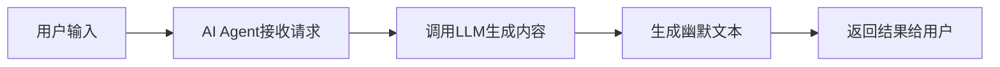
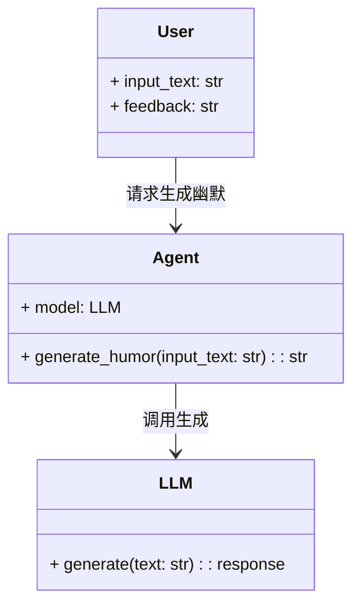
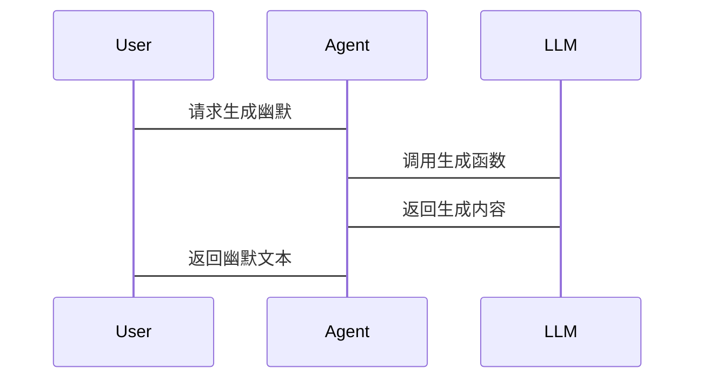

                 


# LLM驱动的AI Agent幽默感生成

## 关键词
- LLM (Large Language Model)
- AI Agent
- Humor Generation
- NLP
- Machine Learning

## 摘要
本书系统地探讨了利用大语言模型（LLM）驱动的AI代理（AI Agent）进行幽默感生成的原理、方法和应用。通过深入分析幽默生成的核心要素，结合LLM和AI Agent的技术特点，本书详细介绍了从算法原理到系统实现的全过程，为读者提供了理论与实践相结合的全面指导。书中不仅涵盖幽默生成的背景与意义，还通过具体的项目实战和系统架构设计，展示了如何构建一个高效的幽默生成系统，并在高级主题部分探讨了幽默生成的伦理和优化策略。

---

# 第1章: 背景介绍

## 1.1 幽默感生成的背景与意义
### 1.1.1 幽默感的定义与重要性
幽默是人类独特的社交能力，它不仅能够拉近人与人之间的距离，还能在教育、娱乐、营销等领域发挥重要作用。随着人工智能技术的发展，幽默生成已成为人机交互领域的重要研究方向。

### 1.1.2 LLM与AI Agent在幽默生成中的作用
大语言模型（LLM）具有强大的文本生成能力，而AI Agent则能够根据用户需求，实时调用这些模型生成幽默内容。这种结合使得幽默生成更加智能化和个性化。

### 1.1.3 幽默生成的挑战与机遇
幽默生成的挑战在于如何理解不同语境下的幽默感，而机遇则在于AI技术的进步为幽默生成提供了新的可能性。

## 1.2 问题背景与目标
### 1.2.1 幽默生成的核心问题
幽默生成的核心问题在于如何在特定语境下，生成符合预期的幽默内容，同时避免冒犯用户或偏离主题。

### 1.2.2 LLM驱动的AI Agent的优势
LLM驱动的AI Agent能够实时分析用户需求，动态生成幽默内容，具有高度的灵活性和适应性。

### 1.2.3 问题的边界与外延
幽默生成的边界包括语言的理解与生成，而外延则涉及跨文化交流、多模态幽默生成等领域。

## 1.3 核心概念与联系
### 1.3.1 LLM与AI Agent的关系
通过调用LLM，AI Agent能够生成幽默内容，并根据用户反馈不断优化生成结果。

### 1.3.2 幽默生成的核心要素
包括语境理解、幽默元素的识别与生成、个性化风格的匹配等。

### 1.3.3 实体关系图
```mermaid
er
  actor: 用户
  agent: AI Agent
  model: LLM
  function: 幽默生成函数
  relation: 调用
  actor --> agent: 请求生成幽默
  agent --> model: 调用LLM生成内容
  agent --> function: 执行生成函数
```

---

# 第2章: 核心概念与联系

## 2.1 LLM与AI Agent的工作原理
### 2.1.1 LLM的基本原理
大语言模型通过大量的文本训练，掌握了语言的分布规律，能够生成连贯且符合语境的文本。

### 2.1.2 AI Agent的功能与结构
AI Agent通过接收用户输入，调用LLM生成内容，并根据反馈优化生成结果。

### 2.1.3 两者的协同关系
LLM为AI Agent提供生成能力，而AI Agent则为LLM提供目标导向的应用场景。

## 2.2 幽默生成的算法原理
### 2.2.1 基于LLM的生成机制
通过LLM的文本生成能力，结合特定的幽默规则，生成符合预期的幽默内容。

### 2.2.2 AI Agent的推理过程
AI Agent根据用户需求，分析语境，生成幽默内容，并实时调整生成策略。

### 2.2.3 生成结果的评估方法
通过幽默度评分、用户反馈等方式，评估生成内容的质量。

## 2.3 实体关系图
```mermaid
er
  actor: 用户
  agent: AI Agent
  model: LLM
  function: 幽默生成函数
  relation: 调用
  actor --> agent: 请求生成幽默
  agent --> model: 调用LLM生成内容
  agent --> function: 执行生成函数
```

---

# 第3章: 算法原理讲解

## 3.1 幽默生成的算法流程
### 3.1.1 基于LLM的生成流程


## 3.2 算法实现代码
```python
def generate_humor(input_text):
    # 调用LLM生成内容
    response = model.generate(input_text)
    return response['choices'][0]['text']
```

## 3.3 数学模型与公式
### 3.3.1 熵的计算
$$H = -\sum p(x) \log p(x)$$

### 3.3.2 疑问的困惑度
$$\text{困惑度} = \frac{1}{N}\sum_{i=1}^{N} \log p(x_i)$$

---

# 第4章: 系统分析与架构设计

## 4.1 问题场景介绍
### 4.1.1 项目背景
随着AI技术的发展，幽默生成已成为人机交互的重要方向。

## 4.2 项目介绍
### 4.2.1 系统功能设计
- 用户输入：接收用户的幽默生成请求
- 生成功能：调用LLM生成幽默内容
- 反馈机制：根据用户反馈优化生成策略

## 4.3 系统架构设计
### 4.3.1 领域模型


## 4.4 系统架构设计
### 4.4.1 系统架构图
```mermaid
graph TD
    User --> Agent: 请求生成幽默
    Agent --> LLM: 调用生成函数
    LLM --> Agent: 返回生成内容
    Agent --> User: 返回幽默文本
```

## 4.5 系统接口设计
### 4.5.1 接口定义
- 输入接口：用户输入文本
- 输出接口：生成的幽默文本

## 4.6 系统交互设计
### 4.6.1 交互流程图


---

# 第5章: 项目实战

## 5.1 环境安装
### 5.1.1 安装Python
```bash
python --version
pip install --upgrade pip
```

### 5.1.2 安装LLM库
```bash
pip install transformers
pip install openai
```

## 5.2 核心代码实现
### 5.2.1 导入必要的库
```python
from transformers import AutoModelForCausalLM, AutoTokenizer
import openai
```

### 5.2.2 定义生成函数
```python
def generate_humor(input_text):
    model = AutoModelForCausalLM.from_pretrained('gpt2')
    tokenizer = AutoTokenizer.from_pretrained('gpt2')
    inputs = tokenizer.encode(input_text, return_tensors='np')
    outputs = model.generate(inputs, max_length=50, do_sample=True)
    return tokenizer.decode(outputs[0], skip_special_tokens=True)
```

## 5.3 代码应用解读与分析
### 5.3.1 代码功能解析
上述代码定义了一个生成幽默的函数，通过GPT-2模型生成幽默内容。

### 5.3.2 代码优化建议
可以尝试不同的模型或参数设置，以优化生成效果。

## 5.4 实际案例分析
### 5.4.1 案例一
用户输入：“为什么猫总是盯着鱼缸里的鱼？”
生成输出：“因为它想告诉鱼，缸外的世界更精彩！”

### 5.4.2 案例二
用户输入：“如何让大象通过门？”
生成输出：“把大象变成大象的腿，然后一步步通过门！”

## 5.5 项目小结
通过实际案例分析，可以发现生成的幽默内容既有创意，又符合语境。

---

# 第6章: 高级主题与最佳实践

## 6.1 高级主题
### 6.1.1 幽默生成的伦理问题
避免生成冒犯性内容，确保生成内容的合规性。

### 6.1.2 用户反馈机制
通过用户反馈不断优化生成策略。

## 6.2 最佳实践
### 6.2.1 小结
幽默生成需要结合语境和用户需求，不断优化生成策略。

### 6.2.2 注意事项
注意内容的合规性，避免生成不当内容。

### 6.2.3 拓展阅读
推荐阅读相关领域的论文和文献，深入了解幽默生成的最新研究。

---

# 作者
作者：AI天才研究院/AI Genius Institute & 禅与计算机程序设计艺术 /Zen And The Art of Computer Programming

