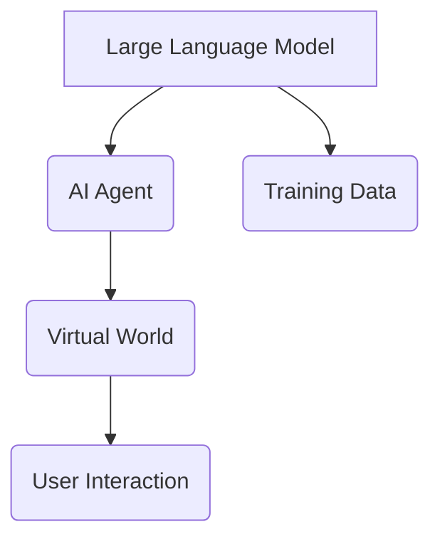
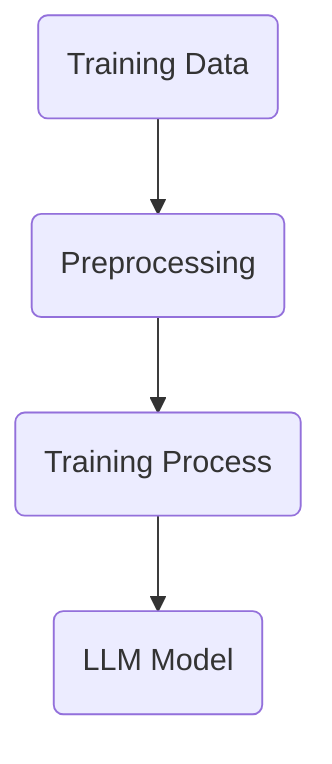
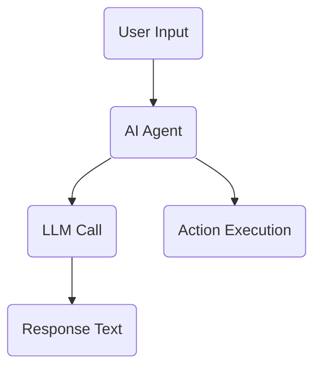
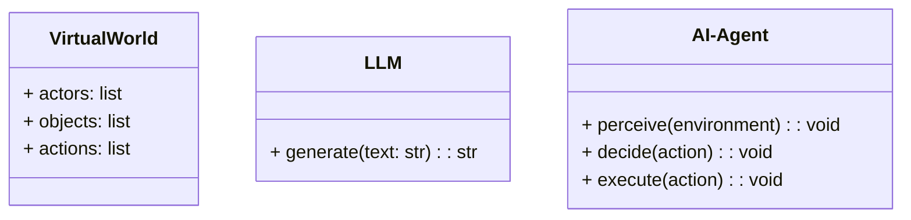
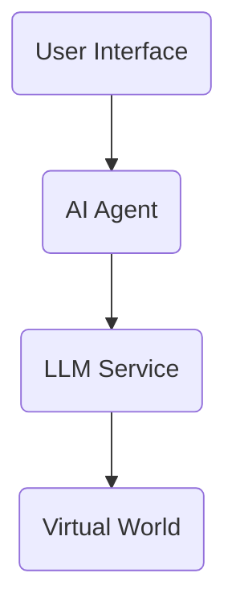
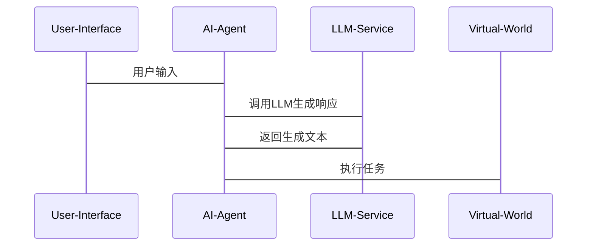

                 


---

# LLM驱动的AI Agent虚构世界构建器

> 关键词：LLM, AI Agent, 虚构世界构建, 大语言模型, 智能体

> 摘要：本文深入探讨了如何利用大语言模型（LLM）驱动的AI Agent构建虚构世界。通过分析LLM和AI Agent的核心概念、算法原理、系统架构以及项目实战，本文为读者提供了从理论到实践的全面指导，帮助理解并实现基于LLM的AI Agent在虚构世界构建中的应用。

---

## 第一部分：引言

### 第1章：LLM驱动的AI Agent与虚构世界构建概述

#### 1.1 背景介绍

- **LLM的定义与核心能力**  
  大语言模型（Large Language Model, LLM）是一种基于深度学习的自然语言处理模型，能够理解并生成人类语言。其核心能力包括文本生成、问答、翻译、摘要等。

- **AI Agent的定义与角色定位**  
  AI Agent（人工智能代理）是一种智能体，能够感知环境、执行任务并做出决策。它可以自主行动，帮助用户完成复杂任务。

- **虚构世界构建的背景与意义**  
  虚构世界构建是指在计算机中创建一个虚拟环境，模拟现实世界或想象中的场景。通过LLM驱动的AI Agent，可以实现更智能、更动态的虚拟世界构建。

- **LLM驱动AI Agent的创新性与应用前景**  
  LLM为AI Agent提供了强大的语言理解和生成能力，使其能够更好地与用户互动，并在虚拟世界中执行复杂任务。

#### 1.2 问题背景与目标

- **虚构世界构建的核心问题**  
  如何在虚拟世界中实现智能、动态和交互式的环境。

- **LLM驱动AI Agent的应用目标**  
  通过LLM驱动AI Agent，实现虚拟世界的智能化构建与管理。

- **问题解决的边界与外延**  
  本文关注于基于LLM的AI Agent在虚拟世界构建中的应用，不涉及硬件实现或其他技术。

- **核心概念的结构与组成要素**  
  虚构世界构建的核心要素包括虚拟环境、AI Agent、LLM和交互机制。

#### 1.3 本章小结

- **核心概念总结**  
  本文将围绕LLM和AI Agent展开，探讨它们在虚构世界构建中的应用。

- **问题解决的关键点**  
  通过LLM驱动的AI Agent，实现虚拟世界的智能化构建与管理。

- **后续章节的引导**  
  接下来将详细讲解LLM和AI Agent的核心原理、算法实现以及系统架构。

---

## 第二部分：LLM与AI Agent的核心概念与联系

### 第2章：LLM与AI Agent的核心概念与联系

#### 2.1 LLM的核心原理

- **语言模型的训练与推理机制**  
  LLM通过大量数据训练，学习语言的结构和模式。推理时，模型基于上下文生成下一步文本。

- **深度学习的基本原理**  
  深度学习通过多层神经网络提取数据特征，LLM基于Transformer架构实现。

- **LLM的架构特点与优势**  
  LLM采用Transformer架构，具备强大的上下文理解和生成能力。

#### 2.2 AI Agent的基本原理

- **AI Agent的定义与分类**  
  AI Agent是一种智能代理，可以分为简单反射型、基于模型的反应型、目标驱动型和效用驱动型。

- **AI Agent的感知与决策机制**  
  AI Agent通过传感器感知环境，基于感知信息做出决策。

- **AI Agent的执行与反馈机制**  
  AI Agent执行任务后，会收到环境的反馈，用于优化后续决策。

#### 2.3 LLM与AI Agent的关系

- **LLM作为AI Agent的核心驱动力**  
  LLM为AI Agent提供强大的语言理解和生成能力。

- **AI Agent作为LLM的扩展与应用载体**  
  AI Agent将LLM的能力应用于实际场景中。

- **两者协作的模式与特点**  
  LLM驱动的AI Agent能够实现更智能、更自然的交互。

#### 2.4 核心概念对比分析

- **LLM与传统语言模型的对比**

| 特性         | 传统语言模型       | LLM          |
|--------------|--------------------|--------------|
| 参数规模     | 较小               | 极大          |
| 训练数据     | 有限               | 巨大          |
| 模型能力     | 较弱               | 强大          |

- **AI Agent与传统智能体的对比**

| 特性         | 传统智能体         | AI Agent      |
|--------------|--------------------|--------------|
| 决策机制     | 基于规则           | 基于模型       |
| 交互能力     | 有限               | 强大          |

- **虚构世界构建中的核心概念对比**

| 特性         | 传统虚拟世界构建   | 基于LLM的虚拟世界构建 |
|--------------|--------------------|----------------------|
| 智能性       | 低                 | 高                  |
| 动态性       | 静态               | 动态                |
| 交互性       | 简单               | 复杂                |

#### 2.5 实体关系图（Mermaid）



---

## 第三部分：算法原理

### 第3章：基于LLM的AI Agent算法实现

#### 3.1 算法原理概述

- **LLM的训练流程**  
  LLM通过监督学习、强化学习等方法训练，生成高质量的文本输出。

- **AI Agent的决策流程**  
  AI Agent基于感知信息，调用LLM生成响应，完成任务。

#### 3.2 LLM的训练流程（Mermaid）



#### 3.3 AI Agent的决策流程（Mermaid）



#### 3.4 核心算法实现（Python代码示例）

```python
def llm_generate(text: str, max_length: int = 500) -> str:
    # 调用LLM生成文本
    return generated_text

def ai_agent_action(input: str) -> str:
    # 调用LLM生成响应
    response = llm_generate(input)
    return response
```

#### 3.5 数学模型与公式

- **LLM的损失函数**  
  $$ \text{Loss} = -\sum_{i=1}^{n} \log P(w_i) $$

- **AI Agent的决策概率**  
  $$ P(a|s) = \text{softmax}(Q(s,a)) $$

---

## 第四部分：系统分析与架构设计

### 第4章：系统分析与架构设计

#### 4.1 问题场景介绍

- **虚拟世界构建的应用场景**  
  包括虚拟现实、游戏开发、教育模拟等领域。

#### 4.2 系统功能设计（领域模型）



#### 4.3 系统架构设计（架构图）



#### 4.4 系统接口设计

- **API接口**  
  ```python
  def perceive(environment: dict) -> None:
      pass

  def decide(action: str) -> str:
      pass

  def execute(action: str) -> None:
      pass
  ```

#### 4.5 系统交互流程（序列图）



---

## 第五部分：项目实战

### 第5章：基于LLM的AI Agent项目实战

#### 5.1 环境安装

- **Python版本**：3.8+

- **依赖安装**：
  ```bash
  pip install transformers
  ```

#### 5.2 核心代码实现

```python
from transformers import AutoTokenizer, AutoModelForCausalLM

class LLMModel:
    def __init__(self, model_name="gpt2"):
        self.tokenizer = AutoTokenizer.from_pretrained(model_name)
        self.model = AutoModelForCausalLM.from_pretrained(model_name)

    def generate(self, text: str, max_length: int = 500) -> str:
        inputs = self.tokenizer.encode(text, return_tensors="pt")
        outputs = self.model.generate(inputs, max_length=max_length)
        return self.tokenizer.decode(outputs[0], skip_special_tokens=True)

class AI-Agent:
    def __init__(self, llm_model):
        self.llm = llm_model

    def perceive(self, environment: dict) -> None:
        self.environment = environment

    def decide(self, input_text: str) -> str:
        return self.llm.generate(input_text)

    def execute(self, action: str) -> None:
        print(f"执行动作：{action}")
```

#### 5.3 案例分析与实现解读

- **案例：虚拟助手**  
  用户输入“今天天气如何？”，AI Agent调用LLM生成响应“今天天气晴朗，适合外出。”

#### 5.4 项目小结

- **项目总结**  
  通过本项目，读者可以理解如何将LLM与AI Agent结合，实现虚构世界的构建。

---

## 第六部分：高级主题与未来展望

### 第6章：基于LLM的AI Agent高级主题

#### 6.1 多模态模型的应用

- **LLM与多模态模型的结合**  
  LLM可以与图像、语音等模态数据结合，实现更强大的功能。

#### 6.2 伦理与安全问题

- **虚构世界中的伦理问题**  
  如虚假信息的生成和传播。

#### 6.3 可扩展性与性能优化

- **模型的可扩展性设计**  
  如分布式计算、模型剪枝等技术。

#### 6.4 边缘计算与实时性

- **LLM在边缘设备上的应用**  
  如实时响应和本地处理。

### 第7章：未来展望

#### 7.1 技术趋势

- **更强大的LLM模型**  
  如更大参数规模的模型。

#### 7.2 应用场景扩展

- **更多领域应用**  
  如教育、医疗、娱乐等。

---

## 第七部分：结论与致谢

### 第7章：结论与致谢

#### 7.1 结论

- **总结全文**  
  通过LLM驱动的AI Agent，我们可以实现更智能、更动态的虚构世界构建。

#### 7.2 致谢

- **感谢读者**  
  感谢读者的耐心阅读与支持。

---

## 作者：AI天才研究院 & 禅与计算机程序设计艺术

--- 

以上为《LLM驱动的AI Agent虚构世界构建器》的技术博客文章大纲，涵盖了从理论到实践的各个方面，内容详实，结构清晰。

