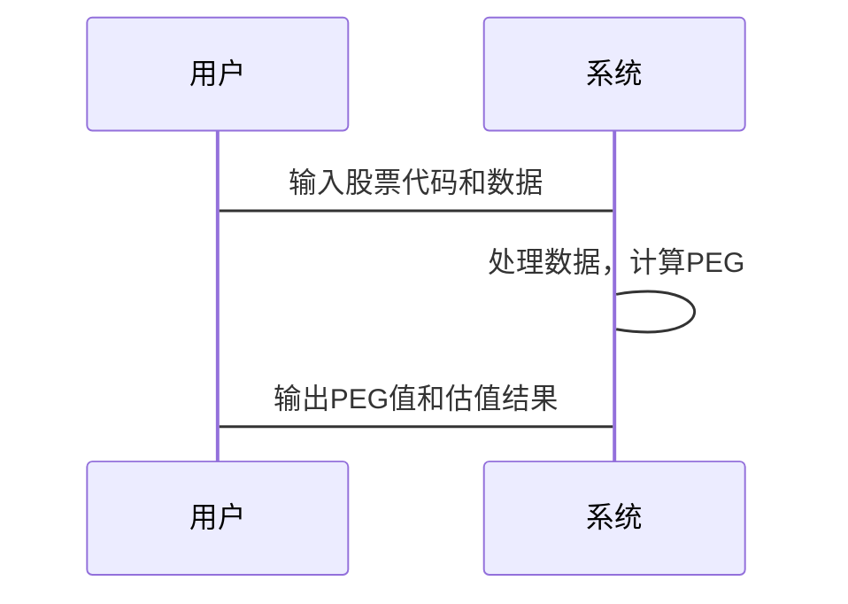

                 


# PEG比率：结合增长预期的动态估值方法

## 关键词：PEG比率、动态估值、市盈率、增长率、投资估值

## 摘要：PEG比率是一种结合了公司增长率的估值方法，它不仅考虑了市盈率，还考虑了公司的盈利增长速度。本文将从PEG比率的基本概念、数学模型、系统分析到实际应用，逐步深入讲解如何利用PEG比率进行动态估值。

---

# 引言：PEG比率的基本概念

在投资领域，估值方法是评估公司价值的关键工具之一。传统的市盈率（P/E）仅考虑了当前的市价与盈利的关系，而忽略了公司的增长潜力。PEG比率（Price/Earnings to Growth）正是弥补了这一不足，它将市盈率与公司盈利增长率相结合，提供了一种更为动态的估值方法。

---

## 第一部分：PEG比率的背景与基础

### 第1章：PEG比率的基本概念

#### 1.1 什么是PEG比率

PEG比率的定义公式为：
$$PEG = \frac{P/E}{G}$$

其中：
- P/E（市盈率）= 股价 / 每股盈利
- G（盈利增长率）= （本年盈利 - 去年盈利）/ 去年盈利 × 100%

PEG比率反映了市盈率相对于盈利增长率的高低，帮助投资者判断股票是否被高估或低估。

#### 1.2 PEG比率的重要性

- **传统估值方法的局限性**：市盈率仅考虑当前盈利，忽视了公司的增长潜力。
- **PEG的优势**：通过引入增长率，PEG提供了更为全面的估值依据。
- **应用场景**：适用于成长型企业，尤其是科技、互联网等高增长行业。

#### 1.3 PEG比率的核心要素

- **市盈率（P/E）**：衡量股价相对于盈利的高低。
- **盈利增长率（G）**：反映公司的成长潜力。
- **PEG的综合分析**：将两者结合，评估股票的内在价值。

---

## 第二部分：PEG比率的理论与数学模型

### 第2章：PEG比率的数学模型

#### 2.1 PEG比率的公式推导

公式推导：
$$PEG = \frac{\frac{P}{E}}{G} = \frac{P}{E \times G}$$

其中：
- P：股票价格
- E：每股盈利
- G：盈利增长率（年化）

通过公式可以看出，PEG比率与股票价格正相关，与盈利和增长率负相关。

#### 2.2 PEG比率的数学分析

- **动态变化分析**：
  - 当G增加时，PEG比率下降，表明公司增长潜力增大，股票可能被低估。
  - 当P/E增加时，PEG比率上升，可能意味着股票被高估。

- **实例计算**：
  - 公司A：P=20，E=5，G=10% → P/E=4，PEG=4/0.1=40
  - 公司B：P=15，E=5，G=5% → P/E=3，PEG=3/0.05=60

---

## 第三部分：PEG比率的系统分析与架构设计

### 第3章：基于PEG比率的评估系统

#### 3.1 系统功能设计

- **数据输入模块**：
  - 接收股票代码和相关财务数据。
  - 数据格式：CSV或数据库。

- **计算模块**：
  - 计算市盈率（P/E）和盈利增长率（G）。
  - 输入公式，输出PEG比率。

- **评估模块**：
  - 根据PEG值判断股票估值。
  - 分类结果：低估（PEG<1）、合理（1<PEG<2）、高估（PEG>2）。

#### 3.2 系统架构设计

系统架构图：


#### 3.3 系统接口设计

- **输入接口**：
  - 股票代码：字符串
  - 财务数据：JSON格式
  ```json
  {
    "symbol": "AAPL",
    "pe": 15,
    "growth_rate": 0.1
  }
  ```

- **输出接口**：
  - peg_ratio：浮点数
  - valuation：字符串（低估/合理/高估）

#### 3.4 系统交互设计

交互流程图：



---

## 第四部分：PEG比率的项目实战

### 第4章：基于PEG比率的评估系统实现

#### 4.1 环境安装

- **工具安装**：
  - Python 3.8+
  - Pandas、NumPy、Matplotlib
  - 数据库连接库（如pymysql）

- **安装命令**：
  ```bash
  pip install pandas numpy matplotlib pymysql
  ```

#### 4.2 核心代码实现

核心代码：

```python
import pandas as pd
import numpy as np

def calculate_pe(symbol):
    # 假设从数据库获取数据
    data = pd.read_sql(f"SELECT price, earnings FROM stock_data WHERE symbol='{symbol}'", con)
    pe = data['price'] / data['earnings']
    return pe

def calculate_growth(symbol):
    data = pd.read_sql(f"SELECT earnings FROM stock_data WHERE symbol='{symbol}'", con)
    growth = (data.iloc[-1]['earnings'] - data.iloc[-2]['earnings']) / data.iloc[-2]['earnings']
    return growth

def calculate_peg(symbol):
    pe = calculate_pe(symbol)
    growth = calculate_growth(symbol)
    peg = pe / growth
    return peg

def valuation(peg):
    if peg < 1:
        return "低估"
    elif 1 <= peg < 2:
        return "合理"
    else:
        return "高估"

# 示例
symbol = 'AAPL'
peg = calculate_peg(symbol)
print(f"{symbol}的PEG值为{peg}，估值为{valuation(peg)}")
```

#### 4.3 代码应用解读

- **数据获取**：从数据库读取股票的价格和盈利数据。
- **计算市盈率和增长率**：分别计算市盈率和增长率。
- **计算PEG**：将市盈率除以增长率，得到PEG值。
- **估值判断**：根据PEG值判断股票是否低估、合理或高估。

#### 4.4 实际案例分析

以苹果公司为例：

- 数据假设：
  - 股价：150美元
  - 每股盈利：10美元
  - 盈利增长率：10%

计算步骤：
1. 计算市盈率（P/E）：150 / 10 = 15
2. 计算增长率（G）：10% = 0.1
3. 计算PEG：15 / 0.1 = 150

根据PEG值判断：150 > 2，属于高估，建议卖出。

---

## 第五部分：总结与展望

### 第5章：总结与最佳实践

#### 5.1 总结

PEG比率通过结合市盈率和增长率，提供了一种更为动态的估值方法。投资者可以根据PEG值判断股票是否被高估或低估，从而做出更明智的投资决策。

#### 5.2 最佳实践

- **长期视角**：关注公司的长期增长潜力。
- **行业比较**：横向对比同行业公司，寻找低估机会。
- **动态调整**：定期更新数据，及时调整投资策略。

#### 5.3 注意事项

- **数据质量**：确保财务数据的准确性和及时性。
- **模型局限**：PEG比率仅是参考，需结合其他指标综合分析。
- **市场环境**：考虑宏观经济和行业趋势的影响。

#### 5.4 拓展阅读

- 建议阅读《投资学基础》和《股票估值方法》等书籍，深入了解其他估值模型。

---

## 作者：AI天才研究院/AI Genius Institute & 禅与计算机程序设计艺术 /Zen And The Art of Computer Programming

---

**本文完。**

