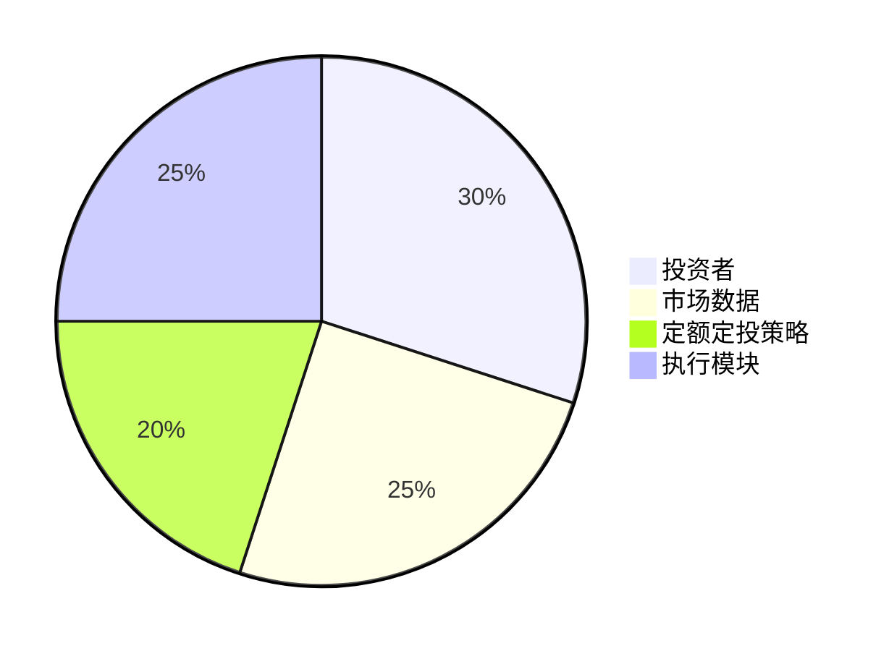

                 

# Dollar-Cost Averaging：在波动市场中的优势

> 关键词：Dollar-Cost Averaging（定额定投）、投资策略、波动市场、风险管理、长期投资

> 摘要：本文深入探讨了Dollar-Cost Averaging（定额定投）作为一种投资策略在波动市场中的优势。通过数学模型、算法分析、系统设计和实战案例，本文揭示了定额定投如何通过平滑成本曲线、分散风险和抓住市场低点机会，帮助投资者在波动市场中实现稳健收益。

---

## 第一部分：Dollar-Cost Averaging概述

### 第1章：Dollar-Cost Averaging的基本概念

#### 1.1 投资市场的波动性与风险
##### 1.1.1 市场波动性的定义
市场的波动性指的是资产价格在短时间内频繁变化的特性。波动性高的市场意味着价格波动剧烈，投资者面临更大的风险和不确定性。

##### 1.1.2 市场波动对投资者的影响
市场波动可能导致投资者的决策失误，例如恐慌性抛售或贪婪性追涨。此外，波动性高的市场通常伴随着更高的交易成本和更大的风险管理难度。

##### 1.1.3 投资者在波动市场中的行为模式
许多投资者在市场波动时倾向于频繁交易，试图通过短期波动获利。然而，这种行为往往会导致交易成本增加和投资回报下降。

#### 1.2 Dollar-Cost Averaging的定义与特点
##### 1.2.1 定额定投的定义
Dollar-Cost Averaging（定额定投）是一种投资策略，投资者定期投入固定金额，不论市场价格如何波动。这种方法通过分批买入，摊低成本，从而减少市场波动对投资组合的影响。

##### 1.2.2 定额定投的核心特点
- **定期投资**：投资者按照固定的频率（如每月、每季度）投资固定金额。
- **分散成本**：通过多次投资，平均每次投资的成本，降低整体投资的平均成本。
- **逆向投资**：在市场下跌时，定额定投可以增加持仓，低位布局，抓住市场低估机会。

##### 1.2.3 定额定投与传统投资策略的区别
与一次性投资相比，定额定投通过分批投资，降低了市场波动对投资组合的影响，同时避免了集中投资的风险。

#### 1.3 定额定投在波动市场中的优势
##### 1.3.1 平滑成本曲线
通过定期投资，投资者可以在市场高点和低点分别买入，从而摊低成本，降低整体投资成本。

##### 1.3.2 抓住市场低点机会
在市场下跌时，定额定投可以自动增加投资金额，低位布局，抓住市场低估的机会。

##### 1.3.3 分散投资风险
定额定投通过分批投资，避免了集中投资的风险，降低了市场波动对整体投资组合的影响。

---

## 第二部分：Dollar-Cost Averaging的核心概念与数学模型

### 第2章：Dollar-Cost Averaging的核心概念

#### 2.1 定额定投的数学模型
##### 2.1.1 平均成本计算公式
假设投资者每期投入固定金额 $A$，价格分别为 $P_1, P_2, \ldots, P_n$，则总投入金额为 $n \times A$，总购买数量为 $\sum_{i=1}^{n} \frac{A}{P_i}$。平均成本 $C$ 可以表示为：
$$
C = \frac{\sum_{i=1}^{n} \frac{A}{P_i}}{n \times A} = \frac{1}{\frac{\sum_{i=1}^{n} \frac{1}{P_i}}{n}}
$$

##### 2.1.2 平均成本曲线
通过绘制价格与投资金额的关系图，可以看到平均成本随着投资金额的增加逐渐下降，尤其是在市场低点时，平均成本下降更快。

##### 2.1.3 平均成本的优化
通过动态调整投资金额和频率，可以进一步优化平均成本，提升投资收益。

#### 2.2 定额定投的优化算法
##### 2.2.1 动态调整投资频率
根据市场波动情况，动态调整投资频率，例如在市场波动加剧时增加投资频率。

##### 2.2.2 根据市场波动调整投资金额
在市场下跌时，增加投资金额，抓住低估机会；在市场上涨时，减少投资金额，规避风险。

##### 2.2.3 结合技术指标优化定投策略
结合技术指标（如均线、RSI等）优化定投策略，进一步提升投资效果。

---

## 第三部分：Dollar-Cost Averaging的系统架构设计

### 第3章：Dollar-Cost Averaging的系统架构

#### 3.1 系统功能设计
##### 3.1.1 投资者信息管理
- 投资者账户管理
- 风险承受能力评估

##### 3.1.2 投资金额与频率设置
- 定期定额投资设置
- 动态调整投资参数

##### 3.1.3 市场数据采集与分析
- 实时市场数据采集
- 市场波动性分析

##### 3.1.4 定额定投策略执行
- 自动化投资执行
- 投资记录与跟踪

#### 3.2 系统架构图

#### 3.3 系统接口设计
##### 3.3.1 投资者接口
- 用户界面：设置投资参数、查看投资记录
- API接口：获取市场数据、调整投资策略

##### 3.3.2 数据接口
- 数据源：市场数据接口
- 数据处理：数据清洗与分析

##### 3.3.3 策略接口
- 策略引擎：执行定额定投策略
- 策略优化：调整投资参数

---

## 第四部分：Dollar-Cost Averaging的实战案例分析

### 第4章：Dollar-Cost Averaging的实战案例

#### 4.1 案例背景介绍
##### 4.1.1 市场环境分析
假设在2022年，全球市场经历了剧烈波动，某投资者选择在该期间采用定额定投策略，每月投入1000美元，投资标的为标普500指数基金。

##### 4.1.2 投资者目标与风险偏好
- 投资目标：长期资本增值
- 风险偏好：中低风险，注重稳健投资

#### 4.2 定额定投策略的实施
##### 4.2.1 确定投资金额与频率
- 每月投入1000美元，连续投资12个月

##### 4.2.2 设定止损与止盈机制
- 止损：市场下跌10%，减少投资金额
- 止盈：市场上涨20%，锁定部分收益

##### 4.2.3 监控市场波动并调整策略
- 定期评估市场波动情况
- 动态调整投资金额和频率

#### 4.3 实战案例的分析与总结
##### 4.3.1 投资结果对比
通过对比定额定投与一次性投资的收益，可以发现定额定投在波动市场中表现更优。

##### 4.3.2 策略优化建议
- 结合市场趋势动态调整投资策略
- 优化投资组合分散风险

##### 4.3.3 经验与教训
- 定额定投在市场波动中表现稳健
- 需要动态调整策略以应对市场变化

---

## 第五部分：结论与最佳实践

### 第5章：结论与最佳实践

#### 5.1 结论
Dollar-Cost Averaging（定额定投）是一种有效的投资策略，尤其适合在波动市场中降低投资风险，平滑投资成本，抓住市场低点机会。

#### 5.2 最佳实践
- **分散投资**：通过定额定投分散投资风险，避免集中投资
- **长期持有**：保持长期投资视角，避免频繁交易
- **动态调整**：根据市场波动动态优化投资策略

#### 5.3 投资建议
- 定期评估投资组合，根据市场变化调整策略
- 结合技术分析和基本面分析优化投资决策
- 保持理性投资，避免情绪化交易

---

## 作者：AI天才研究院/AI Genius Institute & 禅与计算机程序设计艺术 /Zen And The Art of Computer Programming

---

以上是《Dollar-Cost Averaging：在波动市场中的优势》的技术博客文章。通过系统的分析和实战案例，本文揭示了定额定投在波动市场中的优势和应用，为投资者提供了有益的参考和建议。

