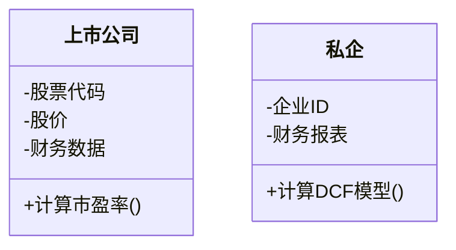
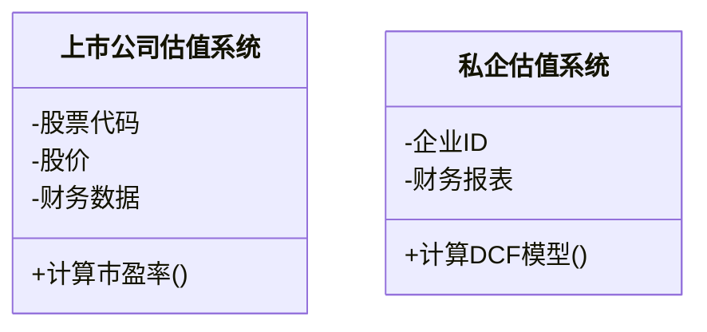

                 

# 上市公司估值方法与私企估值的区别

> 关键词：上市公司估值、私企估值、估值方法、DCF模型、市盈率、市净率

> 摘要：本文详细探讨了上市公司与私企在估值方法上的区别，从核心概念、估值原理、数学模型、系统架构等多个维度进行深入分析。通过对比上市公司和私企的估值方法，揭示了两者在数据来源、方法适用性、风险因素等方面的差异，并通过实际案例分析和数学模型展示，帮助读者更好地理解如何选择合适的估值方法。

---

# 第一部分：背景与核心概念

## 第1章：背景与核心概念

### 1.1 问题背景与描述

#### 1.1.1 企业估值的重要性
企业在市场中的价值评估是投资决策的核心依据。无论是上市公司还是私企，准确的估值都能帮助投资者和管理层做出明智的决策。然而，由于两者在信息公开度、流动性等方面存在显著差异，其估值方法也有所不同。

#### 1.1.2 上市公司与私企估值的区别
- **信息公开性**：上市公司财务数据公开透明，私企数据往往非公开。
- **流动性**：上市公司股票可以在公开市场上自由交易，私企股权流动性较差。
- **投资者基础**：上市公司通常有更多外部投资者，私企主要依赖内部资金或少数机构投资者。

### 1.2 核心概念与定义

#### 1.2.1 上市公司估值的核心要素
- **市盈率（P/E）**：衡量股价与每股收益的比例。
- **市净率（P/B）**：衡量股价与每股净资产的比例。
- **企业价值倍数（EV/EBITDA）**：综合考虑企业价值的指标。
- **现金流折现法（DCF）**：通过未来现金流折现计算企业价值。

#### 1.2.2 私企估值的核心要素
- **资产基础法**：基于企业账面价值进行估值。
- **收益法（DCF模型）**：通过未来现金流折现计算企业价值。
- **市场法**：通过对比可比交易进行估值。

#### 1.2.3 两者的核心区别与联系
- **区别**：上市公司数据透明，估值方法多样；私企数据不透明，依赖DCF模型。
- **联系**：两者都以财务数据为基础，都需要考虑未来现金流和风险因素。

### 1.3 本章小结
本章通过对比上市公司和私企的估值背景，明确了两者的核心概念和区别，为后续分析奠定了基础。

---

# 第二部分：上市公司估值方法的核心原理

## 第2章：上市公司估值方法的核心原理

### 2.1 主流上市公司估值方法

#### 2.1.1 市盈率法（P/E）
- **公式**：$$ P/E = \frac{Share\ Price}{Earnings\ Per\ Share} $$
- **应用场景**：适用于盈利稳定的公司。
- **案例**：苹果公司2023年的市盈率约为20倍。

#### 2.1.2 市净率法（P/B）
- **公式**：$$ P/B = \frac{Share\ Price}{Book\ Value\ Per\ Share} $$
- **应用场景**：适用于金融和房地产企业。

#### 2.1.3 企业价值倍数（EV/EBITDA）
- **公式**：$$ EV = \frac{Market\ Cap + Debt - Cash}{EBITDA} $$
- **应用场景**：适用于资本密集型行业。

#### 2.1.4 现金流折现法（DCF）
- **公式**：$$ NPV = \sum_{t=1}^{n} \frac{CF_t}{(1 + r)^t} + \frac{TV}{(1 + r)^n} $$
- **应用场景**：适用于长期现金流预测准确的公司。

### 2.2 上市公司估值的关键因素

#### 2.2.1 财务指标分析
- 利润能力（ROE、ROA）、成长能力（收入增长率）、偿债能力（资产负债率）。

#### 2.2.2 市场流动性
- 市场流动性越高，估值越容易受市场情绪影响。

#### 2.2.3 行业特性
- 高成长行业（如科技）与低成长行业（如公用事业）估值方法不同。

### 2.3 本章小结
本章详细介绍了上市公司的四种主流估值方法及其应用场景，并分析了影响上市公司估值的关键因素。

---

# 第三部分：私企估值方法的核心原理

## 第3章：私企估值方法的核心原理

### 3.1 私企估值的主要方法

#### 3.1.1 资产基础法
- **原理**：基于企业账面价值进行估值。
- **公式**：$$ Book\ Value = Total\ Assets - Total\ Liabilities $$
- **应用场景**：适用于资产密集型私企。

#### 3.1.2 收益法（DCF模型）
- **原理**：通过未来现金流折现计算企业价值。
- **公式**：$$ Terminal\ Value = \frac{FCFF \times (1 + g)}{WACC} $$
- **应用场景**：适用于高成长性私企。

#### 3.1.3 市场法（可比交易法）
- **原理**：通过对比可比交易的估值倍数进行调整。
- **公式**：$$ Enterprise\ Value = Multiple \times EBITDA $$

### 3.2 私企估值的关键因素

#### 3.2.1 财务健康度
- 利润能力、现金流、资产负债结构。

#### 3.2.2 企业治理结构
- 股权结构、管理团队能力。

#### 3.2.3 未来增长潜力
- 市场前景、技术壁垒、竞争优势。

### 3.3 本章小结
本章详细介绍了私企的三种主要估值方法及其应用场景，并分析了影响私企估值的关键因素。

---

# 第四部分：上市公司估值与私企估值的对比分析

## 第4章：上市公司估值与私企估值的对比分析

### 4.1 核心区别与对比表格

| 评估维度      | 上市公司估值                | 私企估值                  |
|---------------|-----------------------------|---------------------------|
| 数据来源       | 公开的财务报表和市场数据    | 非公开的财务报表和内部数据 |
| 估值方法       | 多种方法（P/E、P/B、EV/EBITDA） | 以DCF模型为主             |
| 流动性         | 高                         | 低                       |
| 信息透明度     | 高                         | 低                       |
| 风险因素       | 市场风险、行业风险          | 经营风险、财务风险        |

### 4.2 实体关系图（ER图）

### 4.3 本章小结
本章通过对比分析，明确了上市公司和私企在估值方法、数据来源、流动性等方面的区别，并通过ER图展示了两者的核心关系。

---

# 第五部分：估值方法的数学模型与公式

## 第5章：估值方法的数学模型与公式

### 5.1 上市公司估值的数学模型

#### 5.1.1 市盈率公式
$$ P/E = \frac{Share\ Price}{Earnings\ Per\ Share} $$

#### 5.1.2 现金流折现模型
$$ NPV = \sum_{t=1}^{n} \frac{CF_t}{(1 + r)^t} + \frac{TV}{(1 + r)^n} $$

### 5.2 私企估值的数学模型

#### 5.2.1 DCF模型
$$ Terminal\ Value = \frac{FCFF \times (1 + g)}{WACC} $$

### 5.3 本章小结
本章通过数学公式展示了上市公司和私企估值的核心模型，帮助读者更好地理解估值方法的原理。

---

# 第六部分：系统分析与架构设计方案

## 第6章：系统分析与架构设计方案

### 6.1 问题场景介绍

#### 6.1.1 上市公司估值系统
- **功能**：实时计算市盈率、市净率等指标。
- **数据来源**：公开市场数据。

#### 6.1.2 私企估值系统
- **功能**：基于DCF模型计算企业价值。
- **数据来源**：内部财务报表。

### 6.2 系统功能设计

### 6.3 本章小结
本章通过系统架构图展示了上市公司和私企估值系统的功能设计，明确了两者在数据来源和功能上的差异。

---

# 结语

上市公司和私企在估值方法上存在显著差异，主要体现在数据来源、方法适用性和流动性等方面。理解这些差异有助于投资者和企业管理者选择合适的估值方法，做出更明智的决策。

---

# 作者：AI天才研究院/AI Genius Institute & 禅与计算机程序设计艺术 /Zen And The Art of Computer Programming

