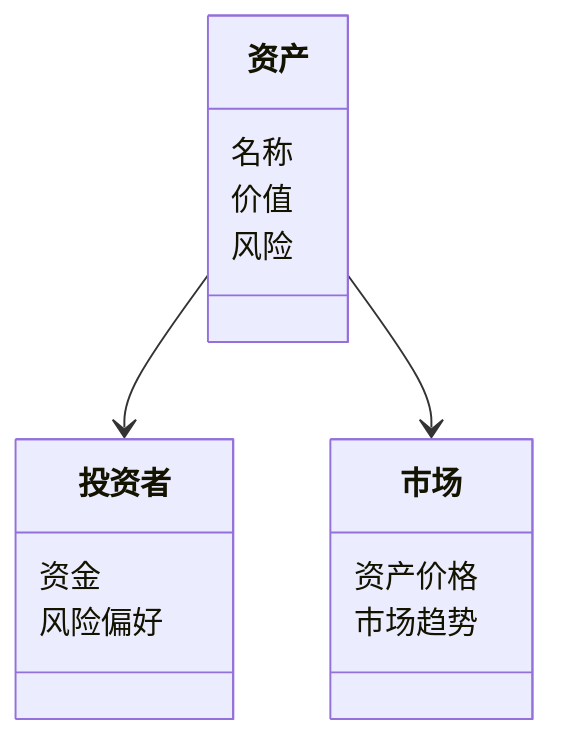
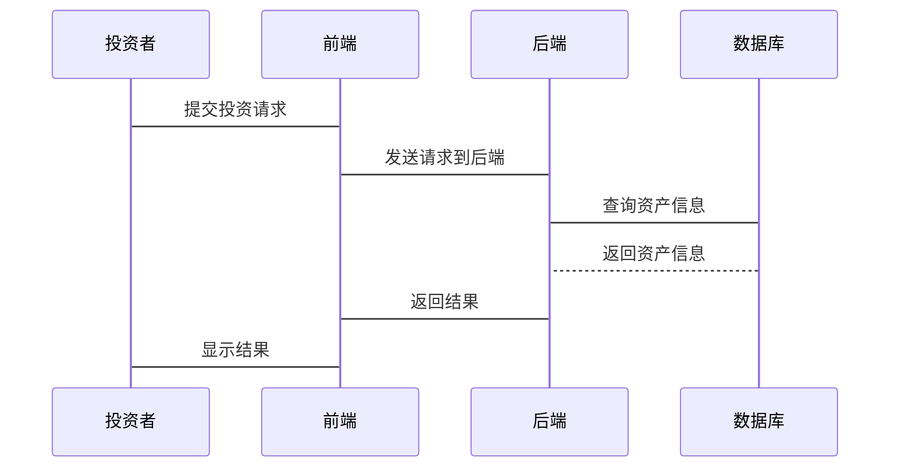

                 


---

# 不良资产投资：高风险高回报的特殊机会

**关键词**：不良资产投资、高风险、高回报、特殊机会、投资策略、风险管理、数学模型

**摘要**：不良资产投资是一种高风险高回报的投资方式，涉及对存在问题的资产进行分析和重组。本文将详细介绍不良资产的定义、分类、投资策略、数学模型、系统架构及实际案例，帮助读者理解如何在高风险中寻找高回报的机会。

---

## 第1章：不良资产投资的背景与概念

### 1.1 不良资产的定义与分类

#### 1.1.1 不良资产的定义
不良资产是指无法正常产生收益或存在重大问题的资产，如违约的贷款、破产企业的股权等。这些资产通常具有较高的风险，但潜在回报也较高。

#### 1.1.2 不良资产的分类
- **流动性风险**：资产难以迅速变现。
- **信用风险**：资产可能无法收回本金和利息。
- **市场风险**：市场波动可能影响资产价值。

### 1.2 不良资产投资的背景

#### 1.2.1 经济周期与不良资产
经济周期波动可能导致企业或个人无法偿还债务，从而产生不良资产。

#### 1.2.2 金融危机与不良资产
金融危机往往导致大量不良资产的产生，如2008年全球金融危机后的次贷危机。

#### 1.2.3 不良资产市场的现状
当前，不良资产市场存在大量机会，但竞争激烈，需要专业知识和技能。

### 1.3 不良资产投资的高风险与高回报

#### 1.3.1 不良资产投资的风险
- **市场风险**：资产价值可能大幅波动。
- **信用风险**：债务人可能无法偿还债务。
- **操作风险**：投资过程中的错误可能导致损失。

#### 1.3.2 不良资产投资的回报
- **高回报潜力**：通过重组或转售实现高收益。
- **市场溢价**：不良资产的价格可能低于其实际价值，存在升值空间。

#### 1.3.3 风险与回报的平衡
投资者需要在风险和回报之间找到平衡，制定合理的投资策略。

### 1.4 不良资产投资的边界与外延

#### 1.4.1 不良资产投资的边界
- **法律边界**：遵守相关法律法规。
- **市场边界**：关注市场趋势和政策变化。

#### 1.4.2 不良资产投资的外延
- **资产类型**：包括贷款、债券、股权等多种形式。
- **投资方式**：通过购买、重组、转售等方式进行投资。

#### 1.4.3 不良资产投资与其他投资方式的对比
- **股票投资**：高风险高回报，但流动性好。
- **债券投资**：相对稳定，但回报较低。
- **房地产投资**：高流动性，但受市场影响大。

---

## 第2章：不良资产投资的核心概念与联系

### 2.1 不良资产的核心要素

#### 2.1.1 资产的流动性
流动性差的资产难以迅速变现，增加了投资风险。

#### 2.1.2 资产的信用风险
债务人无法偿还债务的风险直接影响资产价值。

#### 2.1.3 资产的市场价值
市场波动可能导致资产价值的大幅变化。

### 2.2 不良资产市场的结构

#### 2.2.1 不良资产市场的参与方
- **投资者**：购买不良资产的个人或机构。
- **中介机构**：如律师、会计师等，协助交易完成。
- **监管机构**：制定和执行相关法规。

#### 2.2.2 不良资产市场的交易流程
1. 资产评估：确定资产价值。
2. 资产购买：投资者购买不良资产。
3. 资产重组：对资产进行重组或转售。
4. 收益实现：通过出售或债务重组获得收益。

#### 2.2.3 不良资产市场的价格形成机制
- **拍卖定价**：通过拍卖确定价格。
- **协议定价**：与债务人协商确定价格。
- **市场定价**：根据市场供需关系确定价格。

### 2.3 不良资产与传统投资的对比

#### 2.3.1 不良资产与股票投资的对比
- **风险**：股票投资风险较高，但流动性好。
- **回报**：潜在回报高，但波动大。

#### 2.3.2 不良资产与债券投资的对比
- **风险**：债券风险较低，但回报有限。
- **回报**：相对稳定，但增长潜力小。

#### 2.3.3 不良资产与房地产投资的对比
- **风险**：房地产投资受市场影响大，流动性差。
- **回报**：潜在回报高，但周期长。

### 2.4 不良资产投资的系统性分析

#### 2.4.1 不良资产投资的系统性风险
- **经济周期**：整体经济波动影响资产价值。
- **政策变化**：法规变化可能影响投资收益。

#### 2.4.2 不良资产投资的非系统性风险
- **个体风险**：特定资产或债务人的问题。
- **操作风险**：投资过程中的错误或失误。

#### 2.4.3 不良资产投资的风险管理
- **分散投资**：通过多样化减少风险。
- **风险评估**：使用数学模型评估潜在风险。

---

## 第3章：不良资产投资的数学模型与算法原理

### 3.1 不良资产定价模型

#### 3.1.1 不良资产定价的基本原理
通过分析资产的内在价值和市场价值，确定其合理价格。

#### 3.1.2 不良资产定价的数学公式
$$ V = \alpha \times D + \beta \times R $$
其中，V为资产价值，D为债务，R为资产的残值。

#### 3.1.3 不良资产定价的案例分析
假设某不良贷款的债务为100万元，残值为20万元，α=0.8，β=0.2，则资产价值为：
$$ V = 0.8 \times 100 + 0.2 \times 20 = 80 + 4 = 84 \text{万元} $$

### 3.2 不良资产风险评估模型

#### 3.2.1 风险评估的基本原理
通过分析资产的信用风险和市场风险，评估其潜在损失。

#### 3.2.2 风险评估的数学公式
$$ R = \sigma \times Z $$
其中，σ为标准差，Z为标准正态分布变量。

#### 3.2.3 风险评估的案例分析
某资产的标准差为15%，Z值为-1，则风险评估为：
$$ R = 0.15 \times (-1) = -0.15 \text{或} 15\% \text{的风险} $$

### 3.3 不良资产投资组合优化

#### 3.3.1 投资组合优化的基本原理
通过优化资产配置，降低整体风险，提高回报。

#### 3.3.2 投资组合优化的数学公式
$$ max \mu \quad s.t. \quad \sigma \leq \text{风险容忍度} $$
其中，μ为期望回报，σ为投资组合的标准差。

#### 3.3.3 投资组合优化的案例分析
假设投资者有100万元可用于投资，选择两个资产A和B，分别的期望回报和标准差为：
- 资产A：μ=10%，σ=15%
- 资产B：μ=15%，σ=20%
通过优化，确定投资比例，以达到期望的风险和回报。

---

## 第4章：不良资产投资的系统分析与架构设计

### 4.1 问题场景介绍
投资者需要一个系统来分析和管理不良资产投资。

### 4.2 系统功能设计

#### 4.2.1 领域模型


### 4.3 系统架构设计

#### 4.3.1 系统架构图


#### 4.3.2 系统交互图


### 4.4 系统接口设计
- **前端**：提供用户界面，展示资产信息和投资结果。
- **后端**：处理复杂的计算和逻辑。
- **数据库**：存储资产和交易数据。
- **API**：与其他系统集成，获取市场数据。

---

## 第5章：不良资产投资的项目实战

### 5.1 环境安装
安装Python和相关库（如scikit-learn、pandas）。

### 5.2 核心实现代码
```python
import pandas as pd
from sklearn.linear_model import LinearRegression

# 数据加载
data = pd.read_csv('assets.csv')

# 模型训练
model = LinearRegression()
model.fit(data[['债务', '残值']], data['价值'])

# 预测
预测价值 = model.predict([[100, 20]])
print(预测价值)
```

### 5.3 代码应用解读
代码使用线性回归模型预测资产价值，帮助投资者做出决策。

### 5.4 实际案例分析
分析某不良贷款的投资回报，使用模型预测其价值，并制定投资策略。

---

## 第6章：不良资产投资的最佳实践

### 6.1 小结
不良资产投资需要专业知识和技能，通过科学的方法和系统支持，可以实现高回报。

### 6.2 注意事项
- **风险评估**：避免过度冒险。
- **合规性**：遵守相关法律法规。
- **持续学习**：关注市场变化和新策略。

### 6.3 扩展阅读
- **书籍**：《投资学基础》
- **网站**：金融行业资讯平台
- **课程**：不良资产投资在线课程

---

## 作者信息

作者：AI天才研究院/AI Genius Institute & 禅与计算机程序设计艺术 /Zen And The Art of Computer Programming

---

这篇文章通过详细分析不良资产投资的各个方面，帮助读者理解其高风险高回报的本质，并提供了实际的操作指南和系统设计，为投资者提供了有价值的参考。

