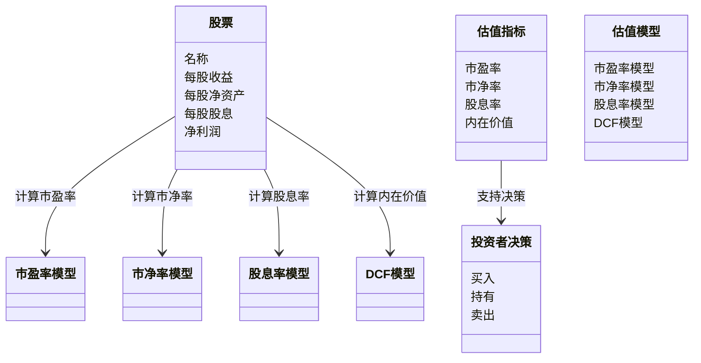
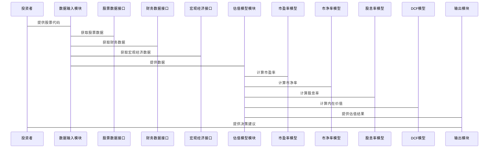

                 


# 香港股市估值:国际金融中心的市场特点

## 关键词：
香港股市，估值，国际金融中心，市盈率，市净率，DCF模型，宏观经济因素

## 摘要：
本文深入探讨了中国香港股市的估值方法及其作为国际金融中心的独特市场特点。通过分析宏观经济因素、行业基本面和市场情绪等关键因素，结合具体的估值模型和案例，揭示了香港股市估值的独特性。文章从背景介绍到系统分析，再到项目实战，全面解析了如何在国际金融市场中准确评估香港股市的价值。

---

## 第一部分: 香港股市估值的背景与基础

### 第1章: 香港股市的背景与发展

#### 1.1 香港股市的历史与发展

##### 1.1.1 香港股市的起源与发展
香港股市的历史可以追溯到19世纪末，随着香港成为英国的殖民地，金融市场逐渐发展起来。1910年，香港交易所成立，标志着香港股市的正式诞生。20世纪初，香港股市经历了多次波动，但随着二战后香港经济的快速发展，股市规模迅速扩大。1984年，香港交易所正式成立，进一步推动了香港股市的国际化进程。

##### 1.1.2 香港作为国际金融中心的地位
香港的地理位置使其成为连接中国内地与国际市场的桥梁。作为国际金融中心，香港拥有完善的金融市场体系、严格的法律法规和高效的金融服务，吸引了大量国际投资者。香港股市不仅是亚洲重要的资本市场，也是全球投资者配置资产的重要渠道。

##### 1.1.3 香港股市的特点与优势
香港股市具有多元化的投资者结构、高效的市场运行机制和严格的监管体系。与内地股市相比，香港股市更国际化，投资者结构多元化，上市公司行业分布广泛，尤其是金融和地产行业占据了重要地位。

---

### 第2章: 股市估值的基本概念与方法

#### 2.1 股市估值的核心概念

##### 2.1.1 估值的定义与意义
估值是指对股票内在价值的估算，是投资者判断股票是否具有投资价值的重要依据。准确的估值可以帮助投资者做出合理的投资决策，避免盲目跟风。

##### 2.1.2 股票价值的决定因素
股票价值主要由公司基本面、行业环境、宏观经济因素和市场情绪等决定。基本面包括盈利能力、财务状况、成长潜力等；行业环境包括行业竞争格局和未来发展趋势；宏观经济因素包括利率、汇率和经济周期等；市场情绪则影响短期价格波动。

##### 2.1.3 估值的基本原理与框架
估值的基本原理是通过分析公司的未来现金流，结合适当的折现率，计算其内在价值。常用的估值框架包括相对估值法和绝对估值法，相对估值法基于可比公司的指标，绝对估值法基于DCF模型等。

#### 2.2 主要估值方法概述

##### 2.2.1 市盈率（P/E）估值法
市盈率=股价/每股收益。该指标反映了市场对公司盈利能力的评价。市盈率越低，可能意味着股价被低估。但市盈率的适用性因行业而异，例如高增长行业可能市盈率较高。

##### 2.2.2 市净率（P/B）估值法
市净率=股价/每股净资产。该指标适用于净资产较多的行业，如银行和地产行业。市净率低于1可能表示股价被低估。

##### 2.2.3 股息率估值法
股息率=每股股息/股价。高股息率的股票通常被视为收益稳定的蓝筹股，但需注意公司是否有持续派息的能力。

##### 2.2.4 内在价值法（DCF模型）
DCF模型通过预测公司未来自由现金流，使用适当的折现率（如加权平均资本成本）将其折现为现值，进而估算公司股权价值。公式如下：

$$
\text{股权价值} = \sum_{t=1}^{n} \frac{\text{FCF}_t}{(1 + r)^t} + \frac{\text{残值}}{(1 + r)^n}
$$

---

### 第3章: 香港股市的独特性与市场特点

#### 3.1 香港股市的国际化特征

##### 3.1.1 多元化的投资者结构
香港股市的投资者结构包括机构投资者、散户和海外投资者。多元化的投资者结构使得市场更加成熟，但也可能导致市场波动性较大。

##### 3.1.2 中资企业的影响
随着中国内地企业的国际化，越来越多的中资企业选择在香港上市，这使得香港股市的行业分布更加多元化，尤其是科技和金融行业。

##### 3.1.3 离岸人民币市场的关联
香港是离岸人民币的主要市场，人民币的国际化使得香港股市与内地市场的关联性进一步增强，但也面临汇率波动的风险。

#### 3.2 香港股市的行业分布与权重

##### 3.2.1 金融行业的主导地位
香港作为国际金融中心，金融行业在股市中占据重要地位，尤其是银行和保险行业。金融行业的表现对整体市场有较大影响。

##### 3.2.2 地产行业的特殊性
香港的地产行业受到政策调控和市场供需的影响较大。高房价和严格的限购政策可能导致地产股的波动性较大。

##### 3.2.3 新经济行业的崛起
近年来，科技、互联网和新能源等新经济行业在香港股市中逐渐崛起，成为推动市场增长的新动力。

---

### 第4章: 影响港股估值的关键因素

#### 4.1 宏观经济因素

##### 4.1.1 利率与货币政策
利率水平直接影响企业的融资成本和股市的流动性。低利率环境通常会推高股价，而高利率则可能导致股价下跌。

##### 4.1.2 汇率波动的影响
人民币升值会降低香港股市的相对吸引力，而贬值则可能吸引更多外资流入。

##### 4.1.3 宏观经济指标对估值的影响
GDP增速、通胀率和失业率等宏观经济指标会直接影响市场的信心和估值。

#### 4.2 行业与公司基本面因素

##### 4.2.1 公司盈利能力与成长性
净利润率、ROE和营收增长率等指标是评估公司基本面的重要指标。高成长性的公司通常具有更高的估值。

##### 4.2.2 财务健康状况分析
通过分析资产负债表、利润表和现金流量表，评估公司的财务健康状况。例如，高负债率可能增加公司的财务风险。

##### 4.2.3 行业竞争格局与前景
行业集中度、竞争壁垒和未来增长潜力是评估行业基本面的重要因素。垄断行业的公司通常具有更强的定价权和竞争优势。

#### 4.3 市场情绪与行为因素

##### 4.3.1 投资者情绪对估值的影响
市场情绪通常通过技术分析来衡量，例如成交量、股价波动率等指标。情绪化交易可能导致股价短期偏离其内在价值。

##### 4.3.2 市场流动性与波动性
市场流动性直接影响股价的波动性。在高流动性市场中，股价波动较小，而在低流动性市场中，股价波动较大。

##### 4.3.3 媒体与市场情绪的关系
媒体报道和社交媒体上的信息可能会影响投资者情绪，进而影响市场估值。

---

### 第5章: 香港股市估值的国际比较

#### 5.1 美国股市与香港股市的对比

##### 5.1.1 市场结构与参与者
美国股市市场结构成熟，参与者多元化，机构投资者占比高。香港股市同样多元化，但更多受到亚洲市场的影响。

##### 5.1.2 估值方法与差异
美国股市通常使用DCF模型等绝对估值法，而香港股市更多使用市盈率和市净率等相对估值法。

##### 5.1.3 市场波动性与稳定性
美国股市波动性较低，市场稳定性较强，而香港股市波动性较大，受政策和地缘政治影响较多。

#### 5.2 其他主要股市的比较

##### 5.2.1 欧洲股市的特点
欧洲股市行业分布较为分散，金融和能源行业占据重要地位。欧洲市场的估值受欧元区经济和政治环境影响较大。

##### 5.2.2 日本股市的特殊性
日本股市受老龄化和低增长的影响，估值通常较低，市盈率和市净率指标较为保守。

##### 5.2.3 其他新兴市场的特点
新兴市场的估值通常较高，波动性较大，但增长潜力也较大。与香港股市相比，新兴市场更受经济周期的影响。

---

## 第二部分: 香港股市估值的核心模型与实践

### 第6章: 香港股市估值的核心模型

#### 6.1 常用估值模型介绍

##### 6.1.1 市盈率模型
公式：
$$
\text{目标股价} = \text{目标P/E} \times \text{每股收益}
$$

##### 6.1.2 市净率模型
公式：
$$
\text{目标股价} = \text{目标P/B} \times \text{每股净资产}
$$

##### 6.1.3 股息率模型
公式：
$$
\text{目标股价} = \frac{\text{每股股息}}{\text{目标股息率}}
$$

##### 6.1.4 DCF模型
公式：
$$
\text{股权价值} = \sum_{t=1}^{n} \frac{\text{FCF}_t}{(1 + r)^t} + \frac{\text{残值}}{(1 + r)^n}
$$

---

### 第7章: 香港股市估值的系统分析与架构设计

#### 7.1 问题场景介绍
投资者需要对香港股市中的某只股票进行估值，以便做出投资决策。

#### 7.2 系统功能设计

##### 7.2.1 领域模型（Mermaid类图）


#### 7.3 系统架构设计

##### 7.3.1 系统架构（Mermaid架构图）
```mermaid
container 香港股市估值系统 {
    component 数据输入模块 {
        股票数据
        财务数据
        宏观经济数据
    }
    component 估值模型模块 {
        市盈率模型
        市净率模型
        股息率模型
        DCF模型
    }
    component 输出模块 {
        市盈率
        市净率
        股息率
        内在价值
        投资者决策建议
    }
}
```

#### 7.4 系统接口设计

##### 7.4.1 输入接口
- 股票数据接口：提供股票的基本信息，如名称、代码等。
- 财务数据接口：提供公司的财务数据，如净利润、每股收益等。
- 宏观经济接口：提供宏观经济数据，如利率、GDP增速等。

##### 7.4.2 输出接口
- 估值结果接口：输出市盈率、市净率、股息率和内在价值。
- 投资者建议接口：提供买入、持有或卖出的决策建议。

#### 7.5 系统交互设计

##### 7.5.1 系统交互流程（Mermaid序列图）


---

### 第8章: 项目实战

#### 8.1 环境安装
- 安装Python和必要的库（如pandas、numpy、scipy）
- 安装Mermaid和Latex工具

#### 8.2 核心实现

##### 8.2.1 Python代码实现
```python
import pandas as pd
import numpy as np

# 示例数据
data = {
    '股票代码': ['HK001', 'HK002', 'HK003'],
    '每股收益': [1.5, 2.0, 1.2],
    '每股净资产': [5.0, 3.5, 4.0],
    '每股股息': [0.5, 0.8, 0.6]
}

df = pd.DataFrame(data)

# 市盈率模型
df['市盈率'] = df['股价'] / df['每股收益']
# 市净率模型
df['市净率'] = df['股价'] / df['每股净资产']
# 股息率模型
df['股息率'] = df['每股股息'] / df['股价']
```

#### 8.3 代码应用解读与分析
通过上述代码，我们可以计算出每只股票的市盈率、市净率和股息率，进而判断其估值是否合理。例如，若某股票的市盈率为10，而行业平均水平为15，则该股票可能被低估。

#### 8.4 实际案例分析
以香港某银行为例，假设其每股收益为1.8，股价为20港元，则市盈率为11.11。若行业平均市盈率为12，则该银行的市盈率较低，可能具有投资价值。

#### 8.5 项目小结
通过实战项目，我们掌握了如何利用Python和估值模型对香港股市中的股票进行估值，并能够根据估值结果做出投资决策。

---

## 第三部分: 香港股市估值的最佳实践

### 第9章: 小结与注意事项

#### 9.1 小结
本文从背景介绍到系统分析，再到项目实战，全面解析了香港股市估值的核心方法和实践技巧。通过分析宏观经济因素、行业基本面和市场情绪等关键因素，结合具体的估值模型和案例，揭示了香港股市估值的独特性。

#### 9.2 注意事项
- 估值模型仅供参考，实际投资需结合市场动态和公司具体情况。
- 需密切关注宏观经济和政策变化，及时调整估值策略。
- 投资者应具备风险意识，合理分散投资组合，避免过度集中。

### 第10章: 扩展阅读与学习资源

#### 10.1 扩展阅读
- 《投资学》（全球经典教材）
- 《价值投资入门》
- 《技术分析实战技巧》

#### 10.2 学习资源
- 网站：Yahoo Finance、Morningstar
- 工具：Excel、Python、R
- 书籍：《股市投资策略》、《估值的艺术》

---

## 作者：AI天才研究院/AI Genius Institute & 禅与计算机程序设计艺术/Zen And The Art of Computer Programming

---

通过以上结构，我们可以系统地分析和实践香港股市估值的核心方法和技巧，帮助投资者更好地理解和应用这些方法，做出更明智的投资决策。

