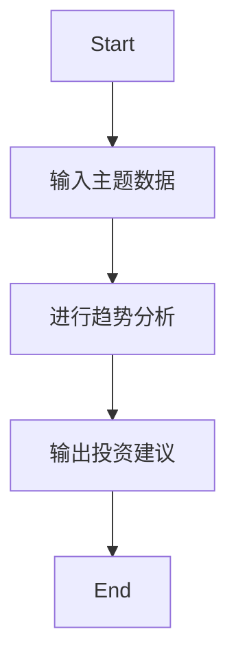
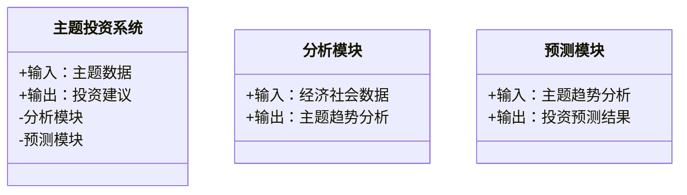
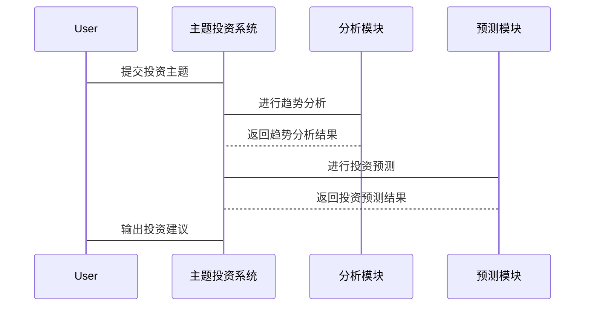

                 


# 主题投资：把握长期经济社会发展趋势

## 关键词：
主题投资、经济社会趋势、投资策略、风险管理、技术进步、政策分析

## 摘要：
本文深入探讨了主题投资的核心概念、方法论及其在把握长期经济社会发展趋势中的应用。通过分析科技、人口、政策等多重因素，结合数学模型和实际案例，为投资者提供系统化的投资框架和策略。文章还详细讲解了主题投资的风险管理、系统架构设计及未来展望。

---

## 第一部分: 主题投资的背景与核心概念

### 第1章: 主题投资的背景与定义

#### 1.1 什么是主题投资
- 1.1.1 投资的基本概念
  - 投资是将资源（资金、时间、精力）投入某个领域以获得未来收益的行为。
  - 投资的本质是通过分析未来的不确定性，找到高概率的收益机会。
- 1.1.2 主题投资的定义
  - 主题投资是一种基于长期经济社会发展趋势，选择具有持续增长潜力的主题（如人工智能、绿色能源、老龄化等）进行投资的策略。
  - 它强调对宏观趋势的洞察，而非单一资产或公司的分析。
- 1.1.3 主题投资与传统投资的区别
  | 方面       | 传统投资         | 主题投资         |
  |------------|------------------|------------------|
  | 投资对象   | 单一资产或公司   | 长期趋势主题     |
  | 分析方法   | 基本面分析       | 宏观趋势分析     |
  | 投资期限   | 中短期           | 长期             |
  | 风险分散   | 多样化           | 主题集中化       |

#### 1.2 主题投资的核心要素
- 1.2.1 长期经济社会发展趋势
  - 科技进步：人工智能、大数据、区块链等技术的快速发展。
  - 人口结构：老龄化、年轻化趋势对消费、医疗、教育等领域的影响。
  - 经济结构：从制造业向服务业转型，绿色经济、可持续发展成为主流。
- 1.2.2 主题的定义与分类
  - 技术驱动型主题：如人工智能、5G技术。
  - 社会需求型主题：如老龄化、医疗健康。
  - 政策驱动型主题：如绿色能源、碳中和。
- 1.2.3 主题投资的核心逻辑
  - 通过分析经济社会的长期趋势，找到具有持续增长潜力的主题。
  - 将主题分解为具体的产业链和细分领域，选择具有竞争优势的公司。

### 第2章: 主题投资的背景分析

#### 2.1 经济发展与主题投资的关系
- 2.1.1 经济周期对投资的影响
  - 经济周期分为复苏、繁荣、衰退、萧条四个阶段，不同阶段适合不同的投资主题。
  - 例如：繁荣期适合科技主题，衰退期适合防御性主题（如公用事业）。
- 2.1.2 新兴产业与经济结构转型
  - 新兴产业（如新能源、人工智能）成为经济增长的新驱动力。
  - 传统产业（如制造业）通过技术创新实现转型升级。
- 2.1.3 全球化与区域经济发展的机会
  - 全球化促进了跨国投资，不同地区的经济发展主题（如东南亚的工业化）为投资者提供了多样化选择。

#### 2.2 社会发展趋势与主题投资
- 2.2.1 人口结构变化
  - 老龄化社会推动医疗、养老产业的发展。
  - 人口年轻化推动教育、消费领域的需求增长。
- 2.2.2 技术进步与创新
  - 人工智能、大数据等技术推动产业升级和新商业模式的出现。
  - 创新能力强的公司更容易成为投资标的。
- 2.2.3 社会需求的变化
  - 环保意识增强推动绿色能源、可持续发展主题。
  - 健康意识提升推动医疗、健身产业的需求。

#### 2.3 政策环境对主题投资的影响
- 2.3.1 宏观政策与行业趋势
  - 政府政策（如碳中和目标）直接推动相关产业的发展。
  - 例如：中国提出“双碳”目标，推动绿色能源、新能源汽车等主题。
- 2.3.2 政府投资与产业政策
  - 政府投资（如新基建）为相关产业提供资金支持。
  - 产业政策（如税收优惠）直接刺激特定产业的发展。
- 2.3.3 国际政治经济环境
  - 国际贸易政策变化影响全球供应链布局。
  - 地缘政治风险可能影响特定主题（如半导体供应链）的投资。

### 第3章: 主题投资的核心概念与联系

#### 3.1 主题投资的数学模型
- 3.1.1 趋势分析模型
  $$ Trend = \sum_{i=1}^{n} w_i \cdot x_i $$
  其中，$w_i$ 是权重，$x_i$ 是影响趋势的因素。
  - 例如：分析人工智能产业的趋势时，权重可以分配给技术进步、政策支持、市场需求等因素。

- 3.1.2 风险评估模型
  $$ Risk = \sqrt{\sum_{i=1}^{m} (r_i - \mu)^2} $$
  其中，$r_i$ 是实际收益，$\mu$ 是预期收益。
  - 通过计算方差，评估特定主题的投资风险。

- 3.1.3 主题选择模型
  $$ ThemeSelection = \sum_{j=1}^{k} w_j \cdot ThemeFactor_j $$
  其中，$ThemeFactor_j$ 是主题的因子（如市场规模、增长潜力），$w_j$ 是权重。
  - 例如：选择绿色能源主题时，权重可以分配给市场规模、政策支持、技术进步等因素。

#### 3.2 主题投资的ER实体关系图
```mermaid
erd
  客户
    +--- ID
    +--- 投资金额
    +--- 投资主题

  主题
    +--- 主题ID
    +--- 主题名称
    +--- 主题描述

  趋势分析
    +--- 趋势ID
    +--- 趋势名称
    +--- 分析结果

  投资组合
    +--- 组合ID
    +--- 组合名称
    +--- 组合构成

  风险评估
    +--- 评估ID
    +--- 评估结果
    +--- 评估时间
```
- 通过ER图，展示主题投资中各实体之间的关系，包括客户、主题、趋势分析、投资组合和风险评估。

#### 3.3 主题投资的算法原理
- 3.3.1 算法流程

- 3.3.2 算法实现
```python
def theme_investment_analysis(theme_data):
    # 输入：theme_data，包含多个主题及其相关数据
    # 输出：投资建议
    for theme in theme_data:
        trend = calculate_trend(theme)
        risk = calculate_risk(theme)
        if trend > 0.7 and risk < 0.3:
            print(f"推荐投资主题：{theme}")
        else:
            print(f"不建议投资主题：{theme}")
    return

def calculate_trend(theme):
    # 计算主题的趋势
    factors = [theme['市场规模'], theme['增长潜力'], theme['政策支持']]
    weights = [0.5, 0.3, 0.2]
    trend = sum(factor * weight for factor, weight in zip(factors, weights))
    return trend

def calculate_risk(theme):
    # 计算主题的风险
    market_fluctuation = theme['市场波动']
    economic_dependence = theme['经济依赖度']
    risk = (market_fluctuation + economic_dependence) / 2
    return risk
```

### 第4章: 主题投资的系统分析与架构设计

#### 4.1 系统功能设计


#### 4.2 系统接口设计
- 数据接口：接收经济社会数据、主题信息等输入。
- 用户接口：用户输入投资主题，系统输出投资建议。
- 输出接口：输出投资建议、风险评估结果等。

#### 4.3 系统交互流程


## 第二部分: 主题投资的核心方法论

### 第5章: 主题投资的核心方法论

#### 5.1 投资框架的构建
- 5.1.1 确定投资主题
  - 从宏观趋势中选择具有持续增长潜力的主题。
  - 例如：绿色能源、人工智能、老龄化。
- 5.1.2 分析主题产业链
  - 将主题分解为上游、中游、下游，分析各环节的竞争优势。
  - 例如：人工智能产业链包括芯片制造、算法开发、应用场景。
- 5.1.3 选择投资标的
  - 根据产业链分析，选择具有竞争优势的公司。

#### 5.2 产业链分析与投资策略
- 5.2.1 产业链分析
  - 上游：技术、原材料等基础领域。
  - 中游：产品制造、服务提供等核心环节。
  - 下游：市场需求端。
- 5.2.2 投资策略
  - 选择具有技术优势的上游公司。
  - 选择市场占有率高的下游公司。

#### 5.3 政策影响与投资机会
- 5.3.1 政策分析
  - 分析政府政策对主题的影响。
  - 例如：碳中和政策推动绿色能源发展。
- 5.3.2 投资机会
  - 政策支持的行业更容易获得增长机会。

### 第6章: 风险管理与投资策略

#### 6.1 投资风险的来源
- 6.1.1 市场风险
  - 整体市场波动影响投资主题。
- 6.1.2 产业风险
  - 产业链中的某一环节出现问题影响整个主题。
- 6.1.3 政策风险
  - 政策变化可能影响主题的发展。

#### 6.2 风险管理策略
- 6.2.1 多样化投资
  - 将资金分配到多个相关主题中，分散风险。
- 6.2.2 定期评估
  - 定期重新评估投资主题的风险和收益，及时调整投资组合。
- 6.2.3 风险对冲
  - 使用衍生工具（如期权）对冲特定风险。

## 第三部分: 项目实战与案例分析

### 第7章: 项目实战

#### 7.1 环境安装
- 安装必要的开发工具和数据分析库。
  - Python、Pandas、NumPy、Matplotlib。

#### 7.2 系统核心实现源代码
- 以下是主题投资分析的Python代码示例：
```python
import pandas as pd
import numpy as np
import matplotlib.pyplot as plt

def load_data():
    # 加载经济社会数据
    data = pd.read_csv('economic_data.csv')
    return data

def calculate_trend(data):
    # 计算主题趋势
    trend = data['增长率'].mean()
    return trend

def plot_trend(data):
    # 绘制趋势图
    plt.plot(data['时间'], data['增长率'])
    plt.title('经济增长趋势')
    plt.xlabel('时间')
    plt.ylabel('增长率')
    plt.show()

def main():
    data = load_data()
    trend = calculate_trend(data)
    plot_trend(data)
    print(f"平均增长率：{trend}%")

if __name__ == "__main__":
    main()
```

#### 7.3 代码应用解读与分析
- 代码功能：
  - 加载经济社会数据。
  - 计算经济增长趋势。
  - 绘制趋势图。
- 应用场景：
  - 分析不同主题的经济增长趋势，帮助投资者选择具有增长潜力的主题。

### 第8章: 案例分析

#### 8.1 案例一：人工智能主题投资
- 背景：
  - 人工智能技术快速发展，应用场景广泛。
- 投资策略：
  - 投资上游芯片制造公司和下游应用公司。
- 案例分析：
  - 选择某人工智能芯片公司和某智能安防公司进行投资。

#### 8.2 案例二：绿色能源主题投资
- 背景：
  - 全球能源结构转型，绿色能源需求增加。
- 投资策略：
  - 投资光伏组件制造公司和储能技术公司。
- 案例分析：
  - 选择某光伏组件公司和某储能电池公司进行投资。

### 第9章: 项目小结

#### 9.1 项目总结
- 通过实际案例分析，验证了主题投资方法的有效性。
- 系统化的投资框架能够帮助投资者更好地把握长期趋势。

## 第四部分: 最佳实践与未来展望

### 第10章: 最佳实践

#### 10.1 投资建议
- 选择具有持续增长潜力的主题。
- 分散投资，降低风险。
- 定期评估，及时调整。

#### 10.2 小结
- 主题投资是一种基于长期趋势的投资策略。
- 投资者需要具备对经济社会趋势的深刻理解。

### 第11章: 未来展望

#### 11.1 技术进步与投资机会
- 人工智能、大数据等技术将继续推动产业升级。
- 新技术的出现将为投资者提供新的投资主题。

#### 11.2 经济社会变化对投资的影响
- 人口结构变化将继续影响医疗、养老等主题。
- 全球化与区域经济发展的不平衡将提供更多投资机会。

#### 11.3 投资者教育与风险管理
- 投资者需要不断提高自身的知识水平。
- 风险管理是投资成功的关键。

## 作者：AI天才研究院/AI Genius Institute & 禅与计算机程序设计艺术/Zen And The Art of Computer Programming

