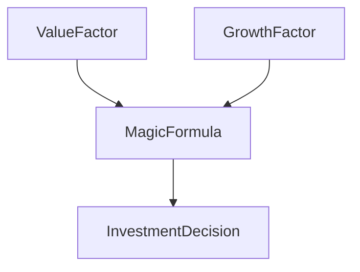
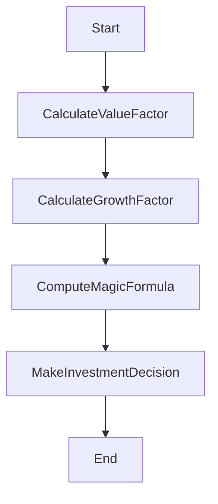
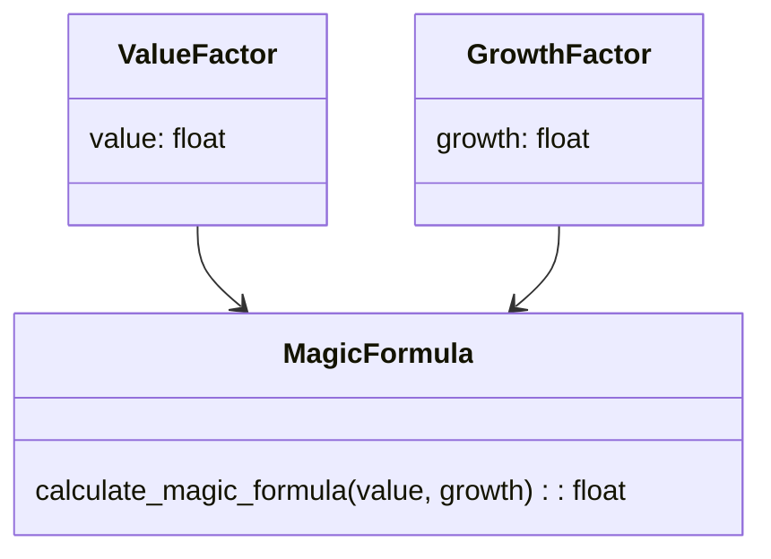

                 


# 《乔尔格林布拉特的魔术公式》

## 关键词：投资决策、价值因子、成长因子、量化投资、股票评估

## 摘要：  
《乔尔格林布拉特的魔术公式》是一本深入探讨投资决策的书籍，重点介绍了乔尔·格林布拉特提出的魔术公式，这是一种结合了价值因子和成长因子的量化投资方法。通过详细分析公式的核心原理、数学模型和实际应用，本书旨在帮助读者理解和应用这一经典的股票评估工具，从而在投资领域做出更明智的决策。

---

## 第一部分: 背景介绍

### 第1章: 魔术公式的起源与背景

#### 1.1 乔尔·格林布拉特及其投资理念
- **1.1.1 乔尔·格林布拉特的背景介绍**
  - 乔尔·格林布拉特是美国著名投资家，以其独特的投资理念闻名。
  - 他在《The New Finance: The Case for
    Fundamental Activist Investing》一书中提出了魔术公式。
  - 他倡导将基本面分析与量化方法相结合，寻找被市场低估的投资机会。

- **1.1.2 投资界的魔术公式理论**
  - 魔术公式是一种量化投资工具，旨在通过简单的数学模型评估企业的投资价值。
  - 它结合了企业的基本面数据，如盈利能力、成长性和估值指标，帮助投资者做出决策。

- **1.1.3 魔术公式的重要性**
  - 魔术公式为投资者提供了一种快速评估股票价值的方法。
  - 它简化了复杂的投资决策过程，使其更易于理解和应用。

#### 1.2 魔术公式的定义与核心思想
- **1.2.1 魔术公式的定义**
  - 魔术公式是一个用于评估企业投资价值的量化指标，由两部分组成：价值因子和成长因子。
  - 公式为：  
    $$ \text{魔术公式} = \frac{\text{价值因子}}{\text{成长因子}} $$

- **1.2.2 魔术公式的核心投资理念**
  - 价值因子：衡量企业的估值是否合理，避免高估或低估。
  - 成长因子：衡量企业的成长潜力，寻找具有可持续增长能力的企业。
  - 结合两者，魔术公式旨在找到估值合理且成长性良好的企业。

- **1.2.3 魔术公式在投资中的应用价值**
  - 作为投资决策的辅助工具，魔术公式帮助投资者筛选出具有潜力的股票。
  - 它特别适合用于价值投资和成长投资的结合，提供了一种平衡的风险控制方法。

---

## 第二部分: 核心概念与联系

### 第2章: 魔术公式的核心要素

#### 2.1 价值因子与成长因子
- **2.1.1 价值因子的定义与计算**
  - 价值因子衡量企业的估值水平，常用指标包括市盈率（P/E）和市净率（P/B）。
  - 计算公式：  
    $$ \text{价值因子} = \frac{\text{股价}}{\text{每股收益}} $$
    $$ \text{或} $$
    $$ \text{价值因子} = \frac{\text{股价}}{\text{每股净资产}} $$

- **2.1.2 成长因子的定义与计算**
  - 成长因子衡量企业的增长潜力，常用指标包括净利润增长率和收入增长率。
  - 计算公式：  
    $$ \text{成长因子} = \frac{\text{净利润增长率}}{\text{行业平均增长率}} $$

- **2.1.3 价值因子与成长因子的对比分析**
  - **价值因子**：关注企业的估值是否合理，避免高估或低估。
  - **成长因子**：关注企业的未来增长潜力，寻找具有持续盈利能力的企业。
  - 对比表格：
  | 指标 | 价值因子 | 成长因子 |
  |------|-----------|----------|
  | 定义 | 估值水平   | 增长潜力 |
  | 作用 | 避免高估   | 寻找潜力 |

#### 2.2 核心概念的ER实体关系图



---

## 第三部分: 算法原理讲解

### 第3章: 魔术公式算法的实现原理

#### 3.1 魔术公式算法的流程图



#### 3.2 魔术公式算法的Python实现

```python
def calculate_value_factor(price, earnings_per_share):
    return price / earnings_per_share

def calculate_growth_factor(net_income_growth, industry_growth):
    return net_income_growth / industry_growth

def magic_formula(price, earnings_per_share, net_income_growth, industry_growth):
    value_factor = calculate_value_factor(price, earnings_per_share)
    growth_factor = calculate_growth_factor(net_income_growth, industry_growth)
    return value_factor / growth_factor

# 示例
price = 50
earnings_per_share = 5
net_income_growth = 20
industry_growth = 10

result = magic_formula(price, earnings_per_share, net_income_growth, industry_growth)
print(f"魔术公式结果为：{result}")
```

#### 3.3 数学模型与公式解析

- **魔术公式的核心公式**：  
  $$ \text{魔术公式} = \frac{\text{价值因子}}{\text{成长因子}} $$
  $$ \text{价值因子} = \frac{\text{股价}}{\text{每股收益}} $$
  $$ \text{成长因子} = \frac{\text{净利润增长率}}{\text{行业平均增长率}} $$

- **实际应用案例**：
  - 假设某企业股价为 $50，每股收益为 $5，净利润增长率为 20%，行业平均增长率为 10%。
  - 计算结果：  
    $$ \text{价值因子} = \frac{50}{5} = 10 $$
    $$ \text{成长因子} = \frac{20}{10} = 2 $$
    $$ \text{魔术公式} = \frac{10}{2} = 5 $$

---

## 第四部分: 数学模型与公式分析

### 第4章: 魔术公式的数学模型与公式分析

#### 4.1 价值因子的数学模型
- **价值因子公式**：  
  $$ \text{价值因子} = \frac{\text{股价}}{\text{每股收益}} $$

- **实例分析**：
  - 股价：$100
  - 每股收益：$10
  - 计算：  
    $$ \text{价值因子} = \frac{100}{10} = 10 $$

#### 4.2 成长因子的数学模型
- **成长因子公式**：  
  $$ \text{成长因子} = \frac{\text{净利润增长率}}{\text{行业平均增长率}} $$

- **实例分析**：
  - 净利润增长率：30%
  - 行业平均增长率：15%
  - 计算：  
    $$ \text{成长因子} = \frac{30}{15} = 2 $$

#### 4.3 魔术公式的综合分析
- **综合公式**：  
  $$ \text{魔术公式} = \frac{\text{价值因子}}{\text{成长因子}} $$

- **实例分析**：
  - 价值因子：10
  - 成长因子：2
  - 计算：  
    $$ \text{魔术公式} = \frac{10}{2} = 5 $$

---

## 第五部分: 系统分析与架构设计

### 第5章: 魔术公式的系统分析与架构设计

#### 5.1 系统功能设计
- **领域模型**：  
  - 输入：股价、每股收益、净利润增长率、行业平均增长率。
  - 输出：魔术公式结果。



#### 5.2 系统架构设计
- **系统架构图**：  
  ```mermaid
  graph TD
      UI-->Input
      Input-->Processor
      Processor-->Output
  ```

---

## 第六部分: 项目实战

### 第6章: 项目实战与案例分析

#### 6.1 环境配置
- **Python环境**：安装必要的库（如pandas、numpy）。
- **数据来源**：使用Yahoo Finance获取股票数据。

#### 6.2 核心实现代码

```python
import pandas as pd
import numpy as np

def calculate_magic_formula(ticker):
    # 获取数据
    df = pd.DataFrame()
    df['Price'] = data['Close']
    df['Earnings_Per_Share'] = data['Earnings_Per_Share']
    df['Net_Income_Growth'] = data['Net_Income_Growth']
    df['Industry_Growth'] = data['Industry_Growth']

    # 计算价值因子和成长因子
    value_factor = df['Price'] / df['Earnings_Per_Share']
    growth_factor = df['Net_Income_Growth'] / df['Industry_Growth']
    magic_formula = value_factor / growth_factor

    return magic_formula.mean()

# 示例
calculate_magic_formula('AAPL')
```

#### 6.3 案例分析
- **案例：评估苹果公司（AAPL）的投资价值**：
  - 数据获取与处理：使用Yahoo Finance获取AAPL的历史数据。
  - 计算价值因子和成长因子。
  - 得出魔术公式结果，并分析AAPL的投资价值。

---

## 第七部分: 最佳实践与总结

### 第7章: 最佳实践与总结

#### 7.1 最佳实践
- **数据质量**：确保输入数据的准确性和完整性。
- **模型优化**：根据市场变化调整公式参数，提升模型的适用性。
- **风险管理**：结合其他指标（如市盈率、市净率）进行综合评估。

#### 7.2 小结
- 魔术公式是一种简单而有效的投资工具，能够帮助投资者快速评估企业的投资价值。
- 通过结合价值因子和成长因子，投资者可以找到估值合理且成长性良好的企业。

#### 7.3 注意事项
- 魔术公式只是一个辅助工具，投资决策需要结合市场环境和企业基本面进行综合判断。
- 避免过度依赖公式，忽视企业的行业地位和竞争优势。

#### 7.4 拓展阅读
- 《The New Finance: The Case for
  Fundamental Activist Investing》
- 《投资学原理》

---

## 作者：AI天才研究院/AI Genius Institute & 禅与计算机程序设计艺术 /Zen And The Art of Computer Programming

