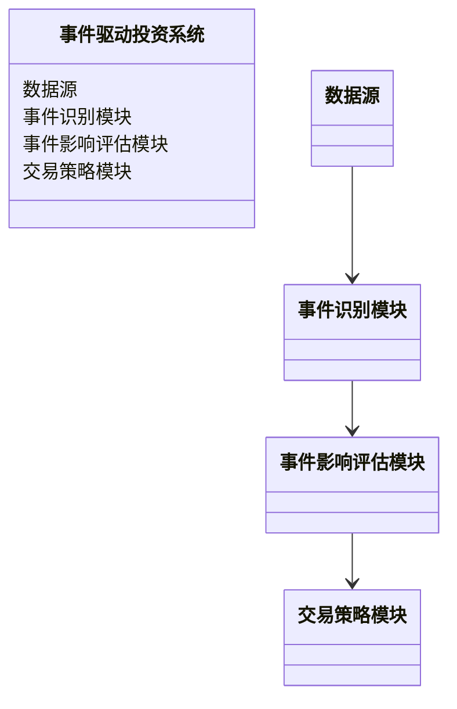
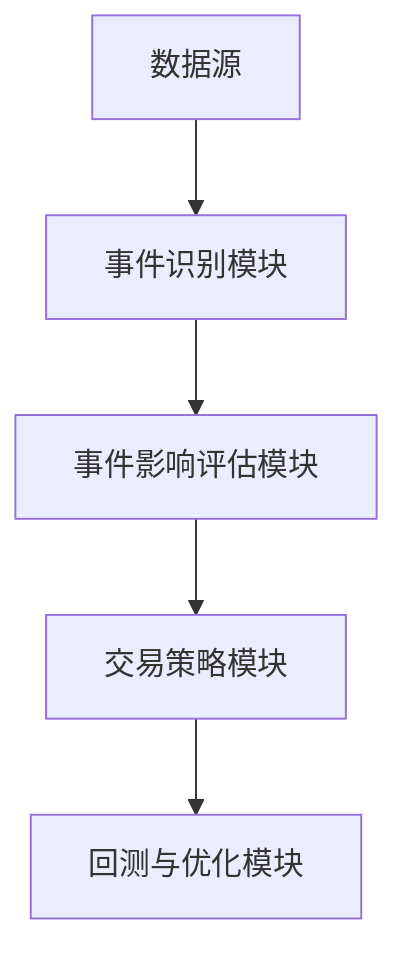
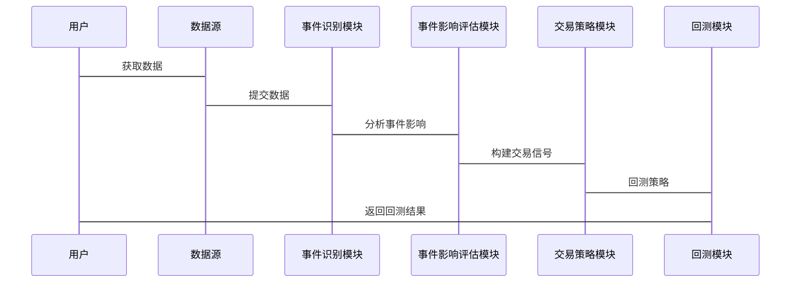

                 


# 事件驱动投资：从公司行为中获取Alpha

## 关键词：事件驱动投资、Alpha、公司行为、数据驱动、投资策略、金融建模

## 摘要

事件驱动投资是一种基于对公司特定事件或市场事件的反应来捕捉超额收益（Alpha）的投资策略。本文深入探讨了事件驱动投资的核心概念、各类事件的影响机制、数据驱动的分析方法以及实际应用中的算法设计。通过系统化的分析框架和实战案例，本文展示了如何利用公司行为数据来构建有效的投资策略，帮助投资者在金融市场中获取超额收益。文章还讨论了事件驱动投资中的风险管理、技术挑战和未来发展方向。

---

## 第一章：事件驱动投资概述

### 1.1 事件驱动投资的定义与背景

#### 1.1.1 事件驱动投资的定义

事件驱动投资是一种基于对公司内部事件或市场事件的反应来捕捉超额收益的投资策略。其核心在于识别和分析那些能够影响资产价格的非常规市场信息，如并购、重组、业绩预告等。

#### 1.1.2 事件驱动投资的背景与演变

随着金融市场的发展，传统的价值投资和趋势投资逐渐面临效率瓶颈。事件驱动投资通过挖掘市场中的非有效信息，为投资者提供了新的超额收益机会。近年来，随着大数据和人工智能技术的进步，事件驱动投资逐渐从经验驱动转向数据驱动，技术门槛不断提高。

#### 1.1.3 事件驱动投资的核心要素

- **事件识别**：准确识别对公司价值产生重大影响的事件。
- **事件影响评估**：量化事件对公司股价的影响。
- **交易策略设计**：基于事件分析构建具体的交易策略。

---

## 第二章：事件驱动投资的核心概念与框架

### 2.1 事件驱动投资的核心概念

#### 2.1.1 公司特定事件的定义与分类

公司特定事件是指对公司内在价值产生重大影响的事件，通常包括并购、资产重组、股权变动、管理层变动、业绩预告等。

#### 2.1.2 事件驱动投资的三要素

- **信息**：事件本身及其相关信息。
- **时机**：事件发生的时间窗口。
- **策略**：基于事件的交易策略。

### 2.2 事件驱动投资的分析框架

#### 2.2.1 事件识别

事件识别是事件驱动投资的第一步，需要从大量的市场数据中提取出对公司股价可能产生重大影响的事件。

- **数据来源**：包括公司公告、新闻报道、社交媒体等。
- **特征提取**：提取事件相关的关键词、时间窗口、相关股票等。

#### 2.2.2 事件影响评估

通过量化模型评估事件对公司股价的短期和长期影响。

- **数学模型**：使用事件研究法（Event Study）量化事件的影响。
- **案例分析**：以公司并购为例，分析其对股价的影响。

#### 2.2.3 交易策略设计

基于事件分析构建具体的交易策略，包括事件驱动的多因子模型、时间序列分析等。

---

## 第三章：事件驱动投资的算法设计与实现

### 3.1 事件驱动投资的算法原理

#### 3.1.1 事件驱动模型的数学表达

事件驱动模型通过量化事件对公司股价的影响，构建交易信号。数学模型如下：

$$ \text{收益预测} = \alpha \times \text{事件影响} + \beta \times \text{市场因子} $$

其中，$\alpha$ 和 $\beta$ 是回归系数，$\text{事件影响}$ 是事件对公司股价的预期影响。

#### 3.1.2 事件驱动策略的回测框架

回测是验证事件驱动策略有效性的关键步骤，包括数据获取、事件识别、策略执行和收益计算。

### 3.2 算法实现

#### 3.2.1 数据获取与预处理

使用Python的pandas库进行数据清洗和处理，提取事件相关的特征。

```python
import pandas as pd

# 获取公司公告数据
df_events = pd.read_csv('events.csv')
# 提取并购事件
并购事件 = df_events[df_events['事件类型'] == '并购']
```

#### 3.2.2 事件影响评估

基于事件研究法，计算事件窗口内的超额收益。

$$ \text{超额收益} = \text{实际收益} - \text{预期收益} $$

#### 3.2.3 交易策略实现

基于事件影响构建多因子模型，并进行回测。

```python
# 策略实现
from backtrader import Strategy

class EventDrivenStrategy(Strategy):
    def __init__(self):
        self.order = None
        self.entry_price = 0

    def on_event(self, event):
        if event['类型'] == '并购':
            self.buy(event['股票'], event['数量'])
```

---

## 第四章：事件驱动投资的系统架构设计

### 4.1 系统功能设计

#### 4.1.1 领域模型

使用Mermaid绘制领域模型类图，展示系统的主要实体和关系。



#### 4.1.2 系统架构

使用Mermaid绘制系统架构图，展示各模块之间的交互。



### 4.2 接口设计与交互流程

#### 4.2.1 接口设计

- **数据接口**：获取公司公告、财务数据等。
- **交易接口**：执行交易指令。
- **回测接口**：进行策略回测。

#### 4.2.2 交互流程

使用Mermaid绘制序列图，展示系统交互流程。



---

## 第五章：事件驱动投资的项目实战

### 5.1 项目背景与目标

项目目标是基于公司并购事件构建一个事件驱动投资策略，并进行回测验证。

### 5.2 核心代码实现

#### 5.2.1 数据获取

```python
import pandas as pd
import requests

def get_mergers_data():
    # 模拟数据获取
    url = 'https://example.com/mergers'
    response = requests.get(url)
    df = pd.read_json(response.text)
    return df
```

#### 5.2.2 事件识别与分析

```python
import numpy as np

def compute_excess_return(df, stock, event_date):
    # 计算事件窗口内的超额收益
    window = 20
    start_date = pd.to_datetime(event_date) - pd.Timedelta(days=window)
    end_date = pd.to_datetime(event_date) + pd.Timedelta(days=window)
    returns = df[stock].loc[start_date:end_date].pct_change().dropna()
    expected_return = np.mean(returns)
    excess_return = returns - expected_return
    return excess_return
```

#### 5.2.3 策略回测

```python
from backtrader import Broker, Strategy

# 初始化回测环境
broker = Broker()
strategy = EventDrivenStrategy()
broker.add_strategy(strategy)
broker.run()
```

### 5.3 案例分析与解读

以某公司并购事件为例，分析事件驱动策略的实施过程和效果。通过回测结果，验证策略的有效性。

---

## 第六章：事件驱动投资的风险管理与优化

### 6.1 风险管理

- **头寸 sizing**：根据事件影响和资金规模调整头寸大小。
- **风险对冲**：使用股指期货等工具对冲系统性风险。

### 6.2 策略优化

- **事件筛选优化**：提高事件识别的准确性。
- **模型优化**：引入机器学习算法提升预测精度。

---

## 第七章：总结与展望

### 7.1 总结

事件驱动投资通过挖掘公司行为和市场事件中的非有效信息，为投资者提供了获取超额收益的机会。本文详细探讨了事件驱动投资的核心概念、算法设计和系统实现，并通过实战案例展示了其应用价值。

### 7.2 展望

未来，随着大数据和人工智能技术的进步，事件驱动投资将更加依赖于高效的数据处理和模型优化。同时，投资者需要注意信息不对称和技术门槛的提高，合理配置资产，降低投资风险。

---

## 作者

作者：AI天才研究院 & 禅与计算机程序设计艺术

--- 

以上是《事件驱动投资：从公司行为中获取Alpha》的技术博客文章，详细涵盖了事件驱动投资的核心概念、算法设计、系统实现和实战案例，旨在为投资者和技术爱好者提供深入的理论指导和实践参考。

