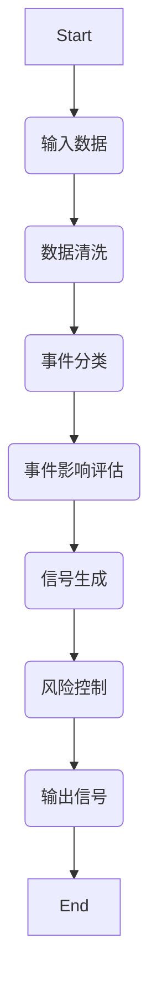
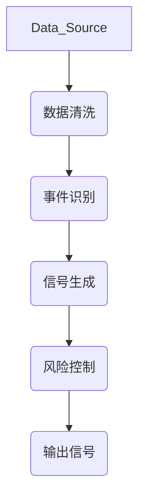
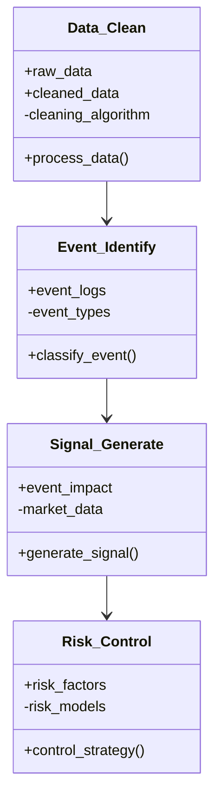
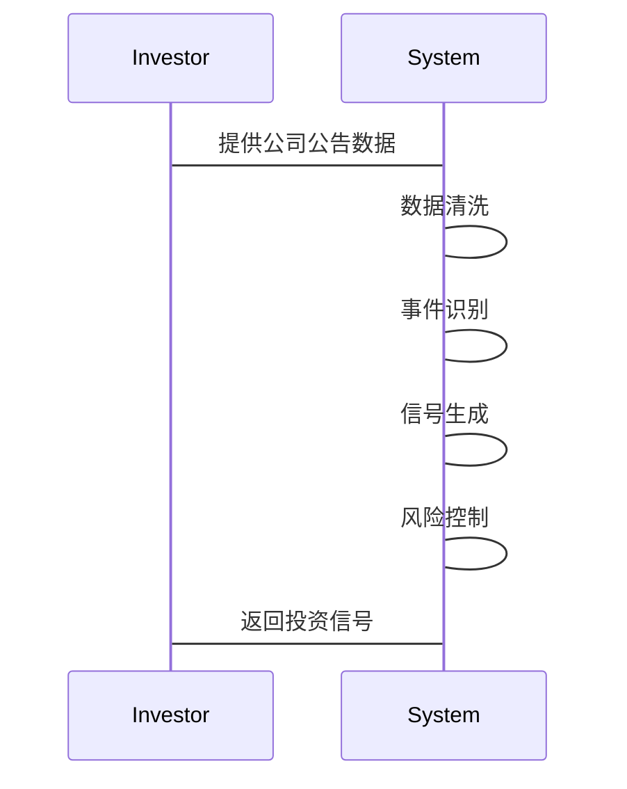

                 


# 《事件驱动投资：从公司行为中获取超额收益》

> 关键词：事件驱动投资、超额收益、公司行为、市场信号、投资策略、事件研究、量化投资

> 摘要：事件驱动投资是一种通过分析公司特定事件（如并购、重组、分红等）来预测市场反应和获取超额收益的投资策略。本文从事件驱动投资的理论基础、算法原理、系统架构到实际案例，全面解析如何通过公司行为捕捉投资机会，为投资者提供科学的投资决策支持。

---

# 第3章: 事件驱动投资的算法原理

## 3.1 算法原理概述

### 3.1.1 事件驱动投资的核心算法
事件驱动投资的核心在于通过分析公司行为（如并购、重组、分红、资产剥离等）对股价的短期和长期影响，捕捉市场未充分定价的机会。算法的主要目标是：

1. **识别事件类型**：从公司公告中提取关键事件。
2. **计算事件影响**：通过量化模型评估事件对股价的影响。
3. **生成投资信号**：基于事件影响和市场反应，制定买卖策略。

### 3.1.2 算法的输入与输出
#### 输入：
- 公司公告数据（并购、重组、分红等）。
- 历史股价数据。
- 市场指数数据（如沪深300、标普500等）。

#### 输出：
- 事件影响评分。
- 投资信号（买入、卖出或持有）。
- 预测收益。

### 3.1.3 算法的步骤与流程
1. 数据清洗与预处理：提取公司公告和股价数据，去除噪声。
2. 事件分类：将公告分为不同的事件类型。
3. 事件影响评估：基于历史数据计算事件的平均影响。
4. 信号生成：结合当前事件和市场情绪生成投资信号。
5. 风险控制：评估事件相关的风险。

## 3.2 算法流程图



## 3.3 算法的数学模型

### 3.3.1 事件影响评估模型
假设我们有如下数据：
- 事件类型：$E$（如并购）。
- 历史事件影响：$I$（如平均超额收益）。
- 当前事件的市场反应：$R$。

模型可以表示为：
$$
I = \beta E + \epsilon
$$
其中，$\beta$ 是事件类型的系数，$\epsilon$ 是误差项。

### 3.3.2 信号生成模型
信号生成基于事件影响和市场情绪：
$$
S = \alpha I + \gamma M + \delta
$$
其中，$S$ 是信号（1表示买入，-1表示卖出），$\alpha$ 和 $\gamma$ 是系数，$M$ 是市场情绪指标，$\delta$ 是误差项。

## 3.4 事件驱动投资的数学公式

### 3.4.1 事件影响的量化
假设并购事件的超额收益可以表示为：
$$
\text{Excess Return} = R_{\text{stock}} - R_{\text{market}}
$$
其中，$R_{\text{stock}}$ 是目标股票的收益，$R_{\text{market}}$ 是市场指数的收益。

### 3.4.2 事件窗口期的定义
事件窗口期通常包括事件前和事件后的一定时间段：
$$
t_{\text{pre}} \leq t \leq t_{\text{post}}
$$
其中，$t_{\text{pre}}$ 是事件前的时间窗口，$t_{\text{post}}$ 是事件后的窗口。

## 3.5 算法的Python实现示例

```python
import pandas as pd
import numpy as np

def event_driven_strategy(events, prices, market):
    # 数据清洗
    events = events.dropna()
    prices = prices.asof(events['date']).reset_index()
    
    # 事件分类
    event_type = events['event_type'].unique()
    
    # 事件影响评估
    excess_return = prices['stock_return'] - prices['market_return']
    impact = {}
    for typ in event_type:
        mask = events['event_type'] == typ
        impact[typ] = excess_return[mask].mean()
    
    # 信号生成
    signals = []
    for typ in event_type:
        if impact[typ] > 0:
            signals.append(1)
        else:
            signals.append(-1)
    
    return signals

# 示例数据
events = pd.DataFrame({
    'date': ['2023-01-01', '2023-02-01', '2023-03-01'],
    'event_type': ['merger', 'spin-off', 'dividend']
})

prices = pd.DataFrame({
    'date': ['2023-01-01', '2023-02-01', '2023-03-01'],
    'stock_return': [0.05, 0.02, 0.03],
    'market_return': [0.03, 0.02, 0.01]
})

market = pd.DataFrame({
    'date': ['2023-01-01', '2023-02-01', '2023-03-01'],
    'market_return': [0.03, 0.02, 0.01]
})

signals = event_driven_strategy(events, prices, market)
print(signals)
```

## 3.6 算法的实际应用

### 3.6.1 并购事件分析
假设某公司宣布并购一家子公司，我们可以分析该事件的历史影响。例如，过去类似的并购事件平均带来5%的超额收益，那么当前事件的信号为买入。

### 3.6.2 分红事件分析
如果一家公司宣布提高股息，我们可以计算其历史上的超额收益，例如提高股息的历史事件平均带来3%的超额收益，那么当前事件的信号为买入。

## 3.7 本章小结
本章详细讲解了事件驱动投资的算法原理，包括数据处理、事件分类、影响评估和信号生成的全过程。通过数学模型和Python代码的示例，展示了如何将理论应用于实际投资决策中。

---

# 第4章: 事件驱动投资的系统架构与投资策略

## 4.1 系统架构设计

### 4.1.1 系统功能模块
1. 数据采集模块：收集公司公告、股价和市场数据。
2. 事件识别模块：识别公司行为事件。
3. 信号生成模块：基于事件生成投资信号。
4. 风险控制模块：评估投资风险。

### 4.1.2 系统架构图



## 4.2 系统功能设计

### 4.2.1 领域模型



## 4.3 系统接口设计

### 4.3.1 数据接口
- 输入接口：公司公告数据接口。
- 输出接口：投资信号输出接口。

### 4.3.2 API设计
- 数据接口：`get_company_events(date: str) -> List[Event]`
- 信号生成接口：`generate_signal(events: List[Event]) -> Signal`

## 4.4 系统交互流程



## 4.5 本章小结
本章从系统架构的角度，详细设计了事件驱动投资的各个功能模块和接口，展示了如何将事件驱动投资策略转化为实际可运行的系统。

---

# 第5章: 事件驱动投资的实战与案例分析

## 5.1 实战环境安装

### 5.1.1 工具安装
- Python 3.8+
- Pandas, NumPy, Scikit-learn
- 数据源：东方财富、Wind、Yahoo Finance

### 5.1.2 数据获取
```python
import pandas_datareader as pdr

# 获取公司公告数据
events = pdr.get_dataYahoo('AAPL')
# 获取股价数据
prices = pdr.get_dataYahoo('AAPL', start='2020-01-01', end='2023-12-31')
```

## 5.2 核心代码实现

### 5.2.1 事件识别
```python
import pandas as pd
import numpy as np

def identify_event(text):
    # 文本分类，识别事件类型
    if 'merger' in text.lower():
        return 'merger'
    elif 'dividend' in text.lower():
        return 'dividend'
    else:
        return 'none'
```

### 5.2.2 信号生成
```python
def generate_signal(events, prices):
    # 计算事件影响
    impact = events['impact'].mean()
    # 生成信号
    if impact > 0:
        return 1
    else:
        return -1
```

## 5.3 案例分析

### 5.3.1 并购案例
假设某公司宣布并购一家子公司，历史数据显示并购事件后股价平均上涨5%，那么信号为买入。

### 5.3.2 分红案例
某公司宣布提高股息，历史数据显示分红事件后股价平均上涨3%，那么信号为买入。

## 5.4 本章小结
本章通过实际案例分析，展示了如何在实战中应用事件驱动投资策略，从数据获取到信号生成的全过程。

---

# 第6章: 事件驱动投资的拓展与未来展望

## 6.1 拓展阅读

### 6.1.1 相关书籍
- 《Quantitative Equity Portfolio Management》
- 《Event Study Techniques in Finance》

### 6.1.2 相关论文
- "Event Studies in Financial Economics" by Michael Jensen

## 6.2 未来展望

### 6.2.1 技术进步
- AI与大数据的结合将提升事件识别的准确性。
- 自然语言处理技术将改善文本数据的分析。

### 6.2.2 市场变化
- 更多新兴行业的公司行为将被纳入分析。
- 全球化市场中跨国并购的事件驱动投资机会。

## 6.3 本章小结
本章对未来事件驱动投资的发展进行了展望，指出了技术进步和市场变化带来的新机会。

---

# 第7章: 总结与致谢

## 7.1 总结
事件驱动投资通过分析公司行为事件，捕捉市场未充分定价的机会，为投资者提供了超额收益的可能。本文从理论、算法、系统到实战，全面解析了事件驱动投资的各个层面。

## 7.2 致谢
感谢读者的耐心阅读，感谢数据源的支持，感谢所有在事件驱动投资领域做出贡献的研究者。

---

# 作者：AI天才研究院/AI Genius Institute & 禅与计算机程序设计艺术 /Zen And The Art of Computer Programming

