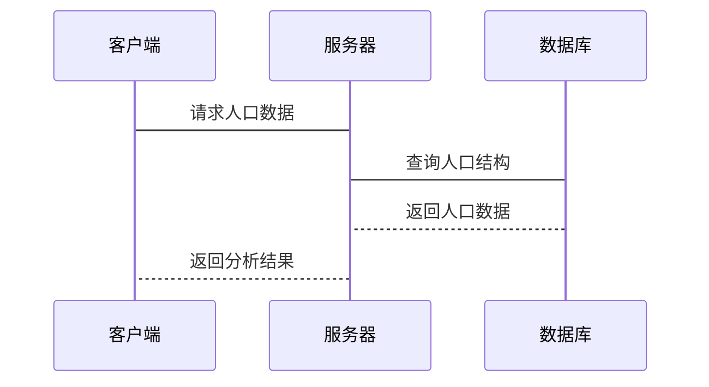
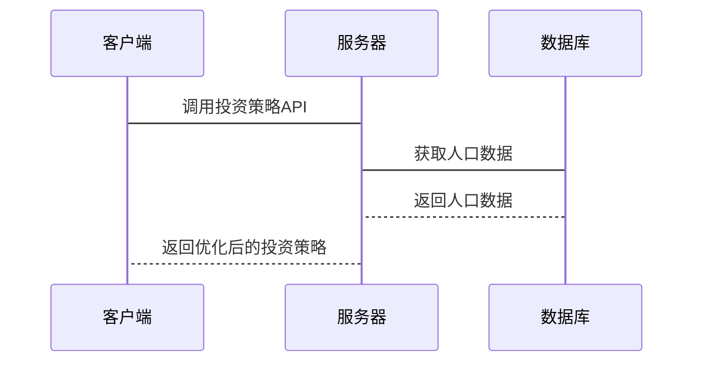

                 


# 人口结构变化对长期投资的影响

> 关键词：人口结构变化, 长期投资, 经济发展, 资产配置, 投资策略

> 摘要：人口结构的变化对长期投资有着深远的影响。本文从人口结构变化的定义、核心要素及其对经济和投资的影响入手，结合数学模型和实际案例，分析了人口结构变化如何影响股票、房地产、债券等资产的投资策略。通过系统分析和架构设计，提出了应对人口结构变化的长期投资策略和风险管理方法，为投资者提供了实用的指导。

---

## 第1章：人口结构变化的定义与核心概念

### 1.1 人口结构变化的定义

人口结构变化是指一个地区或国家内不同年龄段人口比例的变化趋势。这种变化受到生育率、死亡率、迁移率等因素的影响，通常表现为人口老龄化、年轻化或年龄分布的均衡化。人口结构的变化不仅影响社会经济发展，还对投资行为和资产配置产生重要影响。

#### 1.1.1 人口结构的定义

人口结构是指一个地区或国家内不同年龄段人口的分布情况。通常用年龄金字塔模型来描述，包括少儿人口、劳动年龄人口和老年人口三部分。

#### 1.1.2 人口结构变化的驱动因素

- **生育率下降**：随着经济发展，生育率通常会下降，导致年轻人口比例减少。
- **寿命延长**：医疗技术的进步使得人均寿命延长，导致老年人口比例上升。
- **人口迁移**：人口从农村向城市迁移，或从欠发达地区向发达地区迁移，影响不同地区的年龄结构。

#### 1.1.3 人口结构变化的边界与外延

人口结构变化的边界在于其时间和空间维度，包括全球、国家、地区等不同层次的变化。外延则涉及对经济、社会、文化和投资等多个领域的影响。

### 1.2 人口结构变化的核心要素

#### 1.2.1 年龄分布

年龄分布是人口结构的核心要素，通常用年龄中位数来衡量。年龄中位数反映了人口的年轻化或老龄化程度。

#### 1.2.2 人口增长率

人口增长率是衡量人口变化速度的重要指标，通常包括自然增长率和迁移率。低增长率可能导致劳动力短缺和经济停滞。

#### 1.2.3 性别比例

性别比例影响家庭结构、消费习惯和投资行为。例如，男性比例较高可能导致更多的投资需求，而女性比例较高可能增加消费支出。

#### 1.2.4 城市化水平

城市化水平影响人口的分布和流动性，进而影响房地产、交通和服务业的投资机会。

---

## 第2章：人口结构变化对长期投资的影响

### 2.1 人口结构变化与股票投资

#### 2.1.1 年轻人口占比与股市活跃度

年轻人口比例较高时，股市活跃度较高，投资需求增加。反之，老龄化可能导致股市需求下降。

#### 2.1.2 老龄化对股市的长期影响

老龄化可能导致储蓄率下降，减少股市的资金流入，同时增加对稳健资产的需求。

### 2.2 人口结构变化与房地产投资

#### 2.2.1 人口流动对房地产市场的影响

人口从农村向城市迁移可能导致城市房地产需求增加，进而推高房价。

#### 2.2.2 老龄化对房地产需求的改变

老龄化可能导致对老年宜居房地产的需求增加，同时减少对大户型和高价位房产的需求。

### 2.3 人口结构变化与债券投资

#### 2.3.1 人口老龄化对债券需求的影响

老龄化社会中，债券作为稳健投资工具的需求增加，尤其是政府债券和高评级企业债券。

#### 2.3.2 债券市场的风险与收益变化

老龄化可能导致债券市场的流动性下降，同时增加债券价格波动风险。

---

## 第3章：人口结构变化的数学模型与投资策略

### 3.1 人口结构变化的数学模型

#### 3.1.1 人口增长模型

**指数增长模型**：假设人口以固定比例增长，公式为：

$$ P(t) = P_0 \times e^{rt} $$

其中，$P_0$ 是初始人口，$r$ 是增长率，$t$ 是时间。

**稳态增长模型**：假设人口增长达到均衡状态，公式为：

$$ P(t) = \frac{P_0}{1 - (1 + r)^{-t}} $$

#### 3.1.2 年龄结构模型

**年龄金字塔模型**：通过不同年龄段的人口比例，分析人口结构的年轻化或老龄化趋势。

### 3.2 基于人口结构变化的投资策略

#### 3.2.1 生命周期模型

生命周期模型假设投资者在不同生命阶段有不同的投资需求，年轻阶段偏向高风险资产，老年阶段偏向稳健资产。

#### 3.2.2 风险偏好模型

根据人口结构变化调整风险偏好，老龄化社会中风险偏好降低，倾向于更多稳健投资。

---

## 第4章：系统分析与架构设计方案

### 4.1 问题场景介绍

人口结构变化对投资的影响涉及多个领域，包括股票、房地产、债券等。投资者需要根据人口变化调整资产配置和风险管理策略。

### 4.2 项目介绍

本项目旨在通过分析人口结构变化对不同资产的影响，制定长期投资策略。

### 4.3 系统功能设计（领域模型）

使用 Mermaid 绘制领域模型类图：


### 4.4 系统架构设计

使用 Mermaid 绘制系统架构图：

```mermaid
architecturalDiagram

    客户端
    服务器
    数据库

    客户端 -- HTTP --> 服务器
    服务器 -- JDBC --> 数据库
```

### 4.5 系统接口设计

使用 Mermaid 绘制接口设计图：



### 4.6 系统交互设计

使用 Mermaid 绘制交互序列图：



---

## 第5章：项目实战

### 5.1 环境安装

- 安装 Python 和相关库（如 NumPy、Pandas、Matplotlib）。
- 安装 Mermaid 和其他工具。

### 5.2 核心实现源代码

#### 5.2.1 人口增长模型

```python
import numpy as np
import matplotlib.pyplot as plt

# 初始人口
P0 = 1000
# 年增长率
r = 0.02
# 时间范围
t = np.arange(0, 50)

# 指数增长模型
P_index = P0 * np.exp(r * t)
# 稳态增长模型
P_steady = P0 / (1 - (1 + r)**-t)

plt.figure(figsize=(10, 6))
plt.plot(t, P_index, label='指数增长模型')
plt.plot(t, P_steady, label='稳态增长模型')
plt.xlabel('时间（年）')
plt.ylabel('人口数量')
plt.title('人口增长模型比较')
plt.legend()
plt.show()
```

#### 5.2.2 年龄结构分析

```python
import pandas as pd
import seaborn as sns

# 示例数据
data = {'年龄': np.arange(0, 100),
        '人口比例': np.random.dirichlet(np.ones(100), 1).flatten()}
df = pd.DataFrame(data)

# 绘制年龄金字塔
plt.figure(figsize=(8, 6))
sns.barplot(x='年龄', y='人口比例', data=df)
plt.title('年龄金字塔')
plt.xlabel('年龄')
plt.ylabel('人口比例')
plt.show()
```

---

## 第6章：案例分析与实际应用

### 6.1 发达国家的案例

#### 6.1.1 美国的养老金体系与人口老龄化

美国的养老金体系受人口老龄化影响较大，需要调整资产配置以应对未来的支付压力。

#### 6.1.2 日本的房地产市场与老龄化

日本的房地产市场因老龄化需求下降，导致房价长期低迷。

### 6.2 发展中国家的案例

#### 6.2.1 中国的人口红利与投资机会

中国的人口红利期推动了制造业和房地产业的发展，未来需要应对老龄化挑战。

#### 6.2.2 印度的年轻人口与经济增长

印度的年轻人口为其经济增长提供了动力，但也面临就业和基础设施的压力。

---

## 第7章：应对人口结构变化的最佳投资策略

### 7.1 长期投资策略

#### 7.1.1 全球化视角下的资产配置

通过全球化配置分散风险，降低单一市场的人口结构变化影响。

#### 7.1.2 科技创新与投资机会

加大对科技创新行业的投资，以应对人口结构变化带来的挑战。

### 7.2 风险管理

#### 7.2.1 人口结构变化的风险评估

定期评估人口结构变化对投资组合的影响，及时调整资产配置。

#### 7.2.2 风险分散策略

通过多样化投资降低特定资产的风险，避免因人口结构变化导致的重大损失。

---

## 第8章：结论与展望

### 8.1 结论

人口结构变化对长期投资的影响是多方面的，投资者需要根据人口变化调整资产配置和风险管理策略。通过数学模型和实际案例分析，我们可以更好地理解人口结构变化对投资的影响。

### 8.2 展望

未来的研究可以进一步探讨人口结构变化对新兴市场和技术产业的影响，同时结合人工智能和大数据技术，开发更精准的投资策略。

---

## 附录

### 附录A：常用公式

- 人口增长模型：
  $$ P(t) = P_0 \times e^{rt} $$
- 稳态增长模型：
  $$ P(t) = \frac{P_0}{1 - (1 + r)^{-t}} $$

### 附录B：工具与库

- Python库：NumPy、Pandas、Matplotlib、Seaborn
- 数据可视化工具：Mermaid

---

## 作者

**作者：AI天才研究院/AI Genius Institute & 禅与计算机程序设计艺术 /Zen And The Art of Computer Programming**

---

以上是《人口结构变化对长期投资的影响》的文章大纲和详细内容。通过系统的分析和实际案例，我们深入探讨了人口结构变化对长期投资的影响，为投资者提供了科学的指导和实用的策略。

