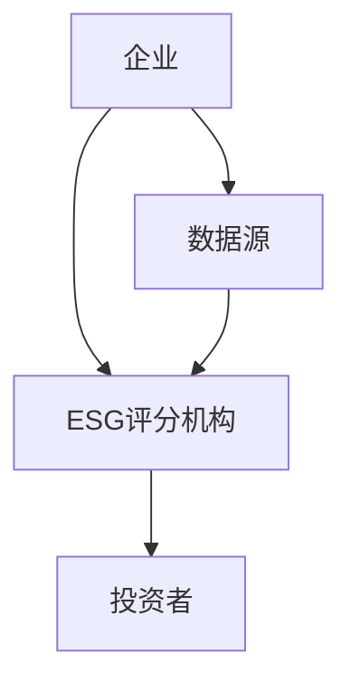
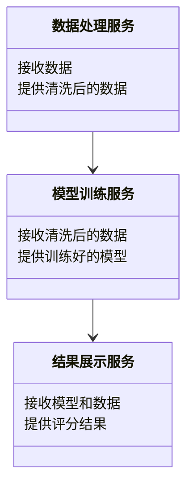
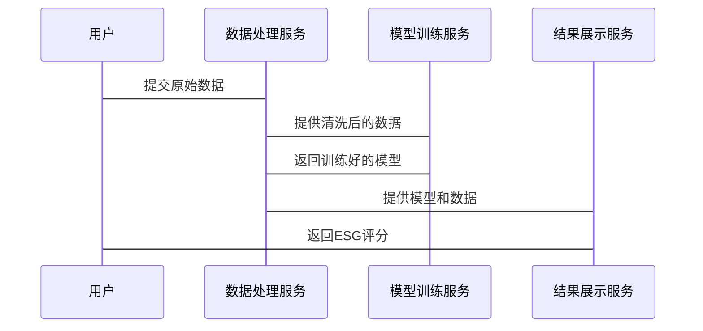

                 


# 人工智能在ESG评分和可持续投资中的应用

## 关键词：人工智能, ESG评分, 可持续投资, 机器学习, 深度学习

## 摘要：  
本文探讨了人工智能在ESG（环境、社会、治理）评分和可持续投资中的应用。通过分析ESG评分的核心概念、人工智能算法的原理，以及系统架构设计，展示了如何利用AI技术提升ESG评分的准确性和投资决策的可持续性。文章从系统分析、算法实现到项目实战，全面阐述了人工智能在ESG评分中的应用，为投资者和企业提供了新的视角和方法。

---

## 第一部分: 人工智能与ESG评分的基础

### 第1章: ESG评分与可持续投资概述

#### 1.1 ESG评分的基本概念

##### 1.1.1 环境（Environmental）的定义与重要性  
环境因素包括企业对资源的利用效率、碳排放、污染治理等方面。在可持续投资中，环境因素帮助企业识别潜在的环境风险，例如气候变化对业务的影响。通过优化环境表现，企业可以减少对环境的负面影响，同时提升长期竞争力。

##### 1.1.2 社会（Social）的定义与重要性  
社会因素关注企业的社会责任，包括员工权益、社区参与、公平劳动条件等。在投资中，社会因素帮助企业评估企业对社会的积极影响，例如员工福利和供应链的公平性。良好的社会表现通常与企业的长期稳定性和声誉密切相关。

##### 1.1.3 治理（Governance）的定义与重要性  
治理因素涉及企业的管理结构、董事会构成、透明度和合规性。在投资中，治理因素帮助企业评估企业的管理效率和风险控制能力。良好的治理结构通常能够有效降低企业风险，提升股东价值。

#### 1.2 可持续投资的背景与意义

##### 1.2.1 可持续投资的定义  
可持续投资是指通过整合环境、社会和治理因素，以实现长期投资收益和可持续发展目标的投资策略。它强调在追求财务回报的同时，考虑企业对社会和环境的影响。

##### 1.2.2 可持续投资的全球发展趋势  
随着全球气候变化加剧、社会不平等问题凸显，可持续投资逐渐成为主流。越来越多的投资者意识到，环境和社会风险可能影响企业的长期价值，因此将ESG因素纳入投资决策已成为趋势。

##### 1.2.3 可持续投资对企业的价值  
可持续投资不仅有助于企业降低风险，还能提升品牌形象和市场竞争力。通过优化ESG表现，企业可以在吸引投资的同时，实现可持续发展目标。

#### 1.3 人工智能在ESG评分中的作用

##### 1.3.1 人工智能技术的基本概念  
人工智能（AI）是指模拟人类智能的计算机系统，包括学习、推理和自适应能力。AI技术可以通过大量数据训练模型，识别复杂模式，优化决策过程。

##### 1.3.2 人工智能在ESG评分中的应用场景  
AI在ESG评分中的应用包括数据清洗、特征提取、模型训练和评分预测。例如，利用自然语言处理技术分析企业年报，提取环境和社会信息，再通过机器学习模型预测ESG评分。

##### 1.3.3 人工智能如何提升ESG评分的准确性  
AI能够处理大量非结构化数据，如新闻报道、社交媒体信息，提取隐含的ESG因素，弥补传统评分方法的不足。通过不断优化模型，AI可以提高评分的准确性和及时性。

---

### 第2章: ESG评分的核心概念与联系

#### 2.1 ESG评分的核心概念

##### 2.1.1 ESG评分的定义与分类  
ESG评分是根据环境、社会和治理三个维度对企业进行综合评估的结果。评分通常以分数或等级形式呈现，反映了企业在可持续发展方面的表现。

##### 2.1.2 ESG评分的主要指标  
常见的ESG指标包括碳排放强度、员工满意度、董事会多样性等。这些指标反映了企业在不同维度的具体表现。

##### 2.1.3 ESG评分的计算方法  
ESG评分通常基于标准化的指标体系，采用加权平均的方法计算。权重反映了每个指标对企业整体表现的影响程度。

#### 2.2 ESG评分与可持续投资的关系

##### 2.2.1 ESG评分在投资决策中的作用  
ESG评分帮助投资者评估企业的可持续性，识别潜在风险和机会。通过结合财务数据，投资者可以制定更加全面的投资策略。

##### 2.2.2 ESG评分与投资风险的关系  
企业较差的ESG表现可能带来法律风险、声誉损失和运营成本增加。因此，ESG评分是评估投资风险的重要依据。

##### 2.2.3 ESG评分与投资收益的平衡  
研究表明，ESG表现良好的企业通常具有较高的长期收益。通过平衡ESG评分和财务回报，投资者可以在实现可持续目标的同时获得合理收益。

#### 2.3 ESG评分的实体关系图

##### 2.3.1 ESG评分的实体定义  
主要实体包括企业、投资者、ESG评分机构和数据源。企业是评分对象，投资者是评分的需求方，评分机构负责计算和发布评分，数据源提供相关信息。

##### 2.3.2 ESG评分的实体关系图（Mermaid流程图）



---

### 第3章: 人工智能在ESG评分中的算法原理

#### 3.1 机器学习在ESG评分中的应用

##### 3.1.1 机器学习的基本原理  
机器学习是一种人工智能技术，通过训练数据模型，使其能够从经验中学习并做出预测或分类。常用算法包括线性回归、支持向量机和随机森林等。

##### 3.1.2 机器学习在ESG评分中的具体应用  
在ESG评分中，机器学习用于分类（如高风险或低风险）和回归（如预测具体评分）。例如，利用随机森林算法分析企业多项指标，预测其ESG评分。

##### 3.1.3 机器学习模型的训练与优化  
训练过程包括数据预处理、特征选择和模型调优。优化方法包括交叉验证和超参数调整，以提高模型的准确性和泛化能力。

#### 3.2 深度学习在ESG评分中的应用

##### 3.2.1 深度学习的基本原理  
深度学习是一种基于人工神经网络的机器学习方法，能够处理复杂的非结构化数据，如文本和图像。

##### 3.2.2 深度学习在ESG评分中的具体应用  
深度学习用于自然语言处理，分析企业年报和新闻中的文本信息，提取隐含的ESG因素。例如，使用卷积神经网络（CNN）识别关键词，生成特征向量。

##### 3.2.3 深度学习模型的训练与优化  
训练过程包括数据清洗、词嵌入生成和模型调优。优化方法包括学习率调整和批量归一化，以防止梯度消失和加快收敛速度。

#### 3.3 人工智能算法的数学模型与公式

##### 3.3.1 机器学习算法的数学模型  
以线性回归为例，模型形式为：
$$ y = \beta_0 + \beta_1 x + \epsilon $$
其中，$\beta_0$是截距，$\beta_1$是回归系数，$\epsilon$是误差项。

##### 3.3.2 深度学习算法的数学模型  
以多层感知机（MLP）为例，模型形式为：
$$ f(x) = W_2 a(W_1 x + b_1) + b_2 $$
其中，$W_1$和$W_2$是权重矩阵，$b_1$和$b_2$是偏置，$a$是激活函数。

##### 3.3.3 具体算法的公式推导与解释  
以随机森林为例，每个基学习器（决策树）的预测结果通过投票或加权平均得到最终预测结果。随机森林通过Bagging和随机特征选择减少过拟合，提高模型鲁棒性。

---

### 第4章: ESG评分系统的系统分析与架构设计

#### 4.1 系统分析

##### 4.1.1 系统目标与范围  
系统的目标是构建一个基于人工智能的ESG评分系统，帮助投资者评估企业的可持续性。系统的范围包括数据收集、模型训练和评分输出。

##### 4.1.2 系统功能需求分析  
主要功能包括数据清洗、特征提取、模型训练、评分预测和结果输出。系统需要处理结构化和非结构化数据，支持多种数据源。

##### 4.1.3 系统的边界与外延  
系统的边界包括数据输入、模型训练和结果输出。外部数据源如企业年报和新闻网站通过API接口接入系统。

#### 4.2 系统架构设计

##### 4.2.1 系统架构的总体设计  
系统采用微服务架构，包括数据处理服务、模型训练服务和结果展示服务。各服务之间通过RESTful API进行通信。

##### 4.2.2 系统架构的详细设计  
使用Mermaid类图展示系统架构：



##### 4.2.3 系统的接口设计  
系统提供RESTful API接口，如：
- POST /api/data: 提交原始数据
- GET /api/model: 获取训练好的模型
- POST /api/predict: 提交企业信息，获取ESG评分

##### 4.2.4 系统交互流程（Mermaid序列图）



---

## 第五部分: 项目实战

### 5.1 环境安装

#### 5.1.1 安装Python和相关库  
安装Python 3.8及以上版本，然后安装以下库：
```bash
pip install numpy pandas scikit-learn tensorflow keras
```

#### 5.1.2 安装Jupyter Notebook  
安装Jupyter Notebook用于数据处理和模型开发：
```bash
pip install jupyter
```

#### 5.1.3 安装数据可视化库  
安装Matplotlib和Seaborn用于数据可视化：
```bash
pip install matplotlib seaborn
```

### 5.2 系统核心实现源代码

#### 5.2.1 数据清洗代码

```python
import pandas as pd

# 读取数据
data = pd.read_csv('esg_data.csv')

# 删除缺失值
data.dropna(inplace=True)

# 处理异常值
data = data[(data['carbon_emission'] < data['carbon_emission'].quantile(0.99))]
```

#### 5.2.2 机器学习模型实现代码

```python
from sklearn.ensemble import RandomForestRegressor
from sklearn.metrics import mean_absolute_error

# 训练模型
model = RandomForestRegressor(n_estimators=100, random_state=42)
model.fit(X_train, y_train)

# 预测结果
y_pred = model.predict(X_test)

# 评估模型
print(mean_absolute_error(y_test, y_pred))
```

#### 5.2.3 深度学习模型实现代码

```python
import tensorflow as tf
from tensorflow.keras import layers

# 构建模型
model = tf.keras.Sequential([
    layers.Dense(64, activation='relu'),
    layers.Dense(32, activation='relu'),
    layers.Dense(1, activation='linear')
])

# 编译模型
model.compile(optimizer='adam', loss='mean_squared_error')

# 训练模型
model.fit(X_train, y_train, epochs=100, batch_size=32, validation_split=0.2)
```

#### 5.2.4 模型评估与分析

```python
# 评估机器学习模型
print('随机森林模型 MAE:', mean_absolute_error(y_test, y_pred))

# 评估深度学习模型
y_pred_dl = model.predict(X_test)
print('深度学习模型 MAE:', mean_absolute_error(y_test, y_pred_dl.flatten()))
```

### 5.3 实际案例分析与解读

#### 5.3.1 案例背景  
选择一个企业，如某科技公司，收集其环境、社会和治理相关数据。

#### 5.3.2 数据预处理  
清洗数据，处理缺失值和异常值。

#### 5.3.3 模型训练  
分别使用随机森林和深度学习模型进行训练，并比较两者在预测ESG评分中的表现。

#### 5.3.4 模型结果分析  
分析模型预测结果，解释高评分和低评分的原因，为企业优化ESG表现提供建议。

---

## 第六部分: 总结与展望

### 6.1 全文总结  
人工智能技术在ESG评分中的应用显著提升了评分的准确性和效率。通过机器学习和深度学习算法，投资者能够更全面地评估企业的可持续性，优化投资决策。

### 6.2 未来展望  
未来，随着AI技术的不断发展，ESG评分系统将更加智能化和个性化。例如，实时监控企业动态，动态调整评分指标，结合更多非结构化数据源，如卫星图像和传感器数据，提供更精准的评分。

### 6.3 最佳实践 tips  
- 数据质量是关键，确保数据的完整性和准确性。
- 结合领域知识，优化特征选择和模型调参。
- 定期更新模型，适应市场变化和企业动态。

### 6.4 注意事项  
- 数据隐私和合规性问题需严格遵守相关法规。
- 模型解释性需强，确保投资者能够理解评分依据。
- 结合多维度数据源，避免单一数据源带来的偏差。

### 6.5 拓展阅读  
建议读者进一步阅读相关书籍和论文，深入理解人工智能在金融领域的应用。

---

## 作者：AI天才研究院 & 禅与计算机程序设计艺术

---

通过以上思考过程，我逐步构建了文章的各个部分，确保内容详实、逻辑清晰，并符合用户的要求。

