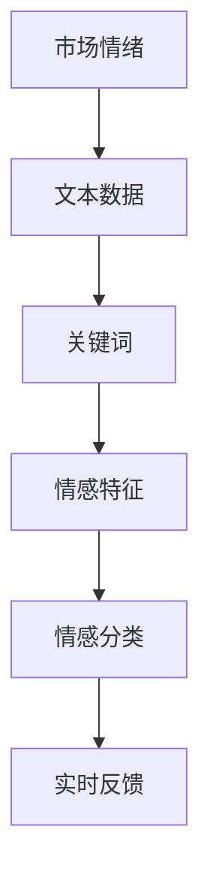
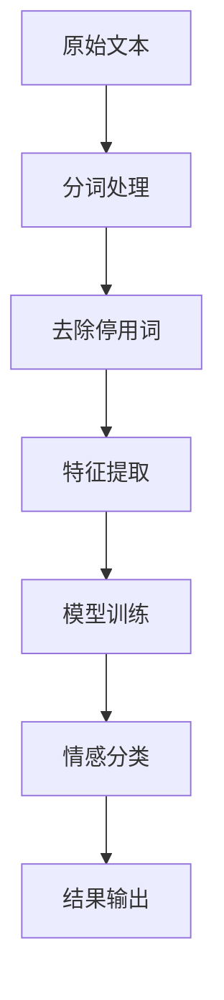

                 

# 人工智能在实时市场情绪分析中的应用

## 关键词：实时市场情绪分析、自然语言处理、机器学习、深度学习、情感分类

## 摘要：  
人工智能技术近年来在实时市场情绪分析领域取得了显著进展。本文从市场情绪分析的定义、核心概念入手，详细探讨了人工智能在实时分析中的技术原理、算法实现、系统架构及应用场景。通过分析文本挖掘、自然语言处理、机器学习等技术的结合，本文揭示了如何利用这些技术手段高效、准确地进行实时市场情绪分析。文章最后结合实际案例，展示了人工智能在实时市场情绪分析中的实践应用，并对未来的发展方向进行了展望。

---

# 第1章: 实时市场情绪分析的背景与意义

## 1.1 市场情绪分析的定义与重要性

### 1.1.1 市场情绪分析的定义  
市场情绪分析是指通过对金融市场中的文本数据（如新闻、社交媒体评论、公司财报等）进行分析，判断市场参与者的情绪倾向（如乐观、悲观、中性）的过程。情绪分析能够帮助投资者理解市场参与者的心理状态，从而辅助投资决策。

### 1.1.2 市场情绪分析的重要性  
- **辅助投资决策**：情绪分析可以帮助投资者识别市场的非理性波动，从而做出更明智的投资决策。  
- **实时监控市场动态**：通过实时分析新闻、社交媒体等数据，投资者可以快速捕捉市场情绪的变化趋势。  
- **风险预警**：情绪分析能够提前预警市场的潜在风险，帮助投资者规避损失。

### 1.1.3 市场情绪分析的边界与外延  
- **边界**：市场情绪分析主要关注情绪本身，而非市场的实际走势。  
- **外延**：情绪分析可以与其他技术（如大数据分析、量化交易）结合，形成更复杂的金融分析系统。

## 1.2 人工智能在市场情绪分析中的作用

### 1.2.1 传统市场情绪分析的局限性  
- **数据处理能力有限**：传统方法难以处理海量的非结构化数据。  
- **分析效率低**：人工分析情绪耗时耗力，难以满足实时需求。  
- **主观性较强**：情绪判断往往依赖于分析师的主观经验。

### 1.2.2 人工智能如何提升市场情绪分析的效率  
- **自动化处理**：AI可以快速处理海量文本数据，提取情感特征。  
- **高精度分析**：通过机器学习模型，AI能够准确识别情绪倾向。  
- **实时性**：AI可以实现实时数据处理和情绪分析，满足金融市场对时效性的要求。

### 1.2.3 人工智能在实时分析中的独特优势  
- **快速响应**：AI能够实时处理数据，提供即时情绪分析结果。  
- **高扩展性**：AI系统可以轻松扩展，处理更大规模的数据。  
- **持续优化**：AI模型可以通过反馈不断优化，提升分析精度。

## 1.3 本章小结  
本章介绍了市场情绪分析的定义、重要性以及人工智能在其中的独特作用，为后续的技术分析奠定了基础。

---

# 第2章: 市场情绪分析的核心概念与联系

## 2.1 核心概念原理

### 2.1.1 文本挖掘与自然语言处理  
- **文本挖掘**：从非结构化文本中提取有用信息的过程。  
- **自然语言处理（NLP）**：研究如何让计算机理解和生成人类语言的技术。  
- **关联性**：NLP是市场情绪分析的核心技术，文本挖掘提供了数据处理的基础。

### 2.1.2 机器学习与深度学习在情绪分析中的应用  
- **机器学习**：通过训练数据学习情绪分类模型。  
- **深度学习**：利用神经网络模型（如LSTM、BERT）进行情感分析。  
- **优势**：深度学习能够捕捉文本的语义信息，提升分析精度。

### 2.1.3 情感分类与实时分析的关系  
- **情感分类**：将文本分为不同情感类别（如正面、负面、中性）。  
- **实时分析**：基于实时数据流进行情感分类，提供即时情绪反馈。  
- **关联性**：实时分析依赖于快速的情感分类能力。

## 2.2 核心概念属性对比表

| **技术**         | **优势**                     | **劣势**                     |
|------------------|------------------------------|------------------------------|
| 文本挖掘         | 数据处理能力强               | 需要大量人工特征工程         |
| 机器学习         | 模型可解释性强               | 对数据质量要求较高           |
| 深度学习         | 语义理解能力强               | 计算资源消耗大               |

## 2.3 ER实体关系图

## 2.4 本章小结  
本章通过对比分析，阐述了文本挖掘、机器学习、深度学习等技术在市场情绪分析中的作用及其相互关系。

---

# 第3章: 市场情绪分析的算法原理

## 3.1 算法原理概述

### 3.1.1 文本预处理流程  
- **分词**：将文本分割成词语或短语。  
- **去停用词**：去除无意义的词汇（如“的”、“了”等）。  
- **词干提取**：将词语还原为词干（如“trading”还原为“trade”）。  

### 3.1.2 特征提取方法  
- **TF-IDF（Term Frequency-Inverse Document Frequency）**：计算关键词的重要性。  
- **词袋模型（Bag of Words）**：将文本表示为词频向量。  
- **词嵌入（Word Embedding）**：使用如Word2Vec生成词向量。  

### 3.1.3 情感分类算法选择  
- **支持向量机（SVM）**：适用于小规模数据的情感分类。  
- **随机森林**：适用于特征较多的情况。  
- **深度学习模型（如LSTM、BERT）**：适用于大规模、复杂的情感分析任务。

## 3.2 算法流程图

## 3.3 数学模型与公式

### 3.3.1 TF-IDF计算公式  
$$ TF-IDF(t, d) = TF(t, d) \times ID

