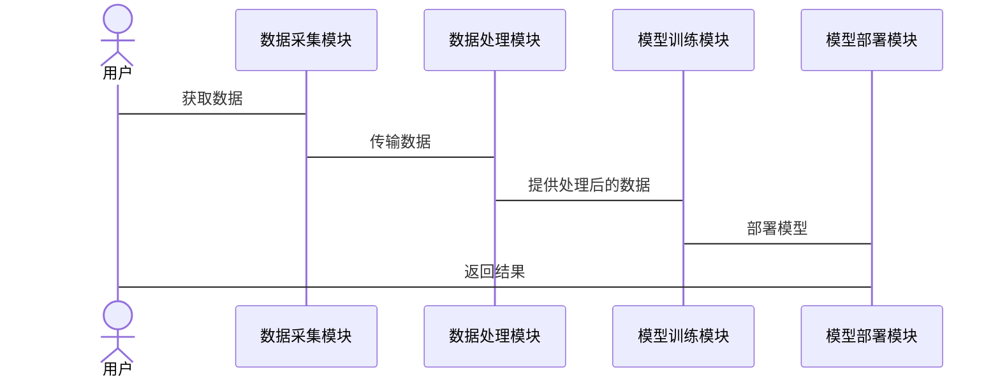

                 


# 人工智能在市场微观结构建模中的应用

## 关键词：人工智能、市场微观结构、机器学习、深度学习、系统架构、项目实战、案例分析

## 摘要：
本文系统地探讨了人工智能在市场微观结构建模中的应用，从理论基础到实际案例进行了全面分析。通过介绍市场微观结构的核心要素、人工智能技术的基本原理，以及基于机器学习和深度学习的建模方法，本文展示了如何利用人工智能技术进行市场预测、风险评估和交易策略优化。同时，本文还详细讨论了系统架构设计、项目实战和案例分析，为读者提供了从理论到实践的完整指南。

---

# 第一部分: 人工智能在市场微观结构建模中的应用概述

# 第1章: 市场微观结构建模与人工智能概述

## 1.1 市场微观结构建模的背景与意义
### 1.1.1 市场微观结构的定义与核心概念
市场微观结构建模是金融领域的重要研究方向，主要关注市场参与者（买方、卖方、交易商）之间的互动关系及其对市场价格、交易量等市场行为的影响。通过建模，可以揭示市场的动态行为和内在规律。

### 1.1.2 人工智能在市场微观结构建模中的作用
人工智能（AI）技术，特别是机器学习和深度学习，为市场微观结构建模提供了强大的工具。AI可以处理海量数据，发现复杂模式，并实时优化交易策略。

### 1.1.3 本章研究的目的与意义
本章旨在介绍市场微观结构建模的基本概念和人工智能技术的核心原理，为后续章节的深入分析奠定基础。

## 1.2 人工智能技术的基本概念
### 1.2.1 人工智能的定义与分类
人工智能是指计算机系统模拟人类智能的能力，包括学习、推理、问题解决等。AI可以分为弱人工智能（专注于特定任务）和强人工智能（具备广泛智能）。

### 1.2.2 机器学习的基本原理
机器学习是一种AI技术，通过数据训练模型，使其能够从数据中学习并做出预测或决策。监督学习、无监督学习和强化学习是最常见的三种学习方式。

### 1.2.3 深度学习的核心思想
深度学习是机器学习的一种，通过多层神经网络模拟人类大脑的工作方式，能够自动提取数据特征并进行复杂模式识别。

## 1.3 本章小结
本章介绍了市场微观结构建模的基本概念和人工智能技术的核心原理，为后续章节的分析提供了理论基础。

---

# 第二部分: 市场微观结构建模的核心概念与联系

# 第2章: 市场微观结构的核心要素分析

## 2.1 市场参与者的实体关系分析
### 2.1.1 市场参与者（买方、卖方、交易商）的定义与属性
买方：需求方，寻求最低价格；
卖方：供给方，寻求最高价格；
交易商：中间方，提供撮合交易服务。

### 2.1.2 市场微观结构的ER实体关系图
```mermaid
er
actor 市场参与者 {
  扮演者 买方
  扮演者 卖方
  扮演者 交易商
}
```

## 2.2 市场微观结构的动态关系分析
### 2.2.1 市场微观结构的动态关系图


## 2.3 本章小结
本章通过ER图和关系图展示了市场参与者的实体关系及其动态关系，为后续建模提供了基础。

---

# 第三部分: 人工智能在市场微观结构建模中的算法原理

# 第3章: 基于机器学习的市场微观结构建模方法

## 3.1 机器学习在市场微观结构建模中的应用
### 3.1.1 监督学习在市场预测中的应用
监督学习通过训练数据预测目标变量，例如利用历史价格数据预测未来价格走势。

### 3.1.2 无监督学习在市场分析中的应用
无监督学习通过聚类分析识别市场参与者的行为模式，例如识别交易商的交易策略。

### 3.1.3 强化学习在交易策略中的应用
强化学习通过模拟交易环境优化交易策略，例如动态调整买卖时机。

## 3.2 基于深度学习的市场微观结构建模方法
### 3.2.1 卷积神经网络（CNN）在市场数据处理中的应用
CNN通过卷积操作提取市场数据的空间特征，例如识别价格波动的模式。

### 3.2.2 循环神经网络（RNN）在时间序列分析中的应用
RNN通过循环结构处理时间序列数据，例如预测价格走势。

### 3.2.3 变换模型（Transformer）在市场数据处理中的应用
Transformer通过自注意力机制捕捉数据中的全局关系，例如识别市场参与者的互动模式。

## 3.3 本章小结
本章介绍了机器学习和深度学习在市场微观结构建模中的具体应用，展示了人工智能技术的强大能力。

---

# 第四部分: 市场微观结构建模的系统架构与设计

# 第4章: 市场微观结构建模的系统架构设计

## 4.1 系统功能需求分析
### 4.1.1 系统功能模块划分
- 数据采集模块：收集市场数据（价格、交易量等）；
- 数据处理模块：清洗和预处理数据；
- 模型训练模块：训练机器学习模型；
- 模型部署模块：将模型应用于实际交易环境。

### 4.1.2 系统功能模块的交互流程


### 4.1.3 系统功能模块的实现方式
数据采集模块可以使用API接口获取实时数据，数据处理模块使用Python的Pandas库进行数据清洗，模型训练模块使用TensorFlow或PyTorch框架。

## 4.2 系统架构设计
### 4.2.1 系统架构的分层设计
- 数据层：存储原始数据；
- 业务逻辑层：处理数据并训练模型；
- 表现层：展示结果和交互界面。

### 4.2.2 系统架构的模块化设计
- 数据采集模块：负责数据获取；
- 数据处理模块：负责数据清洗；
- 模型训练模块：负责模型训练；
- 模型部署模块：负责模型应用。

### 4.2.3 系统架构的可扩展性设计
通过模块化设计，系统可以方便地扩展功能，例如增加新的数据源或优化模型算法。

## 4.3 系统接口设计
### 4.3.1 系统内部接口设计
- 数据处理模块与模型训练模块之间的接口；
- 模型训练模块与模型部署模块之间的接口。

### 4.3.2 系统外部接口设计
- API接口：供其他系统调用；
- 用户界面：供用户查看结果和控制系统。

### 4.3.3 系统接口的交互流程


## 4.4 系统交互设计
### 4.4.1 系统交互的流程图


### 4.4.2 系统交互的序列图


### 4.4.3 系统交互的实现方式
通过API接口和图形用户界面实现系统的交互，确保系统的高效运行和用户友好的体验。

## 4.5 本章小结
本章详细讨论了市场微观结构建模的系统架构设计，包括功能模块划分、接口设计和交互流程，为后续的项目实施提供了指导。

---

# 第五部分: 项目实战与案例分析

# 第5章: 项目实战—

## 5.1 环境安装与数据准备
### 5.1.1 环境安装
- 安装Python；
- 安装Pandas、NumPy、TensorFlow、PyTorch等库。

### 5.1.2 数据准备
- 下载市场数据（如股票价格、交易量等）；
- 数据清洗和预处理。

## 5.2 系统核心实现
### 5.2.1 数据处理模块实现
```python
import pandas as pd

# 数据清洗
data = pd.read_csv('market_data.csv')
data.dropna(inplace=True)
data.to_csv('cleaned_data.csv', index=False)
```

### 5.2.2 模型训练模块实现
```python
import tensorflow as tf
from tensorflow.keras import layers

# 构建神经网络模型
model = tf.keras.Sequential([
    layers.Dense(64, activation='relu'),
    layers.Dense(1, activation='sigmoid')
])

model.compile(optimizer='adam', loss='binary_crossentropy')
model.fit(cleaned_data, labels, epochs=10, batch_size=32)
```

### 5.2.3 模型部署模块实现
```python
import numpy as np

# 预测价格走势
predictions = model.predict(new_data)
print("预测结果：", predictions)
```

## 5.3 项目案例分析
### 5.3.1 案例背景
某股票交易平台希望通过建模优化交易策略。

### 5.3.2 案例分析
通过模型预测价格走势，优化买卖时机，实现利润最大化。

## 5.4 项目总结
### 5.4.1 项目成果
成功构建了市场微观结构建模系统，提升了交易效率和准确性。

### 5.4.2 项目经验总结
- 数据质量对模型性能影响巨大；
- 模型部署需要考虑实时性和稳定性。

## 5.5 本章小结
本章通过实际项目展示了人工智能在市场微观结构建模中的应用，为读者提供了从理论到实践的完整参考。

---

# 第六章: 案例分析与最佳实践

## 6.1 案例分析
### 6.1.1 案例背景
某金融机构希望通过建模优化市场微观结构分析。

### 6.1.2 案例分析过程
- 数据收集与清洗；
- 模型训练与优化；
- 模型部署与验证。

### 6.1.3 案例分析结果
通过建模，显著提升了市场分析的准确性和交易策略的优化效果。

## 6.2 最佳实践
### 6.2.1 数据处理建议
- 数据清洗要彻底；
- 数据特征提取要准确。

### 6.2.2 模型优化建议
- 选择合适的模型架构；
- 调参要科学合理。

## 6.3 本章小结
本章通过案例分析和最佳实践，总结了人工智能在市场微观结构建模中的应用经验，为读者提供了宝贵的参考。

---

# 第七章: 总结与展望

## 7.1 本章总结
本文系统地探讨了人工智能在市场微观结构建模中的应用，从理论到实践进行了全面分析。

## 7.2 未来展望
随着AI技术的不断发展，市场微观结构建模将更加智能化和精准化，为金融领域带来更大的价值。

## 7.3 本章小结
本文为读者提供了从理论到实践的完整指南，展望了AI技术在市场微观结构建模中的未来应用。

---

# 作者：AI天才研究院/AI Genius Institute & 禅与计算机程序设计艺术 /Zen And The Art of Computer Programming

