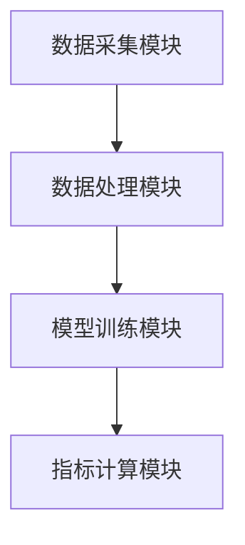
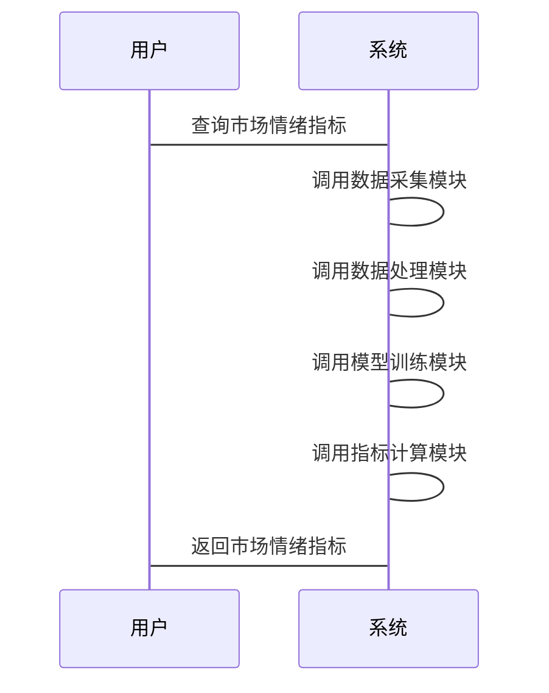

                 


# 人工智能在市场情绪指标构建中的应用

---

## 关键词：
- 人工智能
- 市场情绪指标
- 机器学习
- 自然语言处理
- 时间序列分析

---

## 摘要：
市场情绪指标是金融市场中用于衡量投资者情绪的重要工具，其准确性对金融决策具有重要影响。随着人工智能技术的快速发展，利用机器学习、自然语言处理和时间序列分析等技术，可以更高效、更精准地构建市场情绪指标。本文从市场情绪指标的基础概念出发，结合人工智能技术，详细探讨了市场情绪指标的构建方法、系统架构设计及实际应用案例，最后展望了未来的研究方向。

---

# 第1章: 市场情绪指标概述

## 1.1 市场情绪指标的定义与作用

### 1.1.1 市场情绪指标的定义
市场情绪指标（Market Sentiment Index）是用来衡量投资者对市场看法的量化指标，反映了市场的乐观或悲观情绪。它通常通过分析新闻、社交媒体、交易数据等多种来源得出。

### 1.1.2 市场情绪指标的作用与意义
- 帮助投资者预测市场走势。
- 为金融机构提供决策支持。
- 用于风险管理，识别市场拐点。

### 1.1.3 市场情绪指标的构建目标
构建一个能够实时反映市场情绪、准确预测市场走势的指标体系。

## 1.2 人工智能在市场情绪分析中的应用背景

### 1.2.1 传统市场情绪指标的局限性
- 数据来源单一，难以捕捉多维度情绪。
- 计算复杂，实时性差。
- 无法处理非结构化数据（如文本、图像）。

### 1.2.2 人工智能技术的优势
- 高效处理结构化和非结构化数据。
- 精准分析情绪，捕捉市场波动。
- 实时性高，支持动态调整。

### 1.2.3 市场情绪指标与金融决策的关系
市场情绪指标是金融决策的重要参考，能够帮助投资者更好地理解市场动态。

---

# 第2章: 人工智能技术基础

## 2.1 机器学习基础

### 2.1.1 机器学习的基本概念
- 机器学习：通过数据训练模型，使其能够完成特定任务。
- 监督学习：基于标记数据进行预测。
- 无监督学习：发现数据中的隐含结构。
- 强化学习：通过奖励机制优化决策。

### 2.1.2 常见机器学习算法简介
- 线性回归：用于回归问题。
- 支持向量机（SVM）：用于分类和回归。
- 随机森林：用于分类和回归。
- 神经网络：用于复杂模式识别。

## 2.2 自然语言处理（NLP）基础

### 2.2.1 NLP的基本概念与技术
- 词袋模型：将文本表示为词的集合。
- 词嵌入：通过神经网络学习词的向量表示。
- 分句：识别文本中的句子结构。

### 2.2.2 常见NLP任务与算法
- 情感分析：判断文本的情感倾向。
- 主题建模：发现文本的主题分布。
- 实体识别：识别文本中的实体。

### 2.2.3 NLP在情感分析中的应用
- 使用情感分析模型对新闻标题进行情绪分类。
- 通过主题建模识别市场讨论的主要话题。

## 2.3 时间序列分析基础

### 2.3.1 时间序列的基本概念
- 时间序列：按时间顺序排列的数据。
- 时间序列分析：研究数据随时间的变化规律。

### 2.3.2 常见时间序列分析方法
- 移动平均法：基于过去若干期的平均值预测未来。
- 自回归模型（ARIMA）：基于历史数据预测未来。
- 长短期记忆网络（LSTM）：处理长序列数据。

### 2.3.3 时间序列预测的挑战与解决方案
- 数据噪声大：使用滤波技术处理。
- 数据非线性：使用深度学习模型捕捉复杂模式。

---

# 第3章: 市场情绪指标构建的核心概念与联系

## 3.1 核心概念原理

### 3.1.1 市场情绪指标的核心要素
- 数据来源：新闻、社交媒体、交易数据。
- 特征提取：文本情感、市场波动、交易量。
- 情绪分类： bullish（乐观）、bearish（悲观）、neutral（中性）。

### 3.1.2 人工智能在情绪识别中的作用
- 使用NLP技术分析文本情绪。
- 使用时间序列模型预测情绪变化。
- 使用机器学习模型整合多源数据。

### 3.1.3 数据来源与特征提取
- 数据清洗：处理缺失值、异常值。
- 特征工程：提取情感得分、关键词频率。
- 数据增强：增加数据多样性。

## 3.2 情绪指标与市场行为的关系

### 3.2.1 情绪指标与市场波动的关系
- 市场情绪过度乐观可能导致价格泡沫。
- 市场情绪过度悲观可能导致价格超跌。

### 3.2.2 市场情绪指标与投资者行为
- 投资者情绪影响市场流动性。
- 市场情绪指标可以帮助投资者做出更明智的决策。

---

# 第4章: 市场情绪指标的系统架构设计

## 4.1 系统功能设计

### 4.1.1 系统模块划分
- 数据采集模块：从新闻网站、社交媒体、交易数据源获取数据。
- 数据处理模块：清洗、转换、增强数据。
- 模型训练模块：训练情感分析模型、时间序列预测模型。
- 指标计算模块：根据模型输出计算市场情绪指标。

### 4.1.2 系统功能流程
- 数据采集 → 数据处理 → 模型训练 → 指标计算。

## 4.2 系统架构设计

### 4.2.1 系统架构图


### 4.2.2 系统接口设计
- 数据接口：与数据源对接。
- 模型接口：与训练模型对接。
- 用户接口：提供指标查询功能。

## 4.3 系统交互设计

### 4.3.1 系统交互流程
- 用户查询市场情绪指标。
- 系统调用数据采集模块获取数据。
- 数据处理模块处理数据。
- 模型训练模块训练模型。
- 指标计算模块计算指标并返回结果。

### 4.3.2 系统交互图


---

# 第5章: 项目实战

## 5.1 环境配置

### 5.1.1 系统环境
- 操作系统：Linux/Mac/Windows。
- 开发工具：Python、Jupyter Notebook、IDE。

### 5.1.2 依赖安装
- Python库：numpy、pandas、scikit-learn、tensorflow、pytorch。
- 数据源：新闻API、社交媒体API。

## 5.2 系统核心实现源代码

### 5.2.1 数据采集模块
```python
import requests
import json

def fetch_news_data(api_key):
    url = f"https://api.example.com/news?api_key={api_key}"
    response = requests.get(url)
    return json.loads(response.text)
```

### 5.2.2 数据处理模块
```python
import pandas as pd

def preprocess_data(data):
    df = pd.DataFrame(data)
    df = df.dropna()
    df['date'] = pd.to_datetime(df['date'])
    return df
```

### 5.2.3 情感分析模型
```python
from tensorflow.keras.models import Sequential
from tensorflow.keras.layers import Dense, LSTM

def build_emotion_model(input_shape):
    model = Sequential()
    model.add(LSTM(64, input_shape=input_shape))
    model.add(Dense(3, activation='softmax'))
    model.compile(optimizer='adam', loss='categorical_crossentropy', metrics=['accuracy'])
    return model
```

## 5.3 案例分析与详细解读

### 5.3.1 数据来源与特征提取
- 数据来源：新闻网站、社交媒体、交易数据。
- 特征提取：文本情感得分、关键词频率、市场波动率。

### 5.3.2 模型训练与评估
- 训练数据：分割为训练集和测试集。
- 模型评估：准确率、召回率、F1分数。

## 5.4 项目小结
- 成功构建了市场情绪指标系统。
- 系统具有实时性和准确性。
- 可扩展性高，支持多源数据输入。

---

# 第6章: 未来研究与展望

## 6.1 当前研究热点
- 多模态数据融合：结合文本、图像等多种数据源。
- 智能解释性：提高模型的可解释性。
- 实时性优化：提升系统的响应速度。

## 6.2 未来挑战
- 数据隐私问题：如何保护用户隐私。
- 模型泛化能力：如何在不同市场中通用。
- 算法优化：如何提高模型的准确性和效率。

## 6.3 未来发展方向
- 探索更先进的机器学习算法。
- 结合区块链技术，确保数据安全。
- 研究更复杂的情绪识别方法。

---

# 作者：AI天才研究院 & 禅与计算机程序设计艺术

---

**注意**：以上内容为基于用户要求的思考过程，实际文章撰写需根据具体需求进行调整和补充。

