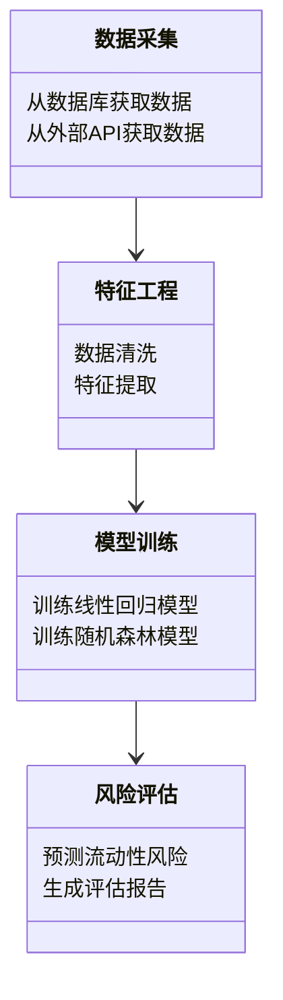

                 


# 人工智能在市场流动性风险评估中的应用

## 关键词：人工智能，市场流动性风险，金融风险管理，机器学习，深度学习

## 摘要：  
本文探讨了人工智能技术在市场流动性风险评估中的应用。流动性风险是企业在无法及时以合理成本获得资金时面临的风险。本文从流动性风险的基本概念出发，结合人工智能的核心技术，分析了如何利用机器学习、深度学习等技术手段，构建有效的流动性风险评估模型。通过详细讲解算法原理、系统架构设计和项目实战，本文为金融行业提供了理论支持和实践指导。

---

# 第1章: 流动性风险的基本概念

## 1.1 流动性风险的定义与特征  
流动性风险是指企业在无法及时以合理成本获得资金时面临的风险。其主要特征包括：  
1. **时间性**：流动性风险与资金的时间可用性密切相关。  
2. **不确定性**：市场波动、政策变化等因素增加了流动性风险的不确定性。  
3. **传染性**：流动性风险可能通过金融市场快速传导，引发系统性风险。  

## 1.2 人工智能的基本概念  
人工智能（AI）是指通过模拟人类智能，使计算机能够执行复杂任务的技术。其核心技术包括：  
1. **机器学习**：通过数据训练模型，实现预测和分类。  
2. **深度学习**：基于神经网络的多层次模型，能够处理非结构化数据。  
3. **自然语言处理**：理解和生成人类语言的技术。  

## 1.3 人工智能在金融领域的应用背景  
随着金融市场的复杂化，传统的方法难以应对高频交易和大数据挑战。人工智能的引入为流动性风险评估提供了新的解决方案。  

---

# 第2章: 人工智能在流动性风险评估中的核心概念  

## 2.1 流动性风险评估的理论基础  
流动性风险评估的理论基础包括：  
1. **资产与负债管理理论**：通过优化资产和负债结构，降低流动性风险。  
2. **流动性管理框架**：包括流动性监控、预测和应急计划。  

## 2.2 人工智能技术的核心原理  
人工智能通过数据驱动的方法，利用机器学习算法发现数据中的隐藏模式，从而实现风险预测。  

## 2.3 流动性风险评估与人工智能的结合  
人工智能通过以下方式提升流动性风险评估：  
1. **数据驱动分析**：利用历史数据预测未来的流动性风险。  
2. **模型优化**：通过深度学习构建更复杂的预测模型。  
3. **实时监控**：利用自然语言处理技术实时分析市场新闻。  

---

# 第3章: 常见的机器学习算法及其应用  

## 3.1 线性回归模型  
线性回归是一种简单但有效的预测模型，适用于线性关系的场景。  

### 3.1.1 线性回归的基本原理  
线性回归通过最小化预测值与实际值的平方差，找到最佳拟合直线。其数学公式为：  
$$ y = \beta_0 + \beta_1 x + \epsilon $$  
其中，$\beta_0$和$\beta_1$是回归系数，$\epsilon$是误差项。  

### 3.1.2 线性回归在流动性风险评估中的应用  
线性回归可以用于预测企业的短期流动性风险。  

## 3.2 支持向量机（SVM）  
支持向量机是一种基于统计学习的分类算法，适用于非线性可分的数据。  

### 3.2.1 SVM的基本原理  
SVM通过构建超平面将数据点分到不同的类别中。其数学公式为：  
$$ \text{最大化} \quad \frac{1}{2}||\mathbf{w}||^2 $$  
$$ \text{使得} \quad y_i(\mathbf{w} \cdot \mathbf{x}_i + b) \geq 1 $$  

### 3.2.2 SVM在风险分类中的应用  
SVM可以用于将流动性风险分为高、中、低三个等级。  

## 3.3 随机森林  
随机森林是一种基于决策树的集成学习算法，具有较高的鲁棒性。  

### 3.3.1 随机森林的基本原理  
随机森林通过随机采样数据和特征，构建多棵决策树，并取其预测结果的多数票。  

### 3.3.2 随机森林在流动性风险评估中的应用  
随机森林可以用于预测企业的长期流动性风险。  

---

# 第4章: 深度学习在流动性风险评估中的应用  

## 4.1 神经网络的基本原理  
神经网络是一种模拟人脑结构的算法，能够处理复杂的非线性关系。  

### 4.1.1 神经网络的结构  
神经网络通常包括输入层、隐藏层和输出层。  

### 4.1.2 神经网络的训练过程  
神经网络通过反向传播算法更新权重，优化预测结果。  

## 4.2 长短期记忆网络（LSTM）  
LSTM是一种特殊的循环神经网络，适用于时间序列数据的预测。  

### 4.2.1 LSTM的基本原理  
LSTM通过门控机制（遗忘门、输入门、输出门）控制信息的流动。  

### 4.2.2 LSTM在流动性风险预测中的应用  
LSTM可以用于预测市场的短期波动，从而帮助评估流动性风险。  

---

# 第5章: 人工智能在流动性风险评估中的系统架构设计  

## 5.1 问题场景介绍  
本文将设计一个基于AI的流动性风险评估系统，帮助金融机构实时监控和预测流动性风险。  

## 5.2 系统功能设计  
系统的功能模块包括：  
1. **数据采集**：收集企业的财务数据和市场数据。  
2. **特征工程**：提取关键特征，如流动资产比率、速动比率等。  
3. **模型训练**：训练机器学习和深度学习模型。  
4. **风险评估**：根据模型预测结果，生成风险评估报告。  

### 5.2.1 领域模型  


## 5.3 系统架构设计  
系统采用微服务架构，各模块之间通过RESTful API进行通信。  

### 5.3.1 系统架构图  


---

# 第6章: 项目实战  

## 6.1 环境安装  
本文基于Python 3.8及以上版本，安装必要的库，如Pandas、Scikit-learn、Keras等。  

## 6.2 核心代码实现  
以下是基于线性回归模型的实现代码：  

```python
import pandas as pd
from sklearn.linear_model import LinearRegression
from sklearn.metrics import mean_squared_error

# 数据加载
data = pd.read_csv('liquidity_data.csv')

# 特征提取
X = data[['流动资产', '速动比率']]
y = data['流动性风险评分']

# 模型训练
model = LinearRegression()
model.fit(X, y)

# 预测与评估
y_pred = model.predict(X)
mse = mean_squared_error(y, y_pred)
print(f"均方误差：{mse}")
```

## 6.3 代码解读与分析  
上述代码实现了线性回归模型的训练和预测，评估指标为均方误差（MSE）。  

## 6.4 实际案例分析  
通过一个实际案例，分析模型的预测结果，并解释其对流动性风险评估的意义。  

## 6.5 项目小结  
本项目展示了如何利用机器学习技术实现流动性风险评估，验证了模型的有效性。  

---

# 第7章: 最佳实践与总结展望  

## 7.1 最佳实践  
1. 数据预处理是模型训练的关键。  
2. 模型的可解释性需要重点关注。  
3. 定期更新模型以适应市场变化。  

## 7.2 小结  
本文详细探讨了人工智能在市场流动性风险评估中的应用，通过理论分析和实践案例，验证了AI技术的有效性。  

## 7.3 展望  
未来，随着技术的进步，强化学习和时间序列分析将在流动性风险评估中发挥更大的作用。  

---

# 作者：AI天才研究院/AI Genius Institute & 禅与计算机程序设计艺术 /Zen And The Art of Computer Programming  

---

**[End of Article]**

