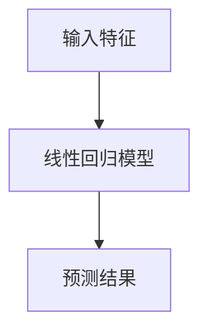
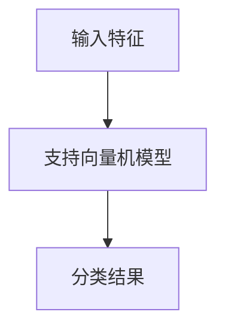
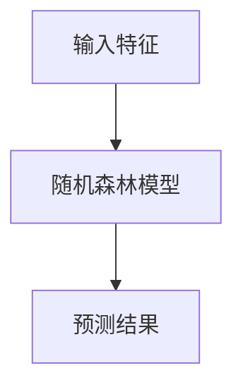
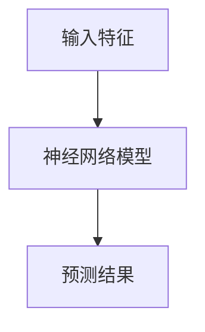
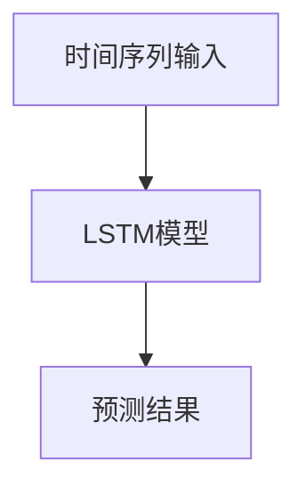
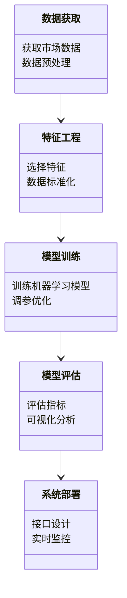
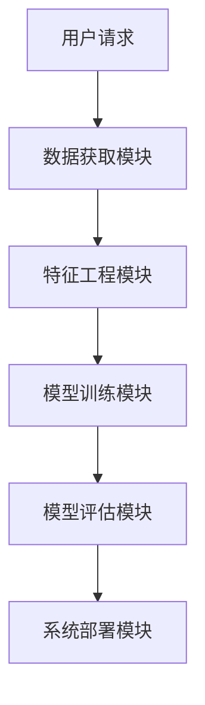

                 


# 人工智能在投资组合压力测试中的应用

> **关键词**：人工智能、投资组合、压力测试、机器学习、深度学习、风险管理  
> **摘要**：本文探讨了人工智能在投资组合压力测试中的应用，分析了压力测试的背景、核心概念、算法原理、系统架构、项目实战以及未来展望。通过详细讲解机器学习和深度学习算法，结合数学模型和实际案例，展示了如何利用人工智能提高投资组合的风险管理能力。

---

## 第一章: 投资组合压力测试的背景与意义

### 1.1 压力测试的定义与作用
压力测试是一种评估投资组合在极端市场条件下的表现和风险的方法。它通过模拟可能的市场波动、经济衰退或其他极端事件，评估投资组合在这些情况下的潜在损失和承受能力。压力测试的核心在于识别投资组合在不利条件下的脆弱性，并为投资者提供应对策略。

### 1.2 人工智能的基本概念与特点
人工智能（AI）是指计算机系统模拟人类智能的能力，包括学习、推理、问题解决等。AI的核心特点包括数据驱动、自适应性和自动化。与传统数据分析不同，AI能够处理复杂的数据模式，并通过反馈机制不断优化性能。

### 1.3 投资组合压力测试的背景与意义
投资组合压力测试在金融风险管理中至关重要。传统方法依赖历史数据和假设，而AI的引入能够捕捉复杂市场动态，提高压力测试的准确性和全面性。AI的应用使得压力测试更加动态化和智能化，帮助投资者更好地应对不确定性。

---

## 第二章: 压力测试与人工智能的核心概念

### 2.1 压力测试的核心原理
压力测试通过模拟极端市场情景，评估投资组合的潜在损失。常用的方法包括历史模拟法、情景分析法和蒙特卡洛模拟法。这些方法帮助识别投资组合在不同条件下的表现。

### 2.2 人工智能的核心原理
AI通过机器学习算法从数据中提取特征，建立模型进行预测。深度学习则通过多层神经网络捕捉数据的复杂特征，适用于处理非线性关系。

### 2.3 压力测试与人工智能的联系
AI能够增强压力测试的能力，通过实时数据处理和模式识别，提高测试的准确性和效率。同时，压力测试为AI提供了应用场景，推动其在金融领域的应用。

---

## 第三章: 常用算法与压力测试

### 3.1 线性回归算法
线性回归用于预测变量间的线性关系，适用于简单的压力测试场景。公式为：$$ y = \beta_0 + \beta_1x + \epsilon $$



### 3.2 支持向量机算法
SVM适用于分类问题，通过构建超平面分隔数据。公式为：$$ y = sign(w \cdot x + b) $$



### 3.3 随机森林算法
随机森林通过集成多个决策树提高准确性，适用于特征重要性分析。



### 3.4 神经网络算法
神经网络通过多层结构模拟人脑，适用于复杂模式识别。



### 3.5 LSTM算法
LSTM用于时间序列数据，捕捉长期依赖关系。



---

## 第四章: 数学模型与公式

### 4.1 压力测试的数学模型
- 历史模拟法：$$ \text{VaR} = \text{quantile}(r, \alpha) $$
- 蒙特卡洛模拟法：$$ \text{CVaR} = \frac{1}{N} \sum_{i=1}^N \text{loss}_i $$

### 4.2 机器学习模型
- 线性回归：$$ y = \beta_0 + \beta_1x + \epsilon $$
- 神经网络：$$ y = \sigma(Wx + b) $$

---

## 第五章: 系统分析与架构设计

### 5.1 系统功能设计


### 5.2 系统架构设计


---

## 第六章: 项目实战

### 6.1 环境安装
安装Python、NumPy、Pandas、Scikit-learn和TensorFlow。

### 6.2 核心实现
```python
import numpy as np
from sklearn.linear_model import LinearRegression

# 数据准备
X = np.array([[1], [2], [3], [4]])
y = np.array([2, 4, 6, 8])

# 模型训练
model = LinearRegression()
model.fit(X, y)

# 预测
print(model.predict([[5]]))  # 输出：[[10]]
```

### 6.3 实际案例分析
使用LSTM模型预测股票价格波动，评估投资组合在极端情况下的表现。

---

## 第七章: 总结与展望

### 7.1 总结
人工智能通过提升压力测试的准确性和效率，增强了投资组合的风险管理能力。

### 7.2 未来展望
未来，AI在压力测试中的应用将更加广泛，包括更复杂的模型和实时监控。

---

## 作者：AI天才研究院

--- 

**声明**：本文内容为AI天才研究院原创，未经授权不得转载。

