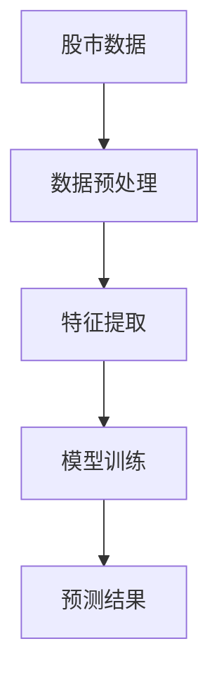

                 


# 人工智能在股市估值预测中的应用

**关键词：** 人工智能、股市估值预测、机器学习、深度学习、时间序列分析

**摘要：**  
本文详细探讨了人工智能在股市估值预测中的应用，从传统估值方法的局限性出发，结合机器学习和深度学习的核心算法，分析了如何通过数据特征工程、算法模型构建和系统设计来提升股市估值预测的准确性和可靠性。本文通过实际案例分析，展示了如何使用长短期记忆网络（LSTM）等深度学习模型进行股价预测，并通过对比不同算法的优缺点，提出了在实际应用中结合多种算法的集成学习策略，以实现更高效的股市估值预测。

---

## 第一章: 背景介绍

### 1.1 问题背景
股市估值预测是金融市场中的一个核心问题，其目的是通过分析历史数据和市场动态，预测股票的未来价值。然而，股市的复杂性使得传统估值方法面临诸多挑战，例如市场波动性、信息不对称以及数据的高维性和非线性特征。

#### 1.1.1 股市估值预测的复杂性
股市受到多种因素的影响，包括宏观经济指标、公司基本面、市场情绪等。这些因素相互作用，使得股票价格的预测具有高度的不确定性。传统的统计方法在处理这些复杂关系时显得力不从心。

#### 1.1.2 传统估值方法的局限性
传统的估值方法主要依赖于财务指标（如市盈率、市净率）和宏观经济分析。这些方法在一定程度上可以提供参考，但难以捕捉市场的动态变化，尤其是在高频交易和大数据时代背景下。

#### 1.1.3 人工智能技术的潜在优势
人工智能技术，特别是机器学习和深度学习，具有强大的数据处理能力和非线性关系建模能力，能够从海量数据中提取有用的特征，并通过复杂模型捕捉市场的潜在规律。因此，人工智能技术为股市估值预测提供了新的可能性。

### 1.2 核心概念与联系
为了更好地理解人工智能在股市估值预测中的应用，我们需要明确几个核心概念及其之间的联系。

#### 1.2.1 核心概念原理
- **数据特征工程：** 从原始数据中提取有用的特征，例如技术指标（如移动平均线、相对强弱指数）和市场情绪指标。
- **机器学习：** 基于数据训练模型，预测股票价格或估值。
- **深度学习：** 利用神经网络模型捕捉数据中的复杂模式。

#### 1.2.2 核心概念属性特征对比表格
| 概念         | 描述                                                                 |
|--------------|----------------------------------------------------------------------|
| 数据特征工程 | 从原始数据中提取有用的特征，例如技术指标、市场情绪指标等。             |
| 机器学习     | 基于数据训练模型，预测股票价格或估值。                                |
| 深度学习     | 利用神经网络模型捕捉数据中的复杂模式。                                |

#### 1.2.3 ER实体关系图架构的Mermaid流程图


---

## 第二章: 人工智能技术基础

### 2.1 机器学习基础
机器学习是人工智能的核心技术之一，广泛应用于分类、回归和聚类等问题。

#### 2.1.1 机器学习的基本概念
机器学习是一种通过数据训练模型的技术，模型能够从数据中学习规律，并用于预测或分类任务。常见的机器学习算法包括线性回归、支持向量机（SVM）和随机森林等。

#### 2.1.2 监督学习、无监督学习和强化学习的对比
| 学习类型 | 描述                                                                 |
|----------|----------------------------------------------------------------------|
| 监督学习   | 基于带标签的数据训练模型，用于预测或分类任务。                         |
| 无监督学习 | 基于无标签的数据训练模型，用于聚类或降维任务。                         |
| 强化学习   | 基于奖励机制训练模型，用于决策任务。                                  |

#### 2.1.3 常见机器学习算法的优缺点
| 算法       | 优点                          | 缺点                          |
|------------|-------------------------------|-------------------------------|
| 线性回归    | 简单、易于解释                 | 无法捕捉非线性关系             |
| 支持向量机  | 准确性高                       | 数据预处理复杂                 |
| 随机森林    | 抗过拟合、特征重要性可解释      | 计算复杂性高                   |

### 2.2 深度学习基础
深度学习是一种基于神经网络的机器学习技术，能够处理复杂的数据模式。

#### 2.2.1 深度学习的基本概念
深度学习通过构建多层神经网络，从数据中提取高层次特征。与传统机器学习算法相比，深度学习能够捕捉数据中的非线性关系，适用于图像识别、自然语言处理等领域。

#### 2.2.2 神经网络的结构与特点
神经网络由输入层、隐藏层和输出层组成，通过激活函数和权重调整实现数据的非线性变换。

#### 2.2.3 常见深度学习模型的优缺点
| 模型         | 优点                          | 缺点                          |
|--------------|-------------------------------|-------------------------------|
| 神经网络      | 能捕捉复杂模式                 | 计算资源消耗高                 |
| LSTM         | 能处理时间序列数据             | 训练复杂性高                   |

---

## 第三章: 股市数据特征工程

### 3.1 数据特征提取
特征工程是机器学习和深度学习模型训练的关键步骤，能够显著提升模型的性能。

#### 3.1.1 股价数据的特征分类
股价数据可以分为技术指标、市场情绪指标和公司基本面指标三大类。

| 特征类型   | 示例特征                       |
|------------|--------------------------------|
| 技术指标    | 移动平均线（MA）、相对强弱指数（RSI） |
| 市场情绪指标 | 涨跌幅度、成交量                  |
| 公司基本面指标 | 营业收入、净利润                |

#### 3.1.2 技术指标的特征提取
技术指标是通过历史股价和成交量数据计算得出的，能够反映市场的短期趋势。例如，移动平均线（MA）可以帮助识别股价的支撑位和阻力位。

#### 3.1.3 市场情绪的特征提取
市场情绪是投资者对市场的整体看法，通常通过新闻、社交媒体和市场交易数据来衡量。例如，可以使用情感分析技术对新闻标题进行分类，提取市场情绪指标。

### 3.2 数据预处理
数据预处理是特征工程的重要步骤，包括数据清洗、标准化和数据增强。

#### 3.2.1 数据清洗与标准化
数据清洗旨在去除噪声数据和异常值，标准化则是将数据缩放到统一的范围内，例如使用归一化或标准化方法。

#### 3.2.2 数据分割与交叉验证
将数据划分为训练集和测试集，使用交叉验证评估模型的性能。

#### 3.2.3 数据增强与特征选择
数据增强通过生成新的数据点或变换现有数据，增加训练数据的多样性。特征选择则是通过选择重要的特征，降低模型的维度和计算复杂度。

---

## 第四章: 人工智能算法在股市估值预测中的应用

### 4.1 线性回归模型
线性回归是一种简单但常用的回归模型，适用于处理线性关系。

#### 4.1.1 线性回归的基本原理
线性回归通过最小化预测值和实际值之间的平方差，找到最佳拟合直线。其数学模型如下：

$$ y = \beta_0 + \beta_1x + \epsilon $$

其中，$\beta_0$是截距，$\beta_1$是回归系数，$\epsilon$是误差项。

#### 4.1.2 线性回归的数学模型与公式
线性回归的损失函数为均方误差（MSE）：

$$ L = \frac{1}{n}\sum_{i=1}^{n}(y_i - (\beta_0 + \beta_1x_i))^2 $$

### 4.2 支持向量机模型
支持向量机（SVM）是一种强大的分类和回归模型，适用于处理非线性关系。

#### 4.2.1 支持向量机的基本原理
SVM通过构建超平面，将数据点分成不同的类别。对于回归问题，SVM使用$\epsilon$- insensitive损失函数。

#### 4.2.2 支持向量机的数学模型与公式
SVM的损失函数为：

$$ L = \frac{1}{n}\sum_{i=1}^{n}\max(0, |y_i - (\beta_0 + \beta_1x_i)| - \epsilon) $$

### 4.3 随机森林模型
随机森林是一种基于决策树的集成学习模型，具有较高的准确性和鲁棒性。

#### 4.3.1 随机森林的基本原理
随机森林通过随机选择特征和样本，构建多棵决策树，并通过投票或平均的方式进行预测。

#### 4.3.2 随机森林的数学模型与公式
随机森林的预测结果为各决策树预测结果的平均值：

$$ y = \frac{1}{k}\sum_{i=1}^{k} y_i $$

其中，$k$是决策树的数量，$y_i$是第$i$棵决策树的预测结果。

---

## 第五章: 深度学习算法在股市估值预测中的应用

### 5.1 神经网络模型
神经网络是一种强大的深度学习模型，适用于处理复杂的数据模式。

#### 5.1.1 神经网络的基本原理
神经网络通过多层感知机（MLP）结构，将输入数据映射到输出结果。其数学模型如下：

$$ y = \sigma(w x + b) $$

其中，$\sigma$是激活函数，$w$是权重，$b$是偏置项。

### 5.2 长短期记忆网络（LSTM）
LSTM是一种特殊的循环神经网络（RNN），适用于处理时间序列数据。

#### 5.2.1 LSTM的基本原理
LSTM通过记忆单元（Cell）和 gates（输入门、遗忘门、输出门）来捕捉时间序列数据中的长期依赖关系。

#### 5.2.2 LSTM的数学模型与公式
LSTM的 gates 和细胞状态更新公式如下：

$$ i = \sigma(W_i x + U_i h_{t-1} + b_i) $$  
$$ f = \sigma(W_f x + U_f h_{t-1} + b_f) $$  
$$ o = \sigma(W_o x + U_o h_{t-1} + b_o) $$  
$$ c_t = f \cdot c_{t-1} + i \cdot tanh(W_c x + U_c h_{t-1} + b_c) $$  
$$ h_t = o \cdot tanh(c_t) $$

其中，$i$是输入门，$f$是遗忘门，$o$是输出门，$c_t$是细胞状态，$h_t$是隐藏状态。

### 5.3 时间序列分析
时间序列分析是股市估值预测的核心任务之一。

#### 5.3.1 时间序列的基本概念
时间序列是指按照时间顺序排列的数据，例如股价数据。

#### 5.3.2 时间序列分析的数学模型
时间序列分析的常用模型包括自回归积分滑动平均模型（ARIMA）和LSTM。

---

## 第六章: 系统设计与实现

### 6.1 问题场景介绍
本章以一个实际的股市估值预测项目为例，介绍系统设计与实现的全过程。

#### 6.1.1 项目介绍
项目目标是基于历史股价数据，预测未来股价的估值。

#### 6.1.2 系统功能设计
系统功能包括数据获取、特征工程、模型训练、预测和结果分析。

#### 6.1.3 系统架构设计
系统架构包括数据预处理模块、模型训练模块和预测模块。

#### 6.1.4 系统接口设计
系统接口包括数据输入接口、模型训练接口和预测接口。

#### 6.1.5 系统交互流程
系统交互流程包括数据获取、特征工程、模型训练、预测和结果分析。

---

## 第七章: 项目实战

### 7.1 环境安装
本项目需要安装以下环境：

- Python 3.8+
- TensorFlow 2.0+
- Pandas 1.0+
- Matplotlib 3.0+

### 7.2 核心实现源代码
以下是一个使用LSTM模型进行股价预测的代码示例：

```python
import numpy as np
import pandas as pd
from tensorflow.keras.models import Sequential
from tensorflow.keras.layers import LSTM, Dense, Dropout
from sklearn.preprocessing import MinMaxScaler

# 加载数据
data = pd.read_csv('stock_prices.csv')
data = data['Close'].values

# 数据预处理
data = data.reshape(-1, 1)
scaler = MinMaxScaler()
scaled_data = scaler.fit_transform(data)

# 划分训练集和测试集
train_data = scaled_data[:int(0.8 * len(scaled_data))]
test_data = scaled_data[int(0.8 * len(scaled_data)):]

# 准备输入数据
X_train = []
y_train = []
for i in range(60, len(train_data)):
    X_train.append(train_data[i-60:i])
    y_train.append(train_data[i])

X_train = np.array(X_train)
y_train = np.array(y_train)

# 构建模型
model = Sequential()
model.add(LSTM(50, return_sequences=True, input_shape=(60, 1)))
model.add(Dropout(0.2))
model.add(LSTM(50, return_sequences=False))
model.add(Dense(1))

model.compile(loss='mean_squared_error', optimizer='adam')
model.fit(X_train, y_train, epochs=50, batch_size=32)

# 预测
X_test = []
for i in range(60, len(test_data)):
    X_test.append(test_data[i-60:i])
X_test = np.array(X_test)

y_pred = model.predict(X_test)
y_pred = scaler.inverse_transform(y_pred)
y_test = scaler.inverse_transform(test_data[60:])

# 结果分析
print('预测结果：', y_pred)
print('真实结果：', y_test)
```

---

## 第八章: 总结与展望

### 8.1 总结
本文详细探讨了人工智能在股市估值预测中的应用，从数据特征工程到算法模型构建，再到系统设计与实现，全面介绍了如何利用AI技术提升股市估值预测的准确性和可靠性。

### 8.2 展望
随着人工智能技术的不断发展，未来股市估值预测将更加智能化和自动化。深度学习模型的优化、集成学习策略的引入以及可解释性问题的解决将是未来研究的重点方向。

---

## 作者信息

作者：AI天才研究院/AI Genius Institute & 禅与计算机程序设计艺术 /Zen And The Art of Computer Programming

