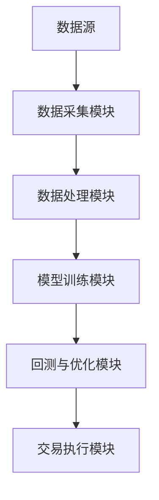

                 


# 人工智能在量化投资中的应用与挑战

> 关键词：量化投资，人工智能，机器学习，算法交易，数据驱动

> 摘要：本文探讨了人工智能在量化投资中的应用与挑战。从背景介绍、核心概念、算法原理、系统架构到项目实战，详细分析了AI如何赋能量化投资，以及在实际应用中面临的挑战和解决方案。

---

# 第一部分: 人工智能在量化投资中的背景与基础

# 第1章: 量化投资与人工智能概述

## 1.1 量化投资的定义与特点
### 1.1.1 量化投资的定义
量化投资是一种基于数学模型和算法的投资方法，通过分析大量数据来寻找投资机会，实现自动化交易和风险管理。

### 1.1.2 量化投资的核心特点
- 数据驱动：依赖大量历史数据进行分析和决策。
- 系统化：建立严格的交易规则和模型，减少人为干预。
- 高频交易：利用算法快速执行交易，捕捉短期市场机会。

### 1.1.3 量化投资在金融领域的应用现状
量化投资已广泛应用于股票、期货、外汇等市场，尤其在高频交易和算法交易中占据重要地位。

## 1.2 人工智能的定义与特点
### 1.2.1 人工智能的定义
人工智能（AI）是模拟人类智能的理论、方法、技术及应用系统，涉及机器学习、自然语言处理等领域。

### 1.2.2 人工智能的核心特点
- 数据驱动：依赖大量数据进行学习和推理。
- 自动化：能够自动完成任务，如识别、分类、预测。
- 智能化：具备一定的决策能力和问题解决能力。

## 1.3 人工智能在量化投资中的结合
### 1.3.1 人工智能如何赋能量化投资
通过机器学习模型分析市场数据，识别潜在投资机会，优化交易策略。

### 1.3.2 量化投资中的人工智能应用场景
- 市场预测：利用AI分析市场趋势，预测资产价格。
- 风险管理：通过AI模型识别和评估市场风险。
- 自动交易：AI驱动算法交易系统，实现自动化交易。

### 1.3.3 人工智能在量化投资中的优势与劣势
- 优势：提高交易效率，发现非显性投资机会。
- 劣势：模型过拟合，数据噪声干扰结果。

## 1.4 本章小结
本章介绍了量化投资和人工智能的基本概念，探讨了AI如何赋能量化投资，以及当前的应用现状。

---

# 第二部分: 人工智能在量化投资中的核心概念

# 第2章: 数据处理与特征工程

## 2.1 数据处理的定义与方法
### 2.1.1 数据清洗的定义与方法
数据清洗是指识别和处理数据中的错误、异常值或缺失值，确保数据质量。

### 2.1.2 数据预处理的定义与方法
数据预处理包括数据标准化、归一化等步骤，为后续分析做好准备。

### 2.1.3 数据增强的定义与方法
数据增强通过增加数据的多样性和复杂性，提高模型的泛化能力。

## 2.2 特征工程的定义与方法
### 2.2.1 特征提取的定义与方法
特征提取是从原始数据中提取有用信息，降低数据维度。

### 2.2.2 特征选择的定义与方法
特征选择是通过统计或机器学习方法，选择对目标变量影响最大的特征。

### 2.2.3 特征降维的定义与方法
特征降维通过主成分分析（PCA）等方法，减少特征数量，降低计算复杂度。

## 2.3 数据特征在量化投资中的应用
### 2.3.1 时间序列数据的特征提取
通过移动平均、波动率等指标，提取时间序列数据的特征。

### 2.3.2 市场情绪数据的特征提取
利用新闻情感分析，提取市场情绪特征。

### 2.3.3 财务数据的特征提取
分析公司财务报表，提取如市盈率、市净率等财务指标。

## 2.4 本章小结
本章详细介绍了数据处理和特征工程在量化投资中的重要性及具体方法。

---

# 第三部分: 人工智能算法在量化投资中的应用

# 第3章: 常用机器学习算法

## 3.1 线性回归
### 3.1.1 线性回归的定义
线性回归是一种统计方法，用于建立自变量与因变量之间的线性关系模型。

### 3.1.2 线性回归的数学模型
$$ y = \beta_0 + \beta_1 x + \epsilon $$

### 3.1.3 线性回归在量化投资中的应用
用于预测资产价格，评估因子对收益的影响。

## 3.2 支持向量机
### 3.2.1 支持向量机的定义
支持向量机（SVM）是一种监督学习算法，用于分类和回归。

### 3.2.2 支持向量机的数学模型
$$ \text{minimize } \frac{1}{2}||\beta||^2 $$
$$ \text{subject to } y_i (\beta_0 + \beta^T x_i) \geq 1 $$

### 3.2.3 支持向量机在量化投资中的应用
用于股票分类，识别可投资机会。

## 3.3 随机森林
### 3.3.1 随机森林的定义
随机森林是一种基于决策树的集成学习算法，通过投票或平均预测结果。

### 3.3.2 随机森林的数学模型
$$ y = \text{mean}(\{h_t(x)\}) $$

### 3.3.3 随机森林在量化投资中的应用
用于多分类问题，如市场情绪分类。

## 3.4 神经网络
### 3.4.1 神经网络的定义
神经网络是一种模仿人脑结构和功能的深度学习模型。

### 3.4.2 神经网络的数学模型
$$ a^{(l+1)} = \sigma(w^{(l)} a^{(l)} + b^{(l)}) $$

### 3.4.3 神经网络在量化投资中的应用
用于复杂非线性关系建模，如时间序列预测。

## 3.5 本章小结
本章介绍了几种常用机器学习算法及其在量化投资中的应用。

---

# 第四部分: 人工智能在量化投资中的系统架构

# 第4章: 量化投资系统的架构设计

## 4.1 量化投资系统的模块划分
### 4.1.1 数据采集模块
负责从多种数据源获取实时或历史数据。

### 4.1.2 数据处理模块
进行数据清洗、特征工程和数据增强。

### 4.1.3 模型训练模块
基于处理后的数据，训练机器学习模型。

### 4.1.4 回测与优化模块
评估模型表现，优化交易策略。

### 4.1.5 交易执行模块
根据模型预测，执行实际交易。

## 4.2 量化投资系统的架构设计
### 4.2.1 系统功能设计
包括数据获取、预处理、模型训练、回测优化、策略执行。

### 4.2.2 系统架构设计（Mermaid图）


## 4.3 本章小结
本章描述了量化投资系统的架构设计，展示了各模块之间的关系。

---

# 第五部分: 人工智能在量化投资中的挑战与解决方案

# 第5章: 挑战与解决方案

## 5.1 数据挑战
### 5.1.1 数据噪声问题
市场数据中存在大量噪声，影响模型准确性。

### 5.1.2 数据量问题
需要处理海量数据，对计算能力提出高要求。

## 5.2 模型挑战
### 5.2.1 过拟合问题
模型在训练数据上表现优异，但泛化能力差。

### 5.2.2 计算效率问题
复杂模型训练时间长，影响实时交易。

## 5.3 解决方案
### 5.3.1 数据解决方案
- 数据清洗：去除噪声数据。
- 数据增强：提高数据多样性。

### 5.3.2 模型解决方案
- 正则化：防止过拟合。
- 分布式计算：提高计算效率。

## 5.4 本章小结
本章分析了AI在量化投资中的挑战，并提出了解决方案。

---

# 第六部分: 人工智能在量化投资中的项目实战

# 第6章: 项目实战

## 6.1 项目介绍
基于股票价格预测的量化交易系统。

## 6.2 环境搭建
安装Python、NumPy、Pandas、Scikit-learn、TensorFlow等库。

## 6.3 核心实现
### 6.3.1 数据获取
从Yahoo Finance获取股票数据。

```python
import pandas_datareader as pdr
df = pdr.get_data_yahoo('AAPL', start='2020-01-01', end='2023-01-01')
```

### 6.3.2 特征工程
提取技术指标，如移动平均线、相对强弱指数（RSI）。

### 6.3.3 模型训练
使用随机森林进行价格预测。

```python
from sklearn.ensemble import RandomForestRegressor
model = RandomForestRegressor()
model.fit(X_train, y_train)
```

### 6.3.4 回测与优化
评估模型表现，优化交易策略参数。

## 6.4 项目小结
本章通过实战项目展示了AI在量化投资中的具体应用。

---

# 第七部分: 总结与展望

## 7.1 总结
本文详细探讨了人工智能在量化投资中的应用，包括数据处理、算法选择、系统架构等方面。

## 7.2 展望
未来，随着AI技术的进步，量化投资将更加智能化和自动化。

---

# 作者

作者：AI天才研究院/AI Genius Institute & 禅与计算机程序设计艺术 /Zen And The Art of Computer Programming

---

以上为完整的技术博客文章大纲，涵盖了从背景到实战的各个方面，确保内容详实、结构清晰。

