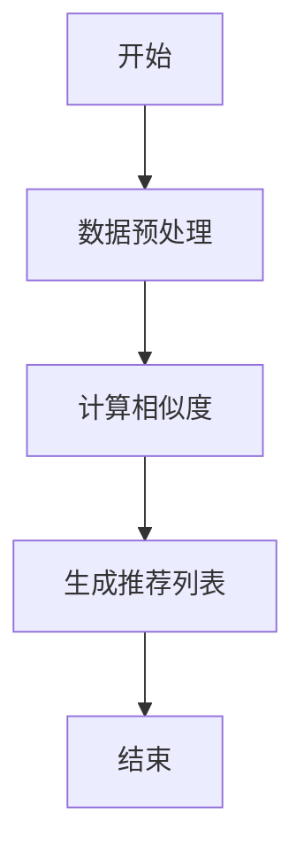
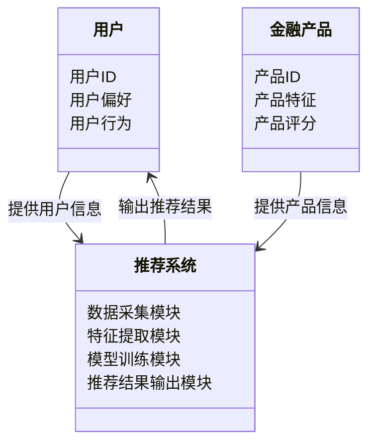
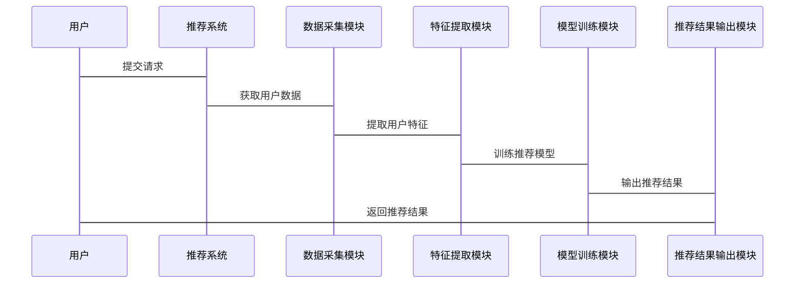

                 


# 人工智能在金融产品个性化推荐中的应用

## 关键词：人工智能、金融推荐系统、协同过滤、深度学习、个性化推荐

## 摘要：人工智能技术在金融产品个性化推荐中的应用是当前金融科技领域的重要研究方向。本文系统地分析了人工智能在金融推荐系统中的核心概念、算法原理、系统架构和实战应用，详细探讨了基于协同过滤和深度学习的推荐算法，结合实际案例，总结了金融推荐系统的最佳实践和未来发展趋势。

---

# 第一部分: 人工智能在金融产品个性化推荐中的应用概述

## 第1章: 人工智能与金融推荐系统概述

### 1.1 人工智能的基本概念

#### 1.1.1 人工智能的定义与核心概念
人工智能（Artificial Intelligence, AI）是指计算机系统执行人类智能任务的能力，如视觉识别、语音识别、决策推理和自然语言处理等。核心概念包括：
- **机器学习（Machine Learning）**：通过数据训练模型，使其能够从经验中学习并做出预测。
- **深度学习（Deep Learning）**：一种机器学习方法，利用多层神经网络模拟人脑的处理方式。
- **自然语言处理（NLP）**：使计算机能够理解和生成人类语言的技术。

#### 1.1.2 人工智能在金融领域的应用现状
人工智能在金融领域的应用广泛，包括：
- **智能投顾**：通过算法为用户提供个性化的投资建议。
- **风险管理**：利用AI预测市场波动和识别风险。
- **信用评估**：基于历史数据评估客户的信用风险。

#### 1.1.3 个性化推荐系统的基本原理
个性化推荐系统通过分析用户的行为、偏好和历史数据，向用户推荐符合其需求的产品或服务。其基本原理包括：
- **数据采集**：收集用户的交互数据，如点击、浏览、购买记录等。
- **特征提取**：从数据中提取有用的特征，如用户兴趣、行为模式等。
- **模型训练**：使用机器学习算法训练推荐模型。
- **结果输出**：根据模型预测结果，生成推荐列表。

### 1.2 金融产品推荐的背景与意义

#### 1.2.1 金融行业的数字化转型
金融行业正在经历数字化转型，传统金融机构纷纷引入人工智能技术，以提升服务效率和客户体验。数字化转型使得金融产品推荐更加精准和高效。

#### 1.2.2 用户需求的个性化趋势
随着用户需求的多样化，个性化推荐成为金融行业的重要趋势。用户希望获得量身定制的金融产品和服务，而非千篇一律的产品推荐。

#### 1.2.3 个性化推荐在金融产品中的价值
个性化推荐能够提高客户满意度、增加产品销售和提升品牌忠诚度。通过精准推荐，金融机构可以降低客户的决策成本，提高客户粘性和满意度。

### 1.3 本章小结
本章介绍了人工智能的基本概念及其在金融领域的应用现状，强调了个性化推荐系统在金融产品中的重要性，并为后续章节奠定了基础。

---

# 第二部分: 个性化推荐系统的核心概念与原理

## 第2章: 推荐系统的核心概念与分类

### 2.1 推荐系统的定义与分类

#### 2.1.1 基于协同过滤的推荐
协同过滤是一种基于用户相似性或物品相似性的推荐方法。具体包括：
- **基于用户的协同过滤**：通过寻找与目标用户相似的用户，推荐这些用户喜欢的物品。
- **基于物品的协同过滤**：通过分析物品之间的相似性，推荐与目标用户已感兴趣物品相似的其他物品。
- **混合协同过滤模型**：结合用户和物品的特征，构建混合推荐模型。

#### 2.1.2 基于内容的推荐
基于内容的推荐系统通过分析物品的特征（如文本描述、标签等）进行推荐。其优势在于能够处理冷启动问题，即对于新用户或新物品，系统也能推荐相关内容。

#### 2.1.3 混合推荐模型
混合推荐模型结合了协同过滤和内容推荐的优点，通过将两者的优势结合起来，提高推荐系统的准确性和多样性。

### 2.2 推荐系统的数学模型与特征分析

#### 2.2.1 用户-物品交互矩阵的构建
用户-物品交互矩阵是一个二维矩阵，行表示用户，列表示物品，矩阵中的元素表示用户对物品的评分或偏好。

#### 2.2.2 特征向量的提取与对比
特征向量是通过降维技术（如PCA）从原始数据中提取的低维表示，用于表示用户或物品的特征。

#### 2.2.3 推荐系统的性能指标
推荐系统的性能指标包括准确率、召回率、F1值等，用于评估推荐系统的推荐效果。

### 2.3 推荐系统的ER实体关系图

```mermaid
er
actor: 用户
product: 金融产品
preference: 用户偏好
transaction: 交易记录
```

### 2.4 本章小结
本章介绍了推荐系统的核心概念和分类，详细讲解了协同过滤和内容推荐的基本原理，并通过ER图展示了推荐系统的实体关系。

---

# 第三部分: 人工智能算法原理与数学模型

## 第3章: 协同过滤算法原理

### 3.1 协同过滤的基本原理

#### 3.1.1 基于用户的协同过滤
基于用户的协同过滤通过寻找与目标用户相似的用户，推荐这些用户喜欢的金融产品。相似性计算通常采用余弦相似度或皮尔逊相关系数。

#### 3.1.2 基于物品的协同过滤
基于物品的协同过滤通过分析金融产品的相似性，推荐与目标用户已感兴趣的产品相似的其他产品。

#### 3.1.3 混合协同过滤模型
混合协同过滤模型结合了基于用户和基于物品的协同过滤的优点，通过集成两种方法的结果，提高推荐系统的准确性和多样性。

### 3.2 协同过滤的数学模型

#### 3.2.1 用户-物品评分矩阵的构建
用户-物品评分矩阵是一个M×N的矩阵，M表示用户数量，N表示金融产品数量，矩阵中的元素表示用户对金融产品的评分。

#### 3.2.2 相似度计算公式
余弦相似度公式：
$$ \text{相似度} = \frac{\sum_{i=1}^{n}(r_{u,i} - \bar{r}_u)(r_{v,i} - \bar{r}_v)}{\sqrt{\sum_{i=1}^{n}(r_{u,i} - \bar{r}_u)^2} \sqrt{\sum_{i=1}^{n}(r_{v,i} - \bar{r}_v)^2}} $$

#### 3.2.3 协同过滤的实现流程


### 3.3 本章小结
本章详细讲解了协同过滤算法的基本原理和数学模型，并通过流程图展示了协同过滤的实现流程。

---

## 第4章: 基于深度学习的推荐算法

### 4.1 深度学习在推荐系统中的应用

#### 4.1.1 基于神经网络的推荐模型
基于神经网络的推荐模型通过构建多层神经网络，从数据中自动提取特征，用于推荐决策。

#### 4.1.2 基于嵌入的推荐方法
嵌入方法通过将高维数据映射到低维空间，减少数据维度，提高计算效率。

#### 4.1.3 基于注意力机制的推荐模型
注意力机制通过关注重要的特征，提高推荐系统的准确性和个性化。

### 4.2 深度学习推荐算法的数学模型

#### 4.2.1 Word2Vec模型在推荐中的应用
Word2Vec模型通过将词语映射到向量空间，用于推荐系统中的特征提取。

#### 4.2.2 GNN（图神经网络）在推荐中的应用
GNN通过构建用户-物品交互图，利用图结构信息进行推荐。

#### 4.2.3 Transformer模型在推荐中的应用
Transformer模型通过自注意力机制，捕捉用户行为中的长距离依赖关系。

### 4.3 本章小结
本章介绍了基于深度学习的推荐算法，包括神经网络、嵌入和注意力机制，并通过数学公式和流程图展示了其工作原理。

---

# 第四部分: 系统分析与架构设计

## 第5章: 金融推荐系统的系统分析与架构设计

### 5.1 问题场景介绍

#### 5.1.1 金融推荐系统的应用场景
金融推荐系统广泛应用于智能投顾、风险管理、信用评估等领域。

#### 5.1.2 金融推荐系统的用户需求
用户需求包括个性化推荐、实时性、高准确性等。

### 5.2 项目介绍

#### 5.2.1 项目目标
本项目旨在开发一个基于人工智能的金融产品推荐系统，实现个性化推荐功能。

#### 5.2.2 系统功能设计
系统功能包括用户注册登录、数据采集与处理、推荐模型训练、推荐结果展示等。

#### 5.2.3 系统架构设计


#### 5.2.4 系统接口设计
系统接口包括用户信息接口、产品信息接口、推荐结果接口等。

#### 5.2.5 系统交互流程


### 5.3 本章小结
本章分析了金融推荐系统的应用场景和用户需求，设计了系统的功能模块和架构，并通过类图和序列图展示了系统的交互流程。

---

# 第五部分: 项目实战

## 第6章: 项目实战

### 6.1 环境安装

#### 6.1.1 安装Python
安装Python 3.8及以上版本。

#### 6.1.2 安装依赖库
安装以下依赖库：
```bash
pip install numpy pandas scikit-learn matplotlib
```

### 6.2 系统核心实现源代码

#### 6.2.1 数据采集模块
```python
import pandas as pd

# 读取数据
data = pd.read_csv('financial_products.csv')
```

#### 6.2.2 特征提取模块
```python
from sklearn.decomposition import PCA

# 提取特征
pca = PCA(n_components=2)
principal_components = pca.fit_transform(data)
```

#### 6.2.3 模型训练模块
```python
from sklearn.neighbors import NearestNeighbors

# 训练模型
model = NearestNeighbors(n_neighbors=5)
model.fit(principal_components)
```

#### 6.2.4 推荐结果输出模块
```python
import numpy as np

# 生成推荐结果
def get_recommendations(user_id):
    user_data = data[data['用户ID'] == user_id]
    # 计算相似度
    distances, indices = model.kneighbors(user_data.values)
    # 返回推荐结果
    return data.iloc[indices[0], :]

print(get_recommendations(1))
```

### 6.3 实际案例分析与详细讲解

#### 6.3.1 案例背景
假设我们有一个金融产品数据集，包含用户ID、产品ID、用户评分等信息。

#### 6.3.2 数据分析与预处理
对数据进行清洗和预处理，提取用户偏好和产品特征。

#### 6.3.3 模型训练与评估
训练推荐模型，并评估模型的准确率和召回率。

#### 6.3.4 推荐结果展示
根据模型输出的推荐结果，展示给用户。

### 6.4 本章小结
本章通过实际案例展示了金融推荐系统的开发流程，包括环境安装、数据采集、特征提取、模型训练和结果输出。

---

# 第六部分: 最佳实践与总结

## 第7章: 最佳实践与总结

### 7.1 最佳实践 tips
- 数据质量是推荐系统的关键，确保数据的准确性和完整性。
- 结合多种推荐算法，提高推荐系统的准确性和多样性。
- 定期更新模型，适应市场变化和用户需求的变化。

### 7.2 小结
本文章系统地介绍了人工智能在金融产品个性化推荐中的应用，详细讲解了推荐系统的原理、算法、架构设计和实战案例，为读者提供了全面的视角和深入的理解。

### 7.3 注意事项
- 注意数据隐私和安全问题。
- 定期监控模型性能，及时调整和优化。
- 保持对新技术的关注，不断提升推荐系统的性能和用户体验。

### 7.4 拓展阅读
建议读者进一步学习以下内容：
- 深度学习在推荐系统中的应用。
- 图神经网络在推荐系统中的应用。
- 联邦学习在金融推荐系统中的应用。

---

# 作者：AI天才研究院/AI Genius Institute & 禅与计算机程序设计艺术 /Zen And The Art of Computer Programming

---

以上是《人工智能在金融产品个性化推荐中的应用》的技术博客文章的完整内容。

