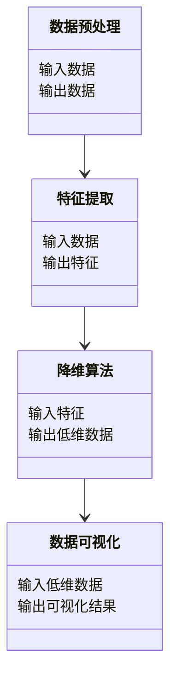
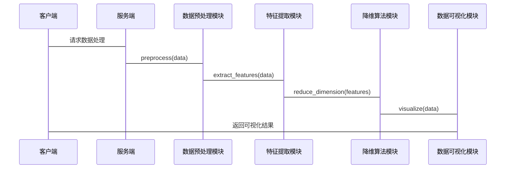

                 


---

# 人工智能在高维金融数据可视化中的应用

## 关键词：
人工智能, 高维数据, 金融数据可视化, 降维算法, 数据分析, 机器学习

## 摘要：
本文深入探讨人工智能在高维金融数据可视化中的应用，分析了高维数据的核心概念、常见降维算法的原理及实现，结合系统架构设计和项目实战案例，展示了如何利用人工智能技术提升金融数据可视化的效率和效果。文章从背景介绍、算法对比、系统架构到项目实战，全面解析了人工智能在金融数据可视化中的重要作用和应用价值。

---

# 第1章 高维金融数据与人工智能概述

## 1.1 高维金融数据的定义与特点

### 1.1.1 高维数据的定义
高维数据是指具有超过三个维度的数据，通常存在于金融、科学计算等领域。在金融领域，高维数据主要指包含大量特征（如股票价格、交易量、市场指数等）的数据。

### 1.1.2 高维金融数据的核心特点
- **维度高**：金融数据通常包含数百个甚至上千个特征。
- **稀疏性**：高维数据中存在大量缺失值或零值。
- **复杂性**：高维数据中的关系是非线性的，难以通过传统方法发现。

### 1.1.3 高维金融数据的来源与应用场景
- **来源**：股票价格、市场指数、交易数据、财务报表等。
- **应用场景**：风险评估、投资组合优化、市场趋势预测等。

## 1.2 人工智能在金融领域的应用背景

### 1.2.1 人工智能的基本概念
人工智能（AI）是指计算机系统能够执行人类智能的任务，如视觉识别、语音识别、决策等。

### 1.2.2 人工智能在金融领域的应用现状
- **智能投顾**：基于AI算法提供个性化的投资建议。
- **风险管理**：利用AI进行风险评估和预警。
- **欺诈检测**：通过机器学习识别异常交易。

### 1.2.3 高维数据可视化的重要性与挑战
- **重要性**：帮助分析师发现数据中的隐藏模式。
- **挑战**：维度灾难、计算复杂度高、可视化工具的局限性。

## 1.3 高维金融数据可视化的核心概念

### 1.3.1 数据可视化的定义与作用
数据可视化是将数据转化为图形或图表的过程，目的是帮助用户更好地理解数据。

### 1.3.2 高维数据可视化的难点与解决方案
- **难点**：维度高导致信息复杂。
- **解决方案**：使用降维算法（如PCA、t-SNE）将高维数据映射到低维空间。

### 1.3.3 人工智能在数据可视化中的角色
- **数据预处理**：清洗、归一化。
- **特征提取**：提取数据中的关键特征。
- **降维**：将高维数据映射到低维空间。

## 1.4 本章小结
本章介绍了高维金融数据的核心概念、人工智能在金融领域的应用背景，以及高维数据可视化的重要性与挑战。接下来将详细探讨高维金融数据的特征与属性。

---

# 第2章 高维金融数据的特征与属性

## 2.1 高维金融数据的特征分析

### 2.1.1 数据维度的扩展性
- 数据维度不断增加，导致计算复杂度指数级上升。

### 2.1.2 数据的稀疏性与噪声
- 数据中存在大量缺失值或噪声，影响分析结果。

### 2.1.3 数据的分布特性
- 数据分布可能非线性，难以用传统方法捕捉。

## 2.2 数据降维与特征选择

### 2.2.1 数据降维的必要性
- 降低计算复杂度。
- 提高可视化效果。

### 2.2.2 常见的降维方法对比（表格形式）

| 方法名称 | 原理简述 | 优缺点 |
|----------|----------|--------|
| PCA     | 基于方差最大化 | 无监督，线性 | 
| t-SNE   | 适用于非线性降维 | 适合高维数据可视化 |
| UMAP     | 基于流形学习 | 保持局部结构 |

### 2.2.3 降维方法的选择策略
- 根据数据分布选择线性或非线性方法。
- 根据计算复杂度选择适合的算法。

## 2.3 数据降维的数学模型

### 2.3.1 PCA算法的数学公式
$$ \text{PCA目标：} \max \sum_{i=1}^{k} \lambda_i $$
其中，$\lambda_i$ 是特征值。

### 2.3.2 t-SNE算法的降维公式
$$ \text{t-SNE损失函数：} \min \sum_{i=1}^{n} \sum_{j=1}^{n} \text{KL}(p_{ij}, q_{ij}) $$

## 2.4 本章小结
本章详细分析了高维金融数据的特征与属性，并对比了常见的降维方法。接下来将探讨这些算法的实现与优化。

---

# 第3章 人工智能算法在高维数据可视化中的应用

## 3.1 PCA算法的实现与优化

### 3.1.1 PCA算法的步骤
1. 数据标准化
2. 计算协方差矩阵
3. 计算特征值和特征向量
4. 选择主成分

### 3.1.2 PCA算法的优化策略
- 数据去均值化
- 特征向量正交化

## 3.2 t-SNE算法的实现与优化

### 3.2.1 t-SNE算法的步骤
1. 计算数据点的概率分布
2. 计算降维后的概率分布
3. 最小化KL散度

### 3.2.2 t-SNE算法的优化
- 使用动量优化加速收敛
- 调整学习率

## 3.3 UMAP算法的实现与优化

### 3.3.1 UMAP算法的步骤
1. 构建图结构
2. 优化低维嵌入

### 3.3.2 UMAP算法的优化
- 调整参数（如邻域数、压缩维度）

## 3.4 算法对比与选择策略

### 3.4.1 不同算法的性能对比（表格形式）

| 算法名称 | 优点 | 缺点 | 适用场景 |
|----------|------|------|----------|
| PCA     | 计算快，线性可解释 | 无法捕捉非线性关系 | 线性数据 |
| t-SNE   | 非线性降维，适合可视化 | 计算复杂度高 | 高维数据可视化 |
| UMAP     | 保持局部结构，降维效果好 | 对参数敏感 | 高维数据可视化 |

### 3.4.2 算法选择策略
- 根据数据分布选择算法。
- 考虑计算复杂度和内存需求。

## 3.5 本章小结
本章详细介绍了PCA、t-SNE和UMAP算法的实现与优化，并给出了选择策略。接下来将探讨系统架构设计。

---

# 第4章 高维金融数据可视化的系统架构设计

## 4.1 问题场景介绍
- 数据预处理：清洗、归一化。
- 特征提取：提取关键特征。
- 降维：将高维数据映射到低维空间。
- 可视化：展示降维后的数据。

## 4.2 系统功能设计

### 4.2.1 领域模型（Mermaid类图）



### 4.2.2 系统架构设计（Mermaid架构图）

```mermaid
architectural
    客户端 <---> 服务端
    服务端 --> 数据预处理模块
    服务端 --> 特征提取模块
    服务端 --> 降维算法模块
    服务端 --> 数据可视化模块
```

### 4.2.3 系统接口设计
- 数据预处理接口：`preprocess(data)`
- 特征提取接口：`extract_features(data)`
- 降维接口：`reduce_dimension(features)`
- 可视化接口：`visualize(data)`

### 4.2.4 系统交互（Mermaid序列图）



## 4.3 本章小结
本章详细设计了高维金融数据可视化的系统架构，包括功能模块、接口设计和系统交互。接下来将探讨项目实战部分。

---

# 第5章 项目实战：高维金融数据分析与可视化

## 5.1 环境安装与配置

### 5.1.1 安装Python环境
```bash
pip install python
pip install numpy
pip install scikit-learn
pip install umap-learn
pip install matplotlib
```

### 5.1.2 安装可视化库
```bash
pip install plotly
pip install bokeh
```

## 5.2 核心实现源代码

### 5.2.1 数据预处理代码
```python
import numpy as np

def preprocess(data):
    # 数据标准化
    data_normalized = (data - np.mean(data, axis=0)) / np.std(data, axis=0)
    return data_normalized
```

### 5.2.2 t-SNE降维代码
```python
from sklearn.manifold import TSNE

def reduce_dimension(features, n_components=2):
    tsne = TSNE(n_components=n_components, random_state=42)
    reduced_data = tsne.fit_transform(features)
    return reduced_data
```

### 5.2.3 数据可视化代码
```python
import matplotlib.pyplot as plt

def visualize(data, labels):
    plt.scatter(data[:,0], data[:,1], c=labels, cmap='viridis')
    plt.xlabel('X')
    plt.ylabel('Y')
    plt.title('t-SNE Visualization')
    plt.show()
```

## 5.3 项目实现与结果分析

### 5.3.1 数据加载与预处理
```python
# 加载股票数据
import pandas as pd
data = pd.read_csv('stock_data.csv')
processed_data = preprocess(data.values)
```

### 5.3.2 特征提取与降维
```python
reduced_data = reduce_dimension(processed_data)
```

### 5.3.3 数据可视化
```python
labels = data['label'].values
visualize(reduced_data, labels)
```

## 5.4 项目小结
本章通过一个具体的项目案例，详细讲解了高维金融数据可视化的实现过程，包括环境配置、代码实现和结果分析。接下来将总结全文并展望未来的发展方向。

---

# 第6章 总结与展望

## 6.1 全文总结
本文详细探讨了人工智能在高维金融数据可视化中的应用，分析了高维数据的核心概念、常见降维算法的原理及实现，结合系统架构设计和项目实战案例，展示了如何利用人工智能技术提升金融数据可视化的效率和效果。

## 6.2 未来展望
随着AI技术的不断发展，高维金融数据可视化将更加智能化和自动化。未来的研究方向包括：
- 更高效的降维算法。
- 更智能的可视化工具。
- 更广泛的应用场景。

---

# 作者：AI天才研究院 & 禅与计算机程序设计艺术

---

**全文完。**

