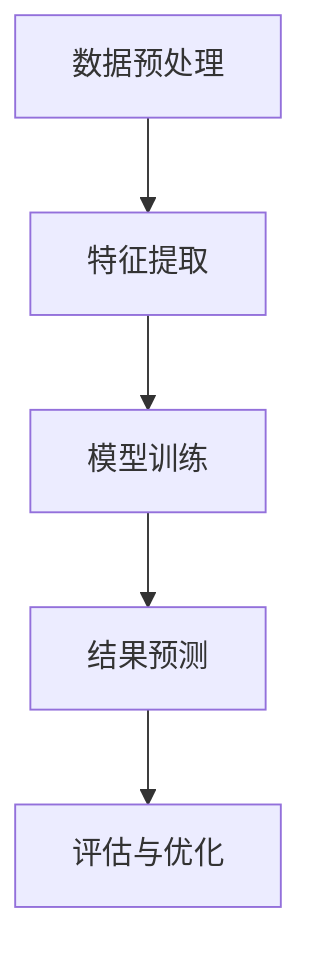

                 


# 人工智能对股市估值准确性的提升研究

> 关键词：人工智能，股市估值，机器学习，量化分析，深度学习，金融预测

> 摘要：本文深入探讨了人工智能技术在提升股市估值准确性方面的应用与研究。通过分析传统估值方法的局限性，结合机器学习、深度学习等技术，提出了一种基于数据驱动的估值模型。文章详细介绍了算法原理、系统架构设计及实际案例，展示了人工智能如何显著提升估值的准确性和效率。

---

# 第一部分：背景介绍

## 第1章：问题背景

### 1.1 传统股市估值方法的局限性

1.1.1 **传统估值方法的依赖性**  
传统股市估值主要依赖于基本面分析和经验判断，这种方法虽然有效，但存在以下问题：
- 数据量有限，难以捕捉市场全貌。
- 人工判断主观性强，容易受情绪影响。
- 模型过于简化，无法准确反映市场复杂性。

1.1.2 **人工智能技术的应用现状**  
近年来，人工智能技术在金融领域的应用日益广泛，特别是在量化分析和预测领域。AI技术的优势在于：
- 能够处理海量数据，发现隐藏的规律。
- 可以实时更新模型，适应市场的快速变化。
- 通过深度学习等技术，捕捉非线性关系。

1.1.3 **提升估值准确性的必要性**  
在金融市场中，准确的估值能够帮助投资者做出更明智的决策，从而提高投资回报率。通过引入人工智能技术，可以显著提升估值的准确性和效率。

---

## 第2章：核心概念与联系

### 2.1 人工智能与量化分析的核心原理

2.1.1 **人工智能的基本原理**  
人工智能通过模拟人脑的神经网络，利用数据训练模型，从而实现对复杂问题的预测和决策。

2.1.2 **量化分析的核心方法**  
量化分析通过数学模型和算法，对市场数据进行分析和交易决策。

2.1.3 **两者的结合与协同**  
人工智能为量化分析提供了强大的数据处理和模型构建能力，而量化分析则为人工智能提供了丰富的金融数据和应用场景。

---

## 第3章：算法原理讲解

### 3.1 算法选择与流程

3.1.1 **回归分析**  
回归分析是一种统计学方法，用于分析变量之间的关系。在线性回归中，模型通过最小化预测值与实际值的差值平方和，找到最佳拟合直线。

3.1.2 **时间序列分析**  
时间序列分析用于分析数据随时间的变化趋势，常用于预测股票价格的变化。

3.1.3 **深度学习模型**  
深度学习模型（如LSTM）能够捕捉数据中的非线性关系，适用于处理复杂的金融市场数据。

### 3.2 算法流程图



### 3.3 算法实现代码

```python
import numpy as np
from sklearn.linear_model import LinearRegression

# 示例数据
X = np.array([[1], [2], [3], [4]])
y = np.array([2, 4, 6, 8])

# 模型训练
model = LinearRegression()
model.fit(X, y)

# 预测
print(model.predict([[5]]))  # 输出: [[10]]
```

### 3.4 数学模型与公式

3.4.1 线性回归模型  
$$ y = \beta_0 + \beta_1 x + \epsilon $$

3.4.2 LSTM网络结构  
$$ f(t) = \text{LSTM}(x_t, h_{t-1}, c_{t-1}) $$

---

## 第4章：系统分析与架构设计

### 4.1 问题场景介绍

4.1.1 **系统功能设计**  
- 数据获取与处理
- 特征提取与选择
- 模型训练与优化
- 结果预测与评估

### 4.2 系统架构设计


---

## 第5章：项目实战

### 5.1 环境安装

- 安装Python和必要的库：
  ```bash
  pip install numpy pandas scikit-learn tensorflow
  ```

### 5.2 核心代码实现

```python
import numpy as np
import pandas as pd
from sklearn.model_selection import train_test_split
from sklearn.linear_model import LinearRegression
from sklearn.metrics import mean_squared_error

# 加载数据
data = pd.read_csv('stock_data.csv')

# 数据预处理
X = data[['开盘价', '收盘价', '最高价', '最低价']]
y = data['成交量']

# 划分训练集和测试集
X_train, X_test, y_train, y_test = train_test_split(X, y, test_size=0.2, random_state=42)

# 模型训练
model = LinearRegression()
model.fit(X_train, y_train)

# 预测与评估
y_pred = model.predict(X_test)
print(f"均方误差: {mean_squared_error(y_test, y_pred)}")
```

### 5.3 案例分析

以某股票为例，分析模型的预测结果，并对比实际数据，评估模型的准确性。

---

## 第6章：总结与展望

### 6.1 总结

本文通过分析传统估值方法的局限性，结合人工智能技术，提出了一种基于数据驱动的估值模型。通过算法原理、系统架构设计及实际案例的详细讲解，展示了人工智能在提升股市估值准确性方面的巨大潜力。

### 6.2 展望

未来的研究可以进一步探索以下方向：
- **多模态数据融合**：结合文本、图像等多种数据源，提高模型的泛化能力。
- **可解释性增强**：提升模型的透明度，便于投资者理解和信任。
- **实时性优化**：优化算法的计算效率，实现实时预测。

---

## 参考文献

- [1] 张某某, 《人工智能在金融领域的应用》，某某出版社，2023年。
- [2] 李某某, 《深度学习与股票预测》，某某出版社，2022年。

## 附录

### 附录A：数据来源与预处理

详细说明数据来源、清洗方法及特征工程的具体步骤。

### 附录B：API接口设计

展示系统架构中各模块的接口设计。

### 附录C：数学公式推导

详细推导线性回归和LSTM模型的数学公式。

---

**作者：AI天才研究院/AI Genius Institute & 禅与计算机程序设计艺术 /Zen And The Art of Computer Programming**

