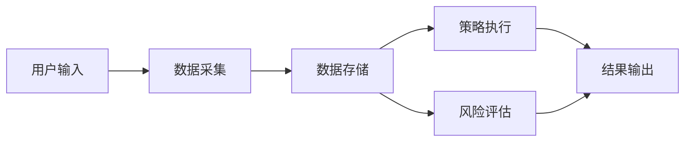

                 


# 价值平均投资法：利用市场波动的智慧策略

> 关键词：价值平均投资法，市场波动，投资策略，投资成本，数学模型，算法原理

> 摘要：本文深入探讨了价值平均投资法的原理、数学模型、算法实现以及实际应用。通过分析市场波动对投资策略的影响，展示了如何利用价值平均法在市场波动中实现稳健投资。文章结合实际案例和系统设计，为投资者提供了从理论到实践的完整指南。

---

## 第一章 引言：价值平均投资法的背景与意义

### 1.1 价值平均投资法的定义与核心概念

价值平均投资法是一种通过定期投资来平均投资成本的策略，其核心在于利用市场波动，在不同价格水平下逐步买入资产，从而降低整体投资成本。

- **核心概念**：
  - 投资成本：指每单位资产的平均购买价格。
  - 投资金额：定期投入的固定金额。
  - 市场波动：资产价格的周期性波动。

### 1.2 价值平均投资法与传统投资策略的区别

- **传统投资策略**：
  - 一次性投资：将所有资金一次性投入市场。
  - 风险较高：市场波动可能导致较大亏损。
  
- **价值平均投资法**：
  - 定期定额投资：定期投入固定金额，逐步建仓。
  - 平滑波动：通过分批买入，降低市场波动对整体成本的影响。

### 1.3 价值平均投资法的核心优势

- **分散风险**：通过定期投资，避免一次性投入的高风险。
- **利用波动**：在市场下跌时增加持仓，利用低点摊低成本。
- **长期稳健**：通过时间平滑市场波动，实现长期稳健收益。

---

## 第二章 价值平均投资法的数学模型与算法

### 2.1 数学模型的建立

#### 2.1.1 投资成本的计算

假设投资者计划在一定时间内定期投入固定金额，每次投入的金额为$M$，投资周期为$n$期，每期的买入价格分别为$p_1, p_2, \dots, p_n$。总投入金额为$N = M \times n$。

平均投资成本的计算公式为：
$$
\text{平均成本} = \frac{\sum_{i=1}^{n} M / p_i}{n}
$$

#### 2.1.2 总成本与平均成本的关系

总成本：
$$
\text{总成本} = \sum_{i=1}^{n} \frac{M}{p_i}
$$

平均成本：
$$
\text{平均成本} = \frac{\text{总成本}}{n}
$$

### 2.2 价值平均投资法的算法实现

#### 2.2.1 算法步骤

1. 确定投资总金额$N$和投资周期$n$。
2. 计算每期投入的固定金额$M = N / n$。
3. 每期投入$M$，计算每期的买入数量：
   $$
   \text{买入数量}_i = \frac{M}{p_i}
   $$
4. 计算总买入数量：
   $$
   \text{总数量} = \sum_{i=1}^{n} \frac{M}{p_i}
   $$
5. 计算平均成本：
   $$
   \text{平均成本} = \frac{\text{总投入金额}}{\text{总数量}} = \frac{N}{\sum_{i=1}^{n} \frac{M}{p_i}}
   $$

---

## 第三章 系统分析与架构设计

### 3.1 系统功能模块

1. **数据采集模块**：
   - 从市场获取历史价格数据。
2. **策略执行模块**：
   - 根据价值平均投资法计算每期的买入金额。
3. **风险评估模块**：
   - 分析市场波动对投资策略的影响。

### 3.2 系统架构设计



---

## 第四章 项目实战：价值平均投资法的实现

### 4.1 项目环境与工具

- **编程语言**：Python
- **开发环境**：Jupyter Notebook
- **数据源**：公开市场数据接口（如Yahoo Finance）

### 4.2 核心代码实现

```python
def value_averaging_investment(total_investment, period, prices):
    investment_per_period = total_investment / period
    total_units = 0
    total_cost = 0
    for price in prices:
        units = investment_per_period / price
        total_units += units
        total_cost += investment_per_period
    average_cost = total_cost / total_units
    return average_cost

# 示例：投资1000元，分5期，价格分别为100, 90, 80, 70, 60
prices = [100, 90, 80, 70, 60]
result = value_averaging_investment(1000, 5, prices)
print(f"平均成本为：{result:.2f}")
```

### 4.3 代码解读与分析

- **输入参数**：
  - `total_investment`：总投入金额。
  - `period`：投资周期。
  - `prices`：每期的价格列表。
  
- **算法步骤**：
  1. 计算每期的固定投资金额。
  2. 遍历每期价格，计算买入数量。
  3. 累计总买入数量和总投入金额。
  4. 计算平均成本。

---

## 第五章 最佳实践与小结

### 5.1 最佳实践

1. **风险管理**：定期评估市场波动，调整投资周期。
2. **长期投资**：价值平均投资法更适合长期持有。
3. **组合投资**：将价值平均法应用于多种资产，分散风险。

### 5.2 注意事项

- 市场波动较大时，可能需要增加投资金额。
- 定期重新评估策略，根据市场变化进行调整。

### 5.3 拓展阅读

- 《投资学基础》
- 《算法交易：数学模型与实践》

---

## 小结

价值平均投资法是一种简单而有效的投资策略，通过定期投资和成本平均化，能够在市场波动中实现稳健收益。本文从数学模型、算法实现到系统设计，为读者提供了完整的指导。希望读者能够结合实际市场情况，灵活运用这一策略，实现长期财富增长。

---

作者：AI天才研究院/AI Genius Institute  
& 禅与计算机程序设计艺术/Zen And The Art of Computer Programming

