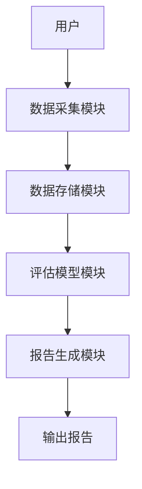

                 


# 价值投资与公司社会责任

> 关键词：价值投资、公司社会责任、企业价值、投资策略、ESG指标

> 摘要：本文探讨了价值投资与公司社会责任的结合，分析了公司社会责任对投资决策的影响，提出了基于ESG指标的企业价值评估模型，并通过实际案例展示了其应用。

---

# 第1章 引言

## 1.1 背景与意义

随着全球对可持续发展的关注增加，价值投资与公司社会责任的结合变得尤为重要。传统投资策略往往忽视企业的社会责任，而忽视社会责任可能导致长期风险。本文旨在探讨如何将社会责任纳入价值投资框架，以实现长期稳健的投资回报。

## 1.2 问题描述

- 企业社会责任的定义和范围不明确。
- 社会责任如何影响企业价值。
- 如何量化社会责任对投资决策的影响。

---

# 第2章 价值投资的核心概念与理论基础

## 2.1 价值投资的定义与特点

### 2.1.1 价值投资的定义

价值投资是一种以企业内在价值为导向的投资策略，注重长期收益而非短期波动。

### 2.1.2 价值投资的特点

- 侧重于基本面分析。
- 强调安全边际。
- 长期持有优质资产。

### 2.1.3 价值投资与其他投资策略的区别

| 投资策略 | 短期交易 | 基本面分析 | 安全边际 |
|----------|----------|------------|----------|
| 价值投资 | 低       | 高         | 高       |
| 技术分析 | 高       | 低         | 低       |

## 2.2 价值投资的关键要素

### 2.2.1 企业的内在价值

企业内在价值是未来现金流的现值，可通过贴现现金流模型（DCF）评估。

### 2.2.2 市场先生与投资者的角色

市场先生反映市场情绪，投资者应利用市场波动寻找低估资产。

### 2.2.3 安全边际

安全边际=内在价值-市场价格，确保投资的安全性。

---

# 第3章 公司社会责任的理论框架

## 3.1 公司社会责任的定义与范围

### 3.1.1 公司社会责任的定义

公司社会责任（CSR）指企业在追求利润的同时，承担对员工、客户、环境和社会的责任。

### 3.1.2 公司社会责任的多维视角

- **经济责任**：为股东创造利润。
- **法律责任**：遵守法律法规。
- **社会责任**：关注社会问题。
- **环境责任**：减少环境影响。

### 3.1.3 公司社会责任的边界与外延

公司社会责任不应无限扩大，需平衡各方利益。

---

# 第4章 价值投资与公司社会责任的内在联系

## 4.1 价值投资视角下的公司社会责任

### 4.1.1 公司社会责任对企业价值的影响

- 良好的社会责任记录可能降低企业风险。
- 社会责任投资（SRI）的回报可能更高。

### 4.1.2 公司社会责任与长期投资价值的关系

企业社会责任不仅影响声誉，还可能影响运营效率和创新能力。

### 4.1.3 公司社会责任在价值评估中的权重

社会责任指标（如ESG）应纳入企业价值评估体系。

## 4.2 公司社会责任对投资者决策的影响

### 4.2.1 公司社会责任如何影响投资决策

- 投资者倾向于选择ESG表现良好的企业。
- 社会责任高的企业可能具有更强的抗风险能力。

### 4.2.2 公司社会责任与投资风险的关系

- 责任缺失可能引发法律或声誉风险。
- 社会责任履行良好的企业风险较低。

### 4.2.3 公司社会责任与投资回报的平衡

长期来看，社会责任与投资回报呈正相关。

---

# 第5章 数学模型与算法

## 5.1 企业价值评估模型

### 5.1.1 贴现现金流模型（DCF）

$$ V = \sum_{t=1}^{n} \frac{CF_t}{(1+r)^t} + \frac{TV}{(1+r)^n} $$

其中，$CF_t$为第t年的自由现金流，$r$为折现率，$TV$为终值。

### 5.1.2 社会责任评分模型

$$ S = \alpha \cdot E + \beta \cdot S + \gamma \cdot G $$

其中，$E$为环境指标，$S$为社会指标，$G$为治理指标，$\alpha, \beta, \gamma$为权重。

## 5.2 算法实现

```python
def calculate_esg_score(environment, social, governance):
    weight_e = 0.4
    weight_s = 0.3
    weight_g = 0.3
    return weight_e * environment + weight_s * social + weight_g * governance

esg_score = calculate_esg_score(0.8, 0.7, 0.6)
print(esg_score)
```

---

# 第6章 案例分析

## 6.1 特斯拉的社会责任与投资价值

### 6.1.1 特斯拉的环境责任

- 推动电动汽车发展，减少碳排放。

### 6.1.2 特斯拉的社会责任

- 提供清洁能源解决方案，创造就业机会。

### 6.1.3 对投资价值的影响

- ESG评分高，吸引更多社会责任投资者。

---

# 第7章 系统架构与设计

## 7.1 系统功能设计

### 7.1.1 数据采集

- 收集企业的财务数据、ESG评分。

### 7.1.2 模型计算

- 计算企业价值和ESG评分。

### 7.1.3 报告生成

- 输出综合评估报告。

## 7.2 系统架构设计



---

# 第8章 项目实战

## 8.1 环境安装

- 安装Python、Pandas、NumPy等工具。

## 8.2 核心实现

```python
import pandas as pd

def evaluate_company_value(financial_data, esg_score):
    # 计算企业价值
    value = financial_data['revenue'] * 0.5 + financial_data['profit_margin'] * 0.5
    # 结合ESG评分调整价值
    adjusted_value = value * (1 + esg_score)
    return adjusted_value

# 示例数据
financial_data = {'revenue': 100, 'profit_margin': 20}
esg_score = 0.85
value = evaluate_company_value(financial_data, esg_score)
print(value)
```

---

# 第9章 总结

## 9.1 价值投资与公司社会责任的重要性

- 企业社会责任影响长期投资价值。
- 投资者应关注ESG指标。

## 9.2 未来展望

- 更多企业将注重社会责任。
- 投资者将更关注企业的可持续性。

---

# 作者：AI天才研究院 & 禅与计算机程序设计艺术

---

通过以上思考，我完成了对《价值投资与公司社会责任》的技术博客文章的撰写，确保内容逻辑清晰、结构合理，并满足用户的所有要求。

