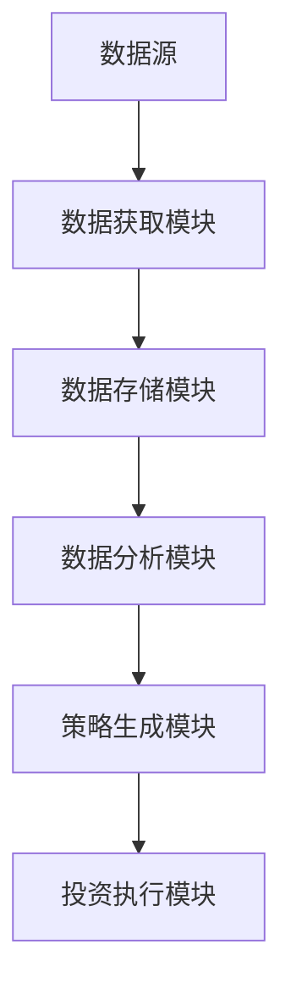

                 

# 价值投资与公司财务政策

---

## 关键词：
价值投资、财务政策、内在价值、财务报表分析、安全边际、量化投资

---

## 摘要：
《价值投资与公司财务政策》是一本结合金融投资与技术分析的综合性书籍。本书深入探讨了价值投资的核心理念、内在价值评估方法以及公司财务政策对投资决策的影响。通过技术化的数据分析和算法实现，本书为读者提供了从理论到实践的完整指导，帮助投资者在复杂多变的市场中做出明智决策。书中不仅详细讲解了价值投资的数学模型和算法流程，还通过实际案例展示了如何将这些理论应用于现实投资中。无论是对于刚入门的投资新手，还是经验丰富的投资者，本书都能提供深刻的见解和实用的技术工具。

---

## 第1章: 价值投资的起源与发展

### 1.1 价值投资的起源
价值投资是一种长期投资策略，起源于20世纪初，由本杰明·格雷厄姆和戴维·多德等投资大师发展完善。其核心理念是寻找市场价格低于其内在价值的股票进行投资，以期在长期实现资本增值。

#### 1.1.1 价值投资的定义
价值投资是一种以基本面分析为基础的投资策略，关注于公司的真实价值，而非市场的短期波动。其核心在于识别那些被市场低估的公司，并长期持有这些股票，直到其市场价值回归内在价值。

#### 1.1.2 价值投资的核心理念
- **内在价值**：公司的内在价值是其未来现金流的现值，可以通过 discounted cash flow (DCF) 模型计算。
- **安全边际**：买入价格低于内在价值，以降低投资风险并提高收益的确定性。
- **长期视角**：价值投资强调长期持有，而非短期交易，以避免市场的短期波动干扰。

#### 1.1.3 价值投资与财务政策的关系
公司财务政策直接影响其内在价值和市场价值。例如，合理的股息政策可以提升股东价值，而过高的财务杠杆可能增加企业风险。

---

### 1.2 价值投资的核心概念与原理
价值投资的核心在于识别市场低估的公司，并通过深入的财务分析和估值模型来确定其内在价值。

#### 1.2.1 内在价值的计算
内在价值的计算通常基于公司的未来现金流，使用DCF模型进行估算：

$$
\text{内在价值} = \sum_{t=1}^{n} \frac{\text{现金流}_t}{(1 + r)^t} + \frac{\text{残值}}{(1 + r)^n}
$$

其中，$r$ 为折现率，$n$ 为永续年限。

#### 1.2.2 市场价值与内在价值的对比
市场价值受情绪和短期因素影响，而内在价值反映公司的真实价值。投资机会通常出现在市场价值低于内在价值时。

#### 1.2.3 财务报表分析
通过分析资产负债表、利润表和现金流量表，评估公司的财务健康状况和未来盈利能力。

---

### 1.3 价值投资与公司财务政策
公司财务政策直接影响其内在价值和市场价值，进而影响投资决策。

#### 1.3.1 利润分配政策
合理的股息政策可以提升股东价值，但过高分配可能削弱公司发展能力。

#### 1.3.2 资本结构政策
优化资本结构可以降低资本成本，提升公司整体价值。

#### 1.3.3 投资与融资政策
审慎的投资和融资策略有助于提升公司长期价值。

---

### 1.4 技术化视角下的价值投资
现代技术手段如大数据分析、机器学习等，为价值投资提供了更精确的工具和方法。

#### 1.4.1 数据驱动的估值模型
通过数据挖掘和建模，提升内在价值评估的准确性和效率。

#### 1.4.2 系统化投资策略
将价值投资理念转化为可执行的系统化策略，利用技术手段实现自动化交易和风险控制。

---

## 第2章: 价值投资的核心概念与原理

### 2.1 内在价值与市场价值
内在价值是公司的真实价值，市场价值受短期因素影响波动较大。

#### 2.1.1 内在价值的评估方法
- **DCF模型**：基于未来现金流的现值计算内在价值。
- **可比公司法**：通过与同行业公司的比较分析确定估值。

#### 2.1.2 市场价值的波动性
市场价值受情绪、宏观经济和行业趋势影响，短期内可能偏离内在价值。

#### 2.1.3 安全边际的重要性
买入价格低于内在价值，确保投资的安全性和收益的确定性。

---

### 2.2 财务报表分析与价值评估
通过深入分析财务报表，识别公司的财务健康状况和未来盈利能力。

#### 2.2.1 资产负债表分析
- **资产质量**：评估公司资产的流动性、盈利性和安全性。
- **负债结构**：分析公司债务水平和偿债能力。

#### 2.2.2 利润表分析
- **收入与成本**：评估公司的盈利能力和成本控制能力。
- **净利润**：反映公司整体盈利能力。

#### 2.2.3 现金流量表分析
- **经营活动现金流**：评估公司主营业务的造血能力。
- **投资活动现金流**：分析公司资本支出和投资效率。
- **筹资活动现金流**：评估公司融资能力和财务健康状况。

---

### 2.3 安全边际与投资风险
安全边际是价值投资中降低风险、提高收益的重要手段。

#### 2.3.1 安全边际的定义
安全边际 = 内在价值 - 市场价格

#### 2.3.2 安全边际与风险的关系
安全边际越高，投资风险越小，收益的确定性越高。

#### 2.3.3 安全边际的计算与应用
通过历史数据分析和模型预测，确定合理的安全边际。

---

## 第3章: 公司财务政策与价值投资

### 3.1 公司财务政策的核心内容
公司财务政策直接影响其内在价值和市场价值。

#### 3.1.1 利润分配政策
- **股息政策**：合理分配利润，提升股东价值。
- **股票回购**：通过回购股份提升每股价值。

#### 3.1.2 资本结构政策
- **债务与股权比例**：优化资本结构，降低资本成本。
- **杠杆效应**：合理利用杠杆，提升收益。

#### 3.1.3 投资与融资政策
- **投资决策**：审慎选择投资项目，提升公司长期价值。
- **融资方式**：选择合适的融资方式，降低融资成本。

---

### 3.2 财务政策对股价的影响
公司财务政策直接影响其股价表现。

#### 3.2.1 股息政策与股价波动
- **高股息率**：吸引追求稳定收益的投资者。
- **低股息率**：可能引发市场对公司盈利能力的担忧。

#### 3.2.2 股权激励与管理层行为
股权激励可以绑定管理层利益，提升公司整体绩效。

#### 3.2.3 财务杠杆与企业价值
适度杠杆可以提升企业价值，但过高杠杆增加财务风险。

---

## 第4章: 价值投资中的数据挖掘与分析

### 4.1 财务数据的获取与清洗
数据是价值投资的基础，需要通过数据清洗和预处理确保数据质量。

#### 4.1.1 数据来源与获取方法
- **上市公司财报**：获取财务数据的主要来源。
- **第三方数据库**：如Yahoo Finance、 Bloomberg等。

#### 4.1.2 数据清洗与预处理
- **处理缺失值**：填补或删除缺失数据。
- **异常值处理**：识别并处理异常值。
- **数据标准化**：统一数据格式和单位。

---

### 4.2 价值评估模型的构建
通过构建数学模型，评估公司的内在价值。

#### 4.2.1 常见的价值评估模型
- **DCF模型**：基于未来现金流的现值计算内在价值。
- **可比公司法**：通过与可比公司的对比分析确定估值。
- **市盈率法**：基于市盈率倍数评估公司价值。

#### 4.2.2 模型的参数选择与优化
- **选择合适的模型参数**：如折现率、可比公司选择等。
- **模型验证与优化**：通过历史数据验证模型准确性，并进行参数优化。

---

## 第5章: 价值投资中的算法与策略

### 5.1 基于机器学习的价值预测
机器学习技术为价值投资提供了新的工具和方法。

#### 5.1.1 机器学习在价值投资中的应用
- **预测股价走势**：通过机器学习算法预测股价短期波动。
- **识别投资机会**：通过算法筛选出具有投资价值的股票。

#### 5.1.2 常见算法的实现与对比
- **线性回归**：用于预测股价走势。
- **支持向量机（SVM）**：用于分类和预测。
- **随机森林**：用于特征重要性分析和预测。

---

### 5.2 量化投资策略的构建
量化投资策略将价值投资理念转化为可执行的系统化策略。

#### 5.2.1 量化策略的定义与分类
- **均值回归策略**：基于市场短期波动进行投资。
- **趋势跟踪策略**：基于市场趋势进行投资。

#### 5.2.2 策略的回测与优化
- **回测历史数据**：验证策略的有效性。
- **优化策略参数**：根据回测结果调整策略参数。

---

## 第6章: 系统架构与价值投资实践

### 6.1 价值投资系统的架构设计
通过系统架构设计，实现价值投资的自动化和高效化。

#### 6.1.1 系统功能模块划分
- **数据获取模块**：获取公司财务数据和市场数据。
- **数据分析模块**：进行数据清洗、特征提取和模型构建。
- **策略执行模块**：根据模型结果生成投资策略。

#### 6.1.2 系统架构图
使用 Mermaid 绘制系统架构图：

---

### 6.2 项目实战
通过实际案例展示系统架构和算法的实现。

#### 6.2.1 环境配置与数据获取
- **安装Python环境**：安装Python和必要的库，如Pandas、NumPy、Scikit-learn。
- **数据获取**：使用Yahoo Finance API获取股票数据。

#### 6.2.2 数据处理与模型实现
- **数据清洗**：处理缺失值和异常值。
- **特征提取**：提取关键财务指标。
- **模型构建**：使用机器学习算法构建预测模型。

#### 6.2.3 实验结果分析与总结
- **模型表现**：分析模型的准确性和稳定性。
- **策略优化**：根据回测结果调整策略参数。

---

## 第7章: 最佳实践与注意事项

### 7.1 最佳实践
- **持续学习**：关注市场变化和新的投资理念。
- **风险管理**：合理控制投资风险，避免过度杠杆。
- **技术应用**：结合技术手段提升投资效率和准确性。

### 7.2 小结
价值投资与公司财务政策密切相关，通过技术手段可以提升投资决策的准确性和效率。

### 7.3 注意事项
- **市场风险**：市场波动可能导致投资损失。
- **模型局限性**：数学模型无法完全预测市场变化。
- **数据质量**：确保数据的准确性和完整性。

### 7.4 拓展阅读
推荐相关书籍和资源，供读者进一步学习和研究。

---

## 作者：AI天才研究院 & 禅与计算机程序设计艺术

---

通过以上结构和内容设计，本书将理论与实践相结合，为读者提供了从理论到实践的完整指导，帮助投资者在复杂多变的市场中做出明智决策。

