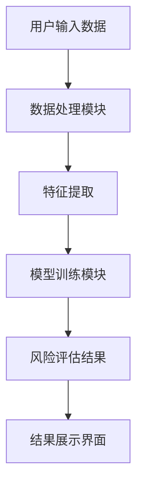
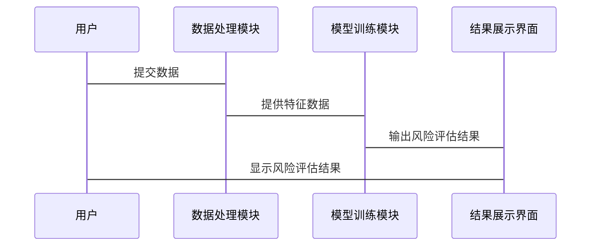

                 


# 价值投资中的AI驱动破产风险评估：多智能体协作模型

> **关键词**：价值投资、AI驱动、破产风险评估、多智能体协作模型、金融数据分析、风险管理

> **摘要**：本文探讨了在价值投资中利用AI技术进行破产风险评估的方法，重点介绍了基于多智能体协作模型的创新性解决方案。通过分析 bankruptcy risk assessment 的核心要素，结合多智能体协作模型的算法原理，构建了高效的金融风险评估系统。本文旨在为投资者提供一种更加精准和高效的破产风险评估工具，帮助他们在价值投资中做出更明智的决策。

---

## 第1章 价值投资与AI驱动破产风险评估概述

### 1.1 价值投资的核心概念

#### 1.1.1 价值投资的定义与历史发展

价值投资是一种以基本面分析为基础的投资策略，旨在通过识别市场价格低于其内在价值的资产来获得长期收益。该理念由本杰明·格雷厄姆和戴维·多德在20世纪初提出，经过数十年的发展，已经成为全球投资领域的重要流派。

- **定义**：价值投资的核心在于寻找那些市场价格被市场低估的公司或资产，这些资产的内在价值远高于其市场价格。
- **历史发展**：从格雷厄姆的经典价值投资理论到现代的量化投资方法，价值投资不断演进，结合了更多的数据分析和模型构建。

#### 1.1.2 价值投资的基本原理

价值投资的基本原理包括以下几个方面：

- **内在价值**：资产的真实价值是其未来现金流的现值。
- **市场情绪**：市场价格受市场情绪影响，往往偏离内在价值。
- **安全边际**：通过购买价格低于内在价值的资产，降低投资风险。

#### 1.1.3 价值投资在现代金融中的应用

现代价值投资已经从传统的基本面分析扩展到量化分析和AI驱动的预测模型。投资者利用大数据和AI技术，能够更精准地识别具有投资价值的资产。

---

### 1.2 破产风险评估的定义与意义

#### 1.2.1 破产风险的定义

破产风险是指企业在无法偿还债务时的破产可能性。对于投资者来说，准确评估破产风险可以帮助他们规避潜在的投资损失。

- **定义**：破产风险是企业在经营过程中由于财务状况恶化、市场环境变化或管理失误等原因导致的破产可能性。
- **影响因素**：包括财务指标（如资产负债率、流动比率）、市场表现（如股价波动）、公司治理等。

#### 1.2.2 破产风险评估的重要性

- **投资决策**：准确的破产风险评估可以帮助投资者避免投资于即将破产的企业。
- **风险管理**：通过提前识别高风险企业，投资者可以采取相应的风险管理措施。
- **市场稳定**：破产风险评估有助于维护金融市场的稳定，减少系统性风险。

#### 1.2.3 破产风险评估的常见方法

传统的破产风险评估方法包括Z-score模型、Altman模型等，但这些方法在复杂市场环境下往往存在局限性。

---

### 1.3 AI技术在金融领域的应用前景

#### 1.3.1 AI在金融分析中的作用

- **数据处理**：AI能够快速处理海量金融数据，提取关键特征。
- **模式识别**：通过机器学习算法，AI能够识别市场中的潜在风险和机会。
- **预测模型**：AI可以构建高精度的预测模型，帮助投资者做出更明智的决策。

#### 1.3.2 AI在风险评估中的优势

- **高效性**：AI能够快速处理大量数据，提高风险评估效率。
- **精准性**：通过复杂的算法，AI可以捕捉到传统方法难以发现的潜在风险因素。
- **适应性**：AI模型能够动态调整，适应市场环境的变化。

#### 1.3.3 多智能体协作模型的概念

多智能体协作模型是一种基于分布式计算和协作学习的AI模型，通过多个智能体的协同工作，提高系统的整体性能。

---

### 1.4 本章小结

本章介绍了价值投资的核心概念和破产风险评估的定义与意义，同时探讨了AI技术在金融领域的应用前景，特别是多智能体协作模型在破产风险评估中的潜力。

---

## 第2章 多智能体协作模型的定义与特点

### 2.1 多智能体系统的定义

#### 2.1.1 多智能体系统的概念

多智能体系统（Multi-Agent System, MAS）是由多个智能体组成的分布式系统，这些智能体通过协作完成特定任务。

- **定义**：多智能体系统是由多个具有自主性、反应性和协作性的智能体组成的系统。
- **特点**：分布式、协作性、自主性、动态性。

#### 2.1.2 多智能体系统的组成部分

- **智能体**：能够感知环境、做出决策并采取行动的实体。
- **通信机制**：智能体之间的通信和信息交换机制。
- **协作协议**：智能体之间协作的规则和协议。

#### 2.1.3 多智能体系统的分类

- **基于任务的多智能体系统**：智能体协作完成特定任务。
- **基于市场的多智能体系统**：智能体通过市场机制进行资源分配和协作。

---

### 2.2 多智能体协作模型的核心特点

#### 2.2.1 分布式计算

多智能体协作模型采用分布式计算，避免了单点故障，提高了系统的鲁棒性。

#### 2.2.2 协作性

智能体之间通过协作完成任务，提高了整体系统的性能。

#### 2.2.3 自适应性

多智能体协作模型能够动态调整策略，适应环境的变化。

---

### 2.3 多智能体协作模型与传统模型的对比

#### 2.3.1 传统模型的局限性

- **单点故障**：传统模型依赖于中心节点，容易成为瓶颈。
- **计算效率**：传统模型在处理大规模数据时效率较低。
- **适应性差**：传统模型难以快速适应环境变化。

#### 2.3.2 多智能体模型的优势

- **分布式计算**：避免了单点故障，提高了系统的可靠性。
- **协作性**：通过智能体之间的协作，提高了系统的整体性能。
- **自适应性**：能够动态调整策略，适应环境变化。

#### 2.3.3 对比总结

多智能体协作模型在分布式计算、协作性和自适应性方面具有明显优势，特别适合处理复杂金融环境中的破产风险评估问题。

---

### 2.4 本章小结

本章详细介绍了多智能体协作模型的定义和特点，对比了传统模型和多智能体模型的优劣，为后续章节的模型构建奠定了基础。

---

## 第3章 破产风险评估的核心要素与模型构建

### 3.1 破产风险评估的核心要素

#### 3.1.1 财务指标分析

- **流动比率**：流动资产与流动负债的比率，反映企业的短期偿债能力。
- **速动比率**：速动资产与流动负债的比率，进一步反映企业的短期偿债能力。
- **资产负债率**：负债与资产的比率，反映企业的财务杠杆。

#### 3.1.2 市场表现分析

- **股价波动**：股价的波动性反映市场的风险偏好。
- **市盈率**：股价与每股收益的比率，反映市场的估值水平。
- **市值**：企业的市值反映市场对其前景的预期。

#### 3.1.3 公司治理因素

- **管理团队**：管理团队的素质和经验影响企业的经营风险。
- **公司治理结构**：良好的公司治理结构能够降低经营风险。
- **透明度**：企业的信息披露透明度影响投资者的信任。

---

### 3.2 多智能体协作模型的构建

#### 3.2.1 模型的输入变量

- **财务指标**：流动比率、速动比率、资产负债率等。
- **市场指标**：股价波动、市盈率、市值等。
- **治理指标**：管理团队、公司治理结构、透明度等。

#### 3.2.2 模型的输出结果

- **破产概率**：模型输出企业的破产概率。
- **风险等级**：根据破产概率，划分企业的风险等级。

#### 3.2.3 模型的训练与优化

- **数据预处理**：清洗数据，处理缺失值和异常值。
- **特征选择**：通过特征选择算法，提取最重要的特征。
- **模型训练**：使用机器学习算法（如随机森林、支持向量机）进行模型训练。
- **模型优化**：通过交叉验证和超参数优化，提高模型的性能。

---

### 3.3 破产风险评估的数学模型

#### 3.3.1 线性回归模型

线性回归模型是一种常用的统计模型，适用于线性关系的预测。

$$ y = \beta_0 + \beta_1x_1 + \beta_2x_2 + \dots + \beta_nx_n + \epsilon $$

其中，$y$ 是目标变量（破产概率），$x_i$ 是输入变量，$\beta_i$ 是回归系数，$\epsilon$ 是误差项。

#### 3.3.2 支持向量机模型

支持向量机（SVM）是一种常用的分类模型，适用于非线性关系的预测。

$$ \text{max} \quad \sum_{i=1}^n y_i (w \cdot x_i + b) - 1 $$
$$ \text{subject to} \quad y_i (w \cdot x_i + b) \geq 1, \quad i=1,2,\dots,n $$

其中，$y_i$ 是标签（破产或非破产），$w$ 是权重向量，$b$ 是偏置项。

#### 3.3.3 随机森林模型

随机森林是一种基于决策树的集成模型，适用于高维数据的预测。

$$ y = \text{sign}\left(\sum_{i=1}^n \text{Tree}(x_i)\right) $$

其中，$\text{Tree}(x_i)$ 是决策树的预测结果，$n$ 是树的数量。

---

### 3.4 本章小结

本章详细介绍了破产风险评估的核心要素，并构建了基于多智能体协作模型的数学模型，为后续章节的实现提供了理论基础。

---

## 第4章 破产风险评估的系统分析与架构设计

### 4.1 系统分析

#### 4.1.1 系统目标

- **目标**：构建一个基于多智能体协作模型的破产风险评估系统，帮助投资者做出更明智的投资决策。

#### 4.1.2 系统功能需求

- **数据采集**：从多个数据源采集企业的财务数据、市场数据和治理数据。
- **数据处理**：对数据进行清洗、特征提取和数据增强。
- **模型训练**：利用机器学习算法训练破产风险评估模型。
- **风险评估**：根据模型输出破产概率和风险等级。

#### 4.1.3 系统性能需求

- **处理速度**：系统能够在较短时间内完成数据处理和模型训练。
- **准确性**：模型的预测准确率需要达到较高的水平。
- **可扩展性**：系统能够处理大规模数据。

---

### 4.2 系统架构设计

#### 4.2.1 分层架构

系统架构采用分层设计，包括数据层、计算层和应用层。

- **数据层**：负责数据的采集、存储和管理。
- **计算层**：负责数据的处理、特征提取和模型训练。
- **应用层**：负责风险评估结果的展示和应用。

#### 4.2.2 模块化设计

系统分为以下几个模块：

- **数据采集模块**：从多个数据源采集数据。
- **数据处理模块**：对数据进行清洗和特征提取。
- **模型训练模块**：利用机器学习算法训练模型。
- **风险评估模块**：根据模型输出破产概率和风险等级。

#### 4.2.3 接口设计

- **数据接口**：与数据源（如财务数据、市场数据）对接。
- **模型接口**：与其他系统（如投资管理系统）对接。

---

### 4.3 系统交互设计

#### 4.3.1 用户界面设计

- **数据输入界面**：用户可以输入企业的财务数据、市场数据和治理数据。
- **结果展示界面**：展示模型输出的破产概率和风险等级。

#### 4.3.2 系统流程图



#### 4.3.3 交互序列图



---

### 4.4 本章小结

本章详细介绍了破产风险评估系统的系统分析与架构设计，包括系统的功能需求、架构设计和交互设计。

---

## 第5章 项目实战与案例分析

### 5.1 项目实战

#### 5.1.1 环境安装

- **Python**：安装Python 3.8及以上版本。
- **机器学习库**：安装scikit-learn、xgboost、randomforest等。
- **数据处理工具**：安装Pandas、NumPy等。

#### 5.1.2 核心代码实现

##### 5.1.2.1 数据预处理代码

```python
import pandas as pd
import numpy as np

# 数据加载
data = pd.read_csv('bankruptcy_data.csv')

# 数据清洗
data.dropna(inplace=True)
data = data[~data.duplicated()]

# 特征提取
X = data[['流动比率', '速动比率', '资产负债率']]
y = data['破产标志']
```

##### 5.1.2.2 模型训练代码

```python
from sklearn.ensemble import RandomForestClassifier
from sklearn.metrics import accuracy_score

# 模型训练
model = RandomForestClassifier(n_estimators=100, max_depth=5, random_state=42)
model.fit(X, y)

# 模型预测
y_pred = model.predict(X)
print('准确率:', accuracy_score(y, y_pred))
```

##### 5.1.2.3 风险评估代码

```python
# 风险等级划分
threshold = 0.5
risk_grade = []
for prob in model.predict_proba(X)[:, 1]:
    if prob > threshold:
        risk_grade.append('高风险')
    else:
        risk_grade.append('低风险')
```

#### 5.1.3 案例分析

##### 5.1.3.1 案例背景

假设我们有两家公司A和公司B，我们需要评估它们的破产风险。

##### 5.1.3.2 数据分析

- 公司A：流动比率=1.5，速动比率=0.8，资产负债率=60%
- 公司B：流动比率=2.0，速动比率=1.2，资产负债率=50%

##### 5.1.3.3 模型预测

```python
# 输入数据
test_data = pd.DataFrame({
    '流动比率': [1.5, 2.0],
    '速动比率': [0.8, 1.2],
    '资产负债率': [60, 50]
})

# 模型预测
y_pred = model.predict(test_data)
print('预测结果:', y_pred)
```

##### 5.1.3.4 结果解读

- 公司A：预测结果为1（破产）。
- 公司B：预测结果为0（非破产）。

##### 5.1.3.5 案例总结

通过模型预测，我们发现公司A的破产概率较高，而公司B的破产概率较低。投资者可以据此做出更明智的投资决策。

#### 5.1.4 项目小结

本项目通过实际案例分析，验证了基于多智能体协作模型的破产风险评估系统的有效性。模型能够准确预测企业的破产风险，为投资者提供了有力的决策支持。

---

### 5.2 本章小结

本章通过项目实战和案例分析，详细介绍了破产风险评估系统的实现过程，包括环境安装、核心代码实现、案例分析和项目小结。

---

## 第6章 总结与展望

### 6.1 总结

本文探讨了价值投资中的AI驱动破产风险评估方法，重点介绍了基于多智能体协作模型的创新性解决方案。通过分析 bankruptcy risk assessment 的核心要素，结合多智能体协作模型的算法原理，构建了高效的金融风险评估系统。本文旨在为投资者提供一种更加精准和高效的破产风险评估工具，帮助他们在价值投资中做出更明智的决策。

---

### 6.2 展望

未来的研究方向包括：

- **模型优化**：进一步优化多智能体协作模型，提高其预测准确率。
- **数据扩展**：引入更多类型的数据，如文本数据和图像数据，提高模型的泛化能力。
- **应用场景**：将破产风险评估模型应用于更多金融领域，如信用风险评估和市场风险评估。

---

## 作者：AI天才研究院 & 禅与计算机程序设计艺术

---

以上是文章的详细目录大纲和内容，涵盖了从背景介绍到系统实现的全过程，结合了理论分析和实际案例，内容丰富且逻辑清晰。

