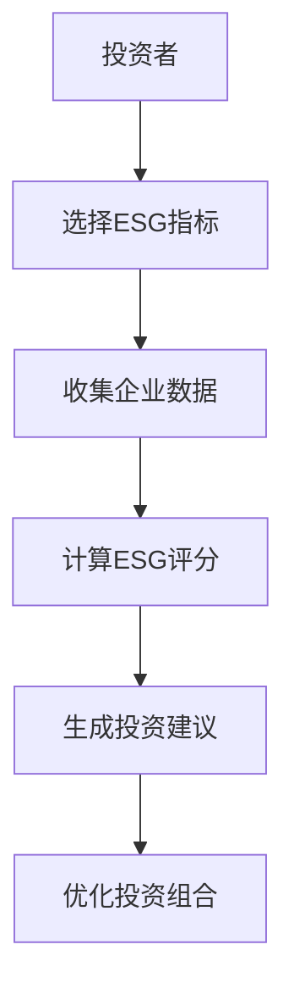
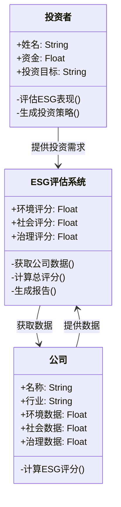
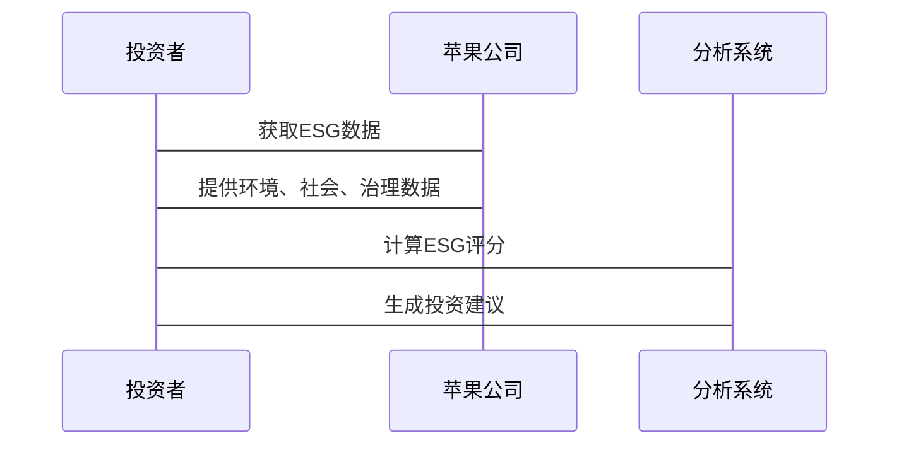

                 


# 价值投资中的ESG因素：可持续发展的重要性

> 关键词：价值投资, ESG因素, 可持续发展, 环境, 社会, 治理

> 摘要：随着全球对可持续发展的关注日益增加，ESG（环境、社会和治理）因素在价值投资中的重要性逐渐凸显。本文详细探讨了ESG的核心概念、其在投资中的作用、算法原理、系统设计以及实际应用案例，帮助读者理解如何将ESG因素融入投资决策，实现长期可持续发展。

---

## 第1章: ESG的定义与重要性

### 1.1 ESG的定义与内涵

#### 1.1.1 环境（Environmental）的定义与内涵
- **环境因素**关注企业在运营过程中对环境的影响，包括碳排放、资源利用、污染治理等方面。企业减少环境负面影响不仅有助于保护地球生态，还能降低运营成本和风险。

#### 1.1.2 社会（Social）的定义与内涵
- **社会因素**涉及企业在社会中的责任，包括员工权益、劳工条件、社区关系和公平对待等方面。关注社会因素有助于提升企业的社会形象和员工满意度。

#### 1.1.3 治理（Governance）的定义与内涵
- **治理因素**关注企业的管理结构和治理机制，包括董事会结构、高管薪酬、透明度和内部控制等方面。良好的公司治理是企业长期稳定发展的基石。

#### 1.1.4 ESG的综合定义与内涵
- ESG将环境、社会和治理三个维度整合起来，形成一个全面评估企业可持续发展的框架。通过关注这些因素，投资者可以识别企业的潜在风险和机会，做出更明智的投资决策。

### 1.2 ESG在价值投资中的重要性

#### 1.2.1 ESG与企业价值的关系
- ESG表现优异的企业通常在长期业绩上表现更优，因为它们注重风险管理、社会责任和可持续发展，从而具备更强的抗风险能力和市场竞争力。

#### 1.2.2 ESG与投资风险的关联
- 忽视ESG因素可能导致投资风险增加。例如，环境问题可能导致罚款和声誉损失，社会问题可能引发消费者抵制，治理问题可能导致内部管理混乱。

#### 1.2.3 ESG与长期投资回报的联系
- 研究表明，ESG表现好的企业往往能为投资者带来更高的回报。这是因为它们在创新、效率和可持续发展方面更具优势，能够持续创造价值。

### 1.3 可持续发展的概念与目标

#### 1.3.1 可持续发展的定义
- 可持续发展是指在满足当代需求的同时，不损害后代满足其需求的能力。它强调经济、社会和环境的平衡发展。

#### 1.3.2 可持续发展的三个核心维度
- **经济维度**：追求经济增长的同时注重效率和公平。
- **社会维度**：关注社会公平、包容性和人权。
- **环境维度**：保护自然资源，减少污染和碳排放。

#### 1.3.3 可持续发展的全球目标与挑战
- 全球目标包括联合国的17个可持续发展目标（SDGs），涵盖消除贫困、保护地球、促进繁荣等方面。实现这些目标需要全球合作和创新。

---

## 第2章: ESG的核心概念与联系

### 2.1 ESG核心概念的原理

#### 2.1.1 环境因素的原理
- 环境因素通过量化企业的碳排放、能源使用和环保投入，评估其对环境的影响。例如，采用可再生能源和减少废物排放可以提升企业的环境评分。

#### 2.1.2 社会因素的原理
- 社会因素关注企业在员工福利、社区参与和供应链管理等方面的表现。例如，公平的劳工政策和积极的社区贡献可以提升企业的社会评分。

#### 2.1.3 治理因素的原理
- 治理因素通过评估企业的董事会结构、高管薪酬和内部控制，衡量其治理透明度和效率。例如，独立的董事会和严格的审计流程可以提升企业的治理评分。

### 2.2 ESG概念属性特征对比表

| 概念维度 | 环境（Environmental） | 社会（Social） | 治理（Governance） |
|----------|---------------------|---------------|-------------------|
| 定义     | 企业的环境影响       | 企业的社会责任 | 公司的治理结构     |
| 关注点   | 碳排放、资源利用     | 劳工权益、社区 | 董事会结构、高管薪酬 |
| 重要性   | 影响企业风险         | 影响企业声

### 2.3 ESG实体关系图

```mermaid
er
actor(投资者) -[评估企业ESG表现]-> 公司
公司 --> 环境因素
公司 --> 社会因素
公司 --> 治理因素
环境因素 --> 碳排放
环境因素 --> 资源利用
社会因素 --> 劳工权益
社会因素 --> 社区关系
治理因素 --> 董事会结构
治理因素 --> 高管薪酬
```

---

## 第3章: ESG与投资策略的结合

### 3.1 ESG评估的数学模型



数学模型如下：

$$ ESG\_score = 0.4 \times E + 0.3 \times S + 0.3 \times G $$

其中：
- $E$ 是环境因素的评分（0-1）
- $S$ 是社会因素的评分（0-1）
- $G$ 是治理因素的评分（0-1）

### 3.2 系统架构设计



---

## 第4章: 项目实战与案例分析

### 4.1 项目实战

#### 4.1.1 环境因素的数据收集
- 从公开报告和数据库获取企业的碳排放数据，例如使用Python爬取数据：

```python
import requests
import pandas as pd

url = "https://www.morningstar.com/esg"
response = requests.get(url)
data = response.text
# 处理数据
```

#### 4.1.2 社会因素的评估
- 使用自然语言处理技术分析企业社会责任报告，例如：

```python
from textblob import TextBlob

text = "公司积极参与社区建设，提供公平的劳工待遇。"
blob = TextBlob(text)
sentiment = blob.sentiment
```

#### 4.1.3 治理因素的评分
- 通过API获取企业的董事会结构数据，例如：

```python
import yfinance as yf

data = yf.get_info('AAPL')
governance = data['governance']
```

### 4.2 实际案例分析
- 以苹果公司为例，分析其ESG表现：



---

## 第5章: 最佳实践与总结

### 5.1 最佳实践

- **数据来源**：确保数据的准确性和全面性，使用多个数据源进行交叉验证。
- **模型优化**：根据市场变化不断优化ESG评分模型，提升评估的准确性。
- **长期关注**：ESG投资需要长期关注，定期评估企业的ESG表现。

### 5.2 小结

- ESG因素不仅是企业社会责任的体现，更是投资决策中的重要考量。通过科学的评估和分析，投资者可以更好地识别风险和机会，实现可持续投资回报。

### 5.3 注意事项

- **数据偏差**：注意数据来源的偏差，避免片面结论。
- **行业差异**：不同行业的ESG表现差异较大，需根据不同行业特点进行评估。
- **模型局限性**：当前的ESG评分模型仍有改进空间，需结合实际情况灵活运用。

### 5.4 拓展阅读

- 建议阅读相关的学术论文和行业报告，深入了解ESG评估的具体方法和最新研究进展。

---

# 作者：AI天才研究院/AI Genius Institute & 禅与计算机程序设计艺术 /Zen And The Art of Computer Programming

---

希望这篇文章能为您提供有价值的信息，并帮助您更好地理解和应用ESG因素进行投资决策。

