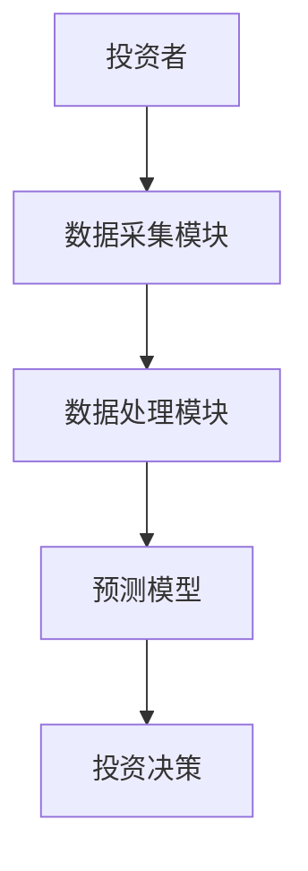
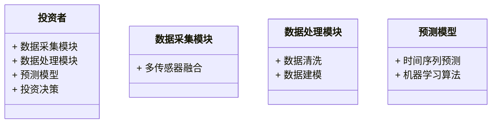

                 


# 价值投资中的仿生机器人在工业中的应用前景

> 关键词：价值投资、仿生机器人、工业应用、人工智能、数据驱动、投资策略、前景分析

> 摘要：本文探讨了仿生机器人在工业中的应用前景，特别是在价值投资中的潜力。通过分析仿生机器人在数据采集、处理和决策支持中的作用，结合人工智能和机器学习技术，本文揭示了这些技术如何提升工业效率和投资决策的精准度。文章还展望了未来的发展趋势，强调了技术挑战和伦理问题。

---

# 价值投资中的仿生机器人在工业中的应用前景

## 引言

### 背景介绍

#### 价值投资的核心概念
价值投资是一种以基本面分析为基础的投资策略，旨在通过分析企业的财务状况、行业地位和管理团队等因素，找到被市场低估的投资标的。其核心在于通过深入研究和数据驱动的决策，实现长期稳定的收益。

#### 仿生机器人在工业中的应用
仿生机器人是一种模拟生物行为和结构的机器人，具有高度的灵活性和适应性。在工业领域，仿生机器人被广泛应用于智能制造、物流管理、质量检测等场景，显著提升了生产效率和产品质量。

#### 价值投资与仿生机器人的结合
随着技术的进步，仿生机器人在工业中的应用逐渐与价值投资相结合。通过利用仿生机器人进行数据采集、分析和预测，投资者能够更精准地评估企业的经营状况和市场潜力，从而做出更科学的投资决策。

### 核心概念与联系

#### 核心概念
- **价值投资**：依赖于数据驱动的决策，强调长期稳定收益。
- **仿生机器人**：通过模拟生物行为，实现高效的数据采集和分析。

#### 对比表格
| 特性            | 传统工业机器人      | 仿生机器人        |
|-----------------|---------------------|-------------------|
| 灵活性          | 较低                | 高                |
| 适应性          | 较差                | 佳                |
| 数据处理能力    | 有限                | 强                |

#### 系统架构


---

## 仿生机器人在工业中的核心技术

### 人工智能技术

#### 机器学习算法
机器学习算法是仿生机器人实现智能决策的核心。常用算法包括支持向量机（SVM）和随机森林（Random Forest），用于分类和回归分析。

#### 深度学习
深度学习通过多层神经网络实现复杂的模式识别，常用于图像识别和自然语言处理。

#### 代码示例
```python
from sklearn.svm import SVC
model = SVC()
model.fit(X_train, y_train)
print(model.score(X_test, y_test))
```

### 感知与交互技术

#### 多传感器融合
通过融合视觉、听觉和触觉传感器数据，仿生机器人能够更准确地感知环境。

#### 机器人视觉
利用卷积神经网络（CNN）进行图像识别，提升检测精度。

### 运动与控制技术

#### 柔性机器人
柔性机器人能够适应不同形状和大小的物体，提高操作灵活性。

#### 高精度控制
通过优化控制算法，实现精确的运动控制，提升生产效率。

---

## 价值投资中的数据处理与分析

### 数据采集与清洗

#### 数据来源
数据来源包括企业财务报表、市场动态和行业报告。

#### 数据预处理
通过清洗和转换数据，确保数据质量和一致性。

### 数据分析与建模

#### 数据建模
利用回归分析和时间序列分析，构建预测模型。

#### 数据可视化
通过图表展示数据趋势，帮助投资者更好地理解市场动态。

---

## 仿生机器人在价值投资中的算法实现

### 时间序列预测

#### ARIMA模型
ARIMA（自回归积分滑动平均）模型用于预测未来趋势，公式如下：
$$ ARIMA(p, d, q) $$

#### LSTM网络
长短时记忆网络（LSTM）通过记忆单元捕捉长期依赖关系，公式如下：
$$ f(t) = \sigma(W_f \cdot [h_{t-1}, x_t] + b_f) $$

### 机器学习算法

#### 支持向量机
支持向量机通过构建超平面进行分类，公式如下：
$$ y = \text{sign}(w \cdot x + b) $$

#### 随机森林
随机森林通过集成学习提升预测精度，适用于特征重要性分析。

---

## 系统分析与架构设计

### 功能设计

#### 领域模型


### 架构设计

#### 系统架构


---

## 项目实战

### 环境安装

#### Python环境
安装必要的库，如scikit-learn和TensorFlow。

### 核心代码实现

#### 数据预处理
```python
import pandas as pd
data = pd.read_csv('data.csv')
data_clean = data.dropna()
```

#### 模型训练
```python
from sklearn.model_selection import train_test_split
X_train, X_test, y_train, y_test = train_test_split(X, y, test_size=0.2)
model = SVC().fit(X_train, y_train)
```

### 测试与优化

#### 结果分析
通过混淆矩阵和回归分析评估模型性能。

---

## 未来展望与挑战

### 发展趋势

#### 智能化
仿生机器人将更加智能化，具备自主学习和决策能力。

#### 网络化
通过物联网实现机器人之间的协同工作，提升整体效率。

### 技术挑战

#### 数据安全
数据泄露和隐私问题需要高度重视。

#### 伦理问题
仿生机器人在工业中的广泛应用可能引发伦理争议。

---

## 总结

仿生机器人在工业中的应用前景广阔，特别是在价值投资中，通过数据驱动的决策支持，帮助投资者实现更精准的投资策略。然而，技术挑战和伦理问题也需要我们共同努力解决。

---

## 作者

**作者：AI天才研究院**  
**联系方式：[email protected]**  
**GitHub：[AI天才研究院](https://github.com/AI-Genius-Institute)**

